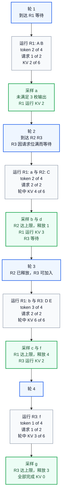

# Continuous Batching 与请求调度：每一轮重组批次，也重算容量与公平

> **文献基线**：[Orca: A Distributed Serving System for Transformer-Based Generative Models，OSDI 2022](https://www.usenix.org/system/files/osdi22-yu.pdf)（正式论文集 PDF，§3 S1、§4.2、Algorithm 1、§6.2；来源索引 `raw/01_theory/05_inference/Orca-2022.md`）；[PagedAttention，arXiv:2309.06180v1](https://arxiv.org/pdf/2309.06180v1)（2023-09-12，§2.2–2.3、§4.3、§4.5、§6.2；来源索引 `raw/01_theory/05_inference/PagedAttention-2309.06180.md`）。
> **主题**：把 continuous batching 写成一个逐轮的准入和状态转换问题：何时考虑新到请求，何时释放 KV，怎样同时受 token、请求数和 KV 预算约束，以及为何吞吐提升仍可能伴随尾延迟。
> **适用范围**：带 KV Cache 的自回归 decoder-only 在线服务。本文讲调度和资源决策；prompt 的分块计算算法见 [[16_chunked_prefill_analysis|Chunked Prefill]]。下文的固定账本是教学推演，未报告引擎实测。
> **最近更新**：2026-09-17。新建原理页；原始 Orca 与 PagedAttention 文本已按章节核验。

## 1. 先分清三种调度粒度

一次自回归请求必须反复运行模型：首次运行消化整个 prompt 并采样首个输出，之后每一轮以最新 token 为输入并采样下一个 token。Orca 将“运行所有层一次”称为一次 iteration；它的 initiation 可一次处理所有输入 token，increment 每轮只处理一个 token。[来源事实：Orca §2，Fig. 1](https://www.usenix.org/system/files/osdi22-yu.pdf) [PagedAttention §2.2](https://arxiv.org/pdf/2309.06180v1) 因此，一个批次到底固定到何时，是调度语义的一部分。

**分析分类。** 为比较调度边界，本页把常见做法按下表分为静态、动态和逐轮三类；这是描述性分类，不是两篇论文给出的术语标准。

| 方法 | 调度器何时重组批次 | 已完成与新到请求 | 主要代价或收益 |
|---|---|---|---|
| 静态批处理 | 先攒齐一批，再把整批交给执行引擎直至结束 | 早结束者可能被占位，晚到者等整批完成 | 控制简单，长度不齐会形成空转或 padding |
| 动态批处理 | 空闲时从队列抽取一个新批次 | 能在**批次边界**补充请求，批内仍可能固定 | 比静态攒批少等候，但长请求仍拉住一批 |
| 逐轮调度 | 每次模型 iteration 返回后 | 先移除完成项，再依据政策把候选项加入下一轮 | 能把到达、完成、KV 容量和公平在更细粒度重新决策 |

“continuous batching”通常指最后一种**可在轮次间改变活动集合**的机制，而不是某一份固定实现。Orca 的具体方案是 iteration-level scheduling：调度器选择请求、让引擎只运行一轮、接收结果，再判断完成状态。其论文因此允许新请求在当前 iteration 返回后被考虑，完成请求也可立即回传。[来源事实：Orca §3 S1，Fig. 4](https://www.usenix.org/system/files/osdi22-yu.pdf) PagedAttention §2.3 同样概括为每轮移除完成项、加入新项；论文将避免 padding 的执行依赖归于专用 GPU kernels。[来源事实：PagedAttention §2.3](https://arxiv.org/pdf/2309.06180v1)

这不等于“每一轮都一定更快”。一次重组需要记录状态、做准入并适配不等长序列；Orca 还专门引入 selective batching 处理这些形状差异。[来源事实：Orca §3 C2、S2](https://www.usenix.org/system/files/osdi22-yu.pdf) 逐轮调度改变的是可选择的工作集合，实际执行时间仍由模型、序列形状、内核、通信和设备决定。

## 2. 一轮的输入、状态与完成点

令请求 $r$ 在第 $q$ 轮开始时的状态为 $s_r^{(q)}$，候选集合为 $W_q$，实际提交给引擎的集合为 $A_q$。一个通用的轮次合同是：

1. 接收新到请求并更新等待集合；
2. 依据准入约束与策略，从等待和可恢复的请求中选择 $A_q$；
3. 引擎对 $A_q$ 各运行一轮，写入本轮输入 token 的 KV，并采样一个候选输出；
4. 对达到 EOS、输出上限、取消或错误终态的请求，生成结果记录并释放其专属资源；其余请求回到可运行状态。

令 `cancel`、`terminal`、`preempt`、`recovered` 分别表示本轮已确认的取消、终态、抢占和恢复事件；下式按从上到下的优先顺序判定，因而取消和终态不会被较低优先级的“未选中”掩盖。它可以抽象为

$$
\begin{aligned}
s_r^{(q+1)}=
\begin{cases}
\mathrm{CANCELLED}, & \operatorname{cancel}_r^{(q)},\\
\mathrm{FINISHED}, & \operatorname{terminal}_r^{(q)},\\
\mathrm{PREEMPTED}, & \operatorname{preempt}_r^{(q)}\ \text{或}\ \bigl(s_r^{(q)}=\mathrm{PREEMPTED}\land\neg\operatorname{recovered}_r^{(q)}\bigr),\\
\mathrm{RUNNING}, & r\in A_q\ \text{且未发生以上事件},\\
\mathrm{WAITING}, & r\in W_q,\ r\notin A_q,\ \text{且未发生以上事件}.
\end{cases}
\end{aligned}
$$

这是**分析状态机**，不主张每个引擎同名或同次序。`PREEMPTED` 只有在恢复完成前保留；恢复完成但本轮未获准入的请求才回到 `WAITING`，因此不与普通排队重叠。实际实现还需处理“请求在 kernel 已发出时取消”的并发边界：取消确认前不得把同一块 KV 重分配给别的请求；确认后丢弃该请求的未交付结果、解除映射并使其不再进入后续 $A_q$。这是一条通用资源生命周期要求，不是对某个项目代码的描述。

KV 的完成点容易数错。**为下节教学账本约定**，一轮的输入 token 被前向计算并写入 KV，随后采样输出 token；若这个新输出正好触发 EOS 或输出上限并立刻结束，它不进入下一轮输入，故账本不为它保留 KV。PagedAttention §2.2 与 Orca Fig. 1 都把“当前输入经本轮处理”与“生成下一 token”分开。[来源事实：PagedAttention §2.2](https://arxiv.org/pdf/2309.06180v1) [Orca §2，Fig. 1](https://www.usenix.org/system/files/osdi22-yu.pdf) 具体引擎可有不同的缓存写入时点，计量应以其实现语义为准。

## 3. 准入不是一个 batch size，而是三本账同时过线

令 $u_r^{(q)}$ 是请求 $r$ 在第 $q$ 轮实际送入模型的 token 数：完整 prompt 首次进入时可大于 $1$，通常 decode 轮为 $1$。设 $B_{\mathrm{tok}}$ 为本轮 token 预算，$B_{\mathrm{req}}$ 为本轮请求数上限，$K_{\mathrm{free}}$ 为可用 KV token-slot，则一个保守的联合准入检查可以写为

$$
\begin{aligned}
\sum_{r\in A_q}u_r^{(q)} &\leq B_{\mathrm{tok}},\\
\lvert A_q\rvert &\leq B_{\mathrm{req}},\\
\sum_{r\in A_q}\Delta k_r^{(q)} &\leq K_{\mathrm{free}}.
\end{aligned}
$$

$\Delta k_r^{(q)}$ 是本轮输入将新增的 KV slot 数；在没有共享、没有预留、每个输入 token 占一个 slot 的教学模型中，$\Delta k_r^{(q)}=u_r^{(q)}$。真实引擎还要把块粒度、共享前缀、跨卡副本、已预留但未写满的位置和峰值 workspace 放入第三个不等式。因而“token budget”可以是计算政策，“请求数”可以是并行度限制，“KV budget”是持续占用限制；把它们折叠为一个数字会掩盖拒绝的真实原因。

**来源事实与实现边界。** Orca §4.2 的 Algorithm 1 以到达时间选至多 `max_bs` 个请求，并在首次调度时按 `max_tokens` 预留 Attention K/V slot；论文还指出，若不留出下一 token 的 K/V 空间，调度器可能无请求可发而陷入死锁。[来源事实：Orca §4.2，Algorithm 1，p. 527](https://www.usenix.org/system/files/osdi22-yu.pdf) 这是 Orca 的预留策略，不是上式的必要条件。PagedAttention §4.3 则描述 vLLM 在每个 decoding iteration 选择候选序列、为新逻辑块分配物理块，并在请求完成后释放块。[来源事实：PagedAttention §4.3](https://arxiv.org/pdf/2309.06180v1)

## 4. 贯穿账本：三请求如何在固定预算下逐轮更替

这是一个**教学推演**，用于审计状态与资源，不能读成 Orca 或 vLLM 的 trace。固定规则如下：

- 本轮最多 $B_{\mathrm{tok}}=4$ 个输入 token、$B_{\mathrm{req}}=2$ 个请求；总 KV 容量为 $K=6$ 个 token-slot。
- 不切分 prompt；首次运行送入完整 prompt，后续 decode 每次送入一个已采样 token。
- 政策为“先保留仍在运行的早到请求，再按到达顺序填空位”。终态为输出达到声明上限；没有 EOS、共享 KV、预留、交换或取消。

| 请求 | 到达轮 | prompt | 输出上限 | 计划采样输出 |
|---|---:|---|---:|---|
| $R_1$ | 1 | `A B`，2 token | 3 | `a b c` |
| $R_2$ | 2 | `C`，1 token | 1 | `d` |
| $R_3$ | 2 | `D E`，2 token | 2 | `f g` |

轮 $2$ 中，$R_3$ 虽已到达，却因 $R_1$ 与 $R_2$ 占满两个请求位而等待；轮 $3$ 才随 $R_2$ 的释放加入。每行的“轮后 KV”只计将被未来轮次读取的**输入** token，终态刚采样出的 token 不再入账。

| 轮 | 到达与轮前状态 | $A_q$ 与输入 token，检查 | 输出和完成条件 | 释放与轮后 KV 状态 |
|---:|---|---|---|---|
| 1 | $R_1$ 到达，等待 | $R_1:[A,B]$；$u=2\leq4$，$\lvert A\rvert=1\leq2$，新增 $2\leq6$ | 采样 `a`，尚未达 3 枚输出 | 无释放；$R_1$ 运行，KV $=2$，下轮输入 `a` |
| 2 | $R_2,R_3$ 到达；$R_1$ 运行 | $R_1:[a],R_2:[C]$；$u=1+1=2\leq4$，请求数 $2$；轮中 KV 为 $R_1:3,R_2:1$，合计 $4\leq6$ | `b` 使 $R_1$ 继续；`d` 是 $R_2$ 第 1 枚输出，达到上限 | 释放 $R_2$ 的 1 slot；$R_1$ 运行 KV $=3$；$R_3$ 等待 |
| 3 | $R_1$ 运行，$R_3$ 等待 | $R_1:[b],R_3:[D,E]$；$u=1+2=3\leq4$，请求数 $2$；轮中 KV $=4+2=6$ | `c` 是 $R_1$ 第 3 枚输出，完成；`f` 使 $R_3$ 继续 | 释放 $R_1$ 的 4 slot；$R_3$ 运行 KV $=2$，下轮输入 `f` |
| 4 | $R_3$ 运行 | $R_3:[f]$；$u=1\leq4$，请求数 $1$；轮中 KV $=3\leq6$ | `g` 是 $R_3$ 第 2 枚输出，完成 | 释放 $R_3$ 的 3 slot；全部终态，KV $=0$ |

图把同一本账按轮展开；方括号内是本轮输入，`释放`发生在采样后确认终态时。每轮的资源数字都能回到表中的 $u_r^{(q)}$ 和 $K=6$ 检查。

账本没有宣称轮 $3$ 比轮 $1$ 快：它只证明该政策在轮 $3$ 恰好同时满足三个预算。若 $R_3$ prompt 变为 4 token，则 $1+4>B_{\mathrm{tok}}$，必须等待、拒绝或由另一种策略处理；如何把 prompt 拆为多轮计算见 [[16_chunked_prefill_analysis|Chunked Prefill]]，而不是在这里暗中假设。

## 5. 公平、长短请求与抢占恢复是政策选择

机制只提供“轮次间可换人”；选择谁先跑是政策。Orca §4.2 的 iteration-level FCFS 定义是：任意两个在池中请求，早到者已运行的 iteration 数不少于晚到者；论文也明确承认晚到的短请求仍可能更早返回。[来源事实：Orca §4.2](https://www.usenix.org/system/files/osdi22-yu.pdf) 这避免长请求因无穷插队而饥饿，却不会让它与短请求在端到端完成时间上相等。

| 目标 | 可选政策方向 | 需要记录的代价与边界 |
|---|---|---|
| 不让早到长请求饿死 | FCFS 或 aging，限制晚到请求连续插队 | 短请求可能排在长请求后，尾部等待增大 |
| 优先交互式短请求 | 短作业优先、deadline 或配额 | 必须有 aging 或保留份额，否则长请求会饥饿 |
| 提高总 token 吞吐 | 填满 token/KV 预算，偏好能放入余量的工作 | 更大的轮次可能增加单轮服务时间，伤害 TTFT 或 ITL |
| 保护已经运行的状态 | 优先续跑，减少驱逐 | 新到请求的排队时间可能更长 |

当下一轮需要的 KV 位置无法获得时，调度器要在等待、拒绝或抢占之间选择。抢占后的恢复合同至少应明确四件事：受害者是谁、其 KV 是保留还是转移、恢复前是否需要重算、何时重新具备候选资格。若 KV 被丢弃，恢复必须先重新得到等价的历史状态，常见方法是将原 prompt 与已生成 token 再次作为 prompt 计算；这会把计算成本移到恢复点。

**某引擎策略，非通用规则。** PagedAttention §4.5 所述 vLLM 对过载使用 FCFS，抢占时优先保留早到请求、先抢占晚到请求；其序列按 all-or-nothing 驱逐，支持把 KV block 交换到 CPU RAM，或在重调度时 recomputation。论文还说明该 swapping 设计会在抢占后暂不接纳新请求，直到被抢占序列完成后再恢复它们。[来源事实：PagedAttention §4.5](https://arxiv.org/pdf/2309.06180v1) 这些归属到该论文版本，不能据此推断所有 vLLM 版本或其他引擎有同样的抢占顺序和恢复时延。

## 6. 吞吐、排队与尾延迟：需要把到达过程也放进结果

逐轮重组能减少“一个请求完成却继续占着整批”和“新请求等整批结束”的等待，但不会制造无限服务能力。若在一个足够长的观察窗口内，到达工作量持续大于系统可完成的工作量，等待集合会增长，端到端延迟的尾部也会随之增长。PagedAttention 的实验说明，随请求率上升，延迟先渐增、超过系统能力后队列会持续增长并使延迟发散；那是其模型、数据集和实现下的实测现象，不是本页账本的结果。[来源事实：PagedAttention §6.2](https://arxiv.org/pdf/2309.06180v1)

报告调度改动时，至少同时给出到达率或 trace、输入和输出长度分布、并发与 KV 预算、拒绝和取消率，以及 p50/p95/p99 的 TTFT、ITL/TPOT、E2E。只报告 aggregate output tokens/s 会掩盖“少量长请求占住 KV”或“短请求为高吞吐被延后”的情况。指标的时间点、分母与端到端成本口径见 [[11_inference_cost_model_analysis|推理性能与资源成本模型]]。

Orca 的端到端实验也给出一个反例提醒：提高它的最大 batch size 在论文所测设置中提高吞吐而未损伤延迟，但作者明确写出这对任意硬件、模型和工作负载没有保证，参数须依据吞吐与延迟目标调节。[来源事实：Orca §6.2，Fig. 10](https://www.usenix.org/system/files/osdi22-yu.pdf) 因此 T15 的账本应作为每轮资源审计，而不是 TTFT、TPOT 或尾延迟的预测器。

## Related Pages

- [[10_prefill_decode_analysis|自回归生成与 Prefill / Decode：一个 token 何时成为历史]]：界定一轮输入、采样输出和 KV 写入的先后关系。
- [[11_inference_cost_model_analysis|推理性能与资源成本模型]]：定义 TTFT、TPOT、吞吐与显存容量的可比较口径。
- [[12_kv_cache_analysis|KV Cache：复用依据与容量]]：展开调度器准入所依赖的 KV 表示与容量条件。
- [[13_paged_kv_attention_analysis|Paged KV Cache 与 PagedAttention]]：说明分页 KV 如何改变块分配和可容纳请求数。
- [[17_sampling_decoding_analysis|采样与解码策略]]：说明终态、EOS 和输出上限怎样使请求离开调度集合。
