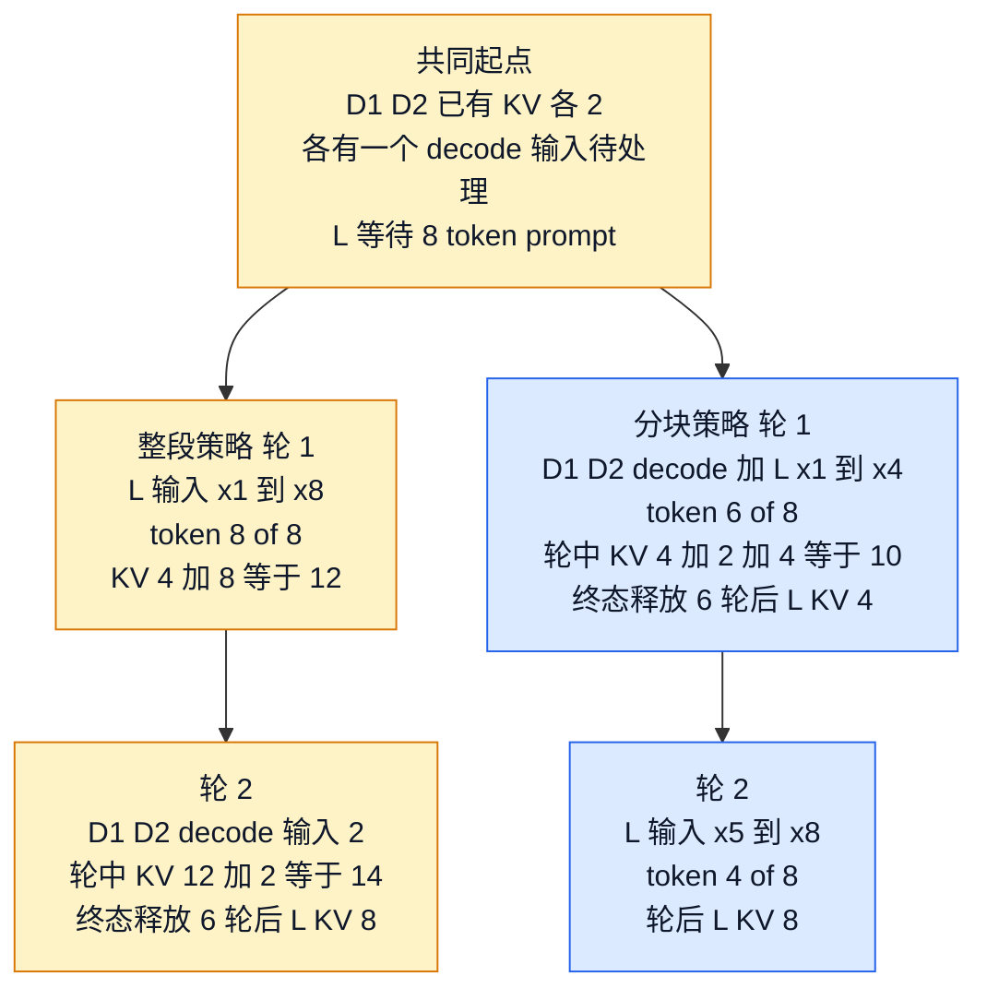

# Chunked Prefill：把长输入拆到轮次之间，同时保留因果历史

> **文献基线**：[Sarathi: Efficient LLM Inference by Piggybacking Decodes with Chunked Prefills，arXiv:2308.16369v1](https://arxiv.org/pdf/2308.16369v1)（2023-08-31，§4.2–4.4，来源索引 `raw/01_theory/05_inference/Sarathi-2308.16369.md`）；[vLLM Optimization and Tuning](https://docs.vllm.ai/en/latest/configuration/optimization/)（动态官方文档，访问快照 2026-09-17，Chunked Prefill 小节；索引 `raw/01_theory/05_inference/vLLMChunkedPrefillDocs-20260917.md`）。
> **主题**：将长 prompt 的 prefill 切为可在轮次间重调度的连续 token 段，说明跨块注意力为何仍须读取历史 KV，以及 chunk 大小怎样在长请求 TTFT、既有 decode 的 ITL 和利用率之间取舍。
> **适用范围**：单副本、因果 decoder 的在线推理。本文只讨论同一副本内的分块与混合批；跨卡上下文分配属于 T27，层间流水属于 T29，跨请求前缀复用属于 T14。
> **最近更新**：2026-09-17。教学时间线不含实测时间；Sarathi 的实验数据和 vLLM 的具体优先级均明确归属原来源版本。

## 1. 为什么整段 prefill 会干扰正在生成的请求

长 prompt 已知，因而可一次并行处理；但一次长前向也会占用一个较长的服务轮次。此时已在 decode 的请求不能在中途插入下一 token，用户看到的 token 间隔便包含这次长前向。把 prompt 拆为连续块后，调度器在块边界重获选择权：可以先给已有 decode 一个位置，再从剩余 token 预算中推进长 prompt。

这是**调度机制**，不承诺任何固定收益。Sarathi 在其 LLaMA-13B/A6000 实验中观察到 prefill 与 decode 的算术强度和吞吐行为不同，并据此提出 chunked-prefills 与 decode-maximal batching。[来源事实：Sarathi v1 §3.1–3.3](https://arxiv.org/pdf/2308.16369v1) 该观察不能替代本机 profile，也不能推出所有模型上 prefill 一定计算受限、decode 一定带宽受限。

## 2. 分块不改变因果依赖

设 prompt 为 $x_{1:I}$，第 $j$ 块覆盖连续位置 $[a_j,b_j]$，其中 $a_1=1$、$a_{j+1}=b_j+1$。第 $j$ 块的 query 仍只能注意到 prompt 中不晚于自身的位置：

$$
\operatorname{visible}(t)=\{1,\ldots,t\},
\qquad t\in[a_j,b_j].
$$

所以第 $j$ 块既要计算本块 token 的 K/V，也要读取前面各块已写入的 KV。块边界不是注意力边界；它只是调度可中断点。Sarathi Fig. 6/§4.2 明确用连续块的因果 mask 保证与整段 prefill 在实数计算语义上等价，并指出后续块会重读先前块的 KV；浮点实现不保证逐位相同。[来源事实：Sarathi v1 §4.2，Fig. 6](https://arxiv.org/pdf/2308.16369v1)

若每块大小为 $c$，则第 $j$ 块新增 KV 为 $c$ 个 token-slot，历史读取长度约为 $(j-1)c$ 加本块内的因果前缀。分块不会减少最终 prompt KV 的总量 $I$；它改变的是这些 slot 的写入时刻和每轮的计算形状。KV 的单 token 容量公式见 [[12_kv_cache_analysis|KV Cache：复用依据与容量]]。

## 3. 混合 batch 的政策与实现归属

在一个轮次 token 预算为 $B$ 时，活动 decode 数为 $d$，长 prefill 本轮推进 $c_q$ 个 token，最小的 token 账是

$$
d+c_q\leq B.
$$

这个式子只检查本轮输入 token；请求数、KV 可用块、工作空间和并行限制仍须同时通过 T15 的联合准入检查。一个通用策略可以是先确定要保护的 decode，再把剩余预算给一个或多个未完成 prefill 块；另一个策略也可以优先长请求的 TTFT。机制不替策略作选择。

**某引擎策略。** 访问快照中的 vLLM V1 文档称：先批入 pending decode，再以 `max_num_batched_tokens` 的余量安排 prefill，放不下的 prefill 自动切块；文档把较小预算与较好 ITL、较大预算与较好 TTFT 关联。[来源事实：vLLM Optimization and Tuning，Chunked Prefill](https://docs.vllm.ai/en/latest/configuration/optimization/) 这是该文档版本的实现政策和调参建议，不能当作 continuous batching 的定义。

## 4. 可重放时间线：一个长 prompt 插入两个 decode

下面是**教学推演**，不对应 Sarathi 或 vLLM 的性能 trace。观察窗口开始前，$D_1,D_2$ 都已完成各自 prompt，各持有 2 个 KV slot，并各有一枚 decode 输入待处理；它们的这 4 个既有 slot 不计入本窗口的新工作。固定每轮 $B=8$ token、总 KV 容量 $K=14$ slot；长请求 $L$ 有 8-token prompt。$D_1,D_2$ 在其本轮 decode 后均达到终态，故各释放原有 2 加本轮新写的 1，共 3 个 slot。比较整段策略与每块 $c=4$ 的策略：比较窗口严格只处理相同的 $L$ 的 8 个 prompt token 和 $D_1,D_2$ 的两个 decode 输入，共 10 个输入 token。

| 轮 | 整段 prefill | 分块 prefill，decode 优先 | 可审计的 token 与 KV 结果 |
|---:|---|---|---|
| 1 | $L:[x_1\ldots x_8]$，输入 8；$D_1,D_2$ 等待 | $D_1:[d_1],D_2:[d_2],L:[x_1\ldots x_4]$，输入 $1+1+4=6$ | 整段：轮后 KV 为 $4+8=12$；分块：轮中为 $4+2+4=10$，$D_1,D_2$ 终态释放 6，轮后仅 $L=4$ |
| 2 | $D_1:[d_1],D_2:[d_2]$，输入 2 | $L:[x_5\ldots x_8]$，输入 4 | 整段：轮中 KV $=12+2=14$，终态释放 6，轮后 $L=8$；分块：轮中和轮后 $L=8$。两条路径均完成窗口的 10 个输入 token |

时间线展示的是选择空间，不是速度结论：两条路径完成的比较窗口工作量和终态 KV 都相同，但整段策略令已就绪的 $D_1,D_2$ 至少多等一轮；分块策略让其在轮 1 与第一块同批，却使 $L$ 的 prompt 在轮 2 才完成。窗口不纳入 $L$ 之后的 decode，因此不把额外工作混入比较；$L$ 的首 token 和后续 ITL 仍需在真实时间戳下测量。

## 5. chunk 大小与多个部分 prefill

小 $c$ 增加调度点，能更频繁地容纳 decode 或其他长 prompt 的一段，却也减小矩阵行数、增加调度开销，并使后续块更多次读取自身历史 KV。大 $c$ 更接近整段 prefill，通常更有利于长请求 TTFT 和单次计算效率，却会拉长同轮 decode 的等待。Sarathi §4.2–4.4 将这些写为 chunk 变小导致的算术强度下降、历史 KV 重读，以及可搭载更多 decode 的取舍；其具体 256-token 例子与 tile 结论受论文模型、硬件和 kernel 限定。[来源事实：Sarathi v1 §4.2–4.4](https://arxiv.org/pdf/2308.16369v1)

多个未完成 prefill 还要选择是否轮流推进。FCFS 可减少早到长请求的饥饿风险；按剩余长度或 deadline 选择可能缩短部分 TTFT，却需要 aging 或配额保护。无论用哪种政策，每轮都应记录每个部分 prefill 的已计算位置、剩余长度、已占 KV、分到的 $c_q$ 和未被选择的原因。请求状态、准入和抢占恢复合同见 [[15_continuous_batching_analysis|Continuous Batching 与请求调度]]。

## 6. 与邻近主题的边界

- Prefix caching 让跨请求的相同前缀少算；chunked prefill 让同一请求的不同连续段分轮计算，见 [[14_prefix_caching_analysis|Prefix Caching：跨请求前缀复用]]。
- PCP 把一次 prefill 的上下文工作分给多卡；本页没有改变设备分工，见 [[27_prefill_context_parallelism_analysis|PCP]]。
- CPP 把模型层组织进流水；本页只在同一执行副本的轮次边界切输入，见 [[29_chunked_pipeline_parallelism_analysis|CPP]]。
- 分块完成后仍回到普通自回归 decode 语义，见 [[10_prefill_decode_analysis|自回归生成与 Prefill / Decode：一个 token 何时成为历史]]。

## Related Pages

- [[10_prefill_decode_analysis|自回归生成与 Prefill / Decode：一个 token 何时成为历史]]：给出 chunk 完成后如何进入逐 token decode 的语义。
- [[12_kv_cache_analysis|KV Cache：复用依据与容量]]：解释跨块历史为何需要持续保留，以及本页 slot 账的含义。
- [[14_prefix_caching_analysis|Prefix Caching：跨请求前缀复用]]：对比跨请求复用与单请求连续段分步计算。
- [[15_continuous_batching_analysis|Continuous Batching 与请求调度]]：提供 token、请求数、KV 的联合准入和公平策略框架。
- [[11_inference_cost_model_analysis|推理性能与资源成本模型]]：将 chunk 大小取舍连接到 TTFT、ITL 和实际测量边界。
