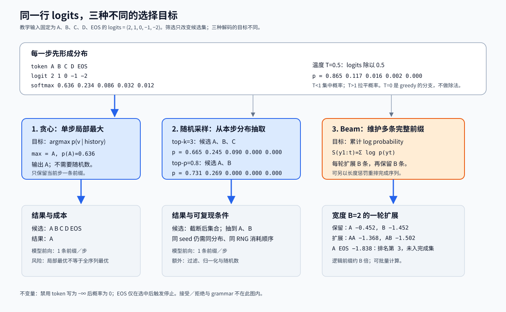

# 采样与解码策略：从一行 logits 到可停止的序列

> **文献基线**：[The Curious Case of Neural Text Degeneration，arXiv:1904.09751v2](https://arxiv.org/pdf/1904.09751v2)（2020-02-14，§2.1、§3.1、Fig. 1、§4.2–4.3）；[Hugging Face Transformers v4.57.1](https://github.com/huggingface/transformers/tree/v4.57.1)（commit `8cb5963`，2025-10-14；`TemperatureLogitsWarper`、`TopKLogitsWarper`、`TopPLogitsWarper`、`RepetitionPenaltyLogitsProcessor`、`BeamSearchScorer.process`、`BeamHypotheses.add/is_done`、`EosTokenCriteria`）。来源索引见 `raw/01_theory/05_inference/The_Curious_Case_of_Neural_Text_Degeneration-1904.09751.md` 和 `raw/01_theory/05_inference/Hugging_Face_Transformers_Generation-v4.57.1.md`。
> **主题**：把某一生成位置的 logits 变成概率、候选集和一个 token；比较 greedy、随机采样与 beam search 各自优化的对象。用一个固定五词表算例重放温度、top-k、top-p、惩罚、禁用和结束。
> **适用范围**：讨论普通自回归语言模型的单步 token selection 与序列停止。投机解码的接受／拒绝修正归后续专题；字符、tokenizer 与 grammar 的约束状态机归约束解码专题；具体服务引擎的参数映射归工程页。
> **最近更新**：2026-09-17。新建原理页；固定论文和官方库版本取证，数值均为教学算例，未报告模型性能实测。

## 1. 先分清：模型给分数，解码器决定怎样用分数

在第 $t$ 步，已提交前缀为 $h_t=(x_1,\ldots,x_t)$。模型头对词表 $V$ 的每个 token 给一个未归一化分数 $\ell_i$，即 logits；它们不是概率，也不是已经选出的 token。温度为 $T>0$ 时，常用的 categorical 分布是：

$$
p_T(v_i\mid h_t)=\frac{\exp(\ell_i/T)}{\sum_{j\in V}\exp(\ell_j/T)}.
$$

因此给所有 logits 同加一个常数不会改变概率；改变**相对**差距才会改变分布。温度 $T<1$ 放大差距，$T>1$ 缩小差距。Transformers 的固定版本将 temperature 定义为对 logits 的除法，并要求随机采样开启时才有作用；$T=0$ 不是上式的合法除法，而是转到 greedy 的离散选择。[来源：`TemperatureLogitsWarper`](https://github.com/huggingface/transformers/blob/8cb5963cc22174954e7dca2c0a3320b7dc2f4edc/src/transformers/generation/logits_process.py#L231-L294)

这里有三个常被混写成“解码”的目标：

| 方法 | 每一步保留什么 | 选择目标 | 本页用语 |
|---|---|---|---|
| greedy | 一条前缀 | 当前步概率最大的 token | 单步局部最大 |
| 随机采样 | 一条前缀 | 从当前处理后的 categorical 分布抽一枚 token | 分布抽样 |
| beam search | 多条前缀 | 在有限宽度内保留累计序列分数高的前缀 | 近似序列搜索 |

greedy 不等于“温度很低的随机结果”；它没有抽样。beam 也不等于“多次随机采样”；经典 beam 按累计分数裁剪候选，随机 beam 是另一个明确的变体。Transformers 的生成合同也将 `num_beams=1/do_sample=false`、`num_beams=1/do_sample=true` 和 `num_beams>1/do_sample=false` 分别列为 greedy、multinomial sampling 与 beam search。[来源：Transformers v4.57.1 `GenerationConfig`](https://huggingface.co/docs/transformers/v4.57.1/main_classes/text_generation)

## 2. 固定小词表：从 logits 到候选与概率

以下是**教学算例**。本页每处的基础 logits 都是同一行 `(2, 1, 0, -1, -2)`，词表按 `A, B, C, D, EOS` 排列；`EOS` 是一个普通可选 token，尚未被选中。其归一化常数为

$$
Z=e^2+e^1+e^0+e^{-1}+e^{-2}\approx11.6106.
$$

| token | A | B | C | D | EOS |
|---|---:|---:|---:|---:|---:|
| logits $\ell$ | 2 | 1 | 0 | -1 | -2 |
| $p_1=\operatorname{softmax}(\ell)$ | 0.636409 | 0.234122 | 0.086129 | 0.031685 | 0.011656 |
| $\log p_1$（约） | -0.452 | -1.452 | -2.452 | -3.452 | -4.452 |

数字可以从上式逐项复算；表中概率因显示精度之和可能与 1 相差最后一位。贪心直接选 A。若用随机采样，A 有约 63.6% 的机会，但 B、C、D、EOS 仍可被抽到；“最高概率”从来不表示“概率为 1”。

**图的规格**：输入固定为五个 token 的 logits `(2,1,0,-1,-2)`，先显示完整 softmax 与温度 $T=0.5$ 的新分布。随后分三条可追踪路径：greedy 以 `argmax` 输出 A；随机路径以 top-k=3 和 top-p=0.8 给出截断后全部候选及再归一化概率；beam 路径以宽度 2 记录两条前缀、其扩展和 EOS 是否因候选排名进入完成集合。每条路径标明优化对象和逻辑成本，图末写出禁用 token 与 EOS 的边界。

图由 [`17_sampling_decoding.mjs`](assets/17_sampling_decoding.mjs) 从同一组 logits 生成；改变数组后，图中的 softmax、top-k 与 top-p 数字会同时重算。图形展示的是算法的逻辑前缀数，不是某个运行时的 GPU 时间线。

### 2.1 温度：先改变分布形状，再谈抽样

温度只改变有限 logits 的相对差距。仍以同一基础行计算：

| 设置 | 变换后的 logits（A, B, C, D, EOS） | 对应概率（A, B, C, D, EOS） |
|---|---|---|
| $T=0.5$ | `4, 2, 0, -2, -4` | `0.864704, 0.117025, 0.015838, 0.002143, 0.000290` |
| $T=1$ | `2, 1, 0, -1, -2` | `0.636409, 0.234122, 0.086129, 0.031685, 0.011656` |
| $T=2$ | `1, 0.5, 0, -0.5, -1` | `0.428656, 0.259993, 0.157694, 0.095646, 0.058012` |

低温让 A 更常被抽中，高温让尾部 token 更容易进入抽样；它不自动保证事实性、格式或多样性。Holtzman 等在相同 GPT-2 模型上观察到不同解码策略可产生很不一样的退化形态，因而“调温度”是分布控制，不是质量保证。[来源：Holtzman 等，§2.1、Fig. 1、§4.2](https://arxiv.org/pdf/1904.09751v2)

### 2.2 top-k 与 top-p：候选集不同，阈值含义也不同

令处理后的有限概率按从高到低排序为 $q_{(1)}\geq q_{(2)}\geq\cdots$。top-k 保留固定数量：

$$
K_k=\{v_{(1)},\ldots,v_{(k)}\}.
$$

top-p（nucleus）保留达到累计质量所需的最短前缀：

$$
\begin{aligned}
K_p&=\{v_{(1)},\ldots,v_{(m)}\},\\
m&=\min\left\{r:\sum_{j=1}^{r}q_{(j)}\geq p\right\}.
\end{aligned}
$$

被保留的集合必须**重新归一化**：$q'_i=q_i/\sum_{v_j\in K}q_j$；其余 token 的概率为零。对固定例子：

| 规则 | 保留候选 | 截断前累计质量 | 截断后的候选概率（A, B, C, D, EOS） |
|---|---|---:|---|
| top-k，$k=3$ | A、B、C | 0.956660 | `0.665241, 0.244728, 0.090031, 0, 0` |
| top-p，$p=0.8$ | A、B | 0.870531 | `0.731059, 0.268941, 0, 0, 0` |

top-p 的 0.8 不是“保留累计概率至多 0.8”：A 的 0.636409 尚未达到阈值，加入 B 才达到 0.870531，所以 B 必须保留。Nucleus Sampling 的原始定义也是每步动态地取累计概率超过阈值的最小集合；固定 $k$ 则可能在分布尖锐或平坦时保留不合适数量的候选。[来源：Holtzman 等，§3.1](https://arxiv.org/pdf/1904.09751v2)；[来源：Transformers `TopPLogitsWarper`](https://github.com/huggingface/transformers/blob/8cb5963cc22174954e7dca2c0a3320b7dc2f4edc/src/transformers/generation/logits_process.py#L464-L528)

组合规则的顺序是实现合同的一部分。上表各自从完整 $T=1$ 分布计算，**不**应读成“先 top-k=3 再 top-p=0.8”的共同结果。若同时启用，先执行哪种 processor、top-p 在过滤前还是过滤后计算、边界同分至少保留几枚，都要以所用引擎的已冻结实现为准；不要从这页的教学数值反推某个 API 的顺序。

## 3. 先改分数还是先终止：惩罚、禁用与停止

解码器可在 softmax 前改变一行 logits。其基本不变量很简单：若最终分数 $\tilde{\ell}_i=-\infty$，则 $p(v_i\mid h_t)=0$；但只要存在至少一个有限候选，仍要对全部剩余候选重新归一化。

### 3.1 重复惩罚与硬禁用作用在不同层次

以固定例子为例，假定 B 已在历史中出现过一次。Transformers 的 `RepetitionPenaltyLogitsProcessor` 对已出现 token 至多施加一次：若分数为正则除以惩罚系数 $r$，若为负则乘以 $r$。取 $r=2$ 时，仅 B 从 1 改成 0.5；新的完整分布为：

| token | A | B | C | D | EOS |
|---|---:|---:|---:|---:|---:|
| 惩罚后 logits | 2 | 0.5 | 0 | -1 | -2 |
| 惩罚后概率 | 0.700983 | 0.156410 | 0.094868 | 0.034900 | 0.012839 |

这类惩罚降低 B 的相对机会，却没有把它禁止。固定版本源码明确规定正负 logits 使用不同乘除分支，且 decoder-only 默认把 prompt 也计入历史；不同产品的 frequency/presence penalty 可能按出现次数或是否出现做加性扣分，不能把它们的参数值当作本表的 $r$。[来源：`RepetitionPenaltyLogitsProcessor`](https://github.com/huggingface/transformers/blob/8cb5963cc22174954e7dca2c0a3320b7dc2f4edc/src/transformers/generation/logits_process.py#L297-L325)

若本步禁用 D，则将它置为 $-\infty$，不是“把 D 的概率减小一点”。同一基础行的结果为：

| token | A | B | C | D | EOS |
|---|---:|---:|---:|---:|---:|
| 禁用后 logits | 2 | 1 | 0 | $-\infty$ | -2 |
| 禁用后概率 | 0.657233 | 0.241783 | 0.088947 | 0 | 0.012038 |

`bad_words_ids` 和 `suppress_tokens` 是某些库提供的硬约束接口；该版本说明后者把对应 log probability 写为 `-inf`。本页只说明单步 mask 的概率效果，不展开依据已生成前缀推进的 grammar 或 tokenizer 边界。[来源：Transformers v4.57.1 `GenerationConfig`](https://huggingface.co/docs/transformers/v4.57.1/main_classes/text_generation)

### 3.2 EOS、长度上限和 stop string 是选择后的停止判定

EOS 仍在候选集中时，先按当前规则选择 token；选到 EOS 后，这条序列终止。若为了 `min_new_tokens` 一类的请求约束而暂时禁用 EOS，则基础行变为 `(2,1,0,-1,-\infty)`，概率是 `0.643914, 0.236883, 0.087144, 0.032059, 0`。长度上限不必改变本步概率：它是“在已输出最多多少枚后停止继续前向”的外部边界；有些实现也可在到达上限时强制 EOS，这属于该实现的合同。

固定版本的 `EosTokenCriteria` 检查最近生成的 token 是否属于一个或多个 `eos_token_id`；同一库的 `StopStringCriteria` 先把字符串与 tokenizer 词表对齐，再判定何时有 token 序列完成该字符串。[来源：`EosTokenCriteria` 与 `StopStringCriteria`](https://github.com/huggingface/transformers/blob/8cb5963cc22174954e7dca2c0a3320b7dc2f4edc/src/transformers/generation/stopping_criteria.py)

停止 string 不是一个天然的“单 token 禁用表”：它可能跨 token 边界，常见实现是在 token 已选出并拼接文本后判定匹配。这个判定与**强制选什么**是两层问题；完整的词法、状态机和 grammar mask 归后续约束解码专题。

## 4. Beam search：扩展的是前缀，评分的是整个候选

greedy 只看本步 $\operatorname*{argmax}$，而 beam 以宽度 $B$ 保留多个前缀。对一条候选 $y_{1:t}$，基础累计分数为：

$$
S(y_{1:t})=\sum_{j=1}^{t}\log p(y_j\mid h_0,y_{<j}).
$$

每轮先把每条活跃 beam 的候选 token 展开，再从合并的候选中留住 $B$ 条分数最高的未完成前缀。EOS 代表一条可终止扩展，但“看见 EOS 就无条件加入完成集合”不是所有实现的合同。若使用长度惩罚，常见一类评分写作：

$$
S_\alpha(y_{1:t})=\frac{S(y_{1:t})}{t^\alpha}.
$$

这不是必须使用的统一公式，而是 Transformers 固定版本 `BeamHypotheses.add` 的实现形式。其 `BeamSearchScorer.process` 先按本轮候选排名扫描：仅当 EOS 的 `beam_token_rank < group_size` 时才调用完成集合的 `add`；本组宽度以外的 EOS 直接跳过。随后才以非 EOS 候选填满下一轮活跃 beam。该版本还区分“凑够 $B$ 个完成候选即停”、启发式停止和只有无法再改进时才停止；因此 beam 的结束既依赖 EOS，也依赖宽度、排名、完成集合、长度上限和停止策略。[来源：`BeamSearchScorer.process`](https://github.com/huggingface/transformers/blob/8cb5963cc22174954e7dca2c0a3320b7dc2f4edc/src/transformers/generation/beam_search.py#L2639-L2646)；[来源：`BeamHypotheses.add/is_done`](https://github.com/huggingface/transformers/blob/8cb5963cc22174954e7dca2c0a3320b7dc2f4edc/src/transformers/generation/beam_search.py#L914-L1002)

宽度 $B=2$ 的最小重放继续使用第 2 节的首步分布：首轮留下 A（$-0.452$）和 B（$-1.452$）。为了显式展示扩展，以下第二步条件概率也是**教学值**，不是同一模型实测：

| 前缀 | 第二步候选及条件概率 | 累计 $\log p$ | 本轮状态 |
|---|---|---:|---|
| A | A: 0.40 | -1.368 | 活跃，保留 |
| A | B: 0.35 | -1.502 | 活跃，保留 |
| A | EOS: 0.25 | -1.838 | EOS，合并排名第 3；不入完成集合 |
| B | A: 0.60 | -1.963 | 被宽度 2 裁掉 |
| B | EOS: 0.30 | -2.656 | EOS，合并排名第 5；不入完成集合 |
| B | B: 0.10 | -3.754 | 被裁掉 |

例如 `A→A` 的 -1.368 是 $\log 0.636409+\log0.40$，而不是取两个概率中的较大者。按该固定 Transformers 实现，本轮排名前二的是 `AA`、`AB`，故它们成为两个活跃前缀；`A EOS` 已排第 3、`B EOS` 排第 5，完成集合在本轮仍为空。后续轮次若 EOS 排入本组前 $B$，才会进入完成集合并参与终止判断。可见 beam 试图近似优化**整条序列的累计条件概率**，并不保证找到全局最优，因为宽度有限。

Holtzman 等报告，在其研究设置中，提高 beam 宽度仍可能偏向过高概率、重复或过短的文本；这是该论文的经验结论，不能推出所有模型、任务和长度惩罚都有相同表现。这里的直接设计代价是每步维护并扩展约 $B$ 条逻辑前缀；实现可以将它们合并成 batch，但不能把序列状态的分支语义省掉。[来源：Holtzman 等，§2.1、Fig. 1、§4.2–4.3、Appendix A](https://arxiv.org/pdf/1904.09751v2)

## 5. 随机性、质量与成本：配置是一份完整实验条件

给定处理后的分布，随机采样还需要伪随机数流。固定 seed 只能固定该随机流的起点；要重现一次输出，至少还要固定模型权重、tokenizer 与 prompt/template、所有 logits 处理和停止规则、抽样算法与其随机数消耗顺序。数值精度、硬件、并行归约或后端版本改变 logits 的末位、同分的排序或随机数消耗时，即使 seed 相同也可能在某一步分叉。这里是从 categorical 抽样依赖“分布加随机流”得到的**工程推断**，不是任一库对跨平台逐 token 一致性的承诺。

| 维度 | greedy | 温度／top-k／top-p 随机采样 | beam search |
|---|---|---|---|
| 质量倾向 | 稳定地偏向每步最高概率 | 在截断分布内保留可控随机性 | 偏向累计高概率前缀 |
| 单请求每步逻辑前缀 | 1 | 1 | 约 $B$ 条活跃前缀 |
| 额外选择工作 | `argmax` | 温度、过滤、归一化或等价抽样、RNG | 扩展、累计分数、排序／裁剪、完成集合 |
| 不能保证 | 全序列最优或多样性 | 事实性、格式合法性或跨平台逐 token 相同 | 全局最优、非重复或低成本 |

三者都通常先取得一整行词表 logits；top-k/top-p 是**头部输出之后**的候选过滤，不能仅凭它们宣称模型不再计算词表分数。beam 的 $B$ 倍是逻辑分支量，不等于实际延迟恰为 $B$ 倍：batch、KV 复用、词表大小、设备和实现都会改变测量结果。解码策略本身的质量没有无条件排序；Holtzman 等的论文恰说明，同一模型在其实验设置下，最大化式解码、纯随机采样和 nucleus 会落在不同的质量与分布行为上。[来源：Holtzman 等，§4–5](https://arxiv.org/pdf/1904.09751v2)

本页的单路径状态在采样后如何成为下一轮输入，见 [[10_prefill_decode_analysis|自回归生成与 Prefill / Decode]]；历史 K/V 的容量与复用约束见 [[12_kv_cache_analysis|KV Cache：复用依据与容量]]。接受／拒绝会改变候选提交与残差采样的规则，归后续投机解码专题；不要把它当作普通 top-p 的一个实现细节。

## Related Pages

- [[10_prefill_decode_analysis|自回归生成与 Prefill / Decode]] — 说明本页选出的 token 何时回到模型成为下一轮输入。
- [[12_kv_cache_analysis|KV Cache：复用依据与容量]] — 说明多步前缀在普通生成中如何保留可复用状态。
- [[01_theory/01_models/attention_is_all_you_need_analysis|Transformer 架构]] — 查看语言模型如何从隐藏表示得到词表分数的模型背景。
- [[02_engineering/03_infer_frameworks/01_llm_inference_technology_stack_analysis|推理技术栈全景]] — 将本页的逻辑选择置入服务、缓存与调度的整体位置。
- [[02_engineering/03_infer_frameworks/vllm/14_vllm_sampling_structured_output_analysis|vLLM 采样与结构化输出]] — 查看一个固定源码基线如何把这些概念落实为处理器、kernel 与输出合同。
