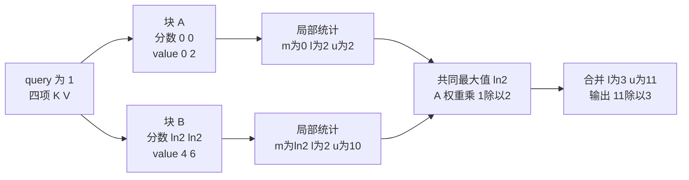

# 高效 Attention：分块、在线归一化与 IO

> **文献基线**：[FlashAttention，arXiv:2205.14135v2](https://arxiv.org/html/2205.14135v2)（2022-06-23，§2.2、§3.1–3.2、§5）；[FlashAttention-2，arXiv:2307.08691v1](https://arxiv.org/html/2307.08691v1)（2023-07-17，§2.3、§3.1–3.2）；[Flash-Decoding 作者文章](https://princeton-nlp.github.io/flash-decoding/)（2023-10-12，“A faster attention for decoding”）。来源索引见 `raw/01_theory/05_inference/FlashAttention-2205.14135.md`、`FlashAttention2-2307.08691.md`、`FlashDecoding-2023.md`。
> **源码基线**：`Dao-AILab/flash-attention@6d673cd9610172431bf1b7786d10918dba2783c0`（`v2.2.0`，2023-09-05；仅用于末节的实现对照，不代替论文的通用算法）。
> **主题**：从一行注意力的分母依赖出发，推导块统计怎样合并成完整结果；说明 IO 感知的分块与短 query 下的 KV 切分各解决哪种执行压力。
> **适用范围**：讨论单次精确 attention 的数值和访存原理。KV 的保存与物理分页分别见 12、13；跨卡 Ring/CP 的通信与布局由 06 并行页负责。
> **最近更新**：2026-09-17。新建原理页；教学算例为解析计算，未运行 GPU 基准。

## 1. 困难不只是乘法量，还有中间矩阵的往返

对一个 attention head，令 $Q\in\mathbb{R}^{N_q\times d}$、$K,V\in\mathbb{R}^{N_k\times d}$。经缩放与可选掩码后的分数 $S$ 有 $N_q\times N_k$ 个元素，输出为 $O=\operatorname{softmax}(S)V$。普通分步实现先写出 $S$，再读写概率矩阵 $P$，最后计算 $PV$；这些中间矩阵在长序列 prefill 中可能成为主要的 HBM 读写和临时容量。FlashAttention 论文的 arXiv v2 版 §2.2 Algorithm 0 明确描述了这条物化路线。这里的“普通实现”是论文比较的算法形态，不代表所有未命名的内核都会物化两份矩阵。[来源：FlashAttention §2.2，Algorithm 0](https://arxiv.org/html/2205.14135v2)。

只把 K/V 分块后分别计算 softmax 还不够。每块有自己的归一化分母，直接平均局部输出会改变完整序列上的概率。关键设计是在每个块保留**最大值、指数和、未归一化加权值**，再按同一个全局最大值重标定。这样大分数不必先写成完整 $S$，局部结果也能恢复全局分母。FlashAttention §3.1 的 Algorithm 1 与 Theorem 1 给出分块前向和数学等价性；FlashAttention-2 §2.3.1、§3.1.1 进一步说明了局部统计与延迟归一化。[来源：FlashAttention §3.1](https://arxiv.org/html/2205.14135v2)，[FlashAttention-2 §2.3.1、§3.1.1](https://arxiv.org/html/2307.08691v1)。

## 2. 三个统计量如何恢复完整 softmax

固定一个 query 行，令有效 key 的分数为 $s_j=q\cdot k_j/\sqrt d$（需要掩码时，被屏蔽位置不参与求和），value 为向量 $v_j$。把 key 索引分成互不重叠的块 $C_1,\ldots,C_B$。对非空块定义：

$$
\begin{aligned}
m_b&=\max_{j\in C_b}s_j, \\
\ell_b&=\sum_{j\in C_b}e^{s_j-m_b}, \\
u_b&=\sum_{j\in C_b}e^{s_j-m_b}v_j.
\end{aligned}
$$

这里 $u_b$ 保留 value 维，$\ell_b$ 是标量；局部归一化结果为 $o_b=u_b/\ell_b$。合并时先取 $m=\max_b m_b$，再把各块改写到相同的指数基准：

$$
\begin{aligned}
\ell&=\sum_b e^{m_b-m}\ell_b, \\
u&=\sum_b e^{m_b-m}u_b, \\
o&=u/\ell.
\end{aligned}
$$

因为 $e^{m_b-m}e^{s_j-m_b}=e^{s_j-m}$，分子与分母恰好都是**全体有效 key**的同一组指数权重；在实数运算下，$o$ 等于直接计算 $\operatorname{softmax}(s)V$。合并规则可反复应用，也可先在各块并行计算，再归约。全被 mask 的块没有有限 $m_b$ 和正的 $\ell_b$，须作为空块跳过；若整行没有有效 key，输出值由具体算子的约定决定，不能把 $0/0$ 当成有效结果。[来源：FlashAttention §3.1 的块合并，Algorithm 1、Theorem 1](https://arxiv.org/html/2205.14135v2)。

## 3. 两块 K/V 的可复算账本

下面是**教学算例**，不是论文数据或实测。取 $d=1$、$q=1$，四个 key 为 $(0,0,\ln2,\ln2)$，value 为 $(0,2,4,6)$，无掩码，故四个分数正好为 $(0,0,\ln2,\ln2)$。把前两项设为块 A、后两项为块 B：

| 区域 | 分数 $s_j$ | value $v_j$ | 最大值 $m$ | 指数和 $\ell$ | 未归一化加权值 $u$ | 局部输出 $o$ |
|---|---|---|---:|---:|---:|---:|
| 块 A | $0,0$ | $0,2$ | $0$ | $1+1=2$ | $0+2=2$ | $1$ |
| 块 B | $\ln2,\ln2$ | $4,6$ | $\ln2$ | $1+1=2$ | $4+6=10$ | $5$ |

全局最大值为 $\ln2$。A 的重标定因子是 $e^{0-\ln2}=1/2$，B 的是 $1$，所以 $\ell=(1/2)\cdot2+2=3$、$u=(1/2)\cdot2+10=11$，输出 $o=11/3$。从全量分数直接算，四个未归一化权重是 $(1,1,2,2)$，得到 $(0+2+8+12)/(1+1+2+2)=22/6=11/3$，两条路线相同。

**图的规格**：左侧是一行 query 与四项 K/V；中间将 K/V 切成 A、B 两条可并行支路，各支路输出 $m,\ell,u$；右侧在共同最大值下重标定并合并，最终输出 $11/3$。数字均来自上表；图强调局部分母不能直接平均，箭头不表示真实内核的线程调度或耗时比例。

如果改用局部 log-sum-exp $L_b=m_b+\log\ell_b$，也可先算各块 $o_b$，再用 $\exp(L_b-L)$ 加权，其中 $L=\operatorname{logsumexp}_b L_b$。本例 $L_A=\ln2$、$L_B=\ln4$，合并权重分别为 $1/3$、$2/3$，故 $(1/3)\cdot1+(2/3)\cdot5=11/3$。这一形式适合下一节并行 split-KV 的部分输出恢复。[来源：Flash-Decoding，“A faster attention for decoding”](https://princeton-nlp.github.io/flash-decoding/)。

## 4. FlashAttention 降低的是哪一层 IO

FlashAttention 把 $Q$、$K$、$V$ 切成适配片上 SRAM 的块，在片上形成局部分数，逐块更新每个 query 行的统计与输出，避免把完整 $N\times N$ 分数和概率矩阵作为中间物写到 HBM。它仍须读取输入、写出输出，块大小也受到片上容量约束。原论文 §3.1 的前向 Algorithm 1 和 §3.2 的 Theorem 2 给出的是**特定算法及容量条件下的 HBM 访问次数**：对 $N_q=N_k=N$、head dim 为 $d$、片上容量记为 $M$ 且 $d\le M\le Nd$ 的模型，普通物化 attention 为 $\Theta(Nd+N^2)$，该 FlashAttention 算法为 $\Theta(N^2d^2/M)$。这里 $M$ 与访问次数按论文的元素模型计量；这不是任意设备、掩码、batch 或 decode 形状上的固定加速倍数。[来源：FlashAttention §3.1–3.2，Algorithm 1、Theorem 2](https://arxiv.org/html/2205.14135v2)。

**计算量没有变成线性。** Theorem 1 仍给出 $O(N^2d)$ 的乘加复杂度，优势来自中间矩阵少往返 HBM；训练反向还可用重算代替存储完整分数矩阵，但这不是推理前向必须承担的工作。论文 §3.2 Fig. 2 显示，在其 GPT-2 medium、长度 1024、A100 的前向加反向基准里，较少 HBM 访问和更短运行时间一起出现；它是指定实验条件下的证据，不可直接换算成单 token 推理收益。[来源：FlashAttention §3.1–3.2、Fig. 2](https://arxiv.org/html/2205.14135v2)。

块也并非越大越好：大块减少某些重复加载，却占更多片上空间，可能压低并发；原论文 §3.2 Fig. 2 的块大小实验指出收益到一定程度后会转为其他瓶颈。不同 GPU 架构和低层 kernel 的可移植性是原论文 §5 明列的限制。FlashAttention-2 §3.2 又通过 query 行块之间的并行改善长序列、小 batch 或少 head 时的占用率，说明**访存量、并行度和额外归一化操作**都影响最终时间。[来源：FlashAttention §3.2、§5](https://arxiv.org/html/2205.14135v2)，[FlashAttention-2 §3.2](https://arxiv.org/html/2307.08691v1)。

## 5. Prefill 与 decode 为什么需要不同的切分轴

Prefill 同时拥有多行 query，逻辑分数形状为 $S_q\times S_k$；按 query 行块并行，每块再流过可见 K/V，能够让不同 query 行各自保持统计。Decode 通常只有一个新 query，但要读取增长中的历史 KV；此时没有很多 query 行可供切分，按 query 块并行可能无法提供足够并发。这里的形状来自自回归执行顺序，参见 [[10_prefill_decode_analysis|Prefill / Decode]]；瓶颈仍需结合 batch、head 数、长度与硬件判断。[来源：FlashAttention-2 §3.2](https://arxiv.org/html/2307.08691v1)，[Flash-Decoding，“Multi-head attention for decoding”](https://princeton-nlp.github.io/flash-decoding/)。

**Split-KV / Flash-Decoding** 在短 query、长 KV、并行度不足的负载下，把历史 KV 沿序列切给多个工作单元；每份求局部输出和 $L_b$，最后以 $\exp(L_b-L)$ 重新加权部分输出。它和 §2 的等价式是同一数学问题，只是为了增加可同时工作的单元而把块间归约显式地放到后一步。作者文章明确写出切分、并行求局部 attention 与 LSE、最终归约这三步。代价是部分输出和 LSE 的写读、额外归约及可能的 kernel 启动；KV 很短或已有足够 batch/head 并行时，不可预设 split 必然更快。[来源：Flash-Decoding，“A faster attention for decoding”](https://princeton-nlp.github.io/flash-decoding/)。

论文中的“exact”指**目标注意力的代数形式未近似**。实际浮点计算会因块划分、重标定与归约顺序产生舍入差异；不同精度、累加类型、mask 和空行约定也会改变数值表现。因此教学算例的有理数相等不是逐位相等的 GPU 保证。物理 KV 分页只决定如何定位 K/V，不改变本节归一化规则；跨卡 Ring Attention 可复用统计合并式，但 K/V 通信与归属由 [[01_theory/06_distributed_parallelism/20_ring_attention_and_context_parallel_analysis|Ring Attention 与上下文并行]] 说明。本页是在线 softmax 公式的归属页，06 保留跨卡算法与通信成本。[来源：FlashAttention §3.1 的数学等价性](https://arxiv.org/html/2205.14135v2)；浮点差异为据运算顺序所作分析推断。

## 6. 冻结实现的两处核对与证据边界

论文解释通用算法；代码仅核对一个已发布实现是否沿相同边界组织。`Dao-AILab/flash-attention@6d673cd9610172431bf1b7786d10918dba2783c0` 中，`csrc/flash_attn/src/flash_fwd_kernel.h::softmax_rescale_o` 维护分数最大值、指数和并重标定输出累积，对应 §2 的块合并。`flash_attn/flash_attn_interface.py::flash_attn_with_kvcache` 把 `num_splits` 定义为沿 KV 序列切分的数量；`csrc/flash_attn/src/flash_fwd_launch_template.h::run_flash_splitkv_fwd` 在多 split 时启动归约 kernel，而 `csrc/flash_attn/src/flash_fwd_kernel.h::combine_attn_seqk_parallel` 根据部分 LSE 缩放并加总输出，对应 §5 的 split-KV 恢复。这些是固定 `v2.2.0` 版本的实现对照，不推广为所有 attention 内核的调度策略。

## Related Pages

- [[10_prefill_decode_analysis|自回归生成与 Prefill / Decode]] — 区分多 query 的 prompt 计算与短 query 的逐轮生成。
- [[12_kv_cache_analysis|KV Cache：复用依据与容量]] — 查看历史 K/V 为什么可复用以及容量如何增长。
- [[01_theory/06_distributed_parallelism/20_ring_attention_and_context_parallel_analysis|Ring Attention 与上下文并行]] — 查看在线归一化跨卡合并时的 K/V 通信、负载均衡和完成条件。
- [[02_engineering/03_infer_frameworks/vllm/10_vllm_attention_backends_analysis|vLLM Attention Backend]] — 查看一个引擎如何接入具体 attention backend 与 KV 布局。
