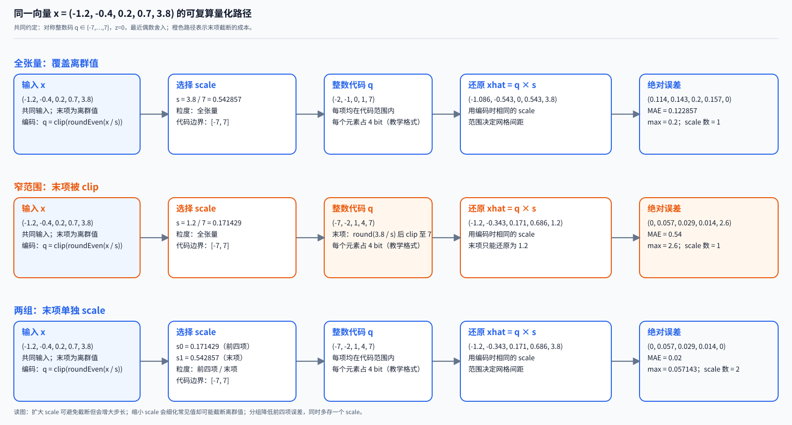

# 推理量化基础：表示、误差与执行成本

> **文献基线**：[Quantization and Training of Neural Networks for Efficient Integer-Arithmetic-Only Inference，arXiv:1712.05877v1](https://arxiv.org/pdf/1712.05877v1)（2017-12-15；§2.1–2.4、§3.1）；[LLM.int8()，arXiv:2208.07339v2](https://arxiv.org/pdf/2208.07339v2)（2022-11-10；§3.1–3.2、§4.1–4.2、Appendix D）；[NVIDIA TensorRT 11.3.0 Quantization Schemes](https://docs.nvidia.com/deeplearning/tensorrt/11.3.0/inference-library/quantized-types-schemes.html) 与 [Accuracy Considerations](https://docs.nvidia.com/deeplearning/tensorrt/11.3.0/inference-library/accuracy-considerations.html)（11.3.0）；[Working with Quantized Types](https://docs.nvidia.com/deeplearning/tensorrt/latest/inference-library/work-quantized-types.html)（动态页，2026-09-17 访问快照）。来源索引见 raw/01_theory/05_inference/Quantization_and_Training_of_Neural_Networks-1712.05877.md、raw/01_theory/05_inference/LLM_int8-2208.07339.md 和 raw/01_theory/05_inference/TensorRT_Quantization_Schemes-11.3.0.md。
> **主题**：量化把连续值映射到有限代码，再按相同缩放约定还原；用同一组含离群值数据追踪范围、误差与元数据，并把存储节省和实际执行成本分开。
> **适用范围**：给出推理中的数值表示和成本基础。量化方案搜索、校准与训练归量化算法专题；KV 的长上下文质量归 KV 专题；打包格式、融合 kernel 和各运行时的性能调优归工程页。
> **最近更新**：2026-09-17。新建原理页；固定论文和官方文档版本取证。示例是可复算教学数据，不是某个模型的精度或吞吐实测。

## 1. 量化先是一套编码约定，不是一个位宽标签

令实数 $x$ 编成整数代码 $q$，再还原为 $\hat{x}$。一套均匀 affine 编码由代码范围 $[q_{\min},q_{\max}]$、正 scale $s$、zero-point $z$ 和舍入规则共同确定：

$$
\begin{aligned}
q &= \operatorname{clip}_{[q_{\min},q_{\max}]}\left(\operatorname{round}(x/s)+z\right),\\
\hat{x} &= s(q-z),\qquad e=\hat{x}-x.
\end{aligned}
$$

Jacob 等在 §2.1 写作 $r=S(q-Z)$：$S$ 是实数尺度，$Z$ 让整数代码 $Z$ 精确表示实数零。相同的位宽可以配不同范围、不同 $s$ 和不同粒度，因而不能只说“这是 4-bit”就得到它的分辨率或误差。若没有截断，相邻还原值的间距为 $s$；采用最近舍入时，单个值的舍入误差绝对值至多为 $s/2$。一旦 clip 生效，这个界不再成立。

代码点数由范围决定。完整的 $B$ bit 无符号整数常有 $2^B$ 个代码；带符号实现也常保留不对称的二补码端点。例如 TensorRT 11.3.0 的 INT8 公式使用 $[-128,127]$，INT4 使用 $[-8,7]$。其 INT8 方案为 $q=\operatorname{round}_{\mathrm{even}}(\operatorname{clip}(x/s,-128,127))$、$\hat{x}=qs$；该已冻结合同采用以零为中心的对称量化。[TensorRT Quantization Schemes 11.3.0](https://docs.nvidia.com/deeplearning/tensorrt/11.3.0/inference-library/quantized-types-schemes.html)；[Working with Quantized Types（动态页，2026-09-17 快照）](https://docs.nvidia.com/deeplearning/tensorrt/latest/inference-library/work-quantized-types.html)

浮点低精度也不是均匀整数网格。TensorRT 的 FP8 E4M3 有随指数变化的间距，靠近零更密、远离零更疏；整数均匀网格则在整个表示区间有固定步长。比较“INT8、INT4、FP8”时，要同时写清格式、范围、scale、舍入和 clip，而不能把 bit 数当成全部事实。[Accuracy Considerations 11.3.0](https://docs.nvidia.com/deeplearning/tensorrt/11.3.0/inference-library/accuracy-considerations.html)

## 2. 一组固定数据：从输入到代码、还原和误差

以下的所有表和图都从同一向量开始：

$$
x=(-1.2,\,-0.4,\,0.2,\,0.7,\,3.8).
$$

$3.8$ 是刻意放入的离群值。为让结果逐项复算，本节约定使用**对称、整数、最近偶数舍入**，教学代码集合为 $q\in\{-7,\ldots,7\}$，即 $z=0$；选择 $-7$ 至 $7$ 是为了令 $s=\max\lvert x\rvert/7$ 直接可见，并不声称它是某一引擎的唯一 INT4 编码。图中的数均保留到六位小数。

| 方案 | scale 与粒度 | 编码 $q$ | 还原 $\hat{x}$ | 逐项 $\lvert e\rvert$ | MAE / 最大误差 |
|---|---|---|---|---|---|
| 全张量、覆盖离群值 | $s=3.8/7=0.542857$ | $(-2,-1,0,1,7)$ | $(-1.085714,-0.542857,0,0.542857,3.8)$ | $(0.114286,0.142857,0.2,0.157143,0)$ | $0.122857 / 0.2$ |
| 窄范围、发生截断 | $s=1.2/7=0.171429$ | $(-7,-2,1,4,7)$ | $(-1.2,-0.342857,0.171429,0.685714,1.2)$ | $(0,0.057143,0.028571,0.014286,2.6)$ | $0.54 / 2.6$ |
| 两组 | 前四项 $s_0=1.2/7$；末项 $s_1=3.8/7$ | $(-7,-2,1,4,7)$ | $(-1.2,-0.342857,0.171429,0.685714,3.8)$ | $(0,0.057143,0.028571,0.014286,0)$ | $0.02 / 0.057143$ |

第一行把较大 $s$ 分给整组，离群值无误差，却让 $0.2$ 量化为零。第二行较细的网格减小了常见值的舍入误差，却使 $3.8$ 先除以 $s$ 后超过代码上界并被截为 $7$，所以还原只能到 $1.2$。第三行不改变每组的代码范围，而是让前四项和末项各带一个 scale；它说明粒度如何隔离动态范围，也带来额外 scale 和分组边界。

**图的规格**：每条路径必须从同一输入向量出发，明确显示 scale、整数代码、还原值和绝对误差。三条路径分别对应覆盖离群值的全张量缩放、会 clip 的窄范围缩放、以及两组缩放；图末列出每条路径的 MAE、最大误差和 scale 个数。橙色标出本例发生截断的窄范围路径及其代价，不表示所有模型都具有同类分布。

图由 [19_inference_quantization.mjs](assets/19_inference_quantization.mjs) 从数组、code range 和舍入函数生成。修改输入数值并同步更新本页算例后，脚本会重算 scale、代码、还原值、误差和汇总；正文与生成结果不一致时会报错。它展示数值语义，不代表任何 kernel 的时间比例。

### 2.1 非对称编码能移动零点，但也要看执行合同

若数据范围明显偏向一侧，affine 编码可用非零 $z$ 让零恰好对齐某个代码。例如仍取同一数据，采用无符号 4-bit 范围 $[0,15]$、$s=0.4,z=3$，可得

$$
q=\operatorname{clip}_{[0,15]}(\operatorname{round}_{\mathrm{even}}(x/0.4)+3),\qquad
\hat{x}=0.4(q-3).
$$

其代码为 $(0,2,3,5,13)$，还原为 $(-1.2,-0.4,0,0.8,4.0)$，绝对误差为 $(0,0,0.2,0.1,0.2)$。本例先对 $x/s$ 舍入、再加 $z$：$0.2/0.4=0.5$ 按最近偶数舍入为 $0$，而 $3.8/0.4=9.5$ 舍入为 $10$，所以代码分别为 $3$ 与 $13$。这是**一个约定明确的算例**；它不说明该参数优于上表任一方案。

通用 affine 数学允许 $z\ne0$，而特定执行器可能没有这个合同。TensorRT 的量化类型文档采用对称量化，并在其 Q/DQ 约束中要求所支持的 zero-point 为零；该条来自没有可用 11.3.0 固定路径的动态文档快照。部署时应把“数值上可表示”与“该引擎、该版本可以执行”分开核对。[Working with Quantized Types（动态页，2026-09-17 快照）](https://docs.nvidia.com/deeplearning/tensorrt/latest/inference-library/work-quantized-types.html)

## 3. scale 何时产生、给谁用：静态、动态与粒度

“静态”和“动态”描述 scale 的产生时机，不等同于某个固定 bit 数。

| 选择 | scale 的来源与复用 | 主要数值后果 | 主要执行代价 |
|---|---|---|---|
| 静态 | 在部署前确定，推理时复用 | 新输入若超出代表范围会 clip；范围太宽则步长大 | 无需每次输入做范围归约，但要保存 scale |
| 动态 | 从当前输入或当前块的统计量得到 | 更贴近这一批数据；统计与边界定义会影响结果 | 需要归约、生成 scale，并在计算图中传递 |
| per-tensor | 一组张量共享一个 scale | 最少元数据；离群值可支配整组步长 | scale 数最少 |
| per-channel / per-row / per-column | 按语义轴分别带 scale | 可匹配不同通道或矩阵向量的范围 | 更多 scale、索引与广播 |
| per-group / per-block | 固定大小的局部块各带 scale | 在误差和元数据之间折中 | 需要分组布局与边界处理 |

Jacob 等 §3.1 解释了为什么不同输出通道的动态范围会使单一量化参数损失精度。LLM.int8() §3.1 使用行和列向量级 scale；§3.2 在该论文的 Transformer 中把少量离群 feature dimension 与主 8-bit 路径分开处理。这些观察给出“为何会改变粒度”的动机；如何自动选范围、阈值和分解策略属于量化算法专题，不能由这一页的三行数据推出通用规则。[Jacob 等 §3.1](https://arxiv.org/pdf/1712.05877v1)；[LLM.int8() §3.1–3.2](https://arxiv.org/pdf/2208.07339v2)

## 4. 误差从哪里来：舍入、截断和离群值

在已选定 $s,z$ 且不触及边界时，误差来自把连续值投到网格点；最近舍入把误差限制在半个步长内。TensorRT 的准确性文档把这称为 rounding error，并指定 nearest ties-to-even。扩大 $s$ 会减少 clipping，却增大网格间距；缩小 $s$ 则相反。上表的第一、二行正是同一折中在两端的数值账本。[Accuracy Considerations 11.3.0](https://docs.nvidia.com/deeplearning/tensorrt/11.3.0/inference-library/accuracy-considerations.html)

clip 后，饱和值的误差是输入距离可表示端点的距离。例如第二行的 $3.8$ 被还原为 $1.2$，绝对误差为 $2.6$，远大于 $s/2\approx0.085714$；因此不能把“量化误差不超过半个 scale”误用于被截断元素。离群值也不必是错误：它先是范围与常见值共享 scale 时的分辨率问题，随后才可能成为精度问题。

LLM.int8() 在其所测的大型 Transformer 中报告了少量大幅值 feature dimension，并据此使用混合精度分解；论文 §3.2 的约 $0.1\%$ 是该方法和实验的经验量级，不能写成所有 LLM 的固定比例。这里仅用它说明：看到离群值后，可以改变粒度或保留高精度路径；何时采用哪种算法归后续专题。[LLM.int8() §3.2、§4.1–4.2](https://arxiv.org/pdf/2208.07339v2)

## 5. 权重、激活与 KV 的对象寿命不同

量化对象不是抽象的“一堆数字”。它们在推理时产生、复用和存活的时间不同：

| 对象 | 何时已知 | 常见 scale 选择含义 | 本页只确认的数值要求 |
|---|---|---|---|
| 权重 $W$ | 模型加载前已固定 | 可预先存编码和 scale；粒度常沿输出或输入通道 | 每个编码块都必须保留可对应的 $s,z$ |
| 激活 $A$ | 随请求和 token 变化 | 可以复用部署时范围，也可以按本次数据产生 scale | 矩阵乘法两端的 scale 必须进入结果还原 |
| KV | 每层、每个已处理位置逐步追加 | 可按张量、头、通道或时间块约定 scale | 读回 K/V 时必须使用写入该块的相同约定 |

KV 的量化若改变历史 token 的近似值，会进一步影响注意力分数和后续输出；长上下文精度、尺度更新和质量测量留给 KV 专题。本页只建立“编码值与它的 scale 必须共同存活”的表示约束，未给出 KV 的质量结论。

## 6. 从存储到乘法再到累加：节省不会自动变成固定加速

对 $N$ 个代码、每组 $g$ 个元素，若每个代码占 $b_q$ bit，每个 scale 占 $b_s$ bit，zero-point 占 $b_z$ bit，一个简化的持久存储账本为：

$$
M\approx \frac{N b_q}{8}+
\left\lceil\frac{N}{g}\right\rceil\frac{b_s+b_z}{8}.
$$

这解释了两组方案为何不只是“5 个 4-bit 数”：scale 和可能的 zero-point 也要存储。更小的 $g$ 往往减少误差，却使第二项增加；真实格式还会有对齐、分块表和打包填充。

对于激活 $a$ 与权重 $w$ 的点积，affine 还原给出：

$$
\sum_i\hat{a}_i\hat{w}_i
=s_a s_w\sum_i(q_{a,i}-z_a)(q_{w,i}-z_w).
$$

这不是说运算可以在任意低精度累加。Jacob 等 §2.2–2.4 将缩放积预先处理，在其 uint8 方案中以 int32 累加 $q_aq_w$ 的核心项，再进行 rescale 和饱和转换；bias 也需采用输入 scale 与权重 scale 的乘积。zero-point 展开还带来校正项，不能只把上式中的整数乘法孤立出来。[Jacob 等 §2.2–2.4](https://arxiv.org/pdf/1712.05877v1)

| 环节 | 可能减少的量 | 仍须核对的条件 |
|---|---|---|
| 权重存储与读取 | 代码位宽和带宽 | scale 元数据、对齐、打包和反量化位置 |
| 激活与 KV 读取 | 传输字节数 | 运行时 scale、读回还原和精度需求 |
| 乘法 | 可使用低精度指令 | 设备是否支持该格式和该粒度组合 |
| 累加与输出 | 中间表示的带宽或格式 | accumulator 宽度、overflow、rescale 与输出类型 |
| 端到端延迟 | 有时可受益于数据移动减少 | batch、序列长度、内存瓶颈、转换开销和 kernel 实现 |

因此“从 16 bit 改成 4 bit”最多先推出理想代码载荷按元素缩小；它不能单独推出固定的吞吐或延迟倍数。LLM.int8() Appendix D 也讨论了混合精度分解和不同 kernel 会改变推理速度。应在给定模型、形状、硬件、格式和运行时下，结合成本模型与实测决定收益；本页不把数字表示直接等同于性能承诺。[LLM.int8() Appendix D](https://arxiv.org/pdf/2208.07339v2)

## 7. 本页边界与相关页面

本页的职责是固定量化的编码语义、误差来源和成本账本。范围搜索、校准、训练后量化和量化感知训练的算法归量化方法页；KV 的质量与长上下文影响归 KV 页；布局、打包、融合与硬件 kernel 归工程分析页。若某个运行时的格式合同与本页通用 affine 方程不同，应以该版本的官方合同为准。

## Related Pages

- [[10_prefill_decode_analysis|自回归生成与 Prefill / Decode]]：解释激活与 KV 怎样按 token 产生，量化对象的生命周期以此为前提。
- [[11_inference_cost_model_analysis|推理性能与资源成本模型]]：把本页的字节、元数据和算术账接入长度、并发与硬件上界。
- [[12_kv_cache_analysis|KV Cache：历史复用与容量]]：展开历史 K/V 的表示、容量和质量边界。
- [[02_engineering/03_infer_frameworks/vllm/17_vllm_quantization_analysis|vLLM 量化执行]]：把这里的通用编码约定落到 vLLM 的 pack、scale、分片与 dispatch。
- [[02_engineering/03_infer_frameworks/vllm/20_vllm_fused_ops_and_kernels_analysis|vLLM 融合算子与 Kernel]]：说明专用 kernel 怎样改变数据布局、融合边界和实测成本。
