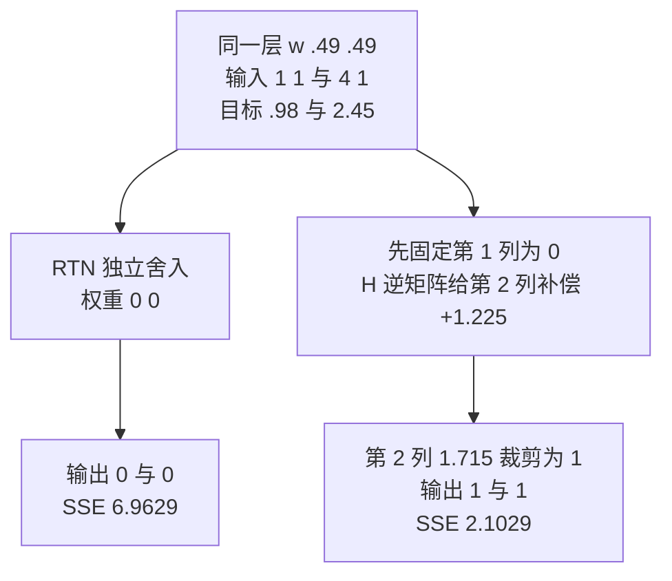
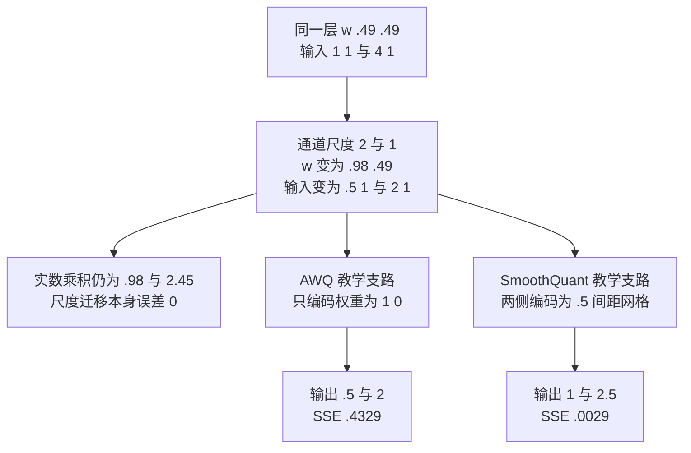

# 推理量化算法：校准、误差补偿与尺度迁移

> **文献基线**：[GPTQ，arXiv:2210.17323v1](https://arxiv.org/pdf/2210.17323v1)（2022-10-31，§3–4；索引 `raw/01_theory/05_inference/GPTQ-2210.17323.md`）；[AWQ，arXiv:2306.00978v1](https://arxiv.org/pdf/2306.00978v1)（2023-06-01，§2–3；索引 `raw/01_theory/05_inference/AWQ-2306.00978.md`）；[SmoothQuant，ICML 2023 正式版](https://proceedings.mlr.press/v202/xiao23c/xiao23c.pdf)（§3–5；索引 `raw/01_theory/05_inference/SmoothQuant-ICML2023.md`）。
> **主题**：在已选编码格式后，用校准输入决定哪些误差更重要；从同一个二输入线性层解释 GPTQ 的顺序补偿、AWQ 的激活感知权重缩放和 SmoothQuant 的激活/权重等价尺度迁移，并把离线制作与在线执行分开。
> **适用范围**：推理权重和激活的训练后量化原理。位宽、scale、zero-point、舍入和 kernel 成本的基本合同见量化基础页；QAT 的具体训练配方归训练域，推理引擎中对已量化权重的读取、打包与 dispatch 归工程页。示例是分析用极小层，不是任何论文的算法复现或跨方法质量排名。
> **最近更新**：2026-09-17。新建原理页；逐算法打开论文公式与实验，图中数值由教学输入机械复算。

## 1. 为什么“直接舍入”是基线，不是校准算法

直接舍入（RTN）在给定代码范围与 scale 后逐个把权重送到最近网格点；它不知道哪些输入通道会被放大，也不利用相邻权重可互相补偿的事实。训练后量化（PTQ）的校准步骤先取一小批代表性输入，通过层计算取得激活或输出，再用它决定量化参数、舍入/补偿和尺度。校准目标可以是给定层的输出重建误差，也可以是激活范围/通道重要性；不同目标不会产生同一算法。[GPTQ §3.1、Eq. (1)](https://arxiv.org/pdf/2210.17323v1)；[AWQ §2.1–2.2](https://arxiv.org/pdf/2306.00978v1)；[SmoothQuant §4](https://proceedings.mlr.press/v202/xiao23c/xiao23c.pdf)

设单层 $Y=WX$，$X$ 是校准样本组成的输入矩阵，$\hat W$ 是可编码权重。GPTQ 从最小化 $\lVert WX-\hat WX\rVert_F^2$ 出发。这个目标只约束校准样本上的输出；若真实请求的输入分布不同，即使该目标接近零，也不能保证所有任务的 token 分布或质量不变。量化格式与舍入误差的通用定义见 [[19_inference_quantization_analysis|推理量化基础]]。

## 2. 一层、两输入、两个样本的共同账本

用**教学线性层** $w=(0.49,0.49)$、两个列输入 $x^{(1)}=(1,1)^\top$ 与 $x^{(2)}=(4,1)^\top$。原层输出为 $y=(0.98,2.45)$，第一个输入通道在第二个样本中较大。下表每条路径都回到这同一组 $w,X$，但**刻意采用不同教学量化网格**以显露各自机制；表内 SSE 不能用来给三篇论文排质量名次。

| 路径 | 约定与中间结果 | 两样本近似输出 | $\sum_i(\hat y_i-y_i)^2$ |
|---|---|---|---:|
| 原始 | $w=(0.49,0.49)$，不量化 | $(0.98,2.45)$ | 0 |
| RTN 对照 | 权重网格 $\{0,1\}$，各自 $0.49\mapsto0$ | $(0,0)$ | 6.9629 |
| GPTQ 式顺序补偿 | 同一权重网格；先 $w_1\mapsto0$，把残差传给 $w_2$，最后 $(0,1)$ | $(1,1)$ | 2.1029 |
| AWQ 式权重缩放 | 权重网格仍 $\{0,1\}$；输入通道尺度 $(2,1)$，变换后权重 $(0.98,0.49)\mapsto(1,0)$ | $(0.5,2)$ | 0.4329 |
| SmoothQuant 式尺度迁移 | 同一尺度 $(2,1)$；激活与权重共用网格 $\{0,0.5,1,1.5,2\}$，变换后 $\hat w=(1,0.5)$，变换后两个输入均在网格上 | $(1,2.5)$ | 0.0029 |

表中的小网格只用于比较**中间量**。真实 GPTQ/AWQ 可用 INT3/4 权重分组，SmoothQuant 面向 W8A8；真实码本、scale 与 clip 不由这五行定义。最后一行的 0.0029 只是所选输入恰好落在网格上的结果，不说明 SmoothQuant 在真实数据上优于另两者。

## 3. GPTQ：先舍入一个权重，再补偿剩余列

GPTQ §3.1 以层输出误差为目标；其 §3.2 先给出 OBQ 单权重更新，再在 §3.3 将所有行按相同列顺序处理、分块累计更新并用 Cholesky 形式保持大层计算可行。**决定性规则**是：量化一个权重造成的误差，可以在尚未固定的其他权重上按校准输入相关性补偿；若所有权重各自舍入，便丢掉了这个机会。GPTQ 不是在推理时为每个请求重新算 Hessian。[GPTQ §3.1–3.3、Eqs. (1)–(3)、Fig. 2](https://arxiv.org/pdf/2210.17323v1)

本例 $X=\begin{bmatrix}1&4\\1&1\end{bmatrix}$，故无阻尼的教学 Hessian $H=2XX^\top=\begin{bmatrix}34&10\\10&4\end{bmatrix}$，$H^{-1}=\frac1{36}\begin{bmatrix}4&-10\\-10&34\end{bmatrix}$。若固定顺序先将 $w_1=0.49$ 舍入为 0，则按论文 §3.2 的单步补偿式，未量化 $w_2$ 的增量是

$$
\delta w_2=-\frac{w_1-Q(w_1)}{(H^{-1})_{11}}(H^{-1})_{21}
=-\frac{0.49}{4/36}\left(-\frac{10}{36}\right)=1.225.
$$

所以 $w_2$ 暂变为 $1.715$，在本例的 $\{0,1\}$ 网格裁剪舍入后变成 1。输出从 RTN 的 $(0,0)$ 改为 $(1,1)$，SSE 从 6.9629 降到 2.1029。**这是用 GPTQ 所继承的 OBQ 补偿式重放一个二权重步骤**，不是完整 GPTQ 的分块、阻尼、列排序或生产码本。论文实际用分块延迟全局更新，因为逐权重更新大矩阵的内存访问过多；分块/Cholesky 与误差目标共同决定它能否扩到大模型。[GPTQ §3.2–3.3、Algorithm 1](https://arxiv.org/pdf/2210.17323v1)

## 4. AWQ：激活信息决定权重通道该怎样缩放

AWQ §2.1 的对照实验发现：在其 OPT/INT3 分组条件下，依据**激活通道**而非权重大小选出少量重要通道，保留 FP16 会明显降低困惑度；但逐个混精度保留不利于规则的低 bit 执行。其最终方法在量化前搜索逐输入通道尺度，让显著通道的权重在组内获得更好分辨率，并对输入作反向缩放，必要时一起搜索 clipping。缩放过强会挤压其他通道的有效范围，这就是不能只把最大激活通道无限放大的理由。[AWQ §2.1–2.2、Tables 1–2、Eqs. (1)–(2)](https://arxiv.org/pdf/2306.00978v1)

教学例的第二个输入在通道 1 为 4，取尺度 $s=(2,1)$。实数层仍满足 $w x=(w\odot s)(x\oslash s)$：$w'=(0.98,0.49)$，两个变换后输入分别为 $(0.5,1)$、$(2,1)$。只把 $w'$ 送到 $\{0,1\}$ 权重网格得 $(1,0)$，计算输出 $(0.5,2)$；相对原层 SSE 为 0.4329，低于本例 RTN 的 6.9629。这个固定尺度是**教学选择**，没有执行论文的激活统计、网格搜索或 clipping；它只展示“显著输入通道的权重量化误差为何更值得保护”。AWQ 是**weight-only** PTQ，运行时激活仍需按其执行合同处理；读到一个 AWQ 权重文件，不等于离线校准过程已在当前引擎中重新发生。[AWQ §2.2–2.3](https://arxiv.org/pdf/2306.00978v1)

## 5. SmoothQuant：用等价变换转移量化难度

SmoothQuant 针对 W8A8 中激活离群值拉大共享范围的问题。对输入行向量 $x$ 和权重列向量 $w$，选每输入通道的正尺度 $s$：

$$
xw=(x\oslash s)(w\odot s).
$$

这一步在**实数运算**中精确相等；SmoothQuant Eq. (3) 用矩阵对角缩放表述同一关系。论文 Eq. (4) 从校准激活与权重的逐通道最大幅度选择 $s_j$，用迁移强度 $\alpha$ 决定多少量化难度从激活移到权重；它还指出 $\alpha$ 太大时权重又变难量化。可把尺度融合到前一层的权重或合适的前置运算，具体融合条件取决于图结构。[SmoothQuant §4、Eqs. (3)–(4)、Fig. 5](https://proceedings.mlr.press/v202/xiao23c/xiao23c.pdf)

仍用本例的 $s=(2,1)$，实数变换后的 $(x',w')$ 与 AWQ 小节完全相同，所以原始输出仍是 $(0.98,2.45)$。为了**另行展示激活也量化**，假设两侧都只用教学网格 $\{0,0.5,1,1.5,2\}$：$w'=(0.98,0.49)$ 近似为 $(1,0.5)$，两个 $x'$ 恰好在网格上，于是输出 $(1,2.5)$，SSE 为 0.0029。若不做尺度迁移、原激活第二样本的 4 在此网格被 clip 到 2，则即使权重量化为 $(0.5,0.5)$，第二输出只有 1.5。**网格和尺度都是教学假设**；论文 W8A8 的真实编码粒度、校准集和执行 kernel 与它不同。等价式只能证明变换前后**量化之前**的线性层不变，不能证明量化之后逐位或任务质量不变。[SmoothQuant §3–4](https://proceedings.mlr.press/v202/xiao23c/xiao23c.pdf)

## 6. PTQ、QAT 与执行格式的成本必须分开

| 决策 | 离线需要什么 | 在线要核对什么 | 不能由算法名推出什么 |
|---|---|---|---|
| RTN | 量化范围、scale、打包 | 代码与 scale 的读取、可能的反量化 | 给定模型任务上的误差 |
| GPTQ | 校准输入、层输出目标、Hessian 近似、分块补偿 | 已编码权重的格式与匹配 kernel | 在线也会运行 Hessian 补偿 |
| AWQ | 校准激活、逐通道尺度/clip 搜索 | 缩放是否融合、weight-only 读取和执行 | 所有显著权重都是 FP16 混精度 |
| SmoothQuant | 校准激活范围、尺度与 $\alpha$ 选择、图上融合 | W8A8 所需两侧量化、累加和输出还原 | 等价变换使量化后完全无误差 |
| QAT | 训练过程中让权重适应量化近似 | 部署格式仍须与训练模拟对应 | 与 PTQ 有相同离线成本或可从量化文件识别训练过程 |

GPTQ/AWQ/SmoothQuant 是训练后量化的不同目标与决策；QAT 则在训练环节加入量化影响，具体训练和优化目标不由这一页展开。[GPTQ §2–3](https://arxiv.org/pdf/2210.17323v1)；[AWQ §2](https://arxiv.org/pdf/2306.00978v1)；[SmoothQuant §4](https://proceedings.mlr.press/v202/xiao23c/xiao23c.pdf)。三篇论文的速度结论都绑定自己的 kernel、硬件、模型和 batch；压缩文件变小只先影响字节账，是否加速要检查反量化、gemm/gemv、元数据、算子支持与具体工作负载。引擎若只是**加载**现成 GPTQ/AWQ 权重，它并未因此执行论文的离线校准和搜索。

## Related Pages

- [[19_inference_quantization_analysis|推理量化基础]]：先确定位宽、scale、舍入、clip 与数据移动成本的共同语言。
- [[11_inference_cost_model_analysis|推理性能与资源成本模型]]：把权重字节减少、额外解码和执行形状放到同一个延迟账里。
- [[21_kv_compression_analysis|KV 压缩与选择性保留]]：区分本页权重/激活 PTQ 与长历史 KV 的在线压缩。
- [[02_engineering/03_infer_frameworks/vllm/17_vllm_quantization_analysis|vLLM 量化执行]]：追踪已量化权重在固定引擎源码中怎样被装载、分片、打包和 dispatch。
- [[01_theory/04_posttraining/01_posttraining_frontier_map_analysis|后训练前沿地图]]：定位 QAT 训练配方相对推理期权重执行的边界。
