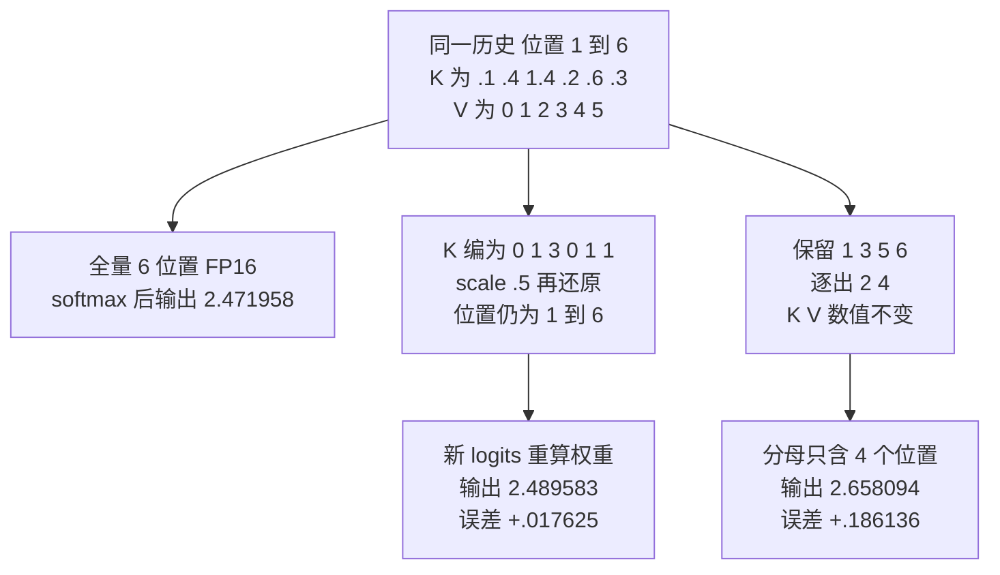

# KV 压缩与选择性保留：精度、位置和表示三条轴

> **文献基线**：[KIVI，arXiv:2402.02750v1](https://arxiv.org/pdf/2402.02750v1)（2024-02-05，§3–4；索引 `raw/01_theory/05_inference/KIVI-2402.02750.md`）；[H2O，arXiv:2306.14048v1](https://arxiv.org/pdf/2306.14048v1)（2023-06-24，§3–5；索引 `raw/01_theory/05_inference/H2O-2306.14048.md`）；[StreamingLLM，arXiv:2309.17453v2](https://arxiv.org/html/2309.17453v2)（2023-11-21，§3–4；索引 `raw/01_theory/05_inference/StreamingLLM-2309.17453.md`）；[DeepSeek-V2，arXiv:2405.04434v1](https://arxiv.org/pdf/2405.04434v1)（2024-05-07，§2.1、Table 1；索引 `raw/01_theory/05_inference/DeepSeekV2_MLA-2405.04434.md`）。
> **主题**：把减少 KV 字节的手段分成数值精度、保留 token 数和模型原生表示维度三轴；用同一段历史追踪量化误差与选择性淘汰怎样分别改变一次注意力输出，再讨论复用和质量边界。
> **适用范围**：推理运行时对已有历史的近似处理及模型原生缓存表示的接口差异。量化编码基础归量化页，完整 MLA 结构归模型页；内容不变的 CPU/远端迁移归 KV 分层迁移页。本文教学算例不是 KIVI、H2O、StreamingLLM 的实现或质量复现。
> **最近更新**：2026-09-17。新建原理页；所有小数由固定六位置输入复算，论文质量结论均限定到原实验口径。

## 1. 容量压力有三种不相同的出口

标准全历史 KV 随已处理位置数增长。给同一请求更多空间，可把冷 KV 搬去 CPU/远端；若要**减小缓存的信息本身**，至少有三条不同的轴：每个数用更少 bit、只留部分 token 的 K/V，或在模型设计时改变每 token 本来需要保存的表示维度。前两者对既有模型是运行时近似，第三者通常是模型结构与权重的一部分，不能把现成 MHA KV 直接当 MLA latent 使用。[KIVI §2–3](https://arxiv.org/pdf/2402.02750v1)；[H2O §3–4](https://arxiv.org/pdf/2306.14048v1)；[DeepSeek-V2 §2.1、Table 1](https://arxiv.org/pdf/2405.04434v1)

| 轴 | 改变的对象 | 保持的对象 | 主要新增风险 |
|---|---|---|---|
| 精度 | 已保留位置的 K/V 数值及 scale/zero-point 元数据 | token 身份和可见位置集合 | 注意力 logits 与加权值出现舍入、截断误差 |
| token 数 | 哪些历史位置仍可参与注意力 | 被保留位置的数值可仍为原精度 | 逐出的 token 无法再被直接注意到 |
| 表示维度 | 模型每位置持久保存什么 latent 或共享位置 key | 由同一模型定义的注意力语义 | 必须用匹配的模型结构、权重和解码路径 |

这些轴可以叠加，但容量节省不能机械相乘：量化要存 scale 和未压缩残段，token 选择要存索引/位置并维护评分，latent 仍可能有位置相关分量。精度、保留位置、布局任一改变都要重新测质量和执行成本。原始存储账见 [[12_kv_cache_analysis|KV Cache：历史复用与容量]]。

## 2. 一段六位置历史：量化和淘汰分别改变什么

以下是**单层、单头、每位置一个 K 标量和一个 V 标量**的教学算例。它刻意很小，使路径可逐项复算，不代表真实头维度或算法参数。查询取 $q=1$，六个已处理位置为 $1,\ldots,6$：

$$
K=(0.1,0.4,1.4,0.2,0.6,0.3),\qquad
V=(0,1,2,3,4,5).
$$

本例把缩放因子 $1/\sqrt{d_k}$ 吸收到 $q$，所以 logits 就是 $K_i$。完整注意力计算为 $a_i=e^{K_i}/\sum_{j=1}^{6}e^{K_j}$，$o=\sum_i a_iV_i$；六个权重约为 $(0.100056,0.135061,0.367133,0.110578,0.164964,0.122208)$，输出约为 $2.471958$。

**精度路径。** 只量化 K，令对称 scale 为 $s=0.5$、整数代码用最近舍入，得到 $q_K=(0,1,3,0,1,1)$，还原 $\hat K=(0,0.5,1.5,0,0.5,0.5)$；V 不变、六个位置都仍可见。按新的 logits 重算，权重约为 $(0.087506,0.144272,0.392172,0.087506,0.144272,0.144272)$，输出约为 $2.489583$，与全精度差 $+0.017625$。这里的相邻舍入与 scale 合同见量化基础页；**该路径不是 KIVI 的按通道 K、按 token V 算法**，仅说明“保留所有位置”也可能改变分布。

**token 路径。** 保持原 K/V 精度，只保留位置 $\{1,3,5,6\}$：位置 1 是本例指定的 sink，位置 3 是此前评分选出的重要位置，5–6 是最近窗口；位置 2、4 的 KV 真正被逐出。把 softmax 分母限制在保留集，权重约为 $(0.132636,0.486682,0.218680,0.162002)$，输出约为 $2.658094$，与全历史差 $+0.186136$。这里用当前 query 的原 K 算出一次后果，**没有声称服务系统可提前知道未来 query 的重要性**；H2O 使用此前的累计注意力信息动态决策，StreamingLLM 使用固定初始 sink 与近窗，它们不是此处这个混合选择器。[H2O §3–4](https://arxiv.org/pdf/2306.14048v1)；[StreamingLLM §3.1–3.2](https://arxiv.org/html/2309.17453v2)

| 同一历史的路径 | 可见位置 | 本例留下的 K 形式 | 输出 $o$ | 最小 payload 账 |
|---|---|---|---:|---:|
| 全精度全历史 | 1–6 | 六个 FP16 K | 2.471958 | K 12 B + V 12 B = 24 B |
| 只量化 K | 1–6 | 六个 4-bit 代码与一个 2 B scale | 2.489583 | K 3 B + scale 2 B + V 12 B = 17 B |
| 淘汰 2、4 | 1、3、5、6 | 四个 FP16 K | 2.658094 | K 8 B + V 8 B = 16 B |

容量列假设恰好密排、一个 2 字节 scale、不计位置索引、页尾空槽、对齐、临时反量化或评分表；因此是**教学 payload**而非真实分配量。数值列在给定单个 query 下展示误差，不是下一 token 概率、长文质量或平均吞吐。

图与表共用同一输入；淘汰支路明确标出位置 2、4 被逐出，量化支路仍有六个位置，却因 logit 改变而产生不同权重。两条支路也可组合，但组合输出必须从新的 K 和新的保留集重新算，不能把上面两个误差直接相加。

## 3. 精度轴：K 和 V 为什么可能要不同分组

KIVI 在其 Llama-2-13B 等实验中观察到 K 有持续偏大的**通道**，V 没有同样明显的固定通道离群模式。其 Table 1 的 2-bit 对比中，K 按通道、V 按 token 的组合在所列任务上优于反向或全按通道配置；§3.2 的分析把 K 误差接到 $QK^\top$ 的 score，把 V 误差接到稀疏注意力加权和。这里是**论文模型与任务内的经验理由**，不能改写成任何模型的数学定理。[KIVI §3.1–3.2、Tables 1–2、Fig. 2](https://arxiv.org/pdf/2402.02750v1)

在线生成每次来一个 token，V 按 token 量化可直接追加；K 按通道的统计跨多个 token。KIVI §3.3 因而把已凑齐的 K 分组量化，新近尚未成组的 residual K 保留全精度，V 也有量化主体与近端残段。读注意力时两个部分分别计算再合并 logits/输出。它解释了“2-bit KV”为什么并不表示**每个活跃 K/V 元素都永久只占 2 bit**：分组 scale、残段、打包和运行时工作区都要计入。[KIVI §3.3、Eq. (3)](https://arxiv.org/pdf/2402.02750v1)

## 4. token 轴：近窗、sink 和重要性选择的不同合同

只留最近窗口，内存上界清楚，却可能使原本训练时长期可见的起始位置突然消失。StreamingLLM §3.1–3.2 的实验把前几个 attention sink 的 KV 与最近窗口一起保留；论文明确说明这支持稳定**流式语言建模**，却不扩展模型在一次注意力中检索任意久远事实的窗口。它还为 RoPE/ALiBi 调整保留位置的**位置编码语义**：以缓存内连续位置组织计算，并在其 RoPE 实现中缓存变换前 K 再对滚动部分施加位置变换。不能仅删除旧块而照用原始位置编号，并声称已经实现 StreamingLLM。[StreamingLLM §3.1–3.2、Fig. 1、Fig. 4](https://arxiv.org/html/2309.17453v2)

H2O 不固定“前几枚 token 一定最重要”，而用累计注意力识别 heavy hitters，并保留近期位置。其 Algorithm 1 每步在固定预算内选择逐出项；Fig. 3 明确：逐出的 KV 在随后的 decode 中不可访问。它的近似理论保证依赖动态次模等假设，实测质量也有模型、任务、预算条件。因此“保留重要性”需要说明评分来自哪个时间窗、怎样更新、预算如何分给近期和高分 token，不能凭当前一步的注意力热图保证未来都不会需要被丢掉的位置。[H2O §3.1–3.2、§4.1–4.2、Fig. 3](https://arxiv.org/pdf/2306.14048v1)

## 5. 表示维度轴：模型原生缓存不等于运行时扔数据

DeepSeek-V2 的 MLA 在模型中学习把内容 K/V 联合压为每位置 latent $c_t^{\mathrm{KV}}$，并另存解耦 RoPE 的位置 key。其 Table 1 给出的每 token 缓存元素数为 $L(d_c+d_h^R)$，其中 $L$ 是层数；它来自专门训练的投影矩阵和注意力路径，不能用“把普通 K/V 截成前 $d_c$ 维”替代。[DeepSeek-V2 §2.1.2–2.1.4、Table 1](https://arxiv.org/pdf/2405.04434v1) 完整 MLA 计算与模型权重归 [[01_theory/01_models/deepseek/11_deepseek_v2_analysis|DeepSeek-V2 模型分析]]，本页只负责辨认它在 KV 容量轴上的位置。

同一模型原生表示仍可再量化或选择 token，但是否受益及损失如何，须按该模型的真实缓存分量、位置编码和任务测；不能把 MHA 上的 KIVI/H2O 论文结果直接乘到 MLA 的理论容量比上。

## 6. 生成一致性、跨请求复用与质量评估

**精确复用**要先说清比较对象：同一模型、token 前缀、位置语义和相同缓存编码政策下复用同一已计算状态，可省掉重复 prefill；但若这个状态本身是量化近似，它不等于未量化全历史模型的数学输出。淘汰 token 后，未来若再要完整历史，除非另存源副本并恢复，否则不能从剩余 KV 反推被删位置；从外层恢复属于分层存储，若重新跑模型则是重算。选择器的历史评分和位置映射也是状态，跨请求分叉后必须各自按后续 token 更新，不能仅共享一份可变评分而假定两条路径一致。这些是从注意力依赖推得的**一致性边界**，不是上述论文给出的通用 cache API。[H2O §4.1、Fig. 3](https://arxiv.org/pdf/2306.14048v1)；[StreamingLLM §3.2](https://arxiv.org/html/2309.17453v2)

质量应在同一模型权重、tokenizer、prompt/输出长度分布、任务集、采样政策和可用 KV 预算下，与完整历史基线对照。既要测短例的 logits/attention 误差，也要测长程检索、流式语言建模和实际生成任务；三者并不互相替代。KIVI 的 §4/附录按任务、group size 和 residual length 报告质量，H2O 的 §5 按模型与预算评估，StreamingLLM 的 §4 另区分长文本 perplexity 与流式问答。因此本页六位置的误差**不能推出**任一论文在长上下文上的质量或吞吐。[KIVI §4.2、Table 5](https://arxiv.org/pdf/2402.02750v1)；[H2O §5](https://arxiv.org/pdf/2306.14048v1)；[StreamingLLM §4.1、§4.3](https://arxiv.org/html/2309.17453v2)

## Related Pages

- [[12_kv_cache_analysis|KV Cache：历史复用与容量]]：给出未压缩时每位置的 K/V 载荷和因果历史语义。
- [[19_inference_quantization_analysis|推理量化基础]]：解释代码、scale、zero-point、舍入和元数据如何产生数值误差。
- [[18_efficient_attention_analysis|高效 Attention]]：对照改变读写次序但保持可见位置的精确注意力计算。
- [[22_kv_tiering_transfer_analysis|KV 分层存储与迁移]]：区分信息不变时的换层和本页改变数值或可见历史的压缩。
- [[01_theory/01_models/deepseek/11_deepseek_v2_analysis|DeepSeek-V2 模型分析]]：查看 MLA 的低秩投影、解耦 RoPE 与完整模型结构。
