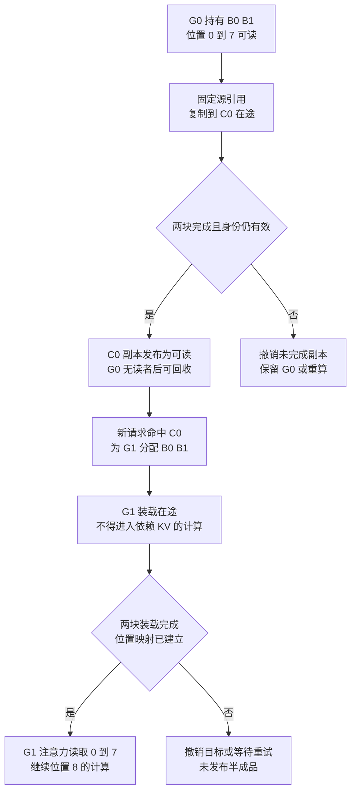

# KV 分层存储与迁移：命中、完成和可读边界

> **文献基线**：[Mooncake，arXiv:2407.00079v1](https://arxiv.org/pdf/2407.00079v1)（2024-06-24，§3、§4.2、§5；来源索引 `raw/01_theory/01_models/moonshot_kimi/Mooncake_KVCache_Disaggregated-2407.00079.md`）；[FlexGen，ICML 2023 正式版](https://proceedings.mlr.press/v202/sheng23a/sheng23a.pdf)（§1、§4.1–4.2；索引 `raw/01_theory/05_inference/FlexGen-ICML2023.md`）。
> **主题**：在 KV 内容身份不变时，决定保留、迁移还是重算；沿一个前缀块从 GPU 到 CPU 再回 GPU 的轨迹，区分目录命中、在途副本、传输完成、消费可读和回收。
> **适用范围**：通用因果 decoder 的 KV 数据迁移与容量成本。前缀身份判定归 Prefix Caching，分页块管理归 Paged KV；Prefill/Decode 部署及池间资源配比归分离式推理页。本文的状态机是对论文异步依赖的教学抽象，不宣称某个实现采用同名状态或故障协议。
> **最近更新**：2026-09-17。新建原理页；数值与故障分支是显式假设的教学推演，不是 Mooncake 或 FlexGen 的性能实测。

## 1. 为什么只报“缓存命中”不够

长前缀已有 KV 时，重算会消耗 prefill 算力；把它留在 GPU 又挤占活跃请求空间。CPU 内存、远端节点乃至 SSD 能容纳更多冷内容，却增加再次使用前的搬运。于是选择的不是一个布尔值“命中”，而是**在截止时间前能否把正确版本的所有必需 KV 放到消费者可读的位置**。[Mooncake §3、§5.1](https://arxiv.org/pdf/2407.00079v1)；[FlexGen §1](https://proceedings.mlr.press/v202/sheng23a/sheng23a.pdf)

Mooncake Fig. 3 把 CPU 内存中的 KV 组织为分页块，按含前缀的 hash 识别可复用块，Messenger 负责 CPU/GPU 及节点间传输。它的 Fig. 4 又把 prefill 产生的 KV 按层异步送往 decode 节点；**所有 KV 已进入 decode 节点 CPU DRAM**后，请求才进入其 continuous batching。进入批次后，某层 attention 计算仍须等该层异步装载完成。前一句是请求准入边界，后一句是每层 GPU 读取边界，两者不可合并。[Mooncake §3、Fig. 3–4，§4.2](https://arxiv.org/pdf/2407.00079v1)

### 1.1 三个彼此独立的判断

| 判断 | 它回答什么 | 不推出什么 |
|---|---|---|
| 身份命中 | 目录中存在与模型、前缀和位置语义相符的 KV | 字节已到本机或目标 GPU |
| 传输完成 | 指定字节已到达目标层并通过传输完成边界 | 任意消费者已建立映射、依赖层已齐、目标计算可开始 |
| 消费可读 | 必需层、块和位置均可寻址，相关写入对计算可见 | 源副本或其他请求的引用可立即释放 |

表是**分析判定模型**。Mooncake 论文给出异步 launch/wait、全量到达 CPU 后准入、逐层等待装载；没有给出通用实现的目录原子性、校验和或租约协议。本页不会把这些教学判定冒充为其源码保证。

## 2. 从 GPU 淘汰到 CPU，再把同一前缀读回

用一个**教学请求**复算：前缀是 8 个已处理 token，块长 4，因而有 $B_0$（位置 0–3）和 $B_1$（位置 4–7）；每块完整 KV payload 取 1 MiB，内容身份、模型版本和位置均已由上游核对。开始时 GPU `G0` 持有两块，CPU `C0` 尚无副本。一次 CPU 写回先固定源块、启动异步复制，直到两块传输都完成才在目录中发布 `C0` 可读；然后才能在无活跃 GPU 读者时归还 `G0` 容量。下一请求的目录命中 `C0` 后，先为目标 GPU `G1` 分配目标块，读回两块、等待完成并建立位置到块的映射，再让 attention 消费。这套发布/保留顺序是防止读取半成品的**教学不变量**，不是声称 Mooncake 精确使用这一协议。[Mooncake §3、Fig. 3–4，§4.2](https://arxiv.org/pdf/2407.00079v1)

图中的两个“否”分支是明确写出的**安全策略推演**：失败、取消或模型版本过期时，不把部分目的块交给注意力；源副本能否继续保持，取决于当时实际引用和是否已安全回收。论文未给出这种失败处理的统一事务协议。对同一请求，只有所有需用层的 KV 到达并满足该层读取依赖后，后续计算才可消费；Mooncake 的逐层等待就是这一边界的具体设计证据。[Mooncake §4.2](https://arxiv.org/pdf/2407.00079v1)

## 3. 多级空间如何影响调度

GPU 显存快而少，CPU DRAM 容量较大、回 GPU 有传输成本，远端内存增加网络排队与带宽竞争，SSD 则可继续扩容量但通常更慢。FlexGen 明确把 GPU、CPU、磁盘作为不同层，对权重、激活、KV 分别选驻留比例，并在当前 batch 计算时重叠下一批 cache 装载和上一批存储；它研究的是**可容忍较高延迟的吞吐型任务**，不是说在线请求从 SSD 恢复也一定合算。[FlexGen §1、§4.1–4.2，Algorithm 1](https://proceedings.mlr.press/v202/sheng23a/sheng23a.pdf)

Mooncake 的在线场景则把闲置 CPU/DRAM/SSD 汇成分布式 KV 池，调度时考虑命中长度、prefill 排队、搬运和 TTFT。它说明远端命中可能比本地重算慢，热点副本可分布到多个节点以减轻拥塞。这是**调度选择与数据放置**，不改变 K/V 的数学内容。[Mooncake §3、§5.1–5.2](https://arxiv.org/pdf/2407.00079v1)

| 路径 | 什么时候可被读 | 必须付的账 |
|---|---|---|
| 继续留 GPU | 引用和映射仍有效时 | 稀缺显存占用；可能阻塞新请求准入 |
| GPU → CPU 后预取 | 目标副本到达、同步和映射完成后 | 两次搬运、CPU 容量、并发传输占用 |
| 远端 CPU 或共享池 | 网络取回并完成本地装载后 | 链路排队、远端热点、失败重试 |
| SSD 后装载 | SSD 读取、可能经 CPU 再到 GPU 后 | 更高 I/O 延迟；适合程度取决于服务目标 |
| 丢弃并重算 | 重新完成相同前缀计算后 | prefill 算力与排队；不需要冷副本容量 |

“远端”“SSD”并不意味着每个系统一定走相同跳数。表列的是可比较的路径类别；具体存储栈、DMA、网络和失败语义需由固定实现确认。

## 4. 带宽、延迟、命中率与重算的同一本账

设需恢复的有效 KV 为 $M$ 字节，传输启动及索引开销为 $L$，这条路径可用带宽为 $R$，排队为 $Q$，必要的同步/映射成本为 $S$。忽略重叠时，恢复路径的下界式教学估计为

$$
T_{\mathrm{restore}}\approx Q+L+\frac{M}{R}+S.
$$

如果链路共用，$R$ 要用**有效带宽**而非接口标称带宽；跨多个层级应逐段相加或按真实重叠取关键路径。设本地重算相同前缀耗时 $T_{\mathrm{recompute}}$，只有在身份可用且 $T_{\mathrm{restore}}<T_{\mathrm{recompute}}$，并同时满足请求截止时间、目标容量与链路限制时，恢复才在这次请求的延迟账上有利。该不等式是本页**分析推断**；Mooncake §5.1 明确需要把命中长度、估计 prefill 和排队合进 TTFT，且指出传输时间受网络拥塞影响。[Mooncake §5.1](https://arxiv.org/pdf/2407.00079v1)

继续用上例，若两块合计 $M=2$ MiB，CPU→GPU 有效速率假设为 1 GiB/s，固定启动加同步映射共 0.5 ms，且无排队，则 $M/R=1.953125$ ms，恢复约 2.453125 ms。若此时重算需要 2 ms，就该选重算；若需要 8 ms，且其他约束满足，恢复可能占优。这组数**只用于复算**，不是论文测量，也未把 GPU→CPU 的先前写回、CPU 占用或预取失败摊入。若从策略层比较长期平均成本，还必须计命中概率 $p$、写回、保留与错误预取，不能把一次成功命中当成整体收益。

## 5. 在途保护、多副本与失败边界

异步迁移会产生一个短暂的“源已存在、目的尚未可读”区间。为了安全，消费者要么继续持有源引用，要么等待目的完成；不能在源回收后凭目录里的目的位置继续访问在途数据。多副本可缓解热点拥塞，但每个副本有容量成本，并且要跟随内容身份失效；取消、超时和模型/adapter 版本变化要求废弃未发布的副本。这些是**从读取依赖推得的通用不变量**。Mooncake §5.2 有热点迁移/复制的设计，但没有提供全系统失败时的原子发布与回收证明，因此具体何时减引用、如何重试或清理孤儿块，要查相应实现。[Mooncake §5.2](https://arxiv.org/pdf/2407.00079v1)

本页迁移的是**同一语义 KV 的位置**。若把 K/V 量化、删除某些 token 或改成模型原生 latent，信息已改变，质量与复用条件归 KV 压缩专题。若为了跨请求命中，须先证明前缀 token、权重/adapter、位置和可见范围一致；不能因“CPU 中有相似文本”就直接迁移并读取。

## Related Pages

- [[12_kv_cache_analysis|KV Cache：复用依据与容量]]：定义需要迁移的历史 K/V 及每 token 理想载荷。
- [[13_paged_kv_attention_analysis|Paged KV 与块表]]：解释逻辑位置如何指向物理块，以及迁移后仍需建立可读映射。
- [[14_prefix_caching_analysis|Prefix Caching]]：规定跨请求命中时的内容身份与最长可复用前缀。
- [[15_continuous_batching_analysis|Continuous Batching 与请求调度]]：说明恢复中的请求何时有资格进入执行批次。
- [[02_engineering/03_infer_frameworks/vllm/22_vllm_disaggregated_kv_serving_analysis|vLLM 分离式 KV 服务]]：继续追踪固定源码中的 connector、加载与交接合同。
