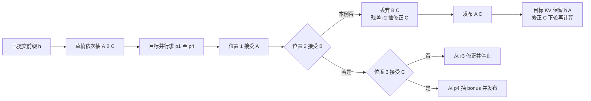

# 投机解码基础：草稿、验证与分布保持

> **文献基线**：[Leviathan、Kalman、Matias，arXiv:2211.17192v2](https://arxiv.org/pdf/2211.17192v2)（2023-05-18；§2.1–2.3、Algorithm 1、§3.1–3.4、Appendix A.1）。来源索引见 `raw/01_theory/05_inference/Speculative_Decoding-2211.17192.md`。
> **主题**：解释草稿模型如何先给出多个候选，目标模型如何并行取得各条件位置的概率，以及接受／拒绝和残差抽样为何保持目标分布。再把被拒后的 token 发布与 KV 提交边界追踪到下一轮。
> **适用范围**：自回归模型的**线性草稿**与精确 speculative sampling；草稿模型、树和多头的选择归 [[24_speculative_decoding_variants_analysis|投机解码变体]]，引擎特有调度和 KV 实现归工程页。文中数字均为教学算例，不是性能实测。
> **最近更新**：2026-09-17。新建原理页并逐节核对论文 v2。

## 1. 为什么先猜再验证

普通 decode 每产出一枚 token 都要串行调用一次目标模型。若目标模型的一次短序列前向能同时给出多个位置的条件分布，而额外计算与数据搬运的延迟小于多次独立 decode，就可以让一个较便宜的草稿分布 $q$ 先提出 $\gamma$ 枚 token，再用目标分布 $p$ 一次验证。这是**以更多并行计算换较少串行目标调用**，不是省略目标检查。Leviathan 等的算法使每轮至少发布一枚 token，最多 $\gamma+1$ 枚；其加速分析明确假定并行验证不会按位置数线性增加墙钟时间（§2.1、§3.3–3.4）。

这里 $p_i(\cdot)=p(\cdot\mid h,x_{<i})$、$q_i(\cdot)=q(\cdot\mid h,x_{<i})$；$h$ 是已提交前缀，$x_1,\ldots,x_\gamma$ 是按 $q_i$ 顺序抽出的草稿。目标同时得到 $p_1,\ldots,p_{\gamma+1}$：$p_1$ 对应 $h$，$p_2$ 对应 $h,x_1$，依此类推。验证在逻辑上仍按位置顺序决定；第 $i$ 枚被拒，后面草稿即使算过也不能越过它发布。[来源：论文 §2.1–2.3、Algorithm 1](https://arxiv.org/pdf/2211.17192v2)

## 2. 接受／拒绝是一条完整的抽样规则

对候选 $x_i\sim q_i$ 另取 $u_i\sim U(0,1)$，按下式接受：

$$
a_i(x_i)=\min\!\left(1,\frac{p_i(x_i)}{q_i(x_i)}\right),\qquad u_i\leq a_i(x_i).
$$

$q_i(x_i)>0$ 是抽到该候选的前提。若第 $i$ 枚首次拒绝，丢弃它及所有更晚的草稿，从**正差残差**抽一枚修正 token：

$$
r_i(v)=\frac{\max(0,p_i(v)-q_i(v))}{\sum_w\max(0,p_i(w)-q_i(w))}.
$$

只在拒绝确实发生时才需要该分母；若 $p_i=q_i$，拒绝概率为零。若 $\gamma$ 枚全接受，则改从 $p_{\gamma+1}$ 抽一枚 bonus token。无论在哪个分支，都在被接受的草稿后**追加恰好一枚**由目标概率或残差概率抽出的 token。$p$ 和 $q$ 必须都是同一请求所要求的最终抽样规则处理后的分布；例如温度和 top-p 若进入目标合同，证明对应的是处理后的 $p,q$，不能验证原始 softmax 却宣称保持截断采样分布。这里的“保持”指输出序列的**概率分布**与直接按目标 $p$ 抽样相同，不表示固定一次随机数后逐 token 输出相同。[来源：论文 §2.2–2.3、Algorithm 1、Appendix A.1](https://arxiv.org/pdf/2211.17192v2)；抽样规则背景见 [[17_sampling_decoding_analysis|采样与解码策略]]。

**原理图规格**：输入为已提交 $h$ 和三枚草稿 `A,B,C`；目标并行给出四行条件概率。箭头先经过 `A` 接受，再经过 `B` 拒绝；拒绝支路丢弃 `B,C`、从 $r_2$ 取修正 `C`，输出 `A,C`；全接受支路额外从 $p_4$ 抽样。图下方区分“发布 token”与“已形成目标 KV”。

## 3. 可复算的小词表：第二枚拒绝

以下是人为设定的**教学输入**，词表只有 `A、B、C`。$\gamma=3$，草稿依次为 `A、B、C`。在位置 1 设 $q_1(A)=0.5$、$p_1(A)=0.6$，所以 `A` 必然接受；其余两项可分别取 $q_1=(0.5,0.3,0.2)$、$p_1=(0.6,0.25,0.15)$。在已接受 `A` 的位置 2：

| token | A | B | C |
|---|---:|---:|---:|
| 草稿 $q_2$ | 0.25 | 0.50 | 0.25 |
| 目标 $p_2$ | 0.50 | 0.20 | 0.30 |
| $\min(p_2,q_2)$ | 0.25 | 0.20 | 0.25 |
| 正差 $\max(0,p_2-q_2)$ | 0.25 | 0 | 0.05 |

草稿 `B` 的接受概率是 $0.20/0.50=0.4$。若教学随机数 $u_2=0.7$，则拒绝 `B`；残差总质量为 $0.25+0.05=0.30$，所以 $r_2=(5/6,0,1/6)$。按 `A,B,C` 顺序用另一枚教学随机数 $0.9$ 做逆 CDF 抽样，修正 token 为 `C`。本轮发布的是**被接受的草稿 `A` 加修正 `C`**，不是原来的三枚草稿 `A,B,C`，也不执行第三枚的接受判定。目标已算的 $p_3,p_4$ 只是投机计算，在本例不贡献输出。

更重要的是，修正并非把被拒 `B` 换成目标分布的普通重抽。位置 2 对每个词的最终概率恰好等于目标概率：

$$
\begin{aligned}
P(v\text{ 最终输出})
&=\underbrace{q_2(v)\min(1,p_2(v)/q_2(v))}_{\min(p_2(v),q_2(v))}\\
&\quad+\underbrace{0.30\,r_2(v)}_{p_2(v)-\min(p_2(v),q_2(v))}\\
&=p_2(v).
\end{aligned}
$$

逐项是 `A: 0.25 + 0.30×5/6 = 0.50`，`B: 0.20 + 0 = 0.20`，`C: 0.25 + 0.30×1/6 = 0.30`。这个等式是单位置证明；对每个已接受前缀重复相同条件分布规则，才能推出整条生成序列的分布保持。若直接把所有草稿视为“目标最可能 token”，或拒绝后从未修正的 $p_i$ 再抽，等式就不成立。[来源：论文 Appendix A.1](https://arxiv.org/pdf/2211.17192v2)

## 4. token 发布和 KV 提交不是一件事

本例假定进入本轮时目标模型已有 $h$ 的有效 KV，验证前向在草稿路径上临时计算了 `A、B、C` 的目标 KV。这是从自回归因果依赖与 Algorithm 1 推出的**逻辑状态要求**，不是论文规定的某个物理 KV 管理 API：

| 边界 | 已发布序列 | 可作为下轮目标前缀的 KV | 后续动作 |
|---|---|---|---|
| 本轮开始 | $h$ | $h$ | 草稿产生 `A、B、C` |
| 位置 1 接受、位置 2 拒绝 | $h,A$ | $h,A$ | `B、C` 的投机目标 KV 不得进入已提交路径 |
| 修正 `C` 发布 | $h,A,C$ | 仍只有 $h,A$ | 下轮需把修正 `C` 送入目标前向，才有它的目标 KV |

“已经输出 `C`”并不意味着“已经计算出以修正 `C` 为输入的目标 KV”；本轮原草稿第三枚恰好也写作 `C`，但它处在错误路径 `h,A,B,C` 上，不能冒充 `h,A,C` 的状态。若全部草稿接受，目标路径上的 $\gamma$ 枚 KV 才都可保留；额外采出的 bonus token 仍需下轮被模型处理。具体缓存槽的截断、复制或延迟提交方式因引擎而异，见 [[12_kv_cache_analysis|KV Cache 基础]] 与 [[02_engineering/03_infer_frameworks/vllm/16_vllm_speculative_decoding_analysis|vLLM 投机解码实现]]。

## 5. 何时有收益，以及证明不覆盖什么

令 $\alpha$ 为各位置接受概率的共同均值，并作论文 §3.1 的独立同分布近似，$\gamma$ 枚草稿的一轮平均输出数为

$$
E[N]=1+\alpha+\cdots+\alpha^\gamma=\frac{1-\alpha^{\gamma+1}}{1-\alpha}.
$$

取教学值 $\gamma=3,\alpha=0.7$，得 $E[N]=2.533$。若草稿单步延迟占目标单步延迟 $c=0.1$，并且验证四个条件位置的墙钟时间确实近似一次目标步，则论文模型给出理想速度比 $2.533/(1+3\times0.1)\approx1.948$。这不是本页的实测速度；实际还需计入目标长序列验证、draft/target KV、采样修正、显存占用、batch 竞争、短输出与调度。$\alpha$ 越高并不单独保证加速，草稿成本和验证并行度同样重要。[来源：论文 §3.1、§3.3–3.4，Theorem 3.8](https://arxiv.org/pdf/2211.17192v2)

分布证明要求 $p_i,q_i$ 是完整且可比较的离散分布，接受概率和正差按相同词表、相同条件前缀与指定目标抽样规则计算。有限精度、不同 tokenizer、草稿路径错位或被拒后的错误 KV 复用，都会破坏推导的前提；论文的数学证明并不自动认证任意实现。若目标请求在发布 EOS、达到长度上限或 stop 条件时结束，仍须执行对应的停止合同，不能因为一次验证得到了后续 logits 就额外发布 token。

## Related Pages

- [[17_sampling_decoding_analysis|采样与解码策略]] — 定义进入本页接受／拒绝规则之前的目标抽样分布。
- [[12_kv_cache_analysis|KV Cache：复用依据与容量]] — 解释已处理前缀与刚选出的 token 为何有不同的缓存边界。
- [[10_prefill_decode_analysis|自回归生成与 Prefill / Decode]] — 给出目标验证多个条件位置所依赖的因果序列语义。
- [[24_speculative_decoding_variants_analysis|投机解码变体与草稿设计]] — 比较不同草稿来源和树候选的独立正确性条件。
- [[02_engineering/03_infer_frameworks/vllm/16_vllm_speculative_decoding_analysis|vLLM 投机解码]] — 查看具体引擎怎样把草稿、验证、调度与缓存落实到固定源码基线。
