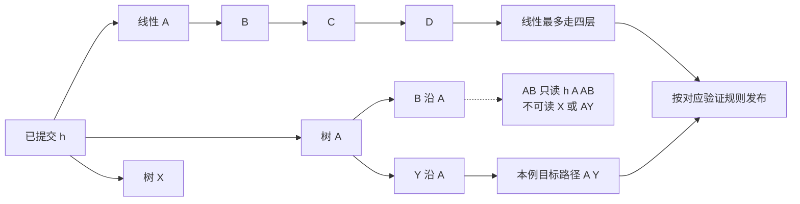

# 投机解码变体与草稿设计：候选从哪里来，怎样验证

> **文献基线**：[Leviathan 等，arXiv:2211.17192v2](https://arxiv.org/pdf/2211.17192v2)（§2–3、§3.6）；[Draft & Verify，arXiv:2309.08168v2](https://arxiv.org/pdf/2309.08168v2)（§3.2–3.4、Algorithm 2）；[Medusa，arXiv:2401.10774v1](https://arxiv.org/pdf/2401.10774v1)（§3.1–3.3、Fig. 2–3）；[EAGLE，arXiv:2401.15077v1](https://arxiv.org/pdf/2401.15077v1)（§2.2、§3–4、Fig. 6–7）；[SpecInfer，arXiv:2305.09781v4](https://arxiv.org/pdf/2305.09781v4)（§3–4、Algorithm 2、Theorem 4.2）。各自版本和定位见 `raw/01_theory/05_inference/` 中对应来源索引。
> **主题**：把投机解码拆成草稿来源、候选形状和验证规则三个独立选择；用固定节点预算比较一条线性路径与一棵候选树。指出各论文分别证明的正确性和未覆盖的组合。
> **适用范围**：仅比较推理阶段如何产生与布置候选。基础线性接受／拒绝证明归 [[23_speculative_decoding_analysis|投机解码基础]]；具体 MTP 训练配方、模型权重及服务引擎兼容矩阵归各自模型或工程页。
> **最近更新**：2026-09-17。新建来源分明的机制比较；图和节点预算均为教学构造。

## 1. 两个问题先分开：谁给草稿，谁决定输出

投机解码的共同压力是目标模型逐 token decode 的串行延迟。草稿器可以是另一个小模型、目标模型自身的低成本路径、附加预测头，甚至历史文本查找；但**草稿便宜**不等于**输出正确**。结果是否保持目标分布，要看验证器如何使用目标条件分布以及拒绝后的修正规则。线性 speculative sampling 的正式条件和证明见 [[23_speculative_decoding_analysis|基础页]]，这里不复制推导。[来源：Leviathan 等 §2.2–2.3、§3.6](https://arxiv.org/pdf/2211.17192v2)

| 草稿来源 | 候选的取得方式 | 需要的额外准备 | 论文中与目标的关系 |
|---|---|---|---|
| 独立小模型 | 用较小模型顺序采 $\gamma$ 枚，保存每步 $q_i$ | 可用的权重、tokenizer 对齐和草稿 KV | Leviathan 的一般采样算法允许任意 $q$，收益受接受率与草稿成本制约 |
| 同一模型的浅层／跳层路径 | 草稿阶段跳过部分层，完整模型验证 | 选择跳层方案、维护两种执行路径 | Draft & Verify 的 Algorithm 2 明确是 **greedy**，验证时用完整模型 `argmax` 修正 |
| 多个未来位置预测头 | 一个隐藏状态的多个 head 各预测未来位置，再组候选 | 训练额外 head；Medusa-1 冻结基座，Medusa-2 联训 | Medusa 的树候选可配不同接受方案；其 typical acceptance 不声称精确目标分布 |
| 特征级草稿 | EAGLE 用上一轮目标特征和移位后的 token 递推未来特征与 token | 训练轻量预测头并取得目标特征 | EAGLE §2.2 沿用 speculative sampling 的修正，论文据此声称保持目标分布 |
| 查找／$n$-gram | 从已有文本或统计表提议后续 token | 无新模型权重，但依赖上下文重复 | Leviathan §3.6 的廉价近似仍须进入相应验证规则；查到的文本本身不是目标概率证明 |

上表是按**论文机制**归类，不表示所有产品都实现这些组合。尤其不要把“自投机”直接等同于某个独立小模型，也不要把“多头”直接等同于任意模型内置 MTP：它们的训练位置、头间条件关系与候选验证可以不同。Draft & Verify v2 的 Algorithm 2 用逐位置 `argmax` 比较，保证的是其 deterministic greedy 输出；若把它改成温度采样，不能沿用同一个证明。Medusa v1 §3.3.1 的 typical acceptance 选择足够“典型”的候选，论文明确放松了与原模型采样分布匹配的要求；只有采用相应精确拒绝采样的路径才可讨论分布保持。[来源：Draft & Verify Algorithm 2](https://arxiv.org/pdf/2309.08168v2)；[Medusa §3.3.1](https://arxiv.org/pdf/2401.10774v1)

## 2. 同样四个草稿节点：线性深度与树宽度

以下是**教学预算**，不是论文实测。已提交前缀为 $h$，每轮最多验证四个草稿节点，且先忽略共享前缀已有目标 logits 的实际调度差异：

| 布置 | 四个新节点 | 最长候选路径 | 覆盖的路径 | 目标需要算的条件位置 |
|---|---|---:|---|---|
| 线性 | `A → B → C → D` | 4 | 一条长度 4 路径 | $h$ 与这四个候选前缀上的分布，逻辑上 5 个位置 |
| 树 | 根分 `A`、`X`；`A` 再分 `B`、`Y` | 2 | `A→B`、`A→Y`、`X` | 同样 $h$ 与四个候选节点上的分布，逻辑上 5 个位置 |

树把预算从**深度**挪到**覆盖**：若目标首 token 为 `A`、次 token 为 `Y`，线性 `A→B→…` 最多接受首枚，树可沿 `A→Y` 接受两枚；若目标首 token 为 `A` 且后续恰好 `B,C,D`，线性可能一次走四层，树最多两层。两个结论只涉及上述固定候选，并非“树一定更快”或“节点数相同则 target 时间相同”。实际验证需要对树节点设置按祖先路径可见的注意力 mask 与位置编号，树宽会增加激活、注意力、KV 临时占用和选择工作。[来源：Medusa §3.1.2、Fig. 2；SpecInfer §3–4](https://arxiv.org/pdf/2401.10774v1)

**原理图规格**：左侧画四节点线性候选 `A→B→C→D`；右侧画同预算的树 `A`/`X` 与 `A→B`/`A→Y`，高亮教学目标路径 `A→Y`。两侧下方同时展示树 attention mask 的允许访问：`AB` 只能访问 `A` 和自己，不能访问 `X` 或 `AY`；箭头末端标出“按选定验证规则发布”。

图是候选**拓扑**，不能把虚线误读为实际注意力张量。对树节点 `AB`，正确的上下文是 $h,A,B$，不是把同批所有节点串起来的 $h,A,X,B,Y$；`X` 与 `A` 是同一位置的互斥分支。Medusa §3.1.2 说明，树 mask 只让节点看见其祖先，位置编码也必须按树深度而非扁平数组下标设置。若把 `AB` 错误地看见 `X`，验证得到的就不是 $p(\cdot\mid h,A,B)$。[来源：Medusa §3.1.2](https://arxiv.org/pdf/2401.10774v1)

## 3. 树的选择不能套用一条线性的接受规则

线性候选只需从第 1 枚向后检查，遇第一次拒绝便修正并停止。树在同一深度可能有多个不同草稿 token；必须明确**选择哪个分支、什么顺序访问其他候选、各候选的提议概率怎样进入剩余分布**。SpecInfer v4 的 Algorithm 2 分开定义 `VerifyGreedy` 与 `VerifyStochastic`，其 Theorem 4.2 证明后者的分布正确性。它不是“在树里任选一条看来最像的路径后继续用线性公式”：[来源：SpecInfer §4、Algorithm 2、Theorem 4.2](https://arxiv.org/pdf/2305.09781v4)

| 验证规则 | 能声称的结果 | 不能偷换的条件 |
|---|---|---|
| 目标 greedy 校验 | 若每步只接受目标 `argmax` 的匹配前缀，输出可与同一目标 greedy 路径一致 | 相同目标版本、输入、tie-break 和数值行为仍需成立；不推出随机采样等价 |
| 线性 $p/q$ 拒绝与残差 | 在基础页的条件下保持目标**采样分布** | 一条草稿链的公式不能原封不动套到多个并列候选 |
| SpecInfer `VerifyStochastic` | 在该论文的树提议和验证算法条件下，保持目标随机采样分布 | 不能只保留 tree mask 和候选而省掉其概率修正 |
| Medusa typical acceptance | 按概率／熵阈值接受更长的“典型”候选，追求论文中的速度与质量权衡 | 论文明确放松精确分布匹配，不是 lossless sampling 证明 |

EAGLE 则是另一个维度：它改变**草稿器**，不是把正确性证明换掉。其 §2.2 明确把目标接受概率 $\min(1,p/q)$ 与正差残差放回最终验证；因此“特征级草稿”与“精确采样”可以共存。EAGLE §4.1 的特征和移位 token 设计旨在提高草稿相似度；提高接受率是它的设计目标，不能仅凭目标论文某张加速图推出另一种目标模型也有相同收益。[来源：EAGLE §2.2、§4.1](https://arxiv.org/pdf/2401.15077v1)

## 4. 如何选草稿长度与树形

固定 $\gamma$ 或固定节点数是**预算**，不是最优值。多一个线性位置可增加最深接受长度，但草稿多走一步且被前位拒绝后下游工作全部浪费；多一个树分支可覆盖另一种早期 token，却可能挤走更深的高概率路径。Medusa §3.3.3 在给定节点预算下，用校准集估计各 head 的候选命中率，再贪心地给较高预期贡献的已连通分支添节点；这些估计依赖数据分布与独立性近似，不是通用的无条件最优树。[来源：Medusa §3.3.3、Fig. 3](https://arxiv.org/pdf/2401.10774v1)

Draft & Verify §3.4 则观察到“继续草拟一枚是否值得”随当前请求变化，设计了按草稿置信度和动态阈值提前停止的方法；这控制的是**本轮草稿成本**，不改变其完整模型 greedy 校验的正确性口径。无论何种变体，都应分别报告草稿成本、目标验证成本、每轮已发布 token 数、目标调用减少量、KV 临时开销和端到端延迟。一个更高的候选命中率若伴随更重的草稿器、更多树节点或同步等待，不必然改善吞吐或单请求时延。[来源：Draft & Verify §3.4；Leviathan §3.3–3.4](https://arxiv.org/pdf/2309.08168v2)

## Related Pages

- [[23_speculative_decoding_analysis|投机解码基础]] — 给出线性 $p/q$ 接受、残差修正和 KV 提交的完整证明边界。
- [[17_sampling_decoding_analysis|采样与解码策略]] — 区分 greedy 一致性与随机输出分布一致性。
- [[10_prefill_decode_analysis|自回归生成与 Prefill / Decode]] — 解释目标在候选树各条件位置上为何需要正确的因果上下文。
- [[02_engineering/03_infer_frameworks/vllm/16_vllm_speculative_decoding_analysis|vLLM 投机解码]] — 查看具体引擎支持哪些提议器和验证路径，而非从本页推断兼容矩阵。
- [[02_engineering/03_infer_frameworks/speculative_decoding/deepspec_codebase_analysis|DeepSpec 草稿训练与评测]] — 衔接一个专门训练和评估草稿模型的代码库分析。
