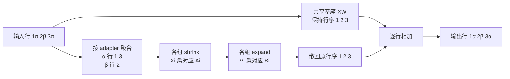

# Multi-LoRA Serving：共享基座下的多适配器执行

> **文献基线**：[LoRA，arXiv:2106.09685v1](https://arxiv.org/pdf/2106.09685v1)（§3.1、Eq. 3、§3.2）；[Punica，arXiv:2310.18547v1](https://arxiv.org/pdf/2310.18547v1)（§2.2–3、§4、Fig. 3–4、§5.2）；[S-LoRA，arXiv:2311.03285v1](https://arxiv.org/pdf/2311.03285v1)（§2、§4.1–4.2、Fig. 1–2、§5.1–5.3）。来源索引见 `raw/01_theory/02_pretraining/LoRA_Low_Rank_Adaptation-2106.09685.md` 及 `raw/01_theory/05_inference/Punica-2310.18547.md`、`S_LoRA-2311.03285.md`。
> **主题**：从单个低秩增量出发，解释一批请求绑定不同 adapter 时如何共享基座矩阵乘法，并按 adapter 分组执行 shrink/expand，最后恢复每行输出。再说明 adapter 驻留、换入和版本身份对服务状态的约束。
> **适用范围**：只讨论**推理服务**中已训练 adapter 的计算与管理；低秩训练目标、优化器和权重生产流程归后训练领域。具体 vLLM kernel、slot 管理和参数支持范围归工程页；数值为教学算例，不是性能实测。
> **最近更新**：2026-09-17。新建来源核对和逐行重放的原理页。

## 1. 为什么一个基座不能简单“合并所有 adapter”

若多个请求来自同一基座 $W$，但每条请求绑定不同的 LoRA adapter，分别把每个 $\Delta W_j$ 合并成一份完整模型会复制大矩阵，并失去跨 adapter 批处理的机会。LoRA 原论文对**单个已选 adapter**建议部署前合并 $W+\Delta W_j$，从而不增加该路径的前向层；Punica 和 S-LoRA 指出，多租户同时服务时更有利的分解是：共享一次基座计算，再为各行补上各自 adapter 的低秩增量。它没有把不同 adapter 变成同一个模型。[来源：LoRA §3.2；Punica §2.2–3；S-LoRA §4.1](https://arxiv.org/pdf/2311.03285v1)

为避免行向量与原 LoRA 论文的列向量记号混淆，本文固定**服务时行向量约定**：$X\in\mathbb{R}^{n\times d_{\mathrm{in}}}$、$W\in\mathbb{R}^{d_{\mathrm{in}}\times d_{\mathrm{out}}}$；adapter $j$ 的 $A_j\in\mathbb{R}^{d_{\mathrm{in}}\times r_j}$、$B_j\in\mathbb{R}^{r_j\times d_{\mathrm{out}}}$。其服务表达式是

$$
Y_i=X_iW+s_{a(i)}\,(X_iA_{a(i)})B_{a(i)},
$$

其中 $a(i)$ 是输出第 $i$ 行**请求绑定的 adapter 身份**，$s_j$ 包括该 adapter 的缩放因子；若该层没有 LoRA，则增量为零。LoRA 原文 Eq. 3 的 $W_0x+BAx$ 使用列向量，这里只是矩阵转置后的同一线性增量，不改变训练定义。rank $r_j$ 可随 adapter 不同，但同一个 adapter 的 $A_j/B_j$ 必须成对、版本一致。[来源：LoRA §3.1 Eq. 3；Punica §2.2 Eq. 1；S-LoRA §2、Eq. 1–2](https://arxiv.org/pdf/2106.09685v1)

## 2. 混合批的三步：共享、shrink、expand

普通 batch 的 $XW$ 用所有行做一次大 GEMM。增量先按 adapter 身份聚合行：`shrink` 计算 $V_i=X_iA_{a(i)}$，把宽维压到 rank；`expand` 计算 $\Delta Y_i=s_{a(i)}V_iB_{a(i)}$，回到输出宽维，再加到**原行**的 $X_iW$。Punica 将两阶段称为 SGMV-shrink、SGMV-expand，并用 segment 索引让同 adapter 行连续，以避免各行独立启动小算子；S-LoRA 则针对不同 rank、非连续分页 adapter 内存设计 MBGMM/MBGMV。二者是同一数学分解的不同具体实现，不能把 Punica 的 kernel 调度当成所有 Multi-LoRA 服务的唯一形式。[来源：Punica §4、Fig. 3–4、§6；S-LoRA §4.1、§5.3](https://arxiv.org/pdf/2310.18547v1)

**原理图规格**：三行原输入分别绑定 `adapter α、β、α`；上路按原行顺序算一次基座 $XW$，下路把 adapter 相同的行重排为 `α: 1,3` 和 `β: 2`，分别 shrink→expand；恢复原行次序后逐行相加。图端点明确行 2 只能加 $\Delta Y_2^{\beta}$，不能借用相邻 adapter 的增量。

### 2.1 三行、两个 adapter 的独立复算

选一个极小的**教学输入**：$d_{\mathrm{in}}=d_{\mathrm{out}}=2$，$W$ 是 $2\times2$ 单位矩阵，缩放 $s_\alpha=s_\beta=1$，两个 adapter 都是 rank 1。

$$
X=\begin{bmatrix}1&2\\3&1\\2&0\end{bmatrix},\quad
A_\alpha=\begin{bmatrix}1\\0\end{bmatrix},\quad
B_\alpha=\begin{bmatrix}0&2\end{bmatrix},\quad
A_\beta=\begin{bmatrix}0\\1\end{bmatrix},\quad
B_\beta=\begin{bmatrix}1&-1\end{bmatrix}.
$$

原行绑定是 $(\alpha,\beta,\alpha)$。重排仅是计算布局，**不**改变请求身份：

| 原行与 adapter | $X_iW$ | shrink $X_iA_{a(i)}$ | expand $V_iB_{a(i)}$ | 恢复行序后的 $Y_i$ |
|---|---|---:|---|---|
| 1，$\alpha$ | $(1,2)$ | 1 | $(0,2)$ | $(1,4)$ |
| 2，$\beta$ | $(3,1)$ | 1 | $(1,-1)$ | $(4,0)$ |
| 3，$\alpha$ | $(2,0)$ | 2 | $(0,4)$ | $(2,4)$ |

例如行 2 的收缩值来自 $X_2A_\beta=(3,1)(0,1)^\mathsf{T}=1$；若误拿 $A_\alpha$，会得到 3 并产生错误输出。表中 $Y$ 应等于按原行顺序堆叠的 `[(1,4),(4,0),(2,4)]`，并非按组顺序 `[(1,4),(2,4),(4,0)]`。该例只核算线性层的行语义，不模拟完整 Transformer 或实际 kernel 时延。

## 3. 加载与驻留：请求能运行的前提

共享基座通常常驻设备；adapter 规模较小，但“CPU 内存里有权重”不等于“下一轮 GPU batch 已可读”。Punica §5.2 在新请求进入 GPU、所需 adapter 未驻留时发异步 host-to-device 拷贝，并在它完成后才让请求加入相应批次。S-LoRA §4.1、§5.1–5.2 把大量 adapter 放在主存，只把当前活跃请求所需的 adapter 装到 GPU，并提出同时管理 adapter 与 KV 的 Unified Paging、下一批预取。这里是**两篇系统的方案**，不是所有引擎必有的 GPU/CPU 层级合同。[来源：Punica §5.2；S-LoRA §4.1、§5.1–5.2](https://arxiv.org/pdf/2311.03285v1)

对任意请求，进入一次计算至少需要：所选基座版本匹配、该请求绑定的 adapter 版本明确、目标层的 $A/B$ 全部可读且映射到正确 adapter 槽，以及输出行能回到正确请求。若某个 adapter 在 GPU 中被淘汰，只有**没有在途批次继续引用它**时才可回收；这是一条从并发读写得到的服务状态约束，不是两篇论文对某个具体锁或引用计数 API 的规定。适配器换入延迟、显存不足、取消请求与版本切换都会影响可调度时刻，不能把“权重拷贝已发起”视为“计算已可用”。

## 4. 成本不是只有低秩 FLOPs

对一个 $n$ 行、宽度 $d_{\mathrm{in}}\to d_{\mathrm{out}}$ 的层，基座 GEMM 的乘加量量级为 $O(nd_{\mathrm{in}}d_{\mathrm{out}})$；若所有行 rank 均为 $r$，增量约为 $O(nr(d_{\mathrm{in}}+d_{\mathrm{out}}))$。这只数运算量：adapter 数越多、每个 segment 越短、rank 越不齐，权重 gather、重排、kernel 启动、设备带宽和驻留缓存越可能决定实际速度。Punica §4 为同 rank／segment 场景设计 SGMV；S-LoRA §5.3 专门处理不同 rank 与非连续页面。不能从 $r\ll d$ 单独推出“多 adapter 几乎免费”。[来源：Punica §4、Fig. 4、§6；S-LoRA §4.1、§5.3](https://arxiv.org/pdf/2311.03285v1)

量化会改变基座 $XW$ 的数值路径和 adapter 增量的精度、累加位置；浮点形式的 $W+AB$ 与“量化后基座乘法再加增量”一般不能假定逐位相同。推理量化的表示与误差见 [[19_inference_quantization_analysis|推理量化基础]]。前缀 KV 也可能依赖 adapter：若它改变前缀所经层的 K/V 或后续隐藏状态，同一文本前缀在不同 adapter 下不能仅按 token 身份复用缓存；缓存身份应包含会改变计算结果的基座／adapter 版本和其他前向条件。其具体 hash、共享准则和淘汰实现属于 [[14_prefix_caching_analysis|Prefix Caching]] 与各引擎页，不能从本页的两张矩阵断言任意两 adapter 一定共享或一定不共享 KV。

训练和服务之间的边界是清楚的：LoRA 原论文 §3.1 冻结基座并训练低秩矩阵；本页从已经产生的 $A_j,B_j$ 开始，要求它们与基座、缩放、层位置和版本匹配。如何训练出这些矩阵、哪种 rank 有较好的任务质量，是后训练问题；服务系统只可在明确的 adapter 身份下执行与回收，不替训练质量背书。

## Related Pages

- [[15_continuous_batching_analysis|Continuous Batching]] — 解释为什么不同请求会在同一个 decode 迭代形成混合批。
- [[12_kv_cache_analysis|KV Cache 基础]] — 说明本页 adapter 驻留之外，活跃请求还会竞争增长中的 KV 空间。
- [[14_prefix_caching_analysis|Prefix Caching]] — 讨论跨请求复用时必须识别计算身份和缓存有效性。
- [[19_inference_quantization_analysis|推理量化基础]] — 区分低秩增量与量化基座混合执行时的数值误差。
- [[02_engineering/03_infer_frameworks/vllm/20_vllm_fused_ops_and_kernels_analysis|vLLM 融合算子与 Kernel]] — 查看具体引擎的 LoRA kernel、分组映射和算子边界。
