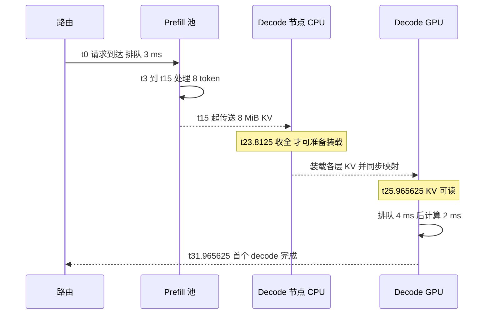

# Prefill/Decode 分离：交接、排队与资源配比

> **文献基线**：[DistServe，OSDI 2024 正式版](https://www.usenix.org/system/files/osdi24-zhong-yinmin.pdf)（§2.3、§3–6；来源索引 `raw/01_theory/05_inference/DistServe-OSDI2024.md`）；[Mooncake，arXiv:2407.00079v1](https://arxiv.org/pdf/2407.00079v1)（2024-06-24，§2–5；来源索引 `raw/01_theory/01_models/moonshot_kimi/Mooncake_KVCache_Disaggregated-2407.00079.md`）。
> **主题**：将计算密集的 prompt 处理和反复读取历史的逐 token 生成交给不同实例，沿一个请求追到 KV 交接和首个 decode 完成，说明独立扩缩、链路成本与排队如何共同决定收益。
> **适用范围**：在线因果 decoder 的部署级 P/D 分离。KV 传输状态与内容身份的通用模型见 KV 分层迁移页；具体 connector 消息、序列化格式和源码保证归工程页。PCP/DCP 是阶段内部的上下文并行维度，不等于 P/D 部署分离。
> **最近更新**：2026-09-17。新建原理页；算例使用假设延迟和速率，不代表论文实测或服务承诺。

## 1. 分离要解决哪两种耦合

混部时，长 prefill 与活动 decode 在同一 GPU 上竞争轮次。调度器即便切分 prefill，也必须在长请求 TTFT 和已有请求的 token 间隔之间选优先级；同时 prefill 和 decode 只能按同一批机器扩缩。DistServe §2.3 具体比较了分块、顺序执行和优先级方法，指出小块可能降低 prefill 效率并反复读取旧块 KV，顺序执行仍有 decode 等待。分离的决定标准是：**两阶段能按各自的 SLO 和并行形状调资源，而 KV 交接的代价仍可承受**，不是只看一轮 kernel 的吞吐。[DistServe §2.3–3.3](https://www.usenix.org/system/files/osdi24-zhong-yinmin.pdf)

P/D 分离给 prefill 池与 decode 池独立的实例数、批大小和放置方式，但新增一段前缀 KV 的跨实例移动。Mooncake 在此基础上让全局调度器同时选 prefill 和 decode 节点，还把 CPU/DRAM/SSD 汇成前缀缓存池，令“命中哪个前缀”也参与路由。[Mooncake §3、Fig. 1、§5.1](https://arxiv.org/pdf/2407.00079v1)

## 2. 路由、P、D 分别拥有哪段进度

| 阶段 | 该阶段负责的结果 | 离开前必须成立的边界 |
|---|---|---|
| 入口与路由 | token 化、选 P/D 实例、预算排队与目标容量 | 请求身份和两池资源选择可被后续使用 |
| Prefill 实例 P | 处理 prompt 未命中部分，产生各层 prompt KV；通常计算首个输出 token | 已处理位置的 KV 完整，交接目标和该请求绑定 |
| 传输与接收 | 把所需各层、各位置 KV 放到 D 可装载的位置 | 传输完成后还须满足目标映射、层依赖及可见性 |
| Decode 实例 D | 以已完成历史接续逐 token 计算、追加 KV、流出后续 token | 本轮读到的历史与 P 处理的 token/模型/位置语义一致 |

Mooncake §3 的顺序更具体：Conductor 先选 P/D；P 恢复可复用前缀并做增量 prefill；Messenger 按层把 KV 异步送到 D 的 CPU；**所有 KV 到达 D 的 CPU DRAM**后请求进入 D 的 continuous batch，实际逐层 GPU 计算前还等待对应装载。DistServe §4.3、§5 的另一种实现取向是 D 侧按需 **pull** P 的 KV，P 的 GPU 可作为突发时的排队缓冲。两条论文路径都要求在消费前完成交接，但缓冲位置和触发者不同；不能把一种论文里的 connector 协议写成另一种的通用保证。[Mooncake §3、Fig. 4，§4.2](https://arxiv.org/pdf/2407.00079v1)；[DistServe §4.3、Fig. 6](https://www.usenix.org/system/files/osdi24-zhong-yinmin.pdf)

## 3. 可复算请求：从排队到首个 decode 完成

下面是**教学时间线**，使用 Mooncake 式“先到 D 的 CPU，再装载到 D 的 GPU”的路径，不是其生产 trace。一个请求有 8-token prompt；P 处理完整 prompt 后产生第一个输出 token 和 8 MiB 的各层合计 KV。假设入口到 P 开始的排队为 3 ms，P 计算 12 ms；P→D CPU 传输有 1 ms 启动，8 MiB 数据以 1 GiB/s **有效**速率传输；D CPU→GPU 装载有 0.2 ms 启动，速率 4 GiB/s；装载完成后 D 再排队 4 ms、首个 decode 前向用 2 ms。各段在此例中故意串行；论文中的异步按层传输可能重叠，真实耗时应按关键路径重新计算。

| 边界 | 时间戳 | 这时可以做什么 |
|---|---:|---|
| 请求到达 | 0 ms | 等 P 资源；D 节点可先被预选。 |
| P 开始 / 完成 | 3 / 15 ms | 完成 prompt KV，并计算第一个输出 token；向 D 发起交接。 |
| D CPU 收全 KV | $15+1+8/1024\times1000=23.8125$ ms | 网络传输完成；仍不能说 GPU attention 已可读。 |
| D GPU 装载完成 | $23.8125+0.2+8/4096\times1000=25.965625$ ms | 假设映射和同步已完成，D 可安全读该前缀。 |
| D 排队结束 / 首个 decode 完成 | 29.965625 / 31.965625 ms | 本轮输入第一个输出 token 后，才产生下一个 token 及其 KV。 |

上表的 $8/1024\times1000$ 先把 1 GiB/s 写成 1024 MiB/s；$8/4096\times1000$ 同理对应 4 GiB/s。其教学总账是

$$
T_{\text{first decode}}=Q_P+C_P+T_{P\to D}+T_{D,\mathrm{load}}+Q_D+C_D
=3+12+8.8125+2.153125+4+2=31.965625\ \mathrm{ms}.
$$

这里的“首个 decode 完成”是**P 已给出首个输出 token 之后，D 又完成一次前向**。它不自动等于 TTFT：首 token 在 P 计算结束时已有，何时发给用户取决于服务输出路径；也不自动等于首个 token 间隔，因为输出流的发送时间未建模。若忽略传输和 D 排队，仅用 12 ms prefill 与 2 ms decode 宣称分离更快，账目便少了本例的 8.8125 ms、2.153125 ms 和 4 ms。

图中 `C` 的“收全”对应 Mooncake §3 的请求交接；`D` 的“可读”对应 §4.2 逐层加载等待。这条路径从请求输入、P 产出、KV 跨边界，到 D 的实际消费均可复算。若传输失败或 D 容量已被新请求占满，D 不能借“P 已完成”越过可读边界；应等待、重路由、取消或重算，具体选择归实现策略。[Mooncake §3、§4.2](https://arxiv.org/pdf/2407.00079v1)

## 4. 资源配比与背压：两个池和一条链路

令每台 P 在当前 prompt 分布和 TTFT 目标下的可持续服务率为 $\mu_P$，每台 D 在输出长度分布和 token 间隔目标下为 $\mu_D$，实例数为 $n_P,n_D$；每请求需传 $M$ 字节，链路有效容量为 $R_{\mathrm{net}}$。对稳态到达率 $\lambda$，一个**必要但不充分**的容量条件是

$$
\lambda<\min\!\left(n_P\mu_P,\ n_D\mu_D,\ \frac{R_{\mathrm{net}}}{M}\right).
$$

这个式子把字节账转换为请求率，尚未保证尾延迟、burst 吸收、GPU KV 空间或公平性。设每台 P 能处理 4 req/s、每台 D 能处理 5 req/s，每请求传 8 MiB，网络给该服务 80 MiB/s，则链路上界是 10 req/s。`2P+1D` 的必要上界为 $\min(8,5,10)=5$ req/s，D 是瓶颈；增到 `2P+2D` 为 $\min(8,10,10)=8$ req/s，P 成为瓶颈。若实际到达 $\lambda=8$ req/s，已经触及 P 上界、排队不能按此理想式保证稳定；$\lambda=7$ req/s 才留有容量余量，但仍需测 TTFT/TPOT 的尾部分布。这是**教学配比**，不是论文配置。

独立扩 D 不能自动减少 P 排队；独立扩 P 也可能更快产生待交接 KV，压垮 D 或网络。DistServe §4.3 为突发流量使用 D 侧 pull，让 KV 暂留 P 的 GPU 作缓冲；这一选择缓解 D 的瞬时内存溢入，代价是占用 P 的显存，仍需背压与最终释放。Mooncake §6 则指出若 P 已做完却因 D 高负载拒绝，请求会浪费 prefill 工作，因此在入口提前估计 D 负载；其论文也说明简单提前拒绝可导致负载振荡。[DistServe §4.3](https://www.usenix.org/system/files/osdi24-zhong-yinmin.pdf)；[Mooncake §6.2–6.4](https://arxiv.org/pdf/2407.00079v1)

## 5. 何时收益会消失，以及与阶段内并行的边界

分离可能让每池选择更合适的 batch 和并行度，隔离长 prefill 对 decode 的轮次干扰；它也复制模型权重驻留、占用网络和两端 KV 缓冲。DistServe 的 Fig. 10 在其 OPT 模型、ShareGPT、所用高速网络下观察到传输延迟占比很小；这是**特定实验条件**，不能推出低带宽节点间、长上下文或异构 KV 布局时也可忽略。[DistServe §6.3、Fig. 10](https://www.usenix.org/system/files/osdi24-zhong-yinmin.pdf) 大前缀、拥塞、重试或 D 排队均能抵消干扰隔离带来的收益。Mooncake 的真实工作负载结论同样属于其 SLO、负载、池配置与 trace 口径，不能移植为固定加速倍数。[Mooncake §7](https://arxiv.org/pdf/2407.00079v1)

P/D 分离是**请求阶段在不同实例/池执行**；PCP 将一次 prefill 的上下文工作分给多卡，DCP 将 decode 的上下文状态和读取分给多卡。这些维度可组合：一个 P 池内部可用 PCP，一个 D 池内部可用 DCP，两个池之间仍要交接完整而语义一致的 KV。模型头数、层数、分片布局和 dtype 不一致时还需重排或拒绝交接；本页只建立布局兼容和可读的必要条件，不替某 connector 声称支持任意异构组合。阶段内通用通信原理见并行域，具体 vLLM 路径见工程页。

## Related Pages

- [[11_inference_cost_model_analysis|推理性能与资源成本模型]]：为两池的 TTFT、token 间隔、带宽和容量提供统一计量口径。
- [[16_chunked_prefill_analysis|Chunked Prefill]]：比较同池分块调度与跨池分离各自处理的干扰。
- [[22_kv_tiering_transfer_analysis|KV 分层存储与迁移]]：给出交接时“命中、传输完成、消费可读”的先后条件。
- [[02_engineering/03_infer_frameworks/vllm/22_vllm_disaggregated_kv_serving_analysis|vLLM 分离式 KV 服务]]：继续验证固定源码基线中的 connector 选择、交接和失败处理。
- [[01_theory/06_distributed_parallelism/20_ring_attention_and_context_parallel_analysis|Ring Attention 与上下文并行]]：对照 PCP/DCP 等阶段内上下文切分的通用通信机制。
