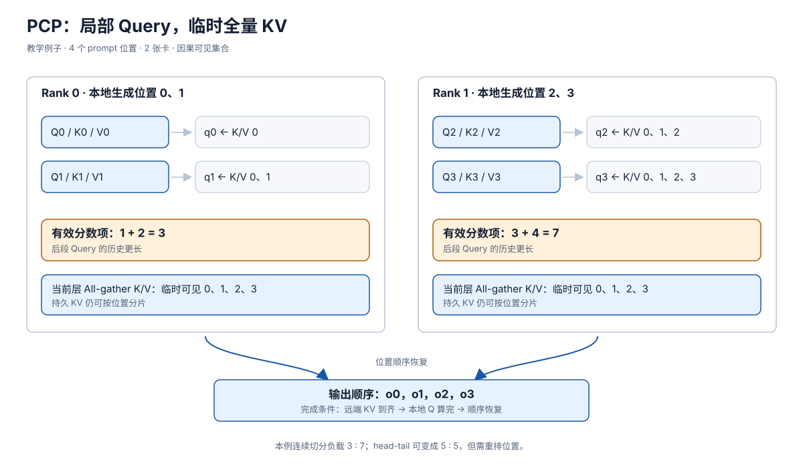

# PCP：将长 Prefill 的 Query 工作分给多卡

> **文档基线**：[vLLM Context Parallel Deployment v0.20.0](https://docs.vllm.ai/en/v0.20.0/serving/context_parallel_deployment/)（“Prefill Context Parallel”）；[vLLM-Ascend Context Parallel v0.21.0rc 设计文档](https://docs.vllm.ai/projects/ascend/en/v0.21.0rc/developer_guide/Design_Documents/context_parallel.html)（“Device Distribution”“Prefill Context Parallel”）。均于 2026-09-17 核读；索引见 `raw/01_theory/05_inference/vLLM_Context_Parallel-v0.20.0.md`、`vLLM_Ascend_Context_Parallel-v0.21.0rc.md`。
> **主题**：说明 Prefill Context Parallelism（PCP）为何按输入位置分担 prefill，以及局部 query 如何获得其所需 K/V、计算输出并恢复全局顺序。用两卡四 token 算例说明因果负载与通信成本。
> **适用范围**：本文解释因果 decoder 的推理 prefill 序列分工；通用 Ring、All-gather、Ulysses 与跨卡 attention 合并见 06 分布式并行页，单卡分块调度见 16，层间流水见 29。具体引擎的模型/后端组合仅按所引版本陈述。
> **最近更新**：2026-09-17。新增原理分析；算例为教学构造，未运行设备性能基准。

## 1. 长 Prompt 的压力落在多个 Query 行

Prefill 对一个已知 prompt 同时处理多行 query。长 prompt 的 attention 工作包含一个随长度增长的因果三角，且非 attention 层也要处理所有输入 token。**PCP 的决定是把输入位置以及对应的 Q/K/V 生成分给多卡**，让一张卡只承担部分 query 行；代价是每行 query 原本应见到的历史 K/V 分布在别的卡上。vLLM v0.20.0 的部署文档把目标写为长 prefill 的 TTFT，并区分“局部 Q、全量 KV”和“局部 Q、局部 KV”两种处理路径。[来源：vLLM v0.20.0，“Prefill Context Parallel”](https://docs.vllm.ai/en/v0.20.0/serving/context_parallel_deployment/)。

不跨卡交换便让 rank 1 的后段 query 只看自己的后段 KV，会漏掉前段历史，输出不再是原因果 attention。这是必须解决的正确性条件；切分本身不能改变每个位置 $i$ 的可见集合 $\{0,\ldots,i\}$。显存足够暂存全量 K/V 时，先按层 all-gather K/V，再让各卡只计算自己负责的 Q 行，是直接可核对的选择；全量 K/V 的峰值或传输无法接受时，可令每卡保存局部 K/V 并轮转块进行 attention，后者的 Ring 计算与归一化由 [[01_theory/06_distributed_parallelism/20_ring_attention_and_context_parallel_analysis|上下文并行通用机制]] 解释。vLLM v0.20.0 明说这两条 PCP 路径当时仍在开发，不能把文档设计等同为所有后端已可用。[来源：vLLM v0.20.0，“Prefill Context Parallel”](https://docs.vllm.ai/en/v0.20.0/serving/context_parallel_deployment/)。

## 2. 两卡四位置：从 Query 到输出

以下是**教学算例**，每个符号只代表一个位置的一组 Q/K/V，而非实际向量内容。取 prompt $x_0,x_1,x_2,x_3$、两卡，每卡生成两个位置的 $q_i,k_i,v_i$。先看连续切分：rank 0 拿 $0,1$，rank 1 拿 $2,3$。在局部 Q、全量 KV 路径中，两卡各把本层产生的两组 K/V 发给对方，因此每卡暂时可见 $K,V$ 的 $0,1,2,3$；因果 mask 决定哪些键真正参与每行。

| Query 所在卡 | 输出位置 | 必须读取的 K/V 位置 | 有效分数项数 | 局部算出的输出 |
|---|---:|---|---:|---|
| rank 0 | $0$ | $0$ | $1$ | $o_0$ |
| rank 0 | $1$ | $0,1$ | $2$ | $o_1$ |
| rank 1 | $2$ | $0,1,2$ | $3$ | $o_2$ |
| rank 1 | $3$ | $0,1,2,3$ | $4$ | $o_3$ |

完整输出逻辑顺序是 $(o_0,o_1,o_2,o_3)$，且按每行有效分数计的教学负载为 rank 0 的 $1+2=3$ 与 rank 1 的 $3+4=7$。**通信完成、因果 mask 正确和输出按位置恢复**三者都成立后，才得到未切分 prefill 的同一数学结果；在有限精度下，不保证与另一计算次序逐位相同。此例只是 attention 分数项的计数，不能据 $7/3$ 推断真实运行时间，后者还包括投影、FFN、块形状、通信和并行度。

**图的规格**：四个位置由 rank 0、rank 1 连续持有；两个本层 KV 半段向对方传递形成临时完整视图；各本地 Q 行沿因果箭头读取自己的可见前缀；右侧按位置收集 $o_0\ldots o_3$。图中标出两卡的 $3$ 与 $7$ 个有效分数项，以及全量 KV 带来的临时副本成本。

## 3. 因果负载如何拉平，顺序如何恢复

连续切分的后一张卡总要处理更长的历史。对四位置例子，把位置进一步看作四个小块并采用**头尾配对**：rank 0 接 $\{0,3\}$，rank 1 接 $\{1,2\}$，有效分数项变成 $1+4=5$ 和 $2+3=5$。分配只改变每张卡拥有哪几行 Q，不改变位置 $3$ 必须读 $0,1,2,3$ 的 K/V。输出完成后，需要从卡内次序 $(o_0,o_3)$、$(o_1,o_2)$ 恢复为 $(o_0,o_1,o_2,o_3)$。这也是“均衡”和“正确”分别要核对的两个不变量。

vLLM-Ascend v0.21.0rc 的设计文档明确采用 head-tail 形式：将输入补齐并切成 $2p$ 个等长段，配对首尾段，计算 `pcp_allgather_restore_idx` 恢复收集后的顺序，入口为 `_update_tokens_for_pcp`。这些是该版本的实现选择；通用因果负载的推导与 Ring 等通信调度保留在 [[01_theory/06_distributed_parallelism/20_ring_attention_and_context_parallel_analysis|06 上下文并行页]]。[来源：vLLM-Ascend v0.21.0rc，“Prefill Context Parallel / Tokens Partition in Head-Tail Style”](https://docs.vllm.ai/projects/ascend/en/v0.21.0rc/developer_guide/Design_Documents/context_parallel.html)。

## 4. 通信、驻留与完成条件

本例的 all-gather 路径让每卡在本层 attention 时暂持 $4$ 位置的 K/V，而只由本卡计算 $2$ 行 Q。推广到 $p$ 卡、$S$ 个位置、每卡均分且忽略 padding 的教学模型，每卡本地生成约 $S/p$ 位置 K/V，暂时需要看到 $S$，因此至少还要接收约 $S(1-1/p)$ 位置的 K/V；传输字节还须乘层数、KV 头数、head dim、K/V 两份与 dtype 字节，且实际 collective 的峰值、链路和调度依实现而异。这是**尺寸账**，不是性能公式。[来源：vLLM v0.20.0 的 full KV 路径](https://docs.vllm.ai/en/v0.20.0/serving/context_parallel_deployment/)；字节推广为本库推导。

vLLM-Ascend v0.21.0rc 的普通 prefill 路径仅对**当前层** all-gather KV，用完即丢弃临时全量副本；持久 KV cache 仍按序列分片。若通信尚未完成，不能计算依赖远端 key 的输出；若跨卡输出尚未恢复到全局 token 顺序，也不能把末位置的表示当作完整 prompt 的最终结果。该设计文档说曾考虑 Ring 以降低峰值并重叠通信，最终该版本优先 all-gather KV，理由是其评估下开发复杂度高、重叠收益有限；这是**该实现的决策依据**，不是 Ring 普遍较慢。[来源：vLLM-Ascend v0.21.0rc，“Prefill Phase”](https://docs.vllm.ai/projects/ascend/en/v0.21.0rc/developer_guide/Design_Documents/context_parallel.html)。

## 5. 与 TP、单卡分块和 CPP 的组合边界

TP 切权重或 head，PCP 切 prompt 位置，两轴回答不同问题。vLLM-Ascend v0.21.0rc 的设备布局把 PCP 作为额外设备域：用户指南例子给出 `world_size = tensor_parallel_size * prefill_context_parallel_size`；DCP 则主要复用 TP 域，细节见 [[28_decode_context_parallelism_analysis|DCP]]。乘积是该版本组网规则，不能仅凭数学正交性声称任何引擎都支持任意组合。[来源：vLLM-Ascend v0.21.0rc，“Device Distribution”与用户指南“How to use Context Parallel”](https://docs.vllm.ai/projects/ascend/en/v0.21.0rc/user_guide/feature_guide/context_parallel.html)。

[[16_chunked_prefill_analysis|Chunked Prefill]] 把同一 prompt 分**轮**调度，保留跨块历史；PCP 把同一轮的 prefill Q 行分**卡**计算。两者可以在数学上叠加，但需要确认该引擎对 chunk 历史、KV 放置和通信的实际支持。[[29_chunked_pipeline_parallelism_analysis|CPP]] 再把模型层分 stage，让多个 chunk 在不同 stage 重叠；PCP 与 CPP 的组合会改变设备数、激活交接和通信负担，不能把各自加速倍数相乘当作预测。

## 6. 容量和支持范围不是定义的一部分

Padding 到均匀块、head-tail 重排与 all-gather 顺序恢复都有代价；请求越短，额外通信和同步越可能吞没并行收益。某卡的 KV 暂存是否放得下，以及传输是否能与计算重叠，要按真实 batch、层、dtype 与拓扑测量。模型注意力类型、多模态输入、prefix cache、分离式 P/D 等组合也取决于具体版本的 backend 合同。vLLM-Ascend v0.21.0rc 用户指南列其支持矩阵与配置约束；这些是**版本化实现范围**，不改变 PCP 的定义：按序列位置分担 prefill，同时保全每行 query 的可见历史与输出顺序。[来源：vLLM-Ascend v0.21.0rc，“Supported Scenarios”“Constraints”](https://docs.vllm.ai/projects/ascend/en/v0.21.0rc/user_guide/feature_guide/context_parallel.html)。

## Related Pages

- [[16_chunked_prefill_analysis|Chunked Prefill]]：区分轮次切块与本页在同一轮内的跨卡分工。
- [[18_efficient_attention_analysis|高效 Attention]]：补足各 query 行的精确 attention 和分块归一化基础。
- [[01_theory/06_distributed_parallelism/20_ring_attention_and_context_parallel_analysis|Ring Attention 与上下文并行]]：查看 head-tail、Ring、All-gather 等通用通信方案的完整推导。
- [[28_decode_context_parallelism_analysis|DCP：Decode Context Parallelism]]：对比 decode 时按历史 KV 分卡及跨卡结果合并。
- [[29_chunked_pipeline_parallelism_analysis|CPP：Chunked Pipeline Parallelism]]：对比按模型层 stage 和 prompt chunk 组织的流水。
