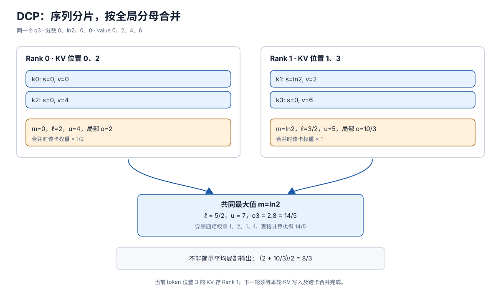

# DCP：Decode 时按序列分担 KV 与合并输出

> **文档基线**：[vLLM Context Parallel Deployment v0.20.0](https://docs.vllm.ai/en/v0.20.0/serving/context_parallel_deployment/)（“Decode Context Parallel”）；[vLLM 官方 DCP 技术文章](https://vllm.ai/blog/2026-08-07-decode-context-parallelism)（2026-08-07，§3–5）；[vLLM-Ascend CP 设计文档 v0.21.0rc](https://docs.vllm.ai/projects/ascend/en/v0.21.0rc/developer_guide/Design_Documents/context_parallel.html)（“Block Table”“Decode Context Parallel”）。均于 2026-09-17 核读；来源索引见 `raw/01_theory/05_inference/vLLM_Context_Parallel-v0.20.0.md`、`vLLM_Decode_Context_Parallel-20260807.md`、`vLLM_Ascend_Context_Parallel-v0.21.0rc.md`。
> **主题**：说明 Decode Context Parallelism（DCP）如何把长历史 KV 沿序列切到多卡，以及短 query 在局部 attention 后怎样用分母统计恢复完整输出。以两卡四位置的可复算例子区分数学合并与引擎通信布局。
> **适用范围**：本文的 DCP 专指 Decode Context Parallelism，非 Dynamic Context Parallelism。单次 attention 的数值公式归 18；TP 与通用 CP 通信归 06；GQA/MQA/MLA 结构及具体 backend 支持分别按来源版本说明。
> **最近更新**：2026-09-17。新增原理分析；教学算例不代表 vLLM 的某次内核运行或基准。

## 1. 少量 Query 与持续增长的历史 KV

一次普通自回归 decode 处理一个新的输入位置，但它的 query 要看这个位置及此前的全部有效 KV。历史越长，KV 的容量和读取越重；只沿 KV head 切的 TP 在可分 head 数有限时会出现重复副本。vLLM v0.20.0 的部署文档先建议用 TP 分 KV head，再用 DCP 将原本重复的 KV 沿序列维切开；文档限定的 DCP 规模是实现/效率选择，而非数学不能在更大组上切历史。[来源：vLLM v0.20.0，“Decode Context Parallel”](https://docs.vllm.ai/en/v0.20.0/serving/context_parallel_deployment/)。

核心约束是**每个 query 的完整分母跨越所有 KV 分片**。每卡独立做局部 softmax 后直接平均输出，一般不会等于对全部历史做一次 softmax。正确路径是令各卡对同一 query 的本地 key 计算局部输出及归一化统计，再把它们放到同一指数基准合并；数值推导详见 [[18_efficient_attention_analysis|高效 Attention §2]]。这既适用于相邻区段，也适用于交错存放的历史位置，只要各有效 key 恰好被包含一次且 mask、位置编码与 query 身份一致。

## 2. 两卡交错存四项 KV：逐项核对输出

以下为**教学算例**，只演示一个标量 head。输入 token 位于位置 $3$，它产生当前 $q_3,k_3,v_3$ 后，应注意到 $0,1,2,3$ 四个位置；输出 $o_3$ 用于预测下一位置。令 $q_3=1$，已缩放的分数为 $(0,\ln2,0,0)$，value 为 $(0,2,4,6)$。rank 0 存位置 $0,2$，rank 1 存位置 $1,3$；新产生的位置 $3$ KV 写到 rank 1。交错只是本例的放置选择，不能从中推导所有 DCP 必用逐 token 交错。

| 所在卡与位置 | 本地分数 | 本地 value | 最大值 $m_r$ | 指数和 $\ell_r$ | 加权值 $u_r$ | 局部输出 $u_r/\ell_r$ |
|---|---|---|---:|---:|---:|---:|
| rank 0：$0,2$ | $0,0$ | $0,4$ | $0$ | $2$ | $4$ | $2$ |
| rank 1：$1,3$ | $\ln2,0$ | $2,6$ | $\ln2$ | $1+1/2=3/2$ | $2+3=5$ | $10/3$ |

取共同最大值 $m=\ln2$，rank 0 的尺度因子为 $1/2$，rank 1 为 $1$。于是

$$
\begin{aligned}
\ell&=(1/2)\cdot2+3/2=5/2, \\
u&=(1/2)\cdot4+5=7, \\
o_3&=u/\ell=14/5.
\end{aligned}
$$

不切分时四个权重为 $(1,2,1,1)$，直接算得 $(0+4+4+6)/(1+2+1+1)=14/5$，与跨卡合并相同；简单平均局部输出得到 $(2+10/3)/2=8/3$，则是错误结果。若局部只输出 $o_r$ 和 log-sum-exp $L_r=m_r+\log\ell_r$，也可按 $e^{L_r-L}$ 加权；这和上式等价。[数学依据：[[18_efficient_attention_analysis|高效 Attention §2–3]]]。

**图的规格**：左侧同一 $q_3$ 到两卡；每卡的 KV 位置与分数、value 并列；中部标出本地 $(m,\ell,u)$；右侧把 rank 0 按 $1/2$ 重标定，合成 $\ell=5/2,u=7$，输出 $14/5$。底部以灰色注明局部输出简单平均为 $8/3$，不能替代全局归一化。

## 3. 从数学需要到跨卡通信

数学上，每个局部 attention 必须有**同一个完整 query 的相应 head**，最终合并需交换每卡的输出或未归一化累积与 LSE/最大值等统计。具体通信并非 DCP 定义本身：若前一层的 TP 布局让每卡只生成 query 的一个 head 片段，必须先集合它；若 query 投影已复制，可省这步。局部输出完成后，还要把合并后的结果放回后续层期望的 head 布局。只说“KV 分片”而漏掉 query 汇集和输出重分配，无法形成可执行的跨层路径。

vLLM 官方 2026-08-07 文章给其标准路径为 `AllGather Q → local attention → AllGather partial outputs/LSE + ReduceScatter`，并说明 MLA 可以选择复制较小的 query 投影来避免前一步。vLLM-Ascend v0.21.0rc 文档将 `cp_lse_ag_out_rs` 用于部分输出与 LSE 合并、再 reduce-scatter，也记载 all-to-all 交换部分结果的替代路径。**这些是所引版本的实现布局**；数学要求只是“完整 query 能访问每个有效 KV，局部统计按全局分母合并，输出返回正确布局”。[来源：vLLM DCP 文章 §4.1](https://vllm.ai/blog/2026-08-07-decode-context-parallelism)，[vLLM-Ascend v0.21.0rc，“Decode Context Parallel”](https://docs.vllm.ai/projects/ascend/en/v0.21.0rc/developer_guide/Design_Documents/context_parallel.html)。

完成条件也跨轮次：本轮位置 $3$ 的 KV 必须提交到负责的 shard，所有 shard 对本轮同一 query 的局部统计才可归并，归并结果完成布局转换后才能供后续层和最终 logits 使用；下一 decode 轮次在 KV 尚未写完时不能把本轮位置当作已有历史。这是据因果依赖和分片状态作出的协议推断，不声称上述文档规定了特定同步原语。

## 4. 容量账、TP 和 KV Head 的限制

设一层每个 KV head、每个 token 的 K/V 合计大小为 $b_{kv}$ 字节，有 $H_{kv}$ 个 KV head、上下文 $S$ 个位置。未切分的逻辑 KV 量为 $S H_{kv}b_{kv}$。在每卡都持相同 head、均衡切序列的简化模型中，$d$ 路 DCP 后每卡约为 $S H_{kv}b_{kv}/d$，还须计物理 block、padding、元数据与临时通信 buffer。它降低的是**持久 KV 重复或单卡容量**；每轮仍要读各 shard 的历史，并多付 query/统计通信，不能从容量比例直接推出 ITL 等比下降。[来源：vLLM v0.20.0，“Decode Context Parallel”](https://docs.vllm.ai/en/v0.20.0/serving/context_parallel_deployment/)；字节式为本库推导。

GQA/MQA 把 KV head 数降到少于 query head 数，TP 继续拉宽时更早遇到 KV head 复制；MLA 的压缩 latent KV 也可能在 TP rank 间重复。vLLM v0.20.0 的例子是 MLA 有效 $H=1$、TP8 时用 DCP8 去除 8 份冗余，以及 GQA $H=4$、TP8 时用 DCP2 去除 2 份冗余；该版本写的 `dcp_size <= tp_size/H` 是**在 TP 冗余组内复用设备**的范围。若另增设备或换非 attention 层布局，数学上可更大，但后续 FFN 利用与通信会改变。模型结构细节不在本文展开。[来源：vLLM v0.20.0，“Decode Context Parallel / Case study”](https://docs.vllm.ai/en/v0.20.0/serving/context_parallel_deployment/)。

## 5. 分片位置、负载与适用边界

若把历史简单切成相邻大段，各卡在给定长度下容量可近似均匀；但历史逐 token 增长时，新增 KV 往往总落到末段所在卡，必须另定增量放置与再均衡策略。vLLM v0.20.0 明确选择沿序列**交错放置**，使未来 token 自然分摊；vLLM-Ascend v0.21.0rc 把交错粒度记为 `cp_kv_cache_interleave_size` 并要求它整除物理 `block_size`。这些是实例化策略和版本约束，非 DCP 定义。[来源：vLLM v0.20.0，“Decode Context Parallel”](https://docs.vllm.ai/en/v0.20.0/serving/context_parallel_deployment/)，[vLLM-Ascend v0.21.0rc，“Block Table”](https://docs.vllm.ai/projects/ascend/en/v0.21.0rc/developer_guide/Design_Documents/context_parallel.html)。

当历史短、并发已有足够 head 或 batch 并行、网络较慢时，DCP 的额外同步可能比省下的容量或局部 attention 时间更贵；长 KV、高并发受显存限制且有可复用 TP 冗余时，它才更有机会改善总吞吐。可用性还由具体 backend、mask、speculative decode、prefix cache 与 P/D 分离支持决定。vLLM 文档报告 MLA/GQA 支持和部分 MTP backend 支持；这不能外推为任意模型都支持。[来源：vLLM v0.20.0，“Decode Context Parallel”](https://docs.vllm.ai/en/v0.20.0/serving/context_parallel_deployment/)。

## Related Pages

- [[12_kv_cache_analysis|KV Cache]]：给出历史 KV 的生成、驻留和容量来源。
- [[18_efficient_attention_analysis|高效 Attention]]：给出跨片局部最大值、指数和与输出的数值合并式。
- [[27_prefill_context_parallelism_analysis|PCP：Prefill Context Parallelism]]：对照长 prompt 的多 query 工作怎样沿位置分给多卡。
- [[01_theory/06_distributed_parallelism/13_tensor_sequence_parallel_analysis|TP 与序列并行]]：查看 TP 切 head/权重及其通用布局边界。
- [[01_theory/06_distributed_parallelism/20_ring_attention_and_context_parallel_analysis|Ring Attention 与上下文并行]]：查看跨卡 KV 通信和通用 CP 方案。
