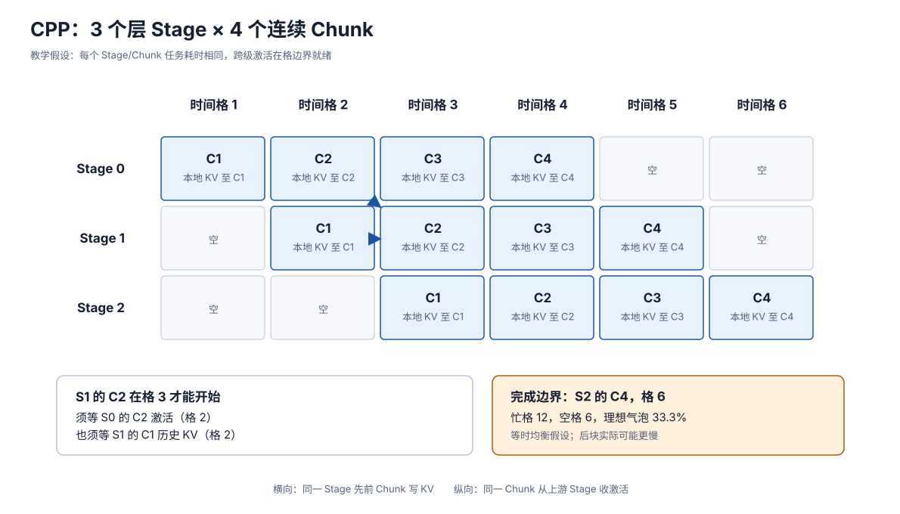

# CPP：Prefill Chunk 穿过层间流水线

> **文献与文档基线**：[NVIDIA《AI Model Co-Design: Hardware-Friendly LLM Design》](https://developer.nvidia.com/blog/?p=119595)（2026-07-10，“Design for pipeline parallelism”，Fig. 8–9，原文快照 `raw/01_theory/06_distributed_parallelism/NVIDIA_HW_Friendly_LLM_CoDesign_2026-07-10.html`）；[VPP，arXiv:2608.26523v1](https://arxiv.org/html/2608.26523v1)（2026-08-27，§1、§2.4）；[vLLM-Ascend Dynamic CPP v0.21.0rc](https://docs.vllm.ai/projects/ascend/en/v0.21.0rc/developer_guide/Design_Documents/dynamic_chunked_pipeline_parallel.html)（“Problem Statement”“Runtime Phase”“Constraints”）。均于 2026-09-17 核读；补充索引见 `raw/01_theory/05_inference/VPP_Chunked_Pipeline_Parallelism-2608.26523.md`、`vLLM_Ascend_Dynamic_CPP-v0.21.0rc.md`。
> **主题**：解释 Chunked Pipeline Parallelism（CPP）为何同时切模型层与长 prompt、一个 chunk 在三 stage 间怎样传激活并保留各 stage 的历史 KV，以及填充、稳态和排空如何决定首 token 可见时间。
> **适用范围**：本文只讲推理 prefill 的层间 chunk 流水；通用 PP、训练反向及调度族归 06，单副本内按轮切 prefill 归 16，按位置切分同一层的 PCP 归 27。vLLM-Ascend 的动态 chunk 是 CPP 的一个版本化变体。
> **最近更新**：2026-09-17。新增原理分析；三 stage 时间格为均衡假设下的教学推演，非论文或设备实测。

## 1. 只有层切分或只有分块，各少一条流水维

模型太大或希望用多卡缩短长 prefill 的层栈关键路径时，可以把层按顺序分给多个 pipeline stage。若整个 prompt 是单个工作单元，它须依次走完所有 stage，前一 stage 做完后才有下一 stage 的事；启动与排空期间许多卡闲置。[[16_chunked_prefill_analysis|Chunked Prefill]] 已能把长 prompt 切为连续 token 段；**CPP 再让这些段作为独立工作单元穿过分层模型**，于是 stage 1 处理前一块时，stage 0 可处理后一块。NVIDIA 2026-07-10 原文 Fig. 8 把“层切 stage、上下文切 chunk”并列为 CPP 的两轴；VPP v1 §2.4 也用同一定义。[来源：NVIDIA “Design for pipeline parallelism”](https://developer.nvidia.com/blog/?p=119595)，[VPP v1 §2.4](https://arxiv.org/html/2608.26523v1)。

CPP 为何不能只把各 chunk 当成互不相关的 microbatch？后块 query 仍要注意到前块 K/V，而每个 stage 承担不同的层。**在 stage $s$ 内，chunk $j$ 必须等 stage $s$ 对本请求此前 chunk 的 KV 已可见**；同时它的输入激活还须来自上游 stage $s-1$ 对**同一 chunk**的输出。这两个依赖方向分别沿 chunk 和 layer 轴。普通 PP 的层切分与一般气泡公式见 [[01_theory/06_distributed_parallelism/15_pipeline_parallel_analysis|流水线并行]]；本页只推演推理 prefill 的二维依赖。

## 2. 三 Stage、四 Chunk 的完整时间线

设单个 prompt 顺序切为 $C_1,C_2,C_3,C_4$，模型层顺序切为 $S_0,S_1,S_2$。教学假设每个 $(S_s,C_j)$ 任务耗一个等长时间格，stage 间激活传递在格边界完成，且无其他请求、无重算、无资源争用。允许一个 stage 在某格只处理一个 chunk。

| 时间格 | $S_0$ | $S_1$ | $S_2$ | 本格之后的可见条件 |
|---:|---|---|---|---|
| 1 | $C_1$ | 空 | 空 | $S_0$ 的 $C_1$ 激活可交给 $S_1$；本地有 $C_1$ KV |
| 2 | $C_2$ | $C_1$ | 空 | $S_0$ 的 $C_2$、$S_1$ 的 $C_1$ 完成 |
| 3 | $C_3$ | $C_2$ | $C_1$ | $S_2$ 完成 $C_1$，但整段 prompt 尚未完成 |
| 4 | $C_4$ | $C_3$ | $C_2$ | $S_0$ 已做完本请求的全部 chunk |
| 5 | 空 | $C_4$ | $C_3$ | $S_1$ 已做完本请求的全部 chunk |
| 6 | 空 | 空 | $C_4$ | 末 stage 完成末 chunk，完整 prompt 的末位置输出才可用于首个生成决策 |

图把时间放横轴、stage 放纵轴，蓝色单元是运行的 $(S_s,C_j)$，白色单元是启动/排空气泡；同色箭头分别说明跨 stage 激活和本 stage 历史 KV 的依赖。**图的规格**：左侧给四个按位置相接的 chunk；中部 3×6 网格准确重放上表；每格标记本地 KV 写入累计到 $C_j$，选择性箭头标出 $S_1C_2$ 同时依赖 $S_0C_2$ 激活与 $S_1C_1$ 历史；右端标出完成边界为 $S_2C_4$ 而非 $S_0C_4$。

上表有 $3\times4=12$ 个忙格，历时 $4+3-1=6$ 格，所有 stage 合计有 $3\times6=18$ 个可用格，故空格为 $6$、空格比例 $1/3$。更一般地，若 $P$ 个**完全均衡**的 stage、$M$ 个**等时** chunk 且只计填充/排空，那么历时 $M+P-1$ 格，理想化气泡比例为

$$
\frac{P-1}{M+P-1}.
$$

这不是实际运行时间的无条件公式。通信、每个 stage 的层成本、不同 chunk 的历史长度、重叠和调度都可能改变格长或引入额外等待；本例的 $1/3$ 只验证图表内部一致。

## 3. 每个 Stage 为什么要保存自己的历史 KV

第 $j$ 块的输入激活经 $S_0$ 后发送给 $S_1$，再发送给 $S_2$；跨 stage 传的是该块在层边界的**激活**，不是把所有层的 KV 统一搬到最后一卡。每个 stage 只拥有其所管层的历史 KV：$S_1$ 处理 $C_2$ 时，要用 $S_1$ 先前处理 $C_1$ 时写入的那些层的 K/V；$S_2$ 处理 $C_4$ 时，同理要看到它自己对 $C_1,C_2,C_3$ 的历史。对任意 stage 内位置 $t$，因果可见集合仍是该层的 $\{0,\ldots,t\}$。这是从层分工与因果 attention 推导出的正确性条件；chunk 边界不能把历史截断。[因果跨块依据：[[16_chunked_prefill_analysis|Chunked Prefill §2]]]。

用任务偏序表达，若 $T_{s,j}$ 表示 stage $s$ 上的 chunk $j$，则至少有

$$
T_{s-1,j}\prec T_{s,j}\quad(s>0),
\qquad T_{s,j-1}\prec T_{s,j}\quad(j>1).
$$

第一条使上游激活先到，第二条使本 stage 的历史 KV 先完成。上表逐格满足两条：如 $S_1C_2$ 在格 3，前者 $S_0C_2$ 和 $S_1C_1$ 都在格 2 完成。若 stage 之间传递或 KV 写入尚未可见就启动该格，得到的不是相同的因果模型结果。最后 stage 只完成 $C_1$ 时可以有这一块的中间 logits，但**完整 prompt 的末位置**尚未经过所有层，不能发布首个生成 token；本例到格 6 才满足完成条件。

## 4. 等长 Chunk 为什么未必等时

即使每块恰有 $c$ 个 token，第 $j$ 块的 attention 还要读取约 $(j-1)c$ 个历史位置；按有效 query-key 对粗算，该块注意力工作量与 $c(j-1)c+c(c+1)/2$ 成正比，而 FFN 对该块仍约随 $c$ 线性。因而后续块可能更慢，表中“一格等时”未必成立；实际 kernel、缓存、稀疏性与带宽也会影响方向和幅度。Sarathi v1 Fig. 6/§4.2 显示后块读取前块历史 KV；VPP v1 §1、§2.4 明确指出等长 CPP 会因历史增长而使 chunk 时间不均。[来源：Sarathi v1 §4.2](https://arxiv.org/pdf/2308.16369v1)，[VPP v1 §1、§2.4](https://arxiv.org/html/2608.26523v1)。

一种替代是动态缩小后续 chunk，力求每块耗时接近；代价是更多边界、调度与可能降低的算子效率。vLLM-Ascend v0.21.0rc 的 **Dynamic CPP** 通过启动 profiling 和运行时校准预测块大小，明确要求 PP 与 chunked prefill，并列出启动 profiling 开销。VPP v1 的研究则在固定 chunk 下用虚拟 stage 布局降低不均衡。二者是不同策略，均不能改写 CPP 基础依赖；本文不将任一方法的实验收益套进上表。[来源：vLLM-Ascend v0.21.0rc，“Solution Overview”“Runtime Phase”“Constraints”](https://docs.vllm.ai/projects/ascend/en/v0.21.0rc/developer_guide/Design_Documents/dynamic_chunked_pipeline_parallel.html)，[VPP v1 §1](https://arxiv.org/html/2608.26523v1)。

## 5. 通信、切分粒度与组合边界

CPP 每条 stage 边界都要传 chunk 激活；$M$ 越大，单块激活越小且可重叠的任务越多，但 stage 间消息次数、调度次数和本 stage 历史 KV 重读可能增长。若 stage 层数或 MoE/attention 开销不均，最慢 stage 会让前后 stage 等待，更多 chunk 也无法消除这种稳态瓶颈。NVIDIA 原文据其 DeepSeek-R1 256K prefill、GB300 场景展示 CPP 随 PP 规模变化的 FTL 与每卡吞吐，并以**规则、可均分的层模式**作为 Guideline 6；数据与模型协同评注保留在 [[01_theory/06_distributed_parallelism/21_hw_friendly_llm_codesign_analysis|06 NVIDIA 软硬协同页]]，本页不将其当作跨模型定律。[来源：NVIDIA “Design for pipeline parallelism”，Fig. 8–9、Guideline 6](https://developer.nvidia.com/blog/?p=119595)。

CPP 的 chunk 与 [[16_chunked_prefill_analysis|单副本 Chunked Prefill]] 使用同一因果历史，但这里一个 chunk 还会依次跨 stage。[[27_prefill_context_parallelism_analysis|PCP]] 在同一层把不同位置分卡并交换 attention 所需信息；CPP 按层分卡并在 stage 间传激活。两者可在布局上叠加，却要另外安排各 stage 内的 PCP 组、KV 和激活交换。NVIDIA 以 P/D 分离作为其部署背景，vLLM-Ascend 动态 CPP 也推荐用于 Prefiller；**另设 Decode 节点不是 CPP 数学定义的前提**。数学可组合、引擎实现支持与目标负载下值得部署，是三件不同的判断。[来源：NVIDIA “Design for pipeline parallelism”](https://developer.nvidia.com/blog/?p=119595)，[vLLM-Ascend Dynamic CPP v0.21.0rc](https://docs.vllm.ai/projects/ascend/en/v0.21.0rc/developer_guide/Design_Documents/dynamic_chunked_pipeline_parallel.html)。

## Related Pages

- [[16_chunked_prefill_analysis|Chunked Prefill]]：提供同一 prompt 分段处理、历史 KV 跨块保留的单副本基础。
- [[27_prefill_context_parallelism_analysis|PCP：Prefill Context Parallelism]]：对照按序列位置跨卡计算与本页按层 stage 传激活的不同轴。
- [[01_theory/06_distributed_parallelism/15_pipeline_parallel_analysis|流水线并行]]：承载通用 PP 切层、气泡和训练调度推导。
- [[01_theory/06_distributed_parallelism/21_hw_friendly_llm_codesign_analysis|硬件友好的 LLM 模型设计]]：保留 NVIDIA 的 Guideline 6、Fig. 9 实验范围与模型结构评注。
- [[11_inference_cost_model_analysis|推理性能与资源成本模型]]：把填充、排空、通信和实际 TTFT 放入统一成本账。
