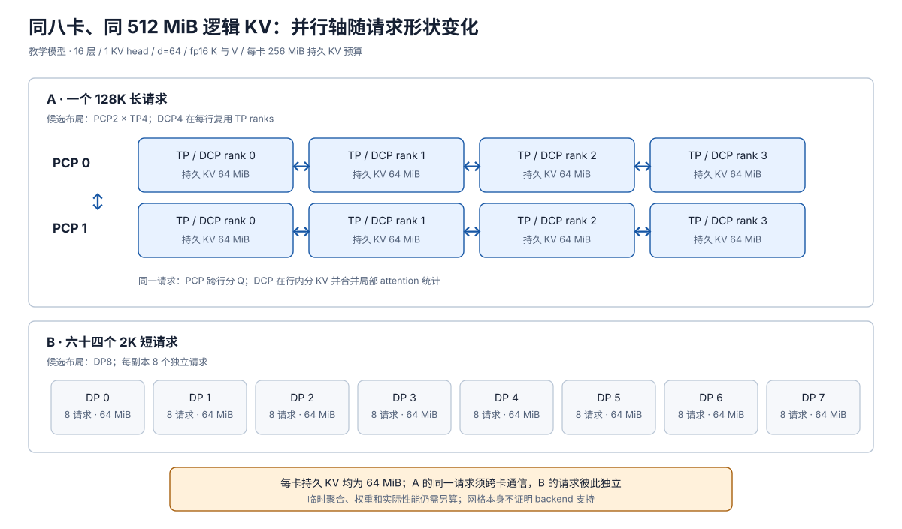

# 推理并行组合：先算容量，再核对通信与布局

> **文档基线**：[vLLM Context Parallel Deployment v0.20.0](https://docs.vllm.ai/en/v0.20.0/serving/context_parallel_deployment/)（“Prefill Context Parallel”“Decode Context Parallel”）；[vLLM-Ascend CP 设计与用户文档 v0.21.0rc](https://docs.vllm.ai/projects/ascend/en/v0.21.0rc/developer_guide/Design_Documents/context_parallel.html)（“Device Distribution”“Block Table”；[用户指南](https://docs.vllm.ai/projects/ascend/en/v0.21.0rc/user_guide/feature_guide/context_parallel.html)“Constraints”）；[NVIDIA 软硬协同原文](https://developer.nvidia.com/blog/?p=119595)（2026-07-10，“Large expert parallelism boosts throughput”“Design for pipeline parallelism”“Hybrid parallel strategies”）。于 2026-09-17 核读；来源索引见 `raw/01_theory/05_inference/vLLM_Context_Parallel-v0.20.0.md`、`vLLM_Ascend_Context_Parallel-v0.21.0rc.md` 及 `raw/01_theory/06_distributed_parallelism/NVIDIA_HW_Friendly_LLM_CoDesign_2026-07-10.html`。
> **主题**：用相同八卡、两种负载逐步选择推理并行轴，先核算权重、KV 和并发容量，再跟踪 attention/FFN 的布局交接、通信频次与完成边界。区分并行轴的数学可组合性、引擎版本支持和实际性能价值。
> **适用范围**：这是组合决策账本，不重复推导 TP/PP/DP/EP 的通用算法，也不替代 PCP、DCP、CPP 的单轴机制页；动态专家负载均衡留给 MoE 专题。数值为教学假设，未运行硬件基准。
> **最近更新**：2026-09-17。新增组合分析；不把教学模型的内存估算当作部署建议或实测吞吐。

## 1. 从容量、并发和延迟目标开始

同样是八卡，低并发的长上下文请求可能先被**单请求的 KV 容量或长 prefill 的 TTFT**卡住；大量短请求则可能主要受可同时处理的请求数、权重复用或路由吞吐限制。若未先定模型权重是否能放进每张卡、目标并发、输入/输出长度、KV dtype 与设备互连，直接挑“TP×PP×PCP×DCP”只是在列名，不是布局。[[11_inference_cost_model_analysis|推理成本模型]]给出权重、KV、计算与测量口径；本页用下列尺寸只演示决策过程。

**共同教学假设**：八张相同设备；权重在每卡都能独立放下；扣除权重与固定工作区后，每卡有 $256\ \mathrm{MiB}$ 可给持久 KV；模型有 $L=16$ 层、$H_{kv}=1$ 个 KV head、head dim $d=64$，K 与 V 均为 2 字节元素，且无 KV 压缩。单 token 所有层的 KV 是

$$
b_{kv}=2\cdot L\cdot H_{kv}\cdot d\cdot 2
=2\cdot16\cdot1\cdot64\cdot2
=4096\ \mathrm{B}=4\ \mathrm{KiB}.
$$

这只算逻辑 payload，未计 block 内碎片、索引、临时 all-gather buffer、每层激活和预留容量。特别是权重“可独立放下”是算例输入，而非某真实 16 层模型的测量结论。

| 负载 | 请求数与每请求上下文 | 总逻辑 KV payload | 主要需要检查的约束 |
|---|---|---:|---|
| A：低并发长上下文 | $1$ 个、$128\mathrm{K}=131072$ token | $131072\cdot4\ \mathrm{KiB}=512\ \mathrm{MiB}$ | 单副本跨卡分片；长 prefill 的完成时间 |
| B：高并发短请求 | $64$ 个、每个 $2\mathrm{K}=2048$ token | $64\cdot2048\cdot4\ \mathrm{KiB}=512\ \mathrm{MiB}$ | 多请求能否独立分散；每卡 batch 与权重复用 |

两组的**总** KV 都是 $512\ \mathrm{MiB}$，但其请求间/请求内分布不同，因而需要不同的同步。输出继续增长时还要预留未来 KV；本表只冻结当前长度，不宣称两组的峰值已覆盖完整服务生命周期。

## 2. 同八卡的两种布局：位置分片与副本分流

对 A，只用 DP 复制八个完整模型时，单个 $512\ \mathrm{MiB}$ 历史仍须放在一个副本内，超过该卡 $256\ \mathrm{MiB}$ 的教学 KV 预算。因有效 KV head 只有一个，**仅把 TP 拉到 4 并不会自动把这个 head 的历史按位置分成四份**；vLLM v0.20.0 文档正以有限 KV head 产生 TP 重复副本作为 DCP 动机。在采用该文档的复用 TP rank 方式时，$\mathrm{TP}=4$、$\mathrm{DCP}=4$ 可让四卡各持约 $128\ \mathrm{MiB}$ 的序列片，先过静态容量检查。若还需压长 prefill 的关键路径，可以再**提出** $\mathrm{PCP}=2$：两组 PCP 位置域与四卡 TP/DCP 域组成八卡，理想均分后的持久 KV payload 为每卡 $512/8=64\ \mathrm{MiB}$。这里 $64\ \mathrm{MiB}$ 是**数学下界式的平均值**，不包括分片不均和临时聚合。[来源：vLLM v0.20.0，“Decode Context Parallel”](https://docs.vllm.ai/en/v0.20.0/serving/context_parallel_deployment/)；[vLLM-Ascend v0.21.0rc，“Device Distribution”“Block Table”](https://docs.vllm.ai/projects/ascend/en/v0.21.0rc/developer_guide/Design_Documents/context_parallel.html)。

对 B，假设每卡可独立执行该模型，则 $\mathrm{DP}=8$ 可把 $64$ 个短请求平均分为每卡 $8$ 个，每请求 KV 为 $2048\cdot4\ \mathrm{KiB}=8\ \mathrm{MiB}$，故每卡持久 KV 约 $8\cdot8=64\ \mathrm{MiB}$。这些是**不同请求**，各自的 attention 分母不跨副本，推理前向无跨副本梯度归约；实际负载均衡、随机路由、请求长度差异仍可能使每卡不等于 8 个。若改为两组 `TP4+DCP4`、每组处理 32 个短请求，均摊每卡也可能是 $64\ \mathrm{MiB}$，但每层多了组内通信；仅凭相同 KV 数字不能判其更快。[DP/TP 的通用机制：[[01_theory/06_distributed_parallelism/11_data_parallel_analysis|DP]]、[[01_theory/06_distributed_parallelism/13_tensor_sequence_parallel_analysis|TP]]]。

**图的规格**：同样八张卡，上半为 A 的 $\mathrm{PCP}2\times\mathrm{TP}4$ 网格，DCP4 在每行复用 TP rank，每卡标 $64\ \mathrm{MiB}$ 持久 KV 并以双向箭头标出组内 attention 通信；下半为 B 的八个互不通信的 DP 副本，每卡 8 请求、$64\ \mathrm{MiB}$。右侧给出“总量都为 512 MiB，通信模式不同”的核对框；前者的 backend 支持须另查，不由网格证明。

## 3. 每条轴具体改变什么

| 轴 | 本页用于判断的切分对象 | 先解决什么 | 新增的主要成本或失败条件 |
|---|---|---|---|
| DP | 请求/模型副本 | 多个独立请求分流，前向互不依赖 | 复制整份权重；单请求容量不因副本数下降 |
| TP | 层内权重、Q/output head 或张量片 | 单层权重/计算分摊 | 每层收集或规约激活；KV head 少时可能重复 |
| PP / CPP | 层 stage；CPP 再按 prompt chunk 流水 | 过深模型容量或长 prefill 的层间重叠 | stage 激活传递、填充排空和不均衡 |
| EP | MoE 专家 | 专家权重分散、按被选专家汇集 token | dispatch/combine all-to-all，路由热点与专家负载偏斜 |
| PCP | prefill 位置及对应 Q 工作 | 长 prefill 的 query 行分工 | 远端 KV 可见性、临时聚合或轮转、顺序恢复 |
| DCP | decode 的历史 KV 位置 | 单请求 KV 重复或容量 | 同 query 的局部统计归一化、query/输出布局转换 |

TP、PP、EP 的通用算子与通信分别归 [[01_theory/06_distributed_parallelism/13_tensor_sequence_parallel_analysis|TP]]、[[01_theory/06_distributed_parallelism/15_pipeline_parallel_analysis|PP]]、[[01_theory/06_distributed_parallelism/14_expert_parallel_analysis|EP]]；PCP、DCP、CPP 的本页专用机制分别归 [[27_prefill_context_parallelism_analysis|27]]、[[28_decode_context_parallelism_analysis|28]]、[[29_chunked_pipeline_parallelism_analysis|29]]。上表是**选择账**，不能以轴名替代其主页面的正确性推导。

## 4. Attention 与 FFN 的布局交接

一层内部可能由 attention 和 FFN 喜欢不同的布局。A 的 DCP/PCP 使 attention 按序列 KV shard 或 prefill Q shard 工作；FFN 的权重与 token 矩阵却可按 TP、EP 或复制方式执行。attention 得到的部分输出先按**全局 attention 分母**合并，再按下一算子所需的 head/token 布局重排；MoE FFN 若用 EP，则还要按路由目标分发并回收 token。若跳过这些交接，只在纸面写下“PCP×DCP×EP”，会遗漏真实通信与完成条件。DCP 的局部统计、LSE/输出交换及返回 head 布局见 [[28_decode_context_parallelism_analysis|DCP §3]]；EP 的 dispatch/combine 见 [[01_theory/06_distributed_parallelism/14_expert_parallel_analysis|专家并行]]。

NVIDIA 2026-07-10 原文提出在低并发 decode 中分别选择 attention 与 FFN 的并行策略，并以 Helix 的 KV 序列切分、随后同一批 GPU 执行 FFN 的 TP×EP 为例。这证明**组合需要显式跨算子布局交接**，不证明任意 TP/EP/PCP/DCP 组合都已实现或总能隐藏通信。它关于 GB300/NVLink 的收益条件留在 [[01_theory/06_distributed_parallelism/21_hw_friendly_llm_codesign_analysis|原软硬协同页]]。[来源：NVIDIA “Hybrid parallel strategies to meet latency-oriented service goals”](https://developer.nvidia.com/blog/?p=119595)。

## 5. 数学可组合、引擎可用与性能合适分开核对

第一关是**数学正确性**：A 的每个 prefill query 可见此前全部 KV；decode 的每个局部分片输出按共同 softmax 分母重标定；CPP 的每个 stage 等上游同块激活及本 stage 先前 chunk KV；EP 的 token 输出回到正确请求与位置。这些条件缺一就不是原模型的同一前向计算。[对应推导：[[27_prefill_context_parallelism_analysis|PCP]]、[[28_decode_context_parallelism_analysis|DCP]]、[[29_chunked_pipeline_parallelism_analysis|CPP]]]。

第二关是**版本支持**。vLLM-Ascend v0.21.0rc 的设备布局定义 `cp_size = pcp_size * dcp_size`，用户指南示例给出 `world_size = tp_size * pcp_size`；DCP 复用 TP ranks，PCP 扩展设备数。该版本对 MLA、GQA 的 DCP 规模、KV 传输所需 interleave/block 对齐及组合功能另列条件。我们的 A 只是满足简化设备数与容量算式；未指定真实模型、attention backend、KV block 和转移方式，因而**不能声称这个八卡方案可直接部署**。vLLM 上游 v0.20.0 又把 PCP 两条策略标成开发中，不能把两个项目/版本的能力混成一个“vLLM 一定支持”。[来源：vLLM-Ascend v0.21.0rc，“Device Distribution”“Constraints”](https://docs.vllm.ai/projects/ascend/en/v0.21.0rc/user_guide/feature_guide/context_parallel.html)，[vLLM v0.20.0，“Prefill Context Parallel”](https://docs.vllm.ai/en/v0.20.0/serving/context_parallel_deployment/)。

第三关是**性能合适**。A 在 4 卡 `TP4+DCP4` 时已过持久 KV 容量关，是否再扩 PCP2 应以长 prompt TTFT 降幅是否超过通信、临时内存与占用其他副本的机会成本来判断；B 的 DP8 避免单请求跨卡 attention 通信，但若模型权重不再能独立放下、单卡短 batch 太小或 MoE 专家读权重成为瓶颈，TP/PP/EP 可能重新有价值。NVIDIA 的宽 EP、CPP、Helix 建议分别对应特定吞吐和交互性场景，并非一份普遍最优配置表。[来源：NVIDIA “Large expert parallelism boosts throughput”“Design for pipeline parallelism”“Hybrid parallel strategies”](https://developer.nvidia.com/blog/?p=119595)。

## 6. 带宽域和统一测量账本

候选布局最终应把每种跨卡数据列清楚：TP 每层的激活规约，EP 的 token all-to-all，PCP 的 K/V 交换与顺序恢复，DCP 的 query/局部统计交换，CPP 的 stage 激活传递，以及 P/D 分离时可能另有的 KV 转运。高频、关键路径的通信应优先放在快互连域；但“机内就一定快”仍需要测量消息大小、collective 次数、拓扑争用和重叠。通用集合通信代价见 [[01_theory/06_distributed_parallelism/10_collectives_analysis|06 集合通信]]，跨 P/D 的传输与排队见相应推理专题；本页不把 P/D 分离等同于 PCP/DCP。

| 对每个候选实际记录 | A：单长请求关心 | B：多短请求关心 |
|---|---|---|
| 容量 | 每卡权重、持久 KV、临时聚合峰值、输出预留 | 每卡副本权重、请求数及长度尾部、KV 碎片 |
| 延迟 | TTFT 分为排队、prefill compute、跨卡等待、末 stage 完成；再测 ITL | P50/P95 ITL、排队时间和短请求 TTFT |
| 吞吐 | 在固定低并发下的设备利用与每请求耗时 | 固定到达率下完成请求数、总 token/s 与每卡成本 |
| 通信 | 各轴每层字节、次数、实际带宽域和不能重叠部分 | 与 DP8 基线相比增加的 TP/EP/CP 通信及负载偏斜 |

这份账本先保证两个工作负载的**相同资源预算与完成口径**，再比较方案；不能把 A 的 TTFT 与 B 的集群吞吐直接当作同一指标。任何估算仅给待测假设，实际收益须在具体模型、权重精度、batch、请求长度分布和后端版本上验证。

## Related Pages

- [[11_inference_cost_model_analysis|推理性能与资源成本模型]]：给出权重/KV 容量、TTFT/ITL 与比较口径。
- [[27_prefill_context_parallelism_analysis|PCP：Prefill Context Parallelism]]：核对长 prompt 按位置切分后的依赖与输出恢复。
- [[28_decode_context_parallelism_analysis|DCP：Decode Context Parallelism]]：核对序列维 KV 分片与跨卡归一化。
- [[29_chunked_pipeline_parallelism_analysis|CPP：Chunked Pipeline Parallelism]]：核对层 stage 与 prompt chunk 的二维时间依赖。
- [[01_theory/06_distributed_parallelism/index|分布式并行原理]]：进入 TP、PP、DP、EP 与通信原语的单轴权威页面。
- [[01_theory/06_distributed_parallelism/21_hw_friendly_llm_codesign_analysis|硬件友好的 LLM 模型设计]]：查看 NVIDIA 对 EP、CPP、Helix 的具体实验和模型协同主张。
