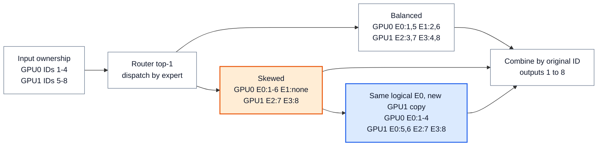

# MoE 推理：路由负载、专家副本与完成边界

> **文献基线**：[DeepSeek-V3 Technical Report，arXiv:2412.19437v1](https://arxiv.org/pdf/2412.19437v1)（2024-12-27，§3.4.1–3.4.2）；来源索引见 `raw/01_theory/01_models/deepseek/DeepSeek_V3-2412.19437.md`。路由模型、训练均衡与通用 EP 的既有解释分别见 [[01_theory/01_models/deepseek/20_deepseek_moe_analysis|DeepSeekMoE]]、[[01_theory/06_distributed_parallelism/14_expert_parallel_analysis|专家并行]]。
> **主题**：从已选专家的 token 分布出发，追踪分组 GEMM、跨设备 dispatch/compute/combine、负载偏斜与物理专家副本，直到每个输出回到原 token 位置。
> **适用范围**：讨论推理时固定路由结果的执行与放置；不推导 Router 训练损失，不把 DeepSeek-V3 的 H800 部署规模当作普遍推荐。两卡四专家数字是教学算例，不是论文实测。
> **最近更新**：2026-09-17。新建原理页；按固定论文版本核对部署事实与探索性方案。

## 1. 从逻辑专家分配到可执行矩阵

设一个 MoE 层收到 $N$ 个 token 行 $X_i\in\mathbb{R}^{d}$。Router 为行 $i$ 选出专家集合 $S_i$ 与权重 $g_{i,e}$，执行结果可写为

$$
Y_i=\sum_{e\in S_i}g_{i,e}F_e(X_i).
$$

这只是**已决定路由后的推理账**；如何训练 Router、是否有共享专家或 top-$k$ 归一化，由模型定义。实际执行先形成赋值表 $(i,e,g_{i,e})$。对每个逻辑专家 $e$，将分给它的 $n_e$ 行聚成 $X_e\in\mathbb{R}^{n_e\times d}$，再运行该专家的 FFN GEMM。$n_e$ 决定矩阵的 batch 维：总分配数是 $\sum_e n_e=\sum_i\lvert S_i\rvert$，**不是**必然等于原 token 数 $N$；top-2 时一行会出现两次。分组省去“每 token 独立启动一串小算子”，但 $n_e$ 太小时仍可能难以摊薄权重读取和启动成本。EP 的基本执行见 [[01_theory/06_distributed_parallelism/14_expert_parallel_analysis|专家并行]]；DeepSeek-V3 的阶段 batch 观察见[原论文 §3.4](https://arxiv.org/pdf/2412.19437v1)。

若专家分散在设备上，dispatch 根据**物理目的卡**发送行及其原始 token ID；本地 expert compute 得到每项 $F_e(X_i)$；combine 把结果送回原拥有者，并按 $g_{i,e}$ 对相同 $i$ 求和。计算布局中的行序可以变化，输出语义中的请求、token 位置和路由权重不能变化。两次发送可用 all-to-all 或点对点等不同实现；DeepSeek-V3 的 prefill 采用跨节点 IB、节点内 NVLink 的分层 all-to-all，decode 使用 IB 点对点，这是其**两个阶段的具体部署**。[来源：DeepSeek-V3 §3.4.1–3.4.2](https://arxiv.org/pdf/2412.19437v1)。

## 2. 两卡四专家：均衡、偏斜与顺序恢复

下面固定 **top-1、每个专家处理一行耗时同为 1 个教学单位**。GPU 0 最初持逻辑专家 E0/E1 和输入行 1–4；GPU 1 持 E2/E3 和输入行 5–8。真实 FFN 耗时不是行数的严格线性函数，该单位只让尾部依赖可复算。

| 路由 | E0 | E1 | E2 | E3 | GPU 0 / GPU 1 接收行数 | 理想并行计算下界 |
|---|---|---|---|---|---|---:|
| 均衡 | 1、5 | 2、6 | 3、7 | 4、8 | 4 / 4 | $\max(4,4)=4$ 单位 |
| 偏斜 | 1、2、3、4、5、6 | 无 | 7 | 8 | 6 / 2 | $\max(6,2)=6$ 单位 |
| 偏斜且 GPU 1 放一份 **E0 物理副本** | GPU 0 算 1–4；GPU 1 的 E0 副本算 5–6 | 无 | 7 | 8 | 4 / 4 | $\max(4,4)=4$ 单位 |

第二行的分配表按专家聚集后可写成 `E0:[1,2,3,4,5,6]，E2:[7]，E3:[8]`；combine 必须按原 ID 恢复 `1,2,3,4,5,6,7,8`。在均衡行，GPU 0 的 1→E0、2→E1 是本地，5→E0、6→E1 是跨卡；GPU 1 的 7→E2、8→E3 是本地，3→E2、4→E3 是跨卡。第三行将 5、6 留在 GPU 1 的 E0 副本，减少这两个赋值的跨卡 dispatch/combine；它也需要**另存一份 E0 权重**。这些通信判断只针对表中初始行归属，不代表真实拓扑的完整代价。

**图的规格**：左侧保留原 token ID，中央分别展示均衡与偏斜时的两卡专家行数；右侧在偏斜情况下给 GPU 1 增加 E0 的物理副本，标明逻辑 E0 没有变成第五个专家，并以 combine 箭头返回 ID 1–8。

表中的 6→4 是**忽略副本加载、通信、GEMM 非线性和其他层争用的关键路径下界变化**。E0 副本只重复权重及计算实例；Router 仍选择同一个逻辑 E0，$F_{E0}$ 与权重版本须一致。若模型是 top-$k$，还要按原权重合并多个专家输出，不能把副本算成额外第 $k+1$ 个专家。

## 3. 为什么偏斜会放大尾延迟

一次 MoE 层的完成时间不由平均 $\frac{1}{G}\sum_e n_e$ 单独决定。至少要等最后一个参与卡完成 dispatch、专家计算、combine；某卡的热门专家可能同时放大输入通信、局部权重/激活带宽和返回通信。**若这些阶段不重叠**，一个只用于定位瓶颈的近似是

$$
T_{\mathrm{layer}}\approx
T_{\mathrm{route}}+T_{\mathrm{dispatch}}+
\max_{g\in\mathrm{GPUs}}T_{\mathrm{experts},g}+
T_{\mathrm{combine}},
$$

其中通信与计算若实际重叠，右式的简单相加就不再是精确预测；网络争用也可能让最长通信落在另一张卡。该式把“平均 token 数足够”与“最慢卡完成”分开，不能拿教学单位预测真实毫秒数。DeepSeek-V3 §3.4 明确以**每卡尽量相近的 token 数**作为在线专家放置目标，并在 prefill/decode 采用不同通信路径。[来源：DeepSeek-V3 §3.4.1–3.4.2](https://arxiv.org/pdf/2412.19437v1)。

## 4. 逻辑专家、副本与迁移的成本账

负载统计可以驱动物理放置，不必改模型的逻辑 Router。DeepSeek-V3 的已描述 prefill 部署会周期性根据在线统计挑出热门专家，重新安排节点内的专家放置；论文给出的部署值是 prefill 32 个冗余专家、每 GPU 在原有 8 个之外再存 1 个，调整间隔举例约 10 分钟。decode 的 320 GPU/EP320 部署中，每卡只持一个专家，64 卡负责冗余与共享专家，并周期性选择冗余集合，论文说不需像 prefill 那样重新排列专家。[来源：DeepSeek-V3 §3.4.1–3.4.2](https://arxiv.org/pdf/2412.19437v1)。这些是特定模型、设备与规模的观察，不能推广为所有 MoE 的默认配额。

放置副本的收益要扣除额外权重存储、加载或迁移期间的带宽与临时空间、路由目的地映射更新以及可能增加的跨节点通信。若副本权重未就绪，不能把指向它的 token 纳入下一批；若旧放置仍有在途 token，不能先回收旧权重。这是服务状态一致性要求，不是论文规定的具体锁机制。DeepSeek-V3 还提到**正在探索**每步在线计算最优路由的动态冗余：prefill 每卡容纳更多专家、每步只激活一部分，decode 需进一步优化路由和 dispatch kernel。这两段是未来研究方向，不能写成报告中的已部署功能。[来源：DeepSeek-V3 §3.4.1–3.4.2](https://arxiv.org/pdf/2412.19437v1)。

## 5. 重叠和阶段差异

prefill 常有较大的专家 token 矩阵，较容易让 GEMM 利用设备；DeepSeek-V3 以 EP32 使每位专家拿到足够大的 batch，并**已描述**用两个计算量相近的 microbatch，把其中一批的 attention/MoE 与另一批的 dispatch/combine 重叠。这里的交错仍要保持每批内部“路由→相关数据到齐→专家输出→combine”依赖，不能提前把尚未返回的专家结果传给下一层。[来源：DeepSeek-V3 §3.4.1](https://arxiv.org/pdf/2412.19437v1)。

decode 的每位专家 batch 在该报告的部署中通常小于 256，论文将其瓶颈描述为访存，并为低时延采用 IB 点对点。它提出的“同时处理两个 microbatch，将一批 attention 与另一批 dispatch+MoE+combine 重叠”明确写作 **exploring**，不能把 prefill 已描述的重叠路径直接套给 decode。[来源：DeepSeek-V3 §3.4.2](https://arxiv.org/pdf/2412.19437v1)。对其他模型，小 batch 是否访存受限、是否值得复制专家，还要测量专家宽度、量化、网络域和实际路由分布；$max_g$ 尾部与跨卡字节数应一起记录。

## Related Pages

- [[01_theory/06_distributed_parallelism/14_expert_parallel_analysis|专家并行 EP]] — 定义通用的专家分布、all-to-all 与 top-$k$ 合并。
- [[01_theory/01_models/deepseek/20_deepseek_moe_analysis|DeepSeekMoE]] — 查看逻辑专家和 Router 的模型语义，避免把物理副本当作新增专家。
- [[15_continuous_batching_analysis|Continuous Batching]] — 解释每轮活跃 token 集如何变化，导致专家分组大小随批次变化。
- [[30_inference_parallelism_composition_analysis|推理并行组合]] — 将 EP 与 TP、DP 及 attention 布局放在同一容量与通信账本中。
- [[11_inference_cost_model_analysis|推理成本模型]] — 按工作负载测量尾延迟、权重容量和实际吞吐，而非只看教学行数。
