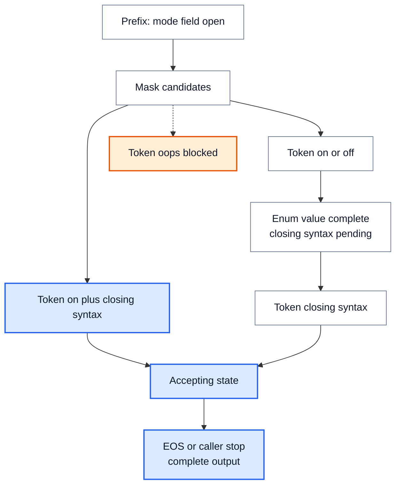

# 约束解码：把格式规则落实到逐 token 状态

> **文献基线**：[Efficient Guided Generation，arXiv:2307.09702v1](https://arxiv.org/pdf/2307.09702v1)（2023-07-19，§1–4）；[XGrammar，arXiv:2411.15100v1](https://arxiv.org/pdf/2411.15100v1)（2024-11-22，§2.1–2.2、Fig. 2–3、§3.1–3.5）。来源索引见 `raw/01_theory/05_inference/Efficient_Guided_Generation-2307.09702.md`、`XGrammar-2411.15100.md`。
> **主题**：将允许的输出语言与当前解析状态转成 token mask，跟踪抽样、状态推进、完成和回滚；用一个含枚举字段的 JSON 重放跨语法边界的 token。
> **适用范围**：讨论通用格式约束生成。工具调用协议和 reasoning 文本的 parser 转换属于具体引擎或应用；本页的极小词表与 logits 为教学算例，不是 XGrammar 性能数据。
> **最近更新**：2026-09-17。新建原理页；固定两篇原始论文的算法边界。

## 1. 格式要求先变成可识别的输出语言

“输出 JSON”只是自然语言意图；执行器需要更明确的允许语言 $L$：字段名、字段顺序是否固定、值类型与枚举、可选字段、空白、转义和完成方式。正则表达式的有限状态机适合其能表示的模式；嵌套数组/对象等递归结构通常要有语法栈或等价的状态。Outlines 原论文为正则构造 token 到有限状态转移的索引，也讨论向 CFG 扩展；XGrammar 将 CFG 转为按字节运行的下推自动机，用栈处理递归和歧义。不能把“对 JSON 用 FSM”理解成任意递归深度都能由一个普通有限状态集合无损表达。[来源：Efficient Guided Generation §1–3](https://arxiv.org/pdf/2307.09702v1)；[XGrammar §2.2](https://arxiv.org/pdf/2411.15100v1)。

解析状态 $s_t$ 必须从**已经提交的输出字节**推进。给候选 token $v$ 的表面字节串 $b(v)$，令 $\delta(s_t,b(v))$ 表示依次消费整段字节后的状态。若它到死状态或不存在合法补全，就禁用该 token；若仍是可完成的前缀，就允许它。`EOS` 只在完整接受状态允许。实际系统还须定义最大长度、空白和解码器处理不完整 UTF-8 字节的政策；XGrammar 特别指出 token 可能跨字符甚至 Unicode 字节边界，因而不能逐 token 直接按完整“词”匹配语法。[来源：XGrammar §2.1–2.2、§3](https://arxiv.org/pdf/2411.15100v1)。

## 2. mask 改变支持集，然后重新归一化

模型对整词表给 logits $\ell(v)$。在状态 $s_t$，令 $A(s_t)$ 为全部允许的 token，约束分布是

$$
p_{s_t}(v)=
\frac{\mathbf{1}[v\in A(s_t)]\exp(\ell(v))}
{\sum_{u\in A(s_t)}\exp(\ell(u))},
\qquad A(s_t)\ne\varnothing.
$$

实现通常把不允许项 logit 设为 $-\infty$ 再采样；它并未令模型“理解”语法，只是将本步无效候选概率置零，并保留有效项间的相对权重。若叠加温度、top-k/top-p、禁用词等处理，顺序会改变最终支持集，必须按实际采样流水线核对；普通采样口径见 [[17_sampling_decoding_analysis|采样与解码策略]]。[来源：XGrammar §2.1、Fig. 2](https://arxiv.org/pdf/2411.15100v1)。

## 3. 一枚 token 可以跨多个语法节点

以下**教学语法**只允许两个完整输出：`{"mode":"on"}` 或 `{"mode":"off"}`，不允许空格或其他字段。假定已提交前缀是 `{"mode":"`，状态正等待枚举值；词表摘出六种 token 表面串：`on`、`off`、`on"}`、`"}`、`oops`、`EOS`。其中 `on"}` 是**一枚** token，跨越枚举值、关闭引号与关闭对象三处语法边界。

| 本步候选 token | 教学 logit | 消费后状态 | 在当前状态可选？ |
|---|---:|---|---|
| `on` | 2 | 值已读完，仍待 `"}` | 是 |
| `off` | 1 | 值已读完，仍待 `"}` | 是 |
| `on"}` | 0 | 完整接受状态 | 是 |
| `"}` | 0 | 枚举值缺失，死状态 | 否 |
| `oops` | 3 | 不符合枚举，死状态 | 否 |
| `EOS` | 0 | 尚未完成对象 | 否 |

前三项的重新归一化常数 $e^2+e^1+e^0\approx11.1073$；概率依次约为 $0.665241、0.244728、0.090031$，`oops` 虽然有最高的原始 logit 3，约束后仍为 0。若示意抽中了 `on`，状态推进到“枚举值已完成但尚未闭合”，下一步仅允许 `"}`（在这个摘出的玩具词表中）；抽中它后语法接受，才允许 `EOS` 或由调用方结束。若第一步抽中 `on"}`，可直接进入接受状态。此例显示解析器必须消费 token 的**整个字节串**，而非假定“一 token 对应一个语法边”。

**图的规格**：从前缀状态出发，显示同一步三个有效 token 中 `on` 与 `on"}` 进入不同后继状态；`oops` 被 mask；只有完整接受状态可结束。

## 4. 状态、结束与空候选是同一正确性边界

每提交一枚 token，就按它的实际字节推进解析状态；只看最终字符串再校验，不等于逐步约束生成。对递归语法，状态可能包括自动机节点与栈；有歧义时可能同时存在多个可行栈。XGrammar 预计算上下文无关 token 的 mask，并在运行时检查依赖完整栈的候选；持久栈结构支持快速分支和回滚。这是**加速 mask 构造**的方法，不改变必须按已提交前缀判断候选的语义。[来源：XGrammar §2.2、§3.1–3.3](https://arxiv.org/pdf/2411.15100v1)。

若 $A(s_t)=\varnothing$，上式分母为零，不能把所有 $-\infty$ logits 送进普通 softmax 并继续声称产生了合法样本。执行器须以明确的错误、回退或更改约束策略处理；若在接受状态，正常结束可以是唯一合法动作。长度上限若在非接受状态截断，得到的是**未完成输出**，不能因为最后一枚 token 局部合法就宣称整体有效。这里的错误处理是由状态机和概率定义推出的服务约束，具体 API 并非两篇论文统一规定。

## 5. 批处理和投机路径的状态必须随前缀走

同一批的请求可处在不同语法状态，mask 不能仅按 batch 的共同模板复用。预计算表可按语法和自动机局部状态共享，但含栈、字段值或已消费字节的动态状态仍属于**各请求的已提交前缀**。XGrammar §3.5 讨论 mask 生成与模型推理的流水重叠，但重叠不能让第 $t+1$ 步使用尚未确定的第 $t$ 步状态。[来源：XGrammar §3.1、§3.5](https://arxiv.org/pdf/2411.15100v1)。

若投机解码提出 `on`、`"}` 等多个候选，验证路径可以临时推进语法栈；一旦目标模型拒绝某分支，分支状态、未提交 token 和相应 KV 都应一起回滚到**最后接受的前缀**，然后在修正 token 后重建后继状态。否则 mask 可能按未提交的 `on` 开放 `"}`，而目标前缀其实还在等待枚举值。XGrammar 的持久栈提供分支/回滚结构；精确分布匹配与 KV 提交边界见 [[23_speculative_decoding_analysis|投机解码]]。这是将两套机制组合时的正确性推论，不声称 XGrammar 论文验证了某个具体投机服务引擎的全部实现。[来源：XGrammar §3.3](https://arxiv.org/pdf/2411.15100v1)。

## 6. 结构合法不等于内容正确

该玩具语法能保证字段名和 `on/off` 枚举在规定字节形式下合法，却不能保证 `on` 与用户意图相符。真实 JSON Schema 中的数值范围、跨字段关系、外部数据库真实性或安全策略，也未必都能由当前 grammar 完整表达。约束解码的保障范围是**被编译并在每步执行的那部分约束**；内容真实性、业务校验与下游 tool parser 的协议处理要分别验证，不能以“能解析”为证据代替它们。

## Related Pages

- [[17_sampling_decoding_analysis|采样与解码策略]] — 解释 logits、mask、top-k/top-p 与 EOS 的一般抽样规则。
- [[23_speculative_decoding_analysis|投机解码]] — 解释候选拒绝后 token/KV 的提交边界，为语法状态回滚提供前缀参照。
- [[15_continuous_batching_analysis|Continuous Batching]] — 说明不同请求的解码状态如何在同一服务迭代中并存。
- [[02_engineering/03_infer_frameworks/vllm/14_vllm_sampling_structured_output_analysis|vLLM 采样与结构化输出]] — 查看一个具体引擎的约束 backend 和采样流水线。
