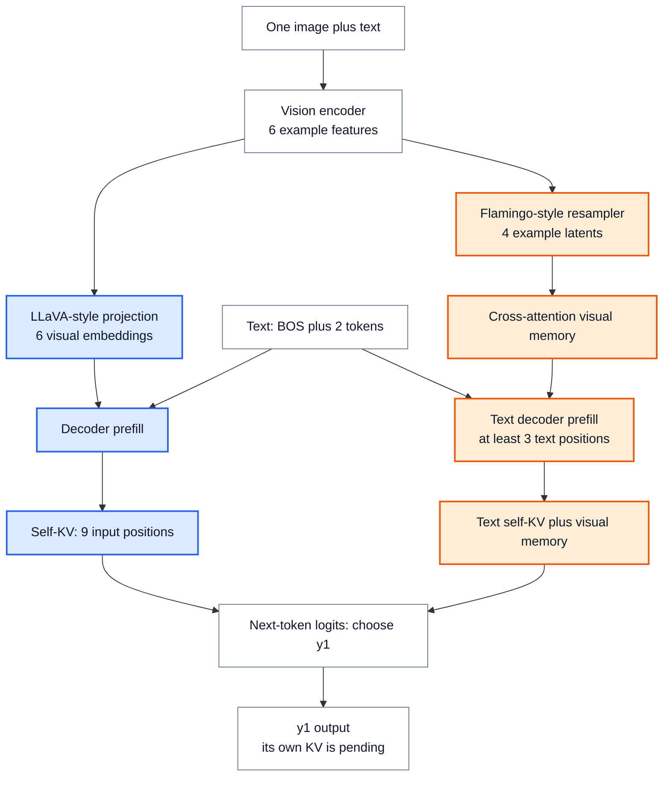

# 多模态推理：媒体编码、运行状态与联合调度

> **文献基线**：[Visual Instruction Tuning（LLaVA），arXiv:2304.08485v2](https://arxiv.org/pdf/2304.08485v2)（2023-12-11，§4.1、Fig. 1、Eq. (1)）；[Flamingo，arXiv:2204.14198v1](https://arxiv.org/pdf/2204.14198v1)（2022-04-29，§3.1.1–3.1.3、Fig. 4–6）。来源索引见 `raw/01_theory/05_inference/Visual_Instruction_Tuning-2304.08485.md`、`Flamingo-2204.14198.md`。
> **主题**：沿媒体输入、编码/连接器、语言前向、缓存、调度与输出 token 的路径，区分视觉 embedding 注入和 cross-attention 两类运行状态。
> **适用范围**：讲通用执行接口与状态边界；具体编码器、图像裁剪、位置编码和模型专用模板由模型页或固定引擎页解释。文中的 6 个特征、4 个 latent 是教学数量，不是 LLaVA 或 Flamingo 的实际配置。
> **最近更新**：2026-09-17。新建原理页；以两个原始架构对照核验缓存归属。

## 1. 一个媒体标记背后有多段计算

文本请求通常先分词，再让 decoder 对已知前缀做 prefill；媒体请求还需读取和预处理图片/视频/音频，将其转为模型接受的表示。一个用户层的 `image` 占位符只指向**媒体位置或附件引用**，不直接说明像素编码耗时、patch 数、视觉 latent 数或语言模型的序列长度。LLaVA §4.1 的图像路径先由 CLIP 视觉编码器得到网格特征 $Z_v=g(X_v)$，再用线性投影 $H_v=WZ_v$ 映射到语言 embedding 维度，形成视觉 token 序列；它并没有说“一个图像标记等于一个视觉 token”。Flamingo §3.1.1 则将可变的视觉特征经 Perceiver Resampler 映射为固定数量视觉 latent，再由语言模型中的门控 cross-attention 读取。[来源：LLaVA §4.1 Eq. (1)](https://arxiv.org/pdf/2304.08485v2)；[Flamingo §3.1.1–3.1.2](https://arxiv.org/pdf/2204.14198v1)。

因此服务接口至少要交接：媒体内容和预处理规格、编码结果或其可复用句柄、它在文本中的顺序/位置、语言模型需要的表示形状，以及请求何时具备进入语言前向的全部依赖。具体张量形状受模型连接器支配，不能从 API 中一个 `image_url` 或模板中的一枚标记直接推断。[来源：Flamingo §3.1.3、Fig. 6](https://arxiv.org/pdf/2204.14198v1)。

## 2. 两种常见连接范式，缓存账不同

| 阶段 | 视觉 embedding 注入：LLaVA 式 | 外部视觉记忆：Flamingo 式 |
|---|---|---|
| 媒体编码与连接 | 网格特征经线性投影，得到语言维度的一串视觉 embedding | 网格/时空特征经 Perceiver Resampler，得到视觉 latent 集 |
| 语言层读取 | 视觉 embedding 与文本 embedding 作为同一 decoder 输入序列的相应位置 | 文本序列运行自身因果 self-attention；插入的 cross-attention 用文本 query 读取视觉 latent K/V |
| decoder 自注意力 KV | 已处理的视觉位置和文本位置一起占据相应的 self-KV 历史 | self-KV 主要对应文字序列；视觉 latent 是 cross-attention 输入，不应机械地算作 self-KV 前缀位置 |
| 另一个可保留状态 | 媒体编码结果可供同一请求或有效缓存复用 | 编码/Resampler 输出，以及实现若选择缓存时的 cross-attention K/V；是否实际缓存由实现决定 |

第一列是从 LLaVA 的投影与视觉 token 序列得到的执行路径；第二列由 Flamingo 的门控 cross-attention 结构直接约束。两类模型的视觉信息都影响输出，但**占用的 decoder 自注意力位置不同**。某些更新模型还会混合更多路径；本表只给两篇来源支持的两种范式，不能把两者压成一个统一“图片 token 公式”。[来源：LLaVA §4.1](https://arxiv.org/pdf/2304.08485v2)；[Flamingo §3.1.1–3.1.3、Fig. 5–6](https://arxiv.org/pdf/2204.14198v1)。

## 3. 一张图和一段文本的可复算位置账

设**教学请求**是一张图加两个文本 token `问`、`?`，前面还有 `BOS`。仅为核对计数，假定图像编码器给出 $6$ 个网格特征。对 LLaVA 式线性投影，序列维不缩减，于是得到 $6$ 个视觉 embedding；若它们排在 `BOS` 后、两个文本 token 前，送入 decoder prefill 的输入顺序为

`[BOS, v1, v2, v3, v4, v5, v6, 问, ?]`，共 $1+6+2=9$ 个位置。

prefill 完成后，相应层的 decoder self-KV 已覆盖这些 **9 个已处理位置**；末位置 logits 选出首枚回答 token $y_1$，但 $y_1$ 自己的 KV 尚未存在。继续生成时才把 $y_1$ 作为下一次 decoder 输入。这与纯文本的 [[10_prefill_decode_analysis|prefill/decode 提交边界]]相同，只是前缀中包含视觉 embedding。若某模型用裁剪、合并、下采样或特殊位置规则，数字 9 必须重新按那个模型的实际展开算，不能从本教学例迁移。[来源：LLaVA §4.1 Eq. (1)](https://arxiv.org/pdf/2304.08485v2)。

若改走 Flamingo 式路径，**教学地假定**同样 6 个视觉特征经 Resampler 得到 4 个 latent：decoder 的文本自注意力至少处理 `BOS, 问, ?` 这 3 个文字位置，视觉的 4 个 latent 保存在 cross-attention 可读的外部表示中。真实 Flamingo 还在文字序列插入图像/段落专用标记，故实际文本位置数须按模板另加；此处的 3 只是最小教学文本计数。它的视觉工作量仍涉及编码 6 个特征、Resampler 产出 4 个 latent，**不**是“1 个占位符＝1 次图像计算”或“4 个 latent＝4 个 decoder self-KV 位置”。[来源：Flamingo §3.1.1–3.1.3、Fig. 6](https://arxiv.org/pdf/2204.14198v1)。

**图的规格**：同一张图进入两条连接路径；左路显示 6 个视觉 embedding 加 3 个文本位置组成 9 位 decoder 前缀，右路显示 6 个编码特征压成 4 个 cross-attention latent、文本自注意力至少 3 位；两路最后都从已处理前缀的 logits 选出尚未写 KV 的 $y_1$。

## 4. 编码、prefill、decode 要按依赖联合调度

对依赖媒体的文本位置，语言前向必须等相应媒体表示可用；但媒体加载/编码、其他请求的 prefill 和 decode 可在资源允许时并行排队。服务调度的成本账不能只报文本 token 数：还要把图像预处理/encoder、连接器、视觉 latent 存储、语言 prefill 长度或 cross-attention 读量、后续每步 decode、媒体与语言张量跨设备传送分开计。若编码结果在不同设备，拷贝完成是进入相应语言计算的条件；若语言模型按位置分块，视觉位置与文本位置的顺序和可见性仍须保持。这里是从两种架构的数据依赖得出的服务排程要求，不声称论文报告了某一统一调度算法。一般批调度与阶段成本见 [[15_continuous_batching_analysis|Continuous Batching]] 和 [[11_inference_cost_model_analysis|成本模型]]。

Flamingo §3.1.3 进一步为交错图文规定文本位置可见哪个此前媒体的 latent；这说明“编码完成”仍不等于“所有文本位置都能读所有图片”。媒体索引、位置、mask 和生成状态须一起传给语言层。LLaVA 式注入路径则需按该模型的位置/注意力规则建立包含视觉 embedding 的前缀，不能把它替换为同长度的空白文本 token。[来源：Flamingo §3.1.3、Fig. 6](https://arxiv.org/pdf/2204.14198v1)；[LLaVA §4.1](https://arxiv.org/pdf/2304.08485v2)。

## 5. 前缀身份与变长媒体成本

缓存命中必须以会改变结果的**计算身份**为准：媒体内容或其稳定摘要、裁剪/采样及预处理版本、encoder/connector/语言模型权重版本、媒体与文本的顺序、位置及可见性规则。仅有相同的文字 `"请描述这张图"` 或相同的 `<image>` 标记，并不意味着前缀 KV 或视觉 latent 相同。对注入式模型，要核对视觉 embedding 形成的 decoder 前缀；对 cross-attention 模型，要分别核对文字 self-KV 和视觉记忆及其 mask。此处是正确性推论；实际 hash、分页、淘汰和多租户隔离属于实现与 [[14_prefix_caching_analysis|Prefix Caching]] 的缓存合同。

图像可有多裁剪或不同分辨率，视频按帧采样并引入时间次序，音频可分块且有时长维度。媒体项目数、编码器输入单元数、连接后 latent 数、decoder 序列位置数与跨注意力访问量是**不同计数**。Flamingo 本身对视频按帧编码并经 Resampler，足以说明“一个视频附件”不能作为计算量单位；但音频路径不在 LLaVA/Flamingo 两篇视觉论文的验证范围内，音频分块成本在这里仅作通用接口推论，不宣称被这两篇来源实测。[来源：Flamingo §3.1.1](https://arxiv.org/pdf/2204.14198v1)。实际 TTFT 与吞吐应按媒体长度、预处理、模型架构和硬件版本实测。

## Related Pages

- [[10_prefill_decode_analysis|Prefill / Decode]] — 核对首枚输出 token 何时写入自身 KV。
- [[12_kv_cache_analysis|KV Cache 基础]] — 计算 decoder 已处理位置的自注意力 KV 容量和生命周期。
- [[14_prefix_caching_analysis|Prefix Caching]] — 核对跨请求复用所需的前缀计算身份。
- [[15_continuous_batching_analysis|Continuous Batching]] — 理解媒体编码完成后请求进入语言批次的调度边界。
- [[02_engineering/03_infer_frameworks/vllm/15_vllm_multimodal_execution_analysis|vLLM 多模态执行]] — 查看某一固定引擎版本如何处理占位符、媒体表示与缓存。
