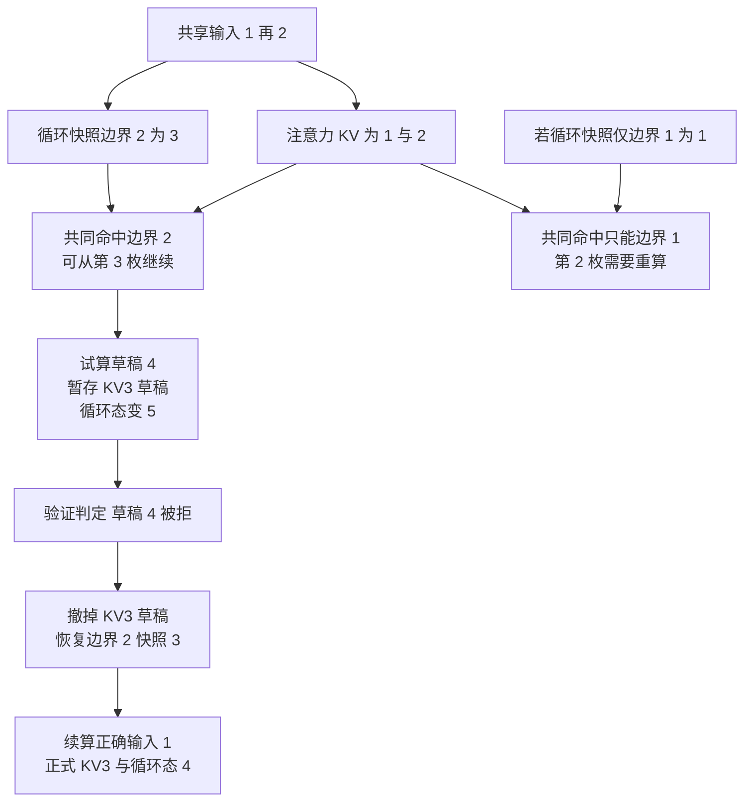

# 混合模型推理：KV 与循环状态协作

> **文献基线**：[Jamba，arXiv:2403.19887v1](https://arxiv.org/pdf/2403.19887v1)（2024-03-28；§1–3、Fig. 1；索引 `raw/01_theory/05_inference/Jamba-2403.19887.md`）；[Mamba，arXiv:2312.00752v1](https://arxiv.org/pdf/2312.00752v1)（2023-12-01；§2–3、Eqs. (2a)–(2b)、Algorithm 2；索引 `raw/01_theory/05_inference/Mamba-2312.00752.md`）。
> **源码基线**：`vllm-project/vllm@199cb9b964822e59ab9b58d88e7be31eb419a2ae`（`main`，2026-09-07）；仅在 §7 引用其具体实现，路径与符号列于该节。
> **主题**：用一个注意力层与一个循环层的共同前缀，解释两类状态如何同步推进、复用、拒绝与恢复；再用固定引擎源码说明共同命中和快照预算怎样落地。
> **适用范围**：混合模型的推理运行状态与生命周期。Jamba/Mamba 的模型结构、选择性 SSM 数学细节归模型页；分块预填充、一般前缀缓存和投机抽样各有前置页。标量例子为教学状态机，不是 Jamba 权重或 vLLM kernel 的逐值模拟。
> **最近更新**：2026-09-17。新建原理页，逐点核验论文 v1 与固定源码。

## 1. 为什么一个“已算前缀”需要两份证据

Jamba 把 Transformer 注意力层与 Mamba 层混排（Jamba §2、Fig. 1）。注意力层在继续生成时需要可读取的历史 K/V；循环层只要足以从某个边界继续更新的内部状态。两者都属于同一请求的因果历史，却有不同的**保留形状**：前者按位置累积或按窗口保留，后者把已走过的序列折入定长状态。[Jamba §1–2](https://arxiv.org/pdf/2403.19887v1)；[Mamba §1–2](https://arxiv.org/pdf/2312.00752v1)

由此得到本页的运行不变量：若请求声称“边界 $t$ 之前已计算，可从 $t+1$ 继续”，那么**每个会在下一步读取过去的层**都必须有与同一 token 前缀一致、已经可读的状态。只有注意力 KV 命中到 $t$，而循环层状态只对应 $t-1$，不能直接跳过第 $t$ 枚 token。要么共同命中退到 $t-1$，要么从更早状态把缺的步骤重算出来。这是由逐层因果依赖推出的推理合同，不是 Jamba 论文提供的通用缓存 API。

## 2. 三类历史状态不是同一种“块”

| 层类型 | 继续一步时读取 | 对长度 $L$ 的保留形状 | 丢失较早内容后的后果 |
|---|---|---|---|
| 全注意力 | 所有仍在注意力范围内的历史 K/V | 在无截断时约 $L m_{\mathrm A}$ 字节；$m_{\mathrm A}$ 是该类层每 token 的 KV 字节 | 若位置仍可被注意而 KV 已丢，不能凭最后一个 KV 恢复历史 |
| 滑动窗口注意力 | 最近至多 $W$ 枚的位置 K/V | 稳态约 $Wm_{\mathrm W}$，还要计块对齐和进行中的写入 | 窗口外历史本来不可直接读取；窗口内缺失仍会使续算不完整 |
| Mamba 式循环层 | 当前 SSM 状态，以及该 block 需要的短卷积等运行状态 | 每请求一份状态约 $m_{\mathrm R}$；每保留一个可复用快照再付约 $m_{\mathrm R}$ | 只存当前态可向前走，不能假定能从它反推出任意早期边界 |

$m_{\mathrm A},m_{\mathrm W},m_{\mathrm R}$ 只是教学字节账，未规定具体模型的头数、state shape、dtype 或 padding。Mamba §2 Eq. (2a) 先给出 $h_t=\bar A h_{t-1}+\bar B x_t$ 的循环形式；§3.2 Algorithm 2 再使若干参数依赖输入，形成随 token 变化的更新。因而不能把保存的一份状态解释为“所有历史 token 的独立 KV”。Mamba Fig. 3 的 block 还有卷积路径，实际恢复点必须包含实现所需的完整运行状态。[Mamba §2、§3.2、§3.4](https://arxiv.org/pdf/2312.00752v1)

全注意力与窗口注意力可以在同一混合模型中并存；本页的贯穿例只用一个全注意力层加一个循环层。若替成窗口层，以下同步边界规则照旧，注意力侧只需确保该边界下一步可访问的窗口内容齐全。窗口的可达范围见 [[12_kv_cache_analysis|KV Cache 基础]]，具体窗口保留规则应按模型与引擎的实际实现核对。

## 3. 同一个输入怎样跨 token 和 chunk 前进

定义**教学模型**：注意力层为每个位置保存一对抽象 $(K_t,V_t)$；循环层把其输入投影简写为整数 $u_t$，用饱和更新 $s_t=\min(5,s_{t-1}+u_t)$，初态 $s_0=0$。此式只展示不可逆的状态演进，不代表 Mamba 的参数或非线性。注意力层和循环层实际按网络层序执行；它们在**同一 token 边界**都完成后，请求才可继续下一 token。取 $u_1=1,u_2=2$：

| 完成边界 | 注意力层可读历史 | 循环层状态 | 下一步可否从该边界继续 |
|---|---|---:|---|
| 0 | 空 | $s_0=0$ | 可以，首 token 尚未处理 |
| 1 | $(K_1,V_1)$ | $s_1=\min(5,0+1)=1$ | 两类状态齐全，可以 |
| 2 | $(K_1,V_1),(K_2,V_2)$ | $s_2=\min(5,1+2)=3$ | 两类状态齐全，可以 |

若预填充把 `1,2` 合在一个 chunk 运行，输出端仍必须有**精确的边界 2 状态**，并按模型规定产生边界 1、2 的注意力 KV。Mamba 的选择性扫描把长段更新并行化，但其结果仍表示同一顺序的状态转换；实现若只暴露最终 $s_2$，便不能据此宣布边界 1 可复用。chunk 的尺寸改变调度和中间状态的物化成本，不改变上述因果边界。[Mamba §3.2–3.3、Algorithm 2](https://arxiv.org/pdf/2312.00752v1)；chunk 调度背景见 [[16_chunked_prefill_analysis|分块预填充]]。

## 4. 前缀复用要取共同可继续边界

设另一请求也从 `1,2` 开始。若注意力侧保存了两个位置的 KV，循环侧保留了**边界 2 的完整快照** $s_2=3$，且身份键、模型权重、位置及状态格式都匹配，请求可以跳过这段计算，从第 3 枚继续。若循环侧只保留边界 1 的 $s_1=1$，则边界 2 的 KV 虽在，却不足以从 3 直接运行循环层；可以把共同命中降到边界 1，并重算第 2 枚。能否局部保留已有注意力 KV 再单独补算循环层，取决于层序、输入是否仍可重建和引擎支持，不能由“注意力命中 2”推出。

对可复用边界集合 $H_{\mathrm A}$（注意力）与 $H_{\mathrm R}$（循环），共同命中是所支持的、身份一致的交集中的最大边界：

$$
t_{\mathrm{hit}}=\max\bigl(H_{\mathrm A}\cap H_{\mathrm R}\bigr).
$$

这里的集合成员必须是**可供继续执行的完整状态**，不是某个块号恰好存在。若保留 $k$ 个循环快照，额外状态字节约 $k m_{\mathrm R}$，加元数据与对齐；完全不保存旧快照虽节省内存，却让任意旧前缀无法直接命中。全注意力 KV 的共同前缀 hash 只证明其自己的内容身份，不能替循环状态提供边界值。Jamba/Mamba 论文给出两类层与循环更新，交集规则是本页据此作的系统推导；一个具体引擎如何判定见 §7。[Jamba §2](https://arxiv.org/pdf/2403.19887v1)；[Mamba §2](https://arxiv.org/pdf/2312.00752v1)

## 5. 草稿拒绝时，删除 KV 不等于恢复循环态

沿同一教学例，从已提交边界 2 试算草稿 $u_3=4$。注意力层暂形成 $(K_3^{\mathrm d},V_3^{\mathrm d})$，循环层变为 $s_3^{\mathrm d}=\min(5,3+4)=5$。若验证拒绝草稿，不能让下一轮读到该 KV，也不能让循环层以 5 为已提交状态。注意力侧可以按位置撤掉未提交的第 3 枚；循环侧必须**恢复快照 $s_2=3$ 或从更早可信边界重算**。随后若正确续算的第 3 枚为 $u_3=1$，应得到 $s_3=\min(5,3+1)=4$ 与新 $(K_3,V_3)$。

为什么不能从草稿态 5 “倒扣” 4？饱和更新的输出 5 可能来自旧态 1、2、3、4、5；仅给定输出 5 与草稿输入 4，并不能唯一确定旧态。真实 Mamba 不是这个饱和函数，但其运行状态同样不是按 token 存储的可任意弹栈 KV。**可回退性必须由保存的边界状态、重算能力或专门的多版本执行合同提供**，不能只从“状态大小固定”推断。这里描述的是推理状态一致性；草稿接受率、残差抽样与目标分布证明见 [[23_speculative_decoding_analysis|投机解码基础]]。[Mamba §2、Eq. (2a)](https://arxiv.org/pdf/2312.00752v1)

**原理图规格**：左侧从两枚共享前缀到共同可继续边界 2，分别标出 KV 两项与循环快照 3；右侧草稿 4 产生 KV3 草稿和饱和态 5，拒绝箭头同时撤掉 KV3 并恢复快照 3，再续算输入 1 得到 KV3 正式项与状态 4。下支路表示若只保留边界 1 状态，共同命中回退至 1。图中的状态值和前缀都与本页表格一致。

图只推导**拒绝后的恢复**；接受草稿会继续提交另一条状态路径。实际投机实现可能分配额外 scratch 状态或分步验证；不应把图当作任何引擎固定内存布局。恢复必须发生在下一次读该请求状态之前，且不能把不同分支的 KV、循环态混在同一个已提交边界。

## 6. 请求生命周期的共同完成点

| 阶段 | 注意力侧必须确定 | 循环侧必须确定 | 可观察的完成条件 |
|---|---|---|---|
| 入场与预算 | 历史 KV 的空间或窗口配额 | 当前态、必要快照和投机临时态的字节 | 两种资源均可分配，才能承诺请求可前进 |
| 预填充或续算 | 写入正确位置的 KV | 顺序推进至同一边界 | 两类状态都与已提交 token 前缀相符且对下个读者可见 |
| 前缀命中 | 需要的 KV 块身份和内容一致 | 同边界完整快照身份和内容一致 | 取共同可继续边界，不把单组命中当全模型命中 |
| 拒绝与分叉 | 草稿分支 KV 不进入正式路径 | 恢复旧快照或按可信前缀重算 | 新分支的第一步从同一已提交边界开始 |
| 结束与释放 | 无仍在使用的 KV 引用 | 无仍在使用的快照/当前态引用 | 后续请求不会读到这条请求的旧状态 |

“状态小”不表示生命周期简单。$L m_{\mathrm A}+m_{\mathrm R}$ 只算一条活跃请求的主要状态；如果为了共享前缀、投机分叉或外部转移保留 $k$ 个循环快照，预算变成近似 $L m_{\mathrm A}+(k+1)m_{\mathrm R}$，还要加对齐、临时写入和传输成本。若内存不够，具体系统可选择减少快照、回退命中、重算或拒绝入场；哪种发生取决于实现，不能由模型论文推定。

## 7. 一个固定引擎如何表达这些边界

以下只描述本页冻结的 `vllm-project/vllm@199cb9b964822e59ab9b58d88e7be31eb419a2ae`，不把它归于 Jamba/Mamba 论文的原生实现。容量入口是 `vllm/v1/kv_cache_interface.py::MambaSpec.max_memory_usage_bytes`；命中调用路线是 `vllm/v1/core/kv_cache_coordinator.py::HybridKVCacheCoordinator.find_longest_cache_hit` → `vllm/v1/core/single_type_kv_cache_manager.py::MambaManager.find_longest_cache_hit` → 协调各组返回值。快照写入/保留另见 `MambaManager.reachable_block_mask`、`MambaManager.cache_blocks`。

`MambaSpec.max_memory_usage_bytes` 对 `all` 预算 $\lceil L/B\rceil+n_{\mathrm{spec}}$ 页，对 `align` 预算 $2+n_{\mathrm{spec}}+n_{\mathrm{prefill\,ckpt}}$ 页，其他模式预算 $1+n_{\mathrm{spec}}$ 页；每页由具体 state shape/dtype 计字节。这里 $B$ 是该 spec 的块大小，三种模式的**页数上限**不是每 token 都保存一份状态的声明。`MambaManager.reachable_block_mask` 又根据可到达边界决定哪些状态快照保留，说明命中能力要付快照字节。[固定源码：`vllm/v1/kv_cache_interface.py::MambaSpec.max_memory_usage_bytes`](https://github.com/vllm-project/vllm/blob/199cb9b964822e59ab9b58d88e7be31eb419a2ae/vllm/v1/kv_cache_interface.py)；[`vllm/v1/core/single_type_kv_cache_manager.py::MambaManager.reachable_block_mask`](https://github.com/vllm-project/vllm/blob/199cb9b964822e59ab9b58d88e7be31eb419a2ae/vllm/v1/core/single_type_kv_cache_manager.py)

`MambaManager.find_longest_cache_hit` 查找适合继续执行的单个循环边界态；`HybridKVCacheCoordinator.find_longest_cache_hit` 再对各组候选长度做协调，若一组缩短就重新检查，最后把全注意力组的块截到协调后的共同长度。这与 §4 的交集思想对应，但真实代码还处理块对齐、部分 hash、EAGLE 和不同组，不能由教学集合式推出其全部分支。[固定源码：`MambaManager.find_longest_cache_hit`](https://github.com/vllm-project/vllm/blob/199cb9b964822e59ab9b58d88e7be31eb419a2ae/vllm/v1/core/single_type_kv_cache_manager.py)；[`HybridKVCacheCoordinator.find_longest_cache_hit`](https://github.com/vllm-project/vllm/blob/199cb9b964822e59ab9b58d88e7be31eb419a2ae/vllm/v1/core/kv_cache_coordinator.py)。逐字段、调度和块生命周期归 [[02_engineering/03_infer_frameworks/vllm/08_vllm_kv_cache_management_analysis|vLLM KV Cache 管理]]。

## Related Pages

- [[12_kv_cache_analysis|KV Cache 基础]]：提供注意力 KV 的 token 边界、容量和可读性合同。
- [[14_prefix_caching_analysis|前缀缓存]]：解释共享前缀的身份键与缓存命中，供本页扩展到跨层共同命中。
- [[16_chunked_prefill_analysis|分块预填充]]：解释 chunk 为什么改变调度与物化点，却不改变因果前缀。
- [[23_speculative_decoding_analysis|投机解码基础]]：承接草稿接受/拒绝的分布规则，本页只管混合状态回滚。
- [[02_engineering/03_infer_frameworks/vllm/08_vllm_kv_cache_management_analysis|vLLM KV Cache 管理]]：追踪固定源码里混合组、Mamba 快照和回收的实现。
