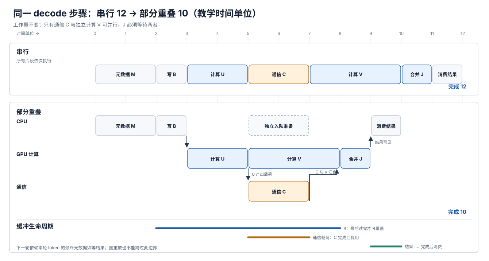

# 推理执行优化：融合、编译、CUDA Graph 与重叠

> **文档基线**：[vLLM V1 优化、编译、融合、CUDA Graph 与 DBO 文档 v0.20.1](https://docs.vllm.ai/en/v0.20.1/configuration/optimization/)（详见来源索引 `raw/01_theory/05_inference/vLLM_Inference_Execution-v0.20.1.md`）；[PyTorch CUDA semantics 2.8](https://docs.pytorch.org/docs/2.8/notes/cuda.html)（“CUDA streams”“CUDA Graphs”，来源索引 `raw/01_theory/05_inference/PyTorch_CUDA_Graphs-2.8.md`）。于 2026-09-17 核读。
> **主题**：从一次 decode 的 CPU 准备、设备执行、通信和结果交付出发，判断四类优化分别缩短哪段关键路径，并保留数据就绪、地址复用和完成边界。
> **适用范围**：这是推理应用层的组合分析。编译器 guard、代码生成与 CUDA Graph 内部 API 的完整原理归 PyTorch 工程域；这里仅用 vLLM v0.20.1 说明一种版本化实现。时间算例是依赖关系演算，非实测。
> **最近更新**：2026-09-17。新建原理页；逐项区分来源事实、教学假设与由依赖关系得到的推断。

## 1. 一次 decode 先经过 CPU 与设备的交接

在第 $n$ 次 decode 前，调度器要确定本轮哪些请求可运行、每个请求的 token 与 KV 位置、block table、输入长度及可用的 batch 形状；模型执行后产生新 KV、logits 或采样结果，输出处理再决定下一轮是否继续。[[15_continuous_batching_analysis|连续批处理]]负责准入/抢占的请求状态机，[[11_inference_cost_model_analysis|成本模型]]负责 TTFT、ITL 与资源口径；本页只看已选中一个执行步的关键路径。

CPU 侧不仅有“发一个 kernel”：调度、输入处理、输出处理和流式返回都耗 CPU；GPU 忙碌时也可能因下一步元数据未准备好而出现设备空档。vLLM v0.20.1 的优化指南明确把 CPU 不足与调度延迟、输入/输出处理列为性能因素。反过来，若瓶颈已经是长 KV 读取、GEMM 或跨卡通信，压缩 CPU launch 本身未必显著缩短 ITL。[来源：vLLM “CPU Resources for GPU Deployments / Performance Impact”](https://docs.vllm.ai/en/v0.20.1/configuration/optimization/)；后句是关键路径推断。

把工作拆为四种费用，才能知道何处可优化：**每次发射/调度**（Python、C++、driver 和元数据）、**设备计算与中间读写**、**跨设备通信**、**结果同步与复用等待**。它们并非永远简单相加：某些片段在不同流或 CPU/GPU 上可重叠，但有依赖的片段必须等前驱完成。PyTorch 2.8 的 CUDA 流文档规定同一流按序，跨流允许并发且须显式同步；“允许”并不保证硬件能同时充分执行。[来源：PyTorch “CUDA streams”](https://docs.pytorch.org/docs/2.8/notes/cuda.html)。

## 2. 融合、编译与图捕获减少不同的工作

| 手段 | 改变的对象 | 推理中的可能收益 | 必须付出的代价/边界 |
|---|---|---|---|
| 算子/内核融合 | 相邻算子之间的中间张量读写和部分独立 kernel 发射 | 小 batch、短 decode 中，减少 launch 与中间结果往返 | 模式需匹配；dtype、backend、硬件、token 数会限制可用性；融合后还须核数值与基准 |
| 编译 | 前向图的可见片段、specialization、kernel 选择 | 针对可复用形状产生更合适的执行片段，或触发专用融合 | 首次编译、调优与缓存占用；形状/guard 变化可能增加变体或退回通用路径 |
| CUDA Graph | 已捕获的一组设备工作及其参数/地址 | 重放时省去每个 kernel 的 CPU 参数准备与 dispatch | 捕获/预热时间、额外保留内存、固定地址与控制流；backend 或 batch 不兼容时不能强行 full capture |
| 异步重叠 | 独立工作在 CPU/GPU、计算/通信或不同流上的时序 | 将一部分非关键路径时间藏在别的工作后面 | 必须有真实独立性、可并发资源与显式完成事件；缓冲不能提早复用 |

编译可以**产生**融合内核，也可以把模型切成可捕获片段，但“已编译”不等于“整个模型都被图捕获”，更不等于“通信已重叠”。vLLM V1 的一个版本化例子是把图按 attention 边界拆开：attention 可保持 eager，attention 之间的片段由编译器处理并做 piecewise CUDA Graph；这一安排给不兼容 full graph 的 attention backend 留出执行位置。[来源：vLLM “torch.compile integration / Computation Graph Processing, Cudagraph Capture”](https://docs.vllm.ai/en/v0.20.1/design/torch_compile/)；[“CUDA Graphs / Motivation”](https://docs.vllm.ai/en/v0.20.1/design/cuda_graphs/)。

**具体融合应逐个查条件。** 例如 vLLM v0.20.1 文档的 AllReduce→RMSNorm（可含 residual/量化）尝试合并 TP collective 与后继算子，但其文档限定 NVIDIA Hopper/Blackwell、FlashInfer、较小 token 数，并标注某些 TP+DP/TP+PP 组合的问题；RoPE→KV-cache 写入融合在该版本仅限 ROCm/AITER。把这些条目抽象为“所有 GPU 默认融合”会丢掉真正的适用范围。融合是否划算要在相同模型、batch、硬件上对照测量，不能把文档各项速度百分比相加。[来源：vLLM “Fusion torch.compile passes / Quick Reference, Fusion Details”](https://docs.vllm.ai/en/v0.20.1/design/fusions/)。

vLLM v0.20.1 还把优化级别用作**启动时间与执行性能**的权衡：`-O1` 包含较快编译、融合与 PIECEWISE 图，默认 `-O2` 增加编译范围、融合与 FULL_AND_PIECEWISE 图，`-O3` 在该版本暂与 `-O2` 相同。其 `torch.compile` 集成文档说明将编译工作安排在接收请求前，并缓存产物，以避免某个用户请求触发编译而出现延迟尖峰；专用 `compile_sizes` 也可能增加首次调优时间。[来源：vLLM “Optimization Levels”](https://docs.vllm.ai/en/v0.20.1/configuration/optimization/)；[“torch.compile integration / Compilation Cache, Computation Graph Compilation”](https://docs.vllm.ai/en/v0.20.1/design/torch_compile/)。

## 3. 动态 batch 为什么需要图选择与静态输入缓冲

连续批处理让请求数、prefill/decode 混合、序列长度持续变化。编译器可能用动态形状处理一段范围；CUDA Graph 重放则要求被捕获的 kernel、参数和指针地址维持一致。PyTorch 2.8 的示例是在每次重放前把新数据写入**长期存活的固定输入地址**，重放后从固定输出地址读取；CPU 工作不属于被捕获内容，数据相关的动态控制流也不能直接放进同一图。[来源：PyTorch “CUDA Graphs / Why CUDA Graphs?, PyTorch API, Constraints”](https://docs.pytorch.org/docs/2.8/notes/cuda.html)。

因此，动态形状处理与图捕获是**不同层次的复用**：前者决定生成的代码能覆盖哪些 batch/token 范围；后者决定当前 batch 是否有对应的已捕获执行图。vLLM v0.20.1 的图分派键含 `num_tokens`、`num_reqs`、`uniform`、`has_lora`，会区分统一的 decode batch 与 prefill/混合 batch；PIECEWISE 可让不兼容算子留在 eager，FULL_DECODE_ONLY 只捕获统一 decode，FULL_AND_PIECEWISE 按 batch 类型选择。只有在 piecewise compilation 可用等条件下，文档才把后者列为默认；attention backend 的 full graph 能力还要另查。[来源：vLLM “CUDA Graphs / CudagraphModes, BatchDescriptor, CUDA Graphs Compatibility of Attention Backends”](https://docs.vllm.ai/en/v0.20.1/design/cuda_graphs/)。

输入缓冲的顺序是：**上一次读完该地址 → 写入本轮 token/位置/block metadata → 本轮图重放读取 → 设备写出 KV 与结果 → 消费者等完成后读取结果**。可把一批请求 padding 到已捕获尺寸，但 padding 也让设备做额外无效工作；捕获更多尺寸会占更多图内存并延长启动。vLLM v0.20.1 提供 `cudagraph_capture_sizes` 控制捕获尺寸，而 FULL_AND_PIECEWISE 被文档标成内存及捕获时间最高的模式。这些都是候选权衡，不是“batch 变化就不能用图”的绝对结论。[来源：vLLM “torch.compile integration / Cudagraph Capture”](https://docs.vllm.ai/en/v0.20.1/design/torch_compile/)；[“CUDA Graphs / CudagraphModes”](https://docs.vllm.ai/en/v0.20.1/design/cuda_graphs/)；padding 成本是执行量推断。

## 4. 同一步 decode：从串行到有依赖的部分重叠

以下为**教学假设**，时间单位无设备含义，不对应 vLLM 的具体 kernel：一轮已选中的 decode 需要 CPU 整理元数据 $M_n$（2 单位）、更新静态输入缓冲 $B$（1）、GPU 前段 $U$（2）、收到 $U$ 的载荷后进行通信 $C$（2）、与 $C$ 无数据依赖但仍读 $B$ 的 GPU 片段 $V$（3）、同时依赖 $C,V$ 的合并片段 $J$（1），最后 CPU 消费设备结果（1）。$U$ 与 $V$ 的顺序在这个算例里仍是 $U$ 后启动 $V$；只有 $C$ 与 $V$ 允许并行。$C$ 可能代表 TP/EP 数据交换，假设这里具备独立计算和独立资源；不能从这个教学图推定普通 dense 模型实际有同样的可重叠片段。

| 执行约束 | 串行时间区间 | 允许 $C$ 与 $V$ 重叠时 | 必须等待的原因 |
|---|---|---|---|
| CPU 准备 $M_n$、写 $B$ | $[0,2)$、$[2,3)$ | 相同 | 本轮 GPU 输入尚未就绪 |
| $U$ | $[3,5)$ | 相同 | 消费 $B$，产生 $C$ 的载荷 |
| $C$ | $[5,7)$ | $[5,7)$ | 等 $U$ 的载荷；通信缓冲保留至 7 |
| $V$ | $[7,10)$ | $[5,8)$ | 算例中与 $C$ 独立；仍读取 $B$ 至 8 |
| $J$ | $[10,11)$ | $[8,9)$ | 等 $C$ 和 $V$ 都完成 |
| CPU 消费结果 | $[11,12)$ | $[9,10)$ | 设备结果在 $J$ 完成前不可见 |

串行总长 $2+1+2+2+3+1+1=12$；在**完全重叠且无额外调度成本**的教学条件下，$J$ 的最早开始点为 $\max(7,8)=8$，结束 9，CPU 消费至 10，总长 10。只省了 $C$ 与 $V$ 重叠的 2 单位，前驱 $U$、合并 $J$ 和结果消费没有被“异步”消除。真实硬件若通信与计算争用同一资源、存在额外同步/切分/缓冲费用，总长可落在两者之间，甚至超过 12；数字只验证依赖图的最早完成时间。

**图的规格**：上半串行条带、下半重叠条带使用相同 $M_n,B,U,C,V,J$ 工作量；箭头从 $U$ 指向 $C$，从 $C,V$ 汇入 $J$。下方画 $B$、通信载荷和结果的活跃区间，标明 $B$ 在最后一次设备读完成前不可覆盖、通信载荷在 $C$ 完成前不可复用、结果在 $J$ 事件后才可消费。CPU 可在设备执行时做与本轮采样无关的下一轮准备，但需要新 token 的最终元数据仍要等结果消费。图中的时间是教学演算，非源文档基准。

vLLM v0.20.1 的 DBO 是一个**有明确适用范围**的通信重叠实证机制：在 DP+EP 部署中把 batch 分为两个 microbatch，以两个 worker thread 和 MoE 内的 yield point，尝试让一组稀疏 all-to-all 等待时另一组计算。其前提是两个 microbatch 的独立工作可并进，不能把它解释为“单个 token 的后继层无需等待本层通信”。本算例的 $C,V$ 是通用依赖演示，不宣称复刻 DBO 的两线程调度。[来源：vLLM “Dual Batch Overlap / Motivation, Introduction”](https://docs.vllm.ai/en/v0.20.1/design/dbo/)。

## 5. 缓冲地址、跨流事件和可见性是正确性条件

CUDA Graph 固定的是**地址**，不是该地址里永远保存同一批内容。输入 $B$ 必须先写新值并确认设备读到；同一地址在本轮最后一次读完成前不可被下一轮覆盖。图捕获的中间缓冲、输出缓冲也需按图的生命周期保持可用；PyTorch 2.8 说明图重放会读写相同虚拟地址，图内存池的复用有固定顺序约束。若另一个流使用缓冲，须建立等待关系并记录使用流，不能以 CPU “函数返回”当作 GPU 工作已完成。[来源：PyTorch “CUDA streams”“CUDA Graphs / Constraints, Graph memory management”](https://docs.pytorch.org/docs/2.8/notes/cuda.html)。

在算例中，$B$ 的本轮内容从写入的 $t=2$ 起，到 $V$ 最后读取完成的 $t=8$ 才可安全覆盖；$C$ 的发送/接收缓冲到 $t=7$ 才可释放或复用；$J$ 的结果在 $t=9$ 前不可让 CPU 读。对同一请求的下一轮，采样 token 与新 KV 是否就绪还会限制 $M_{n+1}$ 的最终确定。CPU 可提前做请求入队、静态参数准备等独立部分，但不能凭“已发起异步任务”跳过这些数据依赖。若采用双缓冲，可让下一轮的**独立输入**写另一个地址，代价是额外容量；它仍不能提前发起依赖本轮 token 的工作。这些是从上述 CUDA 语义和自回归因果关系推出的安全条件，不是对 vLLM 某个具体函数的源代码声称。

## 6. 瓶颈会迁移，逐层核对收益

先测同一负载下的 CPU 排队/调度、每步提交与空档、设备 kernel 时间、通信等待、内存峰值、图捕获/编译启动时间和 ITL 分布，再逐项开关优化。若 kernel 已经由 KV 读取主导，图的 launch 节省可能很小；若 fusion 删除了中间读写，后续瓶颈可能移至通信；若 `FULL_AND_PIECEWISE` 增加保留内存，KV 容量下降还可能反过来降低并发。此处是**测量设计和关键路径推断**，不代表某一模式总是更快。vLLM 的优化级别和融合文档也分别要求权衡启动/性能、按具体工作负载比较融合效果。[来源：vLLM “Optimization Levels”](https://docs.vllm.ai/en/v0.20.1/configuration/optimization/)；[“Fusion torch.compile passes / Quick Reference”](https://docs.vllm.ai/en/v0.20.1/design/fusions/)。

最小核对顺序是：确认原始结果与数值容差；记录 baseline 时间及峰值；逐个启用融合、编译、图、重叠并保存相同负载的对照；最后组合时重新测量而不相加单项收益。对图与重叠尤其要看捕获命中率、eager 回退、缓冲保留、设备完成事件和 P95 ITL。[[40_inference_benchmarking_guide|推理评测]]统一负载与统计方法；这里的重点是**完成边界和执行关键路径**。

## Related Pages

- [[11_inference_cost_model_analysis|推理性能与资源成本模型]]：统一 ITL、设备时间与内存的计量口径。
- [[15_continuous_batching_analysis|连续批处理与调度]]：解释请求就绪、KV 块归属和下一轮准入。
- [[18_efficient_attention_analysis|高效 Attention]]：解释 attention 内核为何可能受访存和形状限制。
- [[02_engineering/01_pytorch/02_compile_stack/01_dynamo/20_symbolic_shapes_guards_and_graph_reuse_analysis|PyTorch 符号形状与 guard]]：查看动态图编译的内部复用条件。
- [[02_engineering/03_infer_frameworks/vllm/20_vllm_fused_ops_and_kernels_analysis|vLLM 融合算子与内核]]：查看引擎级具体融合的实现边界。
