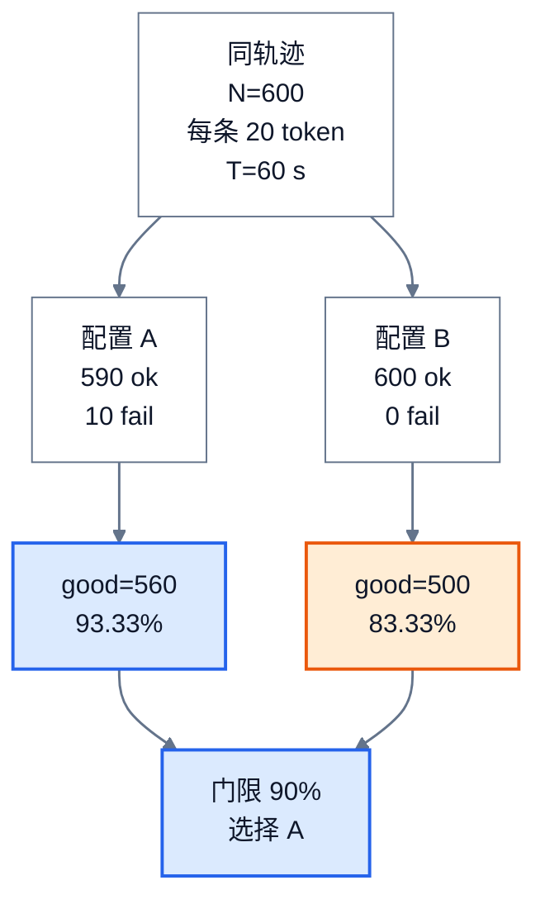

# 推理性能评测：从指标到可信结论

> **文献基线**：[MLCommons MLPerf Inference Rules](https://github.com/mlcommons/inference_policies/blob/d3eba2f21026d868ad65cdcad2bb81e4a17ce3d3/inference_rules.adoc)（2026-09-17 固定提交，§3 Scenarios）；[NVIDIA AIPerf Metrics Reference](https://docs.nvidia.com/aiperf/reference/ai-perf-metrics-reference) 与 [Load Generator Options](https://docs.nvidia.com/aiperf/benchmark-modes/load-generator-options-reference)（2026-09-17 访问快照）；[NVIDIA NIM LLM Metrics 1.0.0](https://docs.nvidia.com/nim/benchmarking/llm/1.0.0/metrics.html)。来源定位见 `raw/01_theory/05_inference/InferenceBenchmarkMethodology-20260917.md`。
> **主题**：把“更快”改写成有负载、时间戳、失败口径和 SLO 的可反驳比较；用相同请求轨迹演示原始输出吞吐与满足延迟门限的有效请求吞吐为何可能给出不同选择。
> **适用范围**：自回归 LLM 的离线和在线推理评测方法。TTFT、ITL、KV 和 Roofline 的指标与资源定义归 [[11_inference_cost_model_analysis|推理性能与资源成本模型]]；具体压测命令、监控字段和部署调参归工程页。本页的协议是教学设计，不是 MLPerf 合规提交规范。
> **最近更新**：2026-09-17。新建方法页；所有 A/B 数字为教学数据，未运行服务或 GPU 测试。

## 1. 先写决策条件，再选指标

同一配置可以提高总 tokens/s，却让更多在线请求错过首 token 门限；也可以缩短单用户间隔，却因并发不足降低总容量。因此评测先写“要选择什么”：例如在给定输入和输出长度分布、请求到达率下，找到满足 TTFT 与流内间隔 SLO 的最大成功请求率。若目标是离线批处理，则应按可用输入一次提交时的完成吞吐与成本选型，不能沿用在线的排队结论。

MLPerf Inference 规则的 Server/Interactive 和 Offline 场景分别规定了负载生成与约束形态；它说明**场景属于结果定义的一部分**，但本页的工作负载、时间窗和门限均自行声明，不冒称规则的正式测试。[来源事实：MLPerf Inference Rules §3](https://github.com/mlcommons/inference_policies/blob/d3eba2f21026d868ad65cdcad2bb81e4a17ce3d3/inference_rules.adoc) 对同一在线结论，最低限度要同时给出请求完成率、首 token 与流内延迟分布、失败率和满足门限的请求率。各指标的事件定义及 TPS 分母差异见 [[11_inference_cost_model_analysis|成本模型]]。

## 2. 冻结可比较的负载合同

比较前把模型权重版本、tokenizer/chat template、采样与停止参数、精度、并行布局、硬件、软件基线和客户端位置固定。每条请求至少保留输入 token 数、计划输出上限、实际输出数及前缀是否相同；不要只固定“平均长度”。共享前缀比例、长短请求混合与多 LoRA 身份会改变缓存命中、KV 驻留和路由；若它们是研究变量，其他字段须保持相同。质量门另用固定评测集或任务判据检查，不能以 tokens/s 代替输出质量。

**到达模型要单独冻结。** 固定请求率是按事先给出的时间表发出请求；只指定并发数而在请求完成后立刻补发，是闭环负载。后者会随服务变慢而自动降低实际到达速率，可能隐藏过载。AIPerf 官方负载参考也把 request rate、concurrency-only 与 fixed schedule 分开描述。[来源事实：AIPerf Load Generator Options，Request Scheduling Options](https://docs.nvidia.com/aiperf/benchmark-modes/load-generator-options-reference) 若同时限制并发，客户端可能在计划时刻之后才发出请求；必须保存两种时间戳并报告漂移。

| 冻结项 | 报告中必须写清的值 | 不固定时会混入的因素 |
|---|---|---|
| 模型与执行 | 权重、tokenizer、精度、kernel/引擎版本、设备及并行轴 | 计算量、输出语义和可用显存都变了 |
| 请求轨迹 | 请求总数、计划到达时刻、输入/输出长度分布、随机种子 | 队列压力与计算工作量不再相同 |
| 缓存状态 | 冷/热起点、前缀重复率、是否预热、清理方式 | 命中使实际 prefill 工作量不同 |
| 响应合同 | streaming、首 token 定义、EOS/上限、失败与超时 | TTFT、ITL 和分母不可比 |
| 质量与目标 | 质量回归集、TTFT/ITL 等 SLO、允许失败率 | 可能选出快但不可用的配置 |

## 3. 一条请求与一个窗口各记什么

对请求 $i$，记录计划到达 $t_i^{\mathrm{plan}}$、客户端实际发出 $t_i^{\mathrm{send}}$、服务端收到 $t_i^{\mathrm{recv}}$（若可观测）、首个有效 token 到达 $t_i^{\mathrm{first}}$、每次流块与 token 数、末响应 $t_i^{\mathrm{last}}$、成功/失败与原因。于是客户端被并发阀挡住的等待是 $t_i^{\mathrm{send}}-t_i^{\mathrm{plan}}$；客户端可见 TTFT 是 $t_i^{\mathrm{first}}-t_i^{\mathrm{send}}$。如果从服务端接收才计时，就应另起名字，不能与客户端 TTFT 混报。[来源事实：NIM Metrics 1.0.0，TTFT/ITL](https://docs.nvidia.com/nim/benchmarking/llm/1.0.0/metrics.html)

设窗口长度为 $T$，尝试请求数 $N$、成功且有效响应数 $N_{\mathrm{ok}}$、失败数 $N_{\mathrm{fail}}=N-N_{\mathrm{ok}}$、其中同时满足预先声明的所有延迟门限者 $N_{\mathrm{good}}$。报告：

$$
Q_{\mathrm{ok}}=\frac{N_{\mathrm{ok}}}{T},\qquad
f_{\mathrm{fail}}=\frac{N_{\mathrm{fail}}}{N},\qquad
Q_{\mathrm{good}}=\frac{N_{\mathrm{good}}}{T},\qquad
f_{\mathrm{good}}=\frac{N_{\mathrm{good}}}{N}.
$$

这里的 $Q_{\mathrm{good}}$ 是**满足预定延迟 SLO 的请求吞吐**，与 T11 可进一步加入质量门的有效输出 token 吞吐不是同一个量。AIPerf 官方 Good Request Fraction 也把错误请求计入 attempted 分母；其 Goodput 以满足所有配置 SLO 的请求数除以基准时长。[来源事实：AIPerf Metrics Reference，Goodput / Good Request Fraction / Error Request Count](https://docs.nvidia.com/aiperf/reference/ai-perf-metrics-reference) 零尝试请求时比例无定义，本页不把它写成成功率 100%。

分位数从**请求级样本**求，例如每请求 TTFT 与每请求平均 ITL 的 P50/P95/P99；不要先平均每秒结果再把秒级平均值叫 P99。失败请求从延迟分位数中剔除时，须同时保留失败率及失败原因，否则“幸存请求都很快”会掩盖超时。流块一次可带多 token，ITL 的归一化规则应随协议固定，参见 T11 的定义。

## 4. 同一轨迹的两配置：原始吞吐与 SLO 选择

以下均为**教学数据，不是实验结果**。设同一模型、设备、采样规则和 600 条请求的计划到达序列，观测窗口 $T=60$ s 并包含这些请求的全部终态。每条有效响应恰好生成 20 个 token；质量门已在独立回归中满足。在线决策门限在运行前固定：每请求客户端 TTFT 不超过 250 ms、每请求平均 ITL 不超过 50 ms，且 $f_{\mathrm{good}}\geq90\%$。两配置唯一计划改变项为一个服务端调度参数；A/B 名称不指真实产品。

| 量 | 配置 A | 配置 B | 口径 |
|---|---:|---:|---|
| 尝试 / 有效完成 / 失败 | 600 / 590 / 10 | 600 / 600 / 0 | 同一 60 s 窗口；失败保留在尝试分母 |
| 有效输出 token | 11,800 | 12,000 | 有效完成数 × 20 |
| 原始有效输出吞吐 | 196.67 token/s | 200 token/s | 有效输出 token ÷ 60 s |
| 同时满足两个延迟门限的请求 | 560 | 500 | 先逐请求判定，再聚合 |
| SLO 请求吞吐 | 9.33 req/s | 8.33 req/s | good 数 ÷ 60 s |
| good 占尝试比例 | 93.33% | 83.33% | good 数 ÷ 600 |
| 预定 90% 达标门 | 通过 | 未通过 | 此教学决策选择 A |

图的两个分支从**同一**到达序列和质量前提出发，经各自完成/失败、逐请求 SLO 判定，最后才进入选择；图中的数字由上表按固定 60 s 窗口计算。图只画比较逻辑，不表示 A 与 B 的实际执行时长比例。

B 的 200 token/s 略高，但它在给定门限下不合格。此结论仅由**声明的教学数据和决策规则**推出，不证明真实调度参数的方向或收益；若真实运行的客户端发出率、输出长度或质量不同，必须重做对照。即使两配置同过门，也应比较多次运行的波动和成本，而不能只看一次平均值。

## 5. 冷热、重复与过载的检查顺序

1. 先检查模型加载、编译、图捕获和缓存预热：分别记录冷启动、预热轮次与正式窗口。不要把一次性启动成本混入稳态，也不要在两配置间让一方享有热缓存而另一方没有。
2. 用同一请求轨迹分别做多次独立运行，记录每次结果及运行间范围；若改变随机种子，也要保持 A/B 配对。异常请求先核查原始响应和时间戳，再决定是否剔除；剔除规则应在看结果前确定。
3. 逐步提高请求率，观察 planned→sent 的客户端漂移、服务端排队、失败率、TTFT/ITL 尾部与 KV 占用是否一起变化。到达率超过可服务容量时，队列增长是负载事实；不能用固定并发下自动放慢的实际发出率替代目标请求率。
4. 同时报告请求级质量、成功率与服务资源；如果新配置改变精度或采样，质量回归需先过门。只有在相同工作负载和质量约束下，吞吐或延迟差才有单一比较意义。

这些步骤是本页的评测协议设计，并非 AIPerf 或 MLPerf 强制要求的完整命令清单。不同工具对窗口起止、客户端排队和流块的定义可能不同，报告中应给出事件定义，必要时以请求级记录重新计算指标。

## 6. 可复核报告模板

一次结果至少留下下表，不以“提升 20%”代替可审计数字：

| 类别 | 应记录 |
|---|---|
| 决策问题 | 在线或离线场景、主要目标、SLO 与质量门、选择规则 |
| 版本与设备 | 模型/权重/tokenizer、框架与依赖版本、量化/并行参数、硬件和客户端位置 |
| 负载 | 完整请求集合或生成脚本、输入/输出分布、前缀/adapter 身份、到达时间表与随机种子 |
| 时间与状态 | 窗口起止、warmup、planned/send/receive/first/last 时间戳、缓存冷热状态 |
| 结果 | 尝试、有效、失败、超时、SLO good 数；TTFT/ITL/E2E 分布及原始与 good 吞吐 |
| 资源与成本 | GPU/CPU、KV、显存峰值、网络、功率或价格的真实观测口径；若未采集则留空并标注 |
| 复核 | 重复次数、每次结果、异常/排除记录、质量回归和原始日志位置 |

本页不提供虚构 GPU profiler 记录。需要具体引擎的压测命令和观测字段时进入 [[02_engineering/03_infer_frameworks/vllm/04_vllm_performance_tuning_guide|vLLM 性能调优指南]]；选优化方案的条件化流程见 [[41_inference_optimization_guide|推理优化组合]]。

## Related Pages

- [[11_inference_cost_model_analysis|推理性能与资源成本模型]]：提供 TTFT、ITL、吞吐与容量的精确定义，本页负责实验合同和结论门限。
- [[15_continuous_batching_analysis|Continuous Batching 与请求调度]]：解释为什么相同请求率下，轮次准入与排队可能改变长尾。
- [[16_chunked_prefill_analysis|Chunked Prefill：长输入的分步执行]]：提供可在同一冻结负载下检验的 TTFT/ITL 取舍假设。
- [[14_prefix_caching_analysis|Prefix Caching：跨请求前缀复用]]：说明冷/热缓存和共享前缀身份为何属于负载合同。
- [[02_engineering/03_infer_frameworks/vllm/04_vllm_performance_tuning_guide|vLLM 性能调优指南]]：承接到固定引擎基线的实际配置、指标采集与排障。
