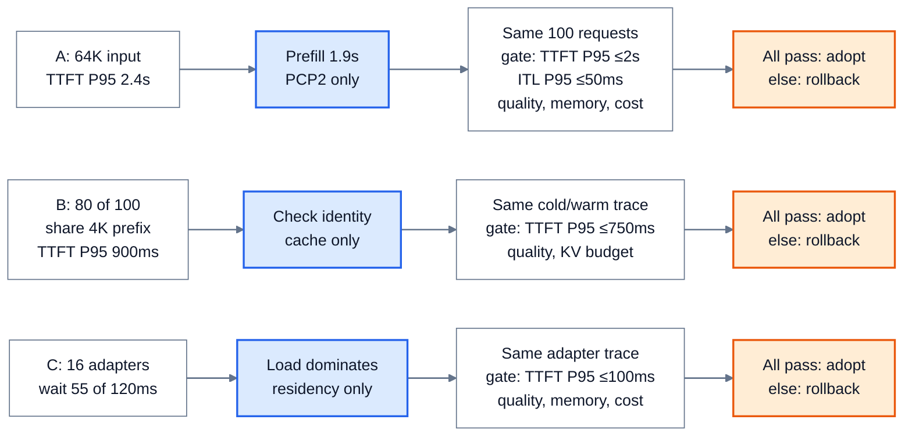

# 推理优化组合：从瓶颈证据到可回滚的方案

> **来源基线**：[PagedAttention，arXiv:2309.06180v1](https://arxiv.org/pdf/2309.06180v1)（§2–4）；[SGLang，arXiv:2312.07104v1](https://arxiv.org/pdf/2312.07104v1)（§5 RadixAttention）；[Punica，arXiv:2310.18547v1](https://arxiv.org/pdf/2310.18547v1)（§3–4）；[S-LoRA，arXiv:2311.03285v1](https://arxiv.org/pdf/2311.03285v1)（§5.1–5.2）；[vLLM Context Parallel Deployment v0.20.0](https://docs.vllm.ai/en/v0.20.0/serving/context_parallel_deployment/)（Prefill/Decode CP）；[NVIDIA AIPerf Metrics Reference](https://docs.nvidia.com/aiperf/reference/ai-perf-metrics-reference) 与 [Load Generator Options](https://docs.nvidia.com/aiperf/benchmark-modes/load-generator-options-reference)（2026-09-17 访问快照）。原始论文与文档定位见 `raw/01_theory/05_inference/` 的对应索引；本页的决策规则是从机制与评测口径推得的教学方法，不是这些来源发布的统一调优算法。
> **主题**：从请求级证据识别主要等待或资源约束，提出有适用前提的一个改动，用配对实验检查质量、SLO、容量和成本，再决定采用、回滚或换假设。
> **适用范围**：面向已有因果 decoder 服务的优化选择。指标定义归 [[11_inference_cost_model_analysis|成本模型]]，实验记录与分母归 [[40_inference_benchmarking_guide|性能评测]]，各候选机制归其原理页；具体命令、kernel 和参数支持归工程域。本页三个场景的数字全部是教学设定，没有执行服务或 GPU 测试。
> **最近更新**：2026-09-17。新建决策方法页，给出三条从观测到条件化决定的完整路线。

## 1. 先定位哪段等待或哪种容量触顶

一条请求的客户端 TTFT 可沿计划发出、实际发出、服务端接收、排队、prefill、首 token 返回逐段记录；后续 token 的间隔还要分 decode 计算、跨卡同步、排队与网络发送。若只有最终 TTFT P99 和总 token/s，无法区分长 prompt 的计算、冷 KV 恢复、adapter 装载或客户端并发阀造成的等待。[[40_inference_benchmarking_guide|评测页]]规定事件时间戳、失败请求和同轨迹比较；[[11_inference_cost_model_analysis|成本模型]]给出 KV、带宽与延迟的量纲。

先用相同请求集合把瓶颈归到四类：**已知输入计算**、**每步读历史和执行**、**常驻容量与迁移**、**排队与交付**。分类不是只能选一个；它只决定先检验哪个因果假设。例如 KV 容量触顶可能先表现为请求排队，而不是 GPU 上的 attention 时间变长。需要同时查看长度分布、到达轨迹、缓存身份、模型/adapter 身份和每层资源峰值，不能用平均 token 数替代长尾。

| 观测证据 | 可先检验的假设 | 不能直接推出 |
|---|---|---|
| 长 prompt 的 prefill 计算占 TTFT 主段，队列短 | 单请求 prefill 关键路径过长 | PCP、CPP 或量化一定改善端到端 TTFT |
| 长历史时 ITL 变差、KV 接近预算 | 历史读取、重复副本或搬运成瓶颈 | 任意 KV 压缩都保持输出质量 |
| 重复 token 前缀仍大量新算 | 命中身份、可读性或驻留有缺口 | 文本看着相同就可以共享 KV |
| adapter 混合批中装载/小 GEMM 多 | adapter 驻留或批内碎片消耗时间 | 共享基座后所有 adapter 输出可混算 |
| 短请求在高到达率下 P99 跃升 | 准入预算、队列或资源背压 | 单个 kernel 的均值决定 P99 |

## 2. 候选组合先过正确性与支持边界

候选方案先问它改变**什么对象**。Prefix Caching 复用相同已处理前缀的 KV，分页只改变物理块映射，分层迁移只改变同语义 KV 的位置；量化和选择性淘汰会改变数值或可见历史。PCP/DCP/CPP 改变同一请求的跨卡分工，P/D 分离改变阶段部署及 KV 交接，投机解码改变候选验证的执行方式。这些区别决定了各自的质量门、通信门和完成边界。[PagedAttention v1 §4](https://arxiv.org/pdf/2309.06180v1)；[SGLang v1 §5](https://arxiv.org/pdf/2312.07104v1)

多轴组合要先检查每个读者能见到正确历史：PCP 的 query 必须获得因果 KV，DCP 的局部结果必须按同一个 softmax 分母合并，CPP 的 stage 必须等同块激活及该 stage 的先前 KV，P/D 分离后的 D 必须读到完整且身份一致的前缀。数学上可组合不表示引擎版本已支持该模型、dtype、attention backend、block 布局和并行组；可支持也不表示在目标负载下划算。具体并行容量和交接账由 [[30_inference_parallelism_composition_analysis|推理并行组合]]持有，KV 可读边界由 [[22_kv_tiering_transfer_analysis|分层迁移]]持有。vLLM v0.20.0 对 PCP 两种路径仍标为开发中，因此下面的 PCP 只作有条件候选。[vLLM v0.20.0，“Prefill Context Parallel”](https://docs.vllm.ai/en/v0.20.0/serving/context_parallel_deployment/)

**图的规格**：三条独立教学轨迹分别携带正文的观测数字、一个假设与单变量改动、配对实验的请求数和门限，最后按各自的质量、资源和 SLO 门决定采用或回滚。图内 `pass/else` 是预定判据，不是已测出的 B 配置结果；三方案不应同时开启。

## 3. 场景 A：长文问答先检验 prefill 关键路径

**教学观测**：100 条请求均为 64K-token 文档输入、最多 128-token 输出；固定到达轨迹下，客户端 TTFT P95 为 2.4 s，ITL P95 为 35 ms。取其中一条 2.4 s 的请求级 trace，客户端与网络 0.3 s、服务端排队 0.2 s、prefill 计算及其跨卡等待 1.9 s；这三个数仅对**这条请求**相加，不能把各阶段 P95 相加当总 P95。事先要求 TTFT P95 ≤2.0 s、ITL P95 ≤50 ms，质量回归通过，单请求上下文及临时 buffer 必须放得下。

**假设和候选**：先验证 1.9 s 确属 prefill 主段，而不是客户端节流或远端 KV 等待。若固定引擎和模型支持，提出 PCP2 分担同一长输入的 query 行；候选的额外 KV 通信、顺序恢复和临时峰值要预先计入。若模型按层分 stage、已有 PP 且多 chunk 可流水，CPP 是另一轮实验候选；本轮只改 PCP，避免把两轴一起打开后无法归因。[[27_prefill_context_parallelism_analysis|PCP]]与 [[29_chunked_pipeline_parallelism_analysis|CPP]]给出正确性和通信条件。

**实验与决定**：同一 100 条 token 化请求、到达时刻、采样种子、预热和客户端位置，A 为原布局，B 仅改 PCP 规模；分别多次运行并保存请求级时间戳。只有 B 的质量回归、TTFT P95 ≤2.0 s、ITL P95 ≤50 ms、失败率不升、显存峰值不超预算，且每成功请求成本符合预先给出的上限，才采用；任一门失败就回滚 PCP 并核查通信或改试其他单变量假设。若 PCP 后 prefill 下降而 P95 不动，重新看排队与到达率，不声称候选“有效但被平均值掩盖”。以上是**预定判据**，不是 B 的测得结果。

## 4. 场景 B：共享前缀先核对身份与可读性

**教学观测**：100 条请求中 80 条有同一个 4K-token 系统前缀，模型权重、token IDs、位置、mask、adapter 身份一致；基线每条仍重算完整 prompt。设固定负载下 TTFT P95 为 900 ms，目标 ≤750 ms，KV 显存预算另给上限。重复的**文本**本身不足以证明命中：tokenizer/template、位置或缓存版本不同都可能使状态不相同；远端目录命中也要等搬运后才可读。[[14_prefix_caching_analysis|前缀复用]]与 [[22_kv_tiering_transfer_analysis|分层迁移]]分别拥有这两个判断。[SGLang v1 §5](https://arxiv.org/pdf/2312.07104v1)

**假设和候选**：先以 token 级身份和前缀块 hash 核对 80 条是否可复用，再用请求级日志区分“无命中”“命中但重算”“命中且需读回”。若身份一致且本机 KV 可保留，单项候选是启用并预热前缀缓存，冻结其他调度参数；若只有远端副本，先测读回时间与重算时间，再决定是否要研究分层放置。缓存能减少新算位置，不保证 TTFT 等比例降低，也会占用块和维护引用。[SGLang v1 §5 RadixAttention](https://arxiv.org/pdf/2312.07104v1)

**实验与决定**：预先定义冷、热两种轨迹并对 A/B 分别使用相同预热规则；保存每请求命中长度、实际新算位置、TTFT、失败、KV 峰值与逐出次数。若在热轨迹中 token 级正确性保持、命中请求新算位置确实减少、TTFT P95 ≤750 ms 且 KV 峰值不超上限，再采用该负载下的缓存配置；若只提高命中率而尾延迟变差，就回滚并测迁移、排队或热点争用。冷轨迹另报，不用热结果代表首次请求。所有数值是**教学设定与验收门**。

## 5. 场景 C：多 LoRA 先量 adapter 装载和批形状

**教学观测**：一个基座服务 16 个 LoRA adapter；固定轨迹中最多 8 条不同 adapter 请求同轮活跃。假设请求级日志显示某条 120 ms 的 TTFT 中，adapter 等待与装载占 55 ms，模型计算与其他等待合计 65 ms；目标 TTFT P95 ≤100 ms，同时保持每个 adapter 的输出与其自身基线一致。该单请求分解不表示整个分布的 P95 可以分项相加。

**假设和候选**：先确认是 adapter 驻留/搬运而非 base 计算或队列在主导。若是，优先单独改变 adapter 的驻留容量或预取策略；下一轮才试将相同或不同 adapter 的 token 组织为共享基座批、让低秩增量按 adapter 索引计算。Punica 的 SGMV 和 S-LoRA 的分页/搬运说明共享基座也仍要正确索引各行的 adapter 权重；不能把 8 个不同 adapter 的增量平均成一个结果。[[25_multi_lora_serving_analysis|多 LoRA 服务]]持有具体计算与存储合同。[Punica §3–4](https://arxiv.org/pdf/2310.18547v1)；[S-LoRA §5.1–5.2](https://arxiv.org/pdf/2311.03285v1)

**实验与决定**：A/B 使用相同 adapter ID 顺序、每个 adapter 的请求比例、到达时刻及输出上限，B 只增加热 adapter 驻留预算；记录命中、搬运字节、TTFT/ITL 分布、基座批大小、每 adapter 质量与显存峰值。若质量和失败率过门、TTFT P95 ≤100 ms、显存与每成功请求成本仍在预定预算内，就采用 B；若只让热 adapter 快、冷 adapter 尾部更差，就回滚并按 adapter 分组报告，下一轮再单独检验批内执行策略。这里没有 B 的实测结果。

## 6. 把收益、代价和限制一起留下

每次决定至少记录：冻结的来源与引擎版本、原始请求轨迹和身份字段、一个改动、所有请求的终态、质量门、TTFT/ITL/吞吐分布、KV/adapter/临时内存峰值、网络或搬运字节、每成功请求成本、重复运行范围，以及失败或回滚原因。[[40_inference_benchmarking_guide|评测页]]的尝试分母和时间窗必须沿用，不能只汇报幸存请求均值。AIPerf 把满足门限的 good 请求和全部尝试请求区分开，这正是判断尾延迟与失败率的必要口径。[AIPerf Metrics Reference](https://docs.nvidia.com/aiperf/reference/ai-perf-metrics-reference)

组合优化应一次增加一个能归因的变量，并在下一轮重测之前已经接受的机制：Prefix Cache 改变 prefill 工作量后，PCP 的原有收益条件也会改变；KV 压缩降低容量后可能引入解压/质量成本；多 LoRA 批改变 batch 形状后，投机或图捕获的收益也可能改变。需要的不是把各机制论文中的加速数字相乘，而是让最终组合在**同一个目标负载、质量门和资源预算**下重新通过完整评测。

## Related Pages

- [[01_inference_overview_analysis|LLM 推理原理全景]]：定位请求从输入到交付的三个资源账本。
- [[11_inference_cost_model_analysis|推理性能与资源成本模型]]：给出延迟、吞吐、KV 和带宽的量纲。
- [[40_inference_benchmarking_guide|推理性能评测]]：给出冻结轨迹、时间戳、失败分母和报告模板。
- [[30_inference_parallelism_composition_analysis|推理并行组合]]：对照多个轴的容量、通信与版本支持。
- [[14_prefix_caching_analysis|Prefix Caching]]：核对共享前缀的内容身份和物理引用。
- [[25_multi_lora_serving_analysis|多 LoRA 服务]]：核对混合 adapter 批的基座与增量计算。
