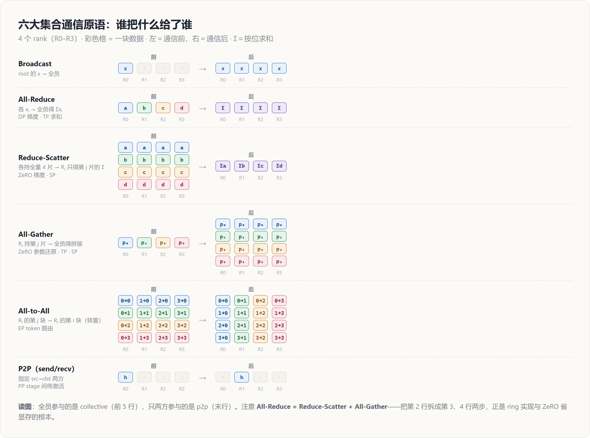
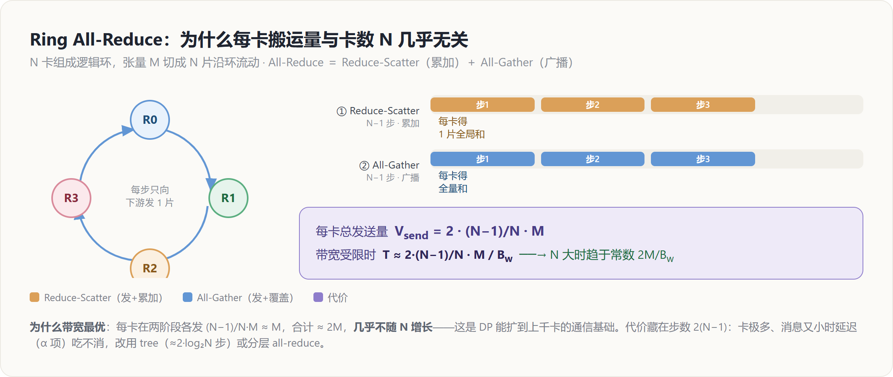

# 分布式原语与通信代价模型 — 原理解读

> 层次：原理（principle）· 引擎无关
> 定位：这是本簇的**代价词汇表**——先把「一次通信要花多少钱」讲清楚，后面 DP / TP / EP / PP / ZeRO 各页都直接引用这里定义的 $\alpha$-$\beta$ 模型与六大原语。
> 实现细节（PyTorch 里这些原语怎么下发）见 [[../../02_engineering/01_ai_frameworks/04_export_and_distributed/02_distributed_primitives/index]]，本页不重复源码。
> 最后更新：2026-07-01

---

## 罗盘：一句话定位

单卡训练里「谁和谁通信」不是问题；一旦跨卡，**所有分布式并行都归结为同一句话**——把一份张量，在一组进程之间，用某个**集合操作（collective）**、在某个**时机**同步，使这组进程算出与单卡**等价**的结果。TP / EP / PP / ZeRO 的差别，只在于「切什么张量、用哪个原语、在什么时机同步」。所以理解并行，先理解原语；理解原语，先理解它**贵在哪**。

本页回答两件事：

1. **六大原语**各自的语义（谁把什么给了谁）。
2. 每个原语的**代价函数**（$\alpha$-$\beta$ 模型）——为什么 all-reduce 的最优实现和参与卡数 $N$ 几乎无关，为什么流水并行只敢用 p2p，为什么张量并行只敢待在机内 NVLink 域。

---

## 为什么需要集合通信：从「等价性」出发

把单卡的一步训练拆到 $N$ 卡上，无非三种切法，每种都会让某个张量在物理上「不完整」，于是需要一次通信把它「补回等价」：

| 切了什么 | 谁不完整了 | 补回等价需要 |
|---|---|---|
| 切数据（DP） | 每卡只看到部分样本 → 梯度是**部分和** | 把各卡梯度**求和**（all-reduce） |
| 切参数/激活（TP） | 每卡只算了输出的**一部分维度** | 把分片**拼起来**或**求和**（all-gather / all-reduce） |
| 切专家（EP） | token 落在别的卡的专家上 | 把 token **发过去、算完发回来**（all-to-all） |
| 切层（PP） | 激活只在前一个 stage 手里 | 把激活**点对点传给**下一个 stage（p2p send/recv） |

一句话：**并行制造了「不完整」，原语负责「补回等价」。** 剩下的全是代价问题。

---

## $\alpha$-$\beta$ 代价模型：一次通信要花多少钱

一次点对点传输 $n$ 字节的墙钟时间，经典建模为线性两项：

$$
T(n) = \alpha + \frac{n}{B_w}
$$

- $\alpha$：**延迟**（latency），一次通信的固定启动开销，与消息大小无关（链路 RTT、内核启动、握手）。小消息被它主导。
- $B_w$：**带宽**（bandwidth），单位时间能搬的字节数。大消息被 $n/B_w$ 主导。有的文献把 $1/B_w$ 记作 $\beta$，于是 $T = \alpha + \beta n$，这也是「$\alpha$-$\beta$ 模型」得名的由来。
- 规约类原语还有第三项 $\gamma$：每字节的**本地计算**开销（做 sum/max 等 reduce 运算）。多数场景 $\gamma \ll \beta$，可略。

**这个模型的全部威力在于两个极端：**

- **延迟受限**（$n$ 小）：$T \approx \alpha$，代价由**跳数/步数**决定 → 优化目标是**减少通信步数**（tree 结构，$\log N$ 步）。
- **带宽受限**（$n$ 大）：$T \approx n/B_w$，代价由**每卡实际吞吐的字节量**决定 → 优化目标是**让每卡搬的字节最少、且各链路满载**（ring 结构）。

大模型的梯度/激活张量都是「大消息」，所以**训练几乎永远是带宽受限**——这解释了后面所有并行策略「拼命省字节、拼命重叠」的动机。

> **拓扑不是均质的（贯穿全篇的隐含前提）**：机内 NVLink/NVSwitch 的 $B_w$ 可达数百 GB/s，机间 InfiniBand/以太只有它的 1/5 ～ 1/50，且 $\alpha$ 更大。所以「用哪个原语」之外还有「在哪一层用」：**通信量大、频次高的并行（TP/SP）必须待在机内高带宽域；通信量小的（DP/PP）才敢跨机**。这条约束是 N 维并行布局（见 [[01_theory/06_distributed_parallelism/index|分布式并行原理]]）的物理根源。

---

## 六大原语：语义

设有 $N$ 个进程（rank），每个持有一块数据。约定用「谁有什么 → 通信后谁有什么」描述语义：

| 原语 | 语义（前 → 后） | 谁用它 |
|---|---|---|
| **Broadcast** | root 有 $x$ → 全员都有 $x$ | 参数初始化广播、同步随机种子 |
| **Reduce** | 各有 $x_i$ → root 有 $\sum_i x_i$ | 汇总到单卡（少用于训练主路径） |
| **All-Reduce** | 各有 $x_i$ → 全员都有 $\sum_i x_i$ | **DP 梯度同步、TP 层内求和** |
| **Reduce-Scatter** | 各有向量 $x_i$ → rank $j$ 只拿到 $\sum_i x_i$ 的第 $j$ 分片 | **ZeRO/FSDP 梯度规约、SP** |
| **All-Gather** | rank $j$ 有分片 $x_j$ → 全员都有拼接 $[x_0,\dots,x_{N-1}]$ | **ZeRO/FSDP 参数还原、SP、TP** |
| **All-to-All** | rank $i$ 的第 $j$ 块 → rank $j$ 的第 $i$ 块（转置） | **EP 专家路由（token 分发/回收）** |
| **P2P（send/recv）** | src 的 $x$ → dst 的 $x$（指定两方） | **PP 相邻 stage 传激活/梯度** |

> **核心恒等式（记住这一个，后面全通）**：
> $$
> \textbf{All-Reduce} = \textbf{Reduce-Scatter} + \textbf{All-Gather}
> $$
> 先 reduce-scatter 让每卡拿到「求和结果的一片」，再 all-gather 把所有片拼回全量。这不只是数学等式——它是 ring all-reduce 的**实际实现方式**，也是 ZeRO 能把 DP 的 all-reduce「拆开省显存」的根本原因（见 [[12_zero_fsdp_analysis]]）。

---

## 每个原语的代价：为什么 ring all-reduce 与 $N$ 无关

设要规约的张量总大小为 $M$ 字节，$N$ 个 rank 组成一个逻辑环。**Ring 算法**的做法：把 $M$ 切成 $N$ 片，每片 $M/N$，让数据沿环流动。

**Reduce-Scatter 阶段**：$N-1$ 步，每步每卡向下游发 1 片（$M/N$）、从上游收 1 片并累加。走完后每卡手里有「某一片的全局和」。
**All-Gather 阶段**：再 $N-1$ 步，每步把「已完成的片」沿环传一圈。走完后每卡都有全量和。

每卡在整个 all-reduce 中**发送**的总字节：

$$
\begin{aligned}
V_{\text{send}}
&= \underbrace{(N-1)\cdot\frac{M}{N}}_{\text{reduce-scatter}} \\
&\quad + \underbrace{(N-1)\cdot\frac{M}{N}}_{\text{all-gather}} = 2\cdot\frac{N-1}{N}\cdot M
\end{aligned}
$$

于是带宽受限下的时间：

$$
T_{\text{ring-allreduce}} \approx 2\cdot\frac{N-1}{N}\cdot\frac{M}{B_w} \xrightarrow{N \text{ 大}} \frac{2M}{B_w}
$$

**这就是关键结论：ring all-reduce 每卡搬运的字节量趋于常数 $2M$，几乎不随 $N$ 增长。** 加 100 张卡和加 1000 张卡，单次 all-reduce 的带宽开销几乎一样——这正是数据并行能扩到上千卡的通信基础。代价藏在 $\alpha$ 项：ring 有 $2(N-1)$ 步，延迟随 $N$ 线性增长，所以**卡极多、消息又小时，ring 的延迟会吃不消**，转而用 tree/分层算法。

**Ring vs Tree —— 延迟带宽的二选一：**

| 算法 | 步数（$\alpha$ 项） | 每卡字节（$\beta$ 项） | 适用 |
|---|---|---|---|
| **Ring** | $2(N-1)$ 步，延迟 $\propto N$ | $2\frac{N-1}{N}M \to 2M$，**带宽最优** | 大消息、带宽受限（**训练梯度**） |
| **Tree / 递归倍增** | $\sim 2\log_2 N$ 步，延迟 $\propto \log N$ | $\sim M\log N$，字节更多 | 小消息、延迟受限 |
| **Hierarchical（分层）** | 机内 ring + 机间 ring/tree 两级 | 跨机只走 1 份规约结果 | **多机**：避让慢的机间链路 |

NCCL/HCCL 等库会按消息大小、拓扑**自动选算法**——这是「实现」，归 engineering 页；本页只需记住二者的代价形状。

---

## 分发类原语的代价：All-to-All 与 P2P

**All-to-All（EP 的命脉）**：每卡把自己的数据按目标 rank 切成 $N$ 块，第 $j$ 块发给 rank $j$，同时收下所有卡发来的第 $i$ 块。若每卡总发送量为 $M$，则每卡发/收各 $\frac{N-1}{N}M \approx M$。它本质是一次**分布式转置**。代价敏感点有二：

- 它天然是**全连接通信**（每对 rank 都有流量），机间做 all-to-all 极易打满、打偏网络 → EP 特别怕**负载不均**（某些专家爆热）。
- 它有两次（发、收），且夹在专家计算前后 → EP 的墙钟＝`a2a_dispatch + expert_compute + a2a_combine`，两次 a2a 常是瓶颈。这解释了 DeepEP 等库为什么要做分层/重叠的 all-to-all（见 [[14_expert_parallel_analysis]]）。

**P2P（PP 的命脉）**：只在指定 src↔dst 两方之间 send/recv，代价就是最朴素的 $T=\alpha+n/B_w$，**不涉及全组**。传的是相邻 stage 之间的**激活**（前向）和**激活梯度**（反向），大小 $\propto B\cdot S\cdot d$（批 × 序列 × 隐藏维），与总层数无关。正因为 p2p 通信量小、只跨一对卡，**PP 是唯一敢大方跨机、甚至跨机架的并行维**（见 [[15_pipeline_parallel_analysis]]）。

---

## 经验法则：哪种并行用哪个原语

把上面收成一张「查询表」，后面每页都会回指这里：

| 并行 | 切什么 | 主原语 | 单步通信量级 | 只能待在 |
|---|---|---|---|---|
| **DP** | 数据（复制模型） | all-reduce 梯度 | $\propto \Psi$（参数量），与 batch 无关 | 可跨机 |
| **ZeRO/FSDP** | 优化器态/梯度/参数 | reduce-scatter + all-gather | $\propto \Psi$，比 DP 多一次 all-gather | 可跨机（带宽换显存） |
| **TP** | 层内权重（隐藏维） | all-reduce（每层 2 次）/ all-gather | $\propto B\cdot S\cdot d$，**每层都发、频次极高** | **机内高带宽域** |
| **SP** | 序列维激活（配合 TP） | reduce-scatter + all-gather（替代 TP 的 all-reduce） | 与 TP 同量级，但激活显存更省 | 机内（随 TP） |
| **CP** | 序列维（长上下文） | all-gather / ring 交换 KV | $\propto B\cdot S\cdot d$ | 机内为主 |
| **EP** | 专家（MoE） | all-to-all（分发 + 回收，各 1 次） | $\propto$ 路由到组外的 token 数 | 机内为主，怕负载不均 |
| **PP** | 层（stage） | p2p（相邻 stage） | $\propto B\cdot S\cdot d$，**频次最低** | **可跨机/跨机架** |

一句话总纲：**DP/ZeRO 靠 all-reduce 族（与参数量挂钩），TP/SP/CP 靠 all-gather/reduce-scatter（与激活挂钩、频次高、只敢机内），EP 靠 all-to-all（怕不均），PP 靠 p2p（最省、可远距离）。** 这张表就是理解 N 维并行布局的全部前提。

---

## 与编译栈的衔接（一句话）

上面讲的都是「就地」的传统集合 API。PyTorch 另有一套 **functional collectives**：不原地改写、返回新张量，从而让通信对 `torch.compile` 的图捕获**可见**，可被编译器做通信代数优化与计算-通信重叠调度。这是 DTensor/TP 能与编译协同的关键，属实现层，细节见 [[../../02_engineering/01_ai_frameworks/04_export_and_distributed/02_distributed_primitives/index]] 与 [[../../02_engineering/01_ai_frameworks/02_compile_stack/04_inductor/index]]。

---

## Related Pages

- [[01_theory/06_distributed_parallelism/index|分布式并行原理]] — 本簇总览：N 维并行全景与显存/通信总账
- [[11_data_parallel_analysis]] — DP：all-reduce 梯度的最基本用法
- [[13_tensor_sequence_parallel_analysis]] — TP/SP/CP：all-gather/reduce-scatter 的层内切分
- [[14_expert_parallel_analysis]] — EP：all-to-all 的专家路由
- [[15_pipeline_parallel_analysis]] — PP：p2p 的 stage 间传递
- [[12_zero_fsdp_analysis]] — ZeRO：把 all-reduce 拆成 reduce-scatter + all-gather 省显存
- [[../../02_engineering/01_ai_frameworks/04_export_and_distributed/02_distributed_primitives/index]] — **实现层**：这些原语在 c10d/PyTorch 里怎么下发（ProcessGroup / Work / functional collectives）
