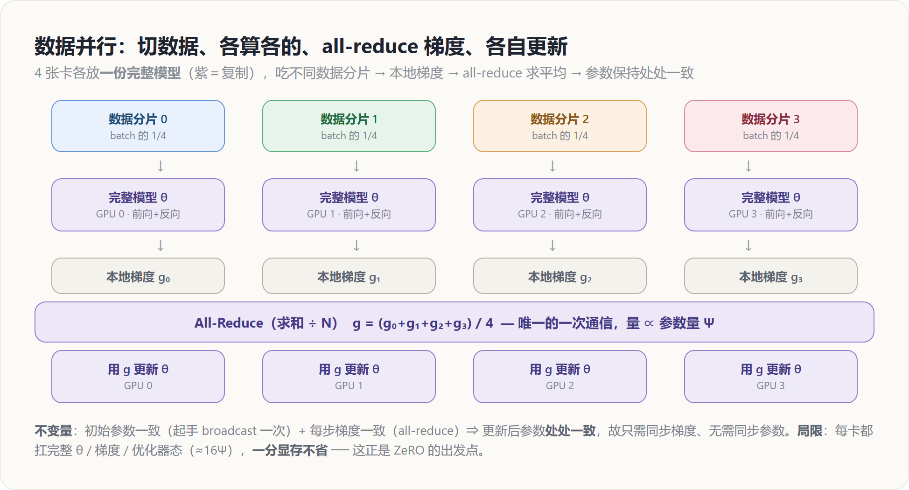

# 数据并行 DP — 原理解读

> 层次：原理（principle）· 引擎无关
> 前置：[[10_collectives_analysis]]（all-reduce 的代价模型）
> 实现见 [[../../02_engineering/01_ai_frameworks/04_export_and_distributed/02_distributed_primitives/index]]（`DistributedDataParallel` 源码级机制）
> 最后更新：2026-07-01

---

## 罗盘：一句话定位

**数据并行（Data Parallelism, DP）＝ 每张卡放一份完整模型，各自吃一部分数据，反向时把梯度 all-reduce 求平均。** 它是最简单、最先该上的并行：模型结构一动不动，只是把一个大 batch 切成 $N$ 份分给 $N$ 卡并行算，再把梯度对一遍答案。它扩展性极好（通信量与卡数几乎无关，见下），**但一分显存都不省**——每卡都扛着完整的参数、梯度、优化器态。这条局限直接催生了 ZeRO（见 [[12_zero_fsdp_analysis]]）。

---

## 为什么 DP 最先上：数据天然可切，等价性最好证

一个 mini-batch 的梯度，是**样本梯度的平均**：

$$g = \frac{1}{B}\sum_{i=1}^{B} \nabla_\theta \ell(x_i;\theta)$$

求和对样本是**线性可分**的——把 $B$ 个样本拆成 $N$ 组，每组 $B/N$ 个，各卡算自己的**部分和**，再把 $N$ 个部分和加起来除以 $B$，结果与单卡一次算 $B$ 个样本**逐位等价**。这就是 DP 的全部数学：

$$g = \frac{1}{N}\sum_{r=0}^{N-1} \underbrace{\Big(\frac{N}{B}\sum_{i\in \text{shard}_r}\nabla_\theta \ell\Big)}_{\text{rank } r \text{ 的本地梯度 } g_r}$$

**关键不变量**：只要（1）各卡**初始参数一致**（训练开始 broadcast 一次），（2）每步**梯度一致**（all-reduce 求平均），那么各卡**每一步之后参数都保持一致**——无需同步参数本身，只同步梯度即可。这是 DP 简单的根源：**通信只发生在反向的梯度上**。

---

## 机制：一步 DP 训练的四拍

1. **切数据**：全局 batch（global batch）切成 $N$ 份，rank $r$ 拿到第 $r$ 份（DataLoader 用 `DistributedSampler` 保证不重叠）。
2. **前向 + 反向（各算各的）**：每卡用**同一份完整模型**独立做前向、反向，得到**只基于本卡样本**的本地梯度 $g_r$。这一步完全无通信。
3. **All-Reduce 梯度**：对所有 $g_r$ 做 all-reduce（求和，通常 op=AVG 直接出平均）。走完后每卡手里都是**全局平均梯度** $g$。
4. **各自更新**：每卡用同一个 $g$ 跑同一个优化器步 → 更新后参数仍然处处一致，回到不变量。

第 3 拍是唯一的通信，也是 DP 的全部成本所在。

---

## 代价：通信与参数量挂钩，与 batch 无关

**通信量**：一次 all-reduce 规约的是整份梯度，大小 $\propto \Psi$（参数量）。用 [[10_collectives_analysis|集合通信代价模型]] 的 ring 结论，每卡每步搬运：

$$V_{\text{DP}} \approx 2\cdot\frac{N-1}{N}\cdot \Psi \cdot b \;\xrightarrow{N\text{ 大}}\; 2\Psi b \quad(b=\text{每参数字节})$$

两个要命的观察：

- **与 batch / 样本数无关**：无论每卡算多少样本，梯度形状恒为 $\Psi$，通信量不变 → **加大每卡 batch 是「免费」摊薄通信的手段**（见下 gradient accumulation）。
- **与卡数 $N$ 几乎无关**：ring all-reduce 每卡搬运趋于常数 $2\Psi b$ → **DP 能干净地扩到上千卡**，这是它最大的优点。

**计算通信比**：每步计算 $\propto B\cdot\Psi$（batch 越大算得越多），通信 $\propto \Psi$（恒定）。所以 **batch 越大，通信占比越低**——这解释了为什么大规模训练偏爱大 global batch。

---

## DP 的根本局限：一分显存都不省

DP 复制的是**整个模型状态**。以混合精度 Adam 训练、参数量 $\Psi$ 为例，每卡都要独立存下（经典 ZeRO 论文的账本）：

| 状态 | 每卡占用 | 说明 |
|---|---|---|
| 参数（fp16） | $2\Psi$ | 前向/反向用 |
| 梯度（fp16） | $2\Psi$ | 反向产出 |
| 优化器态（fp32：参数副本 + m + v） | $12\Psi$ | Adam 三份 fp32 |
| **合计（不含激活）** | $\mathbf{16\Psi}$ | **每卡都是这么多，$N$ 卡冗余 $N$ 份** |

一个 7.5B 模型光模型状态就 120GB，单卡放不下——**DP 完全帮不上忙，因为它把这 $16\Psi$ 在每张卡上复制了一遍。** 这就是 DP 的天花板，也是 [[12_zero_fsdp_analysis]] 的出发点：既然这 $16\Psi$ 在 $N$ 卡间完全冗余，为什么不把它**切开**、每卡只存 $1/N$？

> **一句话对照**：DP 省的是**时间**（并行算数据），费的是**显存**（复制模型）；ZeRO 在 DP 基础上，用**额外一点通信**把这份显存也省了。二者是同一根「数据轴」上的两个点。

---

## 工程上让 DP 更快的两招（原理层）

**① 梯度分桶 + 反向重叠**：反向是**从最后一层往前**逐层产生梯度的。与其等整份梯度都算完再 all-reduce（通信暴露在关键路径），不如把参数分成若干**桶（bucket）**，某个桶的梯度一凑齐就**立即异步 all-reduce**，同时反向继续往前算——通信藏进了后续层的反向计算里。这就是 DDP 的 `Reducer` 做的事（实现见 [[../../02_engineering/01_ai_frameworks/04_export_and_distributed/02_distributed_primitives/index]]）。

**② 梯度累积（gradient accumulation）**：想要更大的 global batch 又受显存限制时，可以连续跑 $k$ 个 micro-batch、把梯度**本地累加**，只在第 $k$ 个之后才 all-reduce 一次。等价于 batch 放大 $k$ 倍，而**通信频次降为 $1/k$**——直接改善计算通信比。代价是这 $k$ 步内不能更新参数。

---

## DP 度数与整体布局

一次训练的 **DP 度数** $= \text{global batch} / (\text{micro batch} \times \text{梯度累积步数})$。在 N 维并行里（见 [[01_theory/06_distributed_parallelism/index|分布式并行原理]]），DP 通常是**最外层**维度：先用 TP/PP/EP 把「单个模型副本」塞进一组卡，再用 DP 把这一组「整体复制」多份并行吃数据。因为 DP 通信量小（$\propto\Psi$、频次每步一次）且可跨机，把它放在带宽最差的机间维度最划算。

---

## Related Pages

- [[10_collectives_analysis]] — all-reduce 的 ring 代价模型（本页通信量的来源）
- [[12_zero_fsdp_analysis]] — **直接续篇**：把 DP 复制的 $16\Psi$ 状态切开，同一数据轴的省显存版
- [[13_tensor_sequence_parallel_analysis]] — TP：当单份模型都放不下时，切模型本身
- [[15_pipeline_parallel_analysis]] — PP：另一条「切模型」的路
- [[01_theory/06_distributed_parallelism/index|分布式并行原理]] — N 维并行里 DP 通常是最外层维度
- [[../../02_engineering/01_ai_frameworks/04_export_and_distributed/02_distributed_primitives/index]] — **实现层**：`DistributedDataParallel` 的 `Reducer` 分桶与反向 all-reduce 重叠
