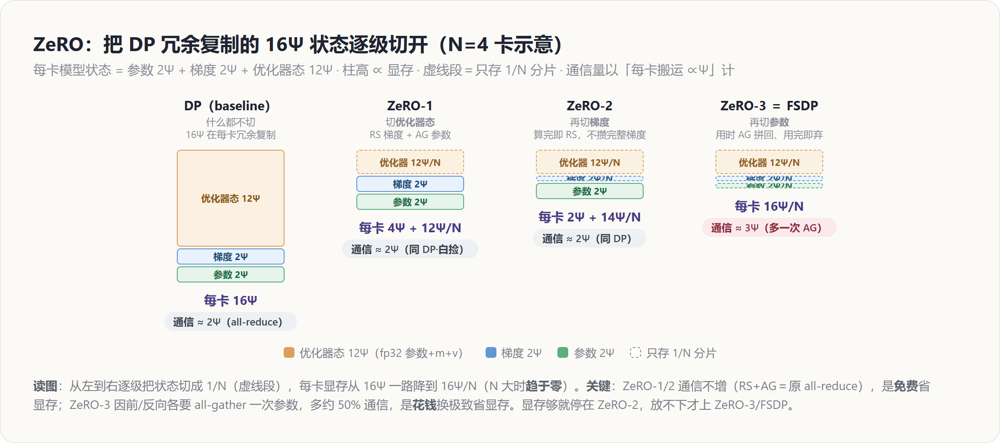

# ZeRO / FSDP — 原理解读

> 层次：原理（principle）· 引擎无关
> 前置：[[11_data_parallel_analysis]]（DP 的 $16\Psi$ 显存账本）、[[10_collectives_analysis]]（all-reduce = reduce-scatter + all-gather）
> 实现见 [[../../02_engineering/02_train_frameworks/torchtitan/11_torchtitan_fsdp_analysis]]、[[../../02_engineering/01_ai_frameworks/04_export_and_distributed/02_distributed_primitives/index]]（FSDP1/FSDP2）
> 最后更新：2026-07-01

---

## 罗盘：一句话定位

**ZeRO（Zero Redundancy Optimizer）＝ 在 DP 的基础上，把每张卡冗余复制的「模型状态」切开，每卡只存 $1/N$，用到时临时通信还原、用完即弃。** 它不改变 DP 的数据切分与等价性，只消灭 DP 的显存冗余——所以是**「省显存版的 DP」，同处一根数据轴**。三个 stage 逐步切掉更多状态；**ZeRO-3 与 PyTorch 的 FSDP 是同一件事**。代价是每一步要额外通信把参数临时拼回来，本质是**用带宽换显存**。

---

## 出发点：DP 的 $16\Psi$ 全是冗余

回顾 [[11_data_parallel_analysis]] 的账本：混合精度 Adam 下，每卡都独立存着模型状态（$\Psi$ = 参数量）：

$$\underbrace{2\Psi}_{\text{fp16 参数}} + \underbrace{2\Psi}_{\text{fp16 梯度}} + \underbrace{12\Psi}_{\text{fp32 优化器态: 参数副本+m+v}} = 16\Psi$$

关键观察：**这 $16\Psi$ 在 $N$ 张卡上是逐位相同的冗余副本。** DP 需要各卡参数一致，但它并不需要各卡**同时**持有完整副本——优化器更新时，每张卡完全可以只负责更新参数的一个分片。既然如此，为什么不把这 $16\Psi$ 切成 $N$ 份、每卡只存 $16\Psi/N$？这就是 ZeRO 的全部动机。

**能这么做的技术支点**是 [[10_collectives_analysis]] 的核心恒等式：DP 那次 all-reduce 梯度，本就等于 **reduce-scatter + all-gather**。ZeRO 把这两半拆开用——reduce-scatter 让每卡只拿到「自己负责分片」的梯度和，于是它只需更新那一片、只需存那一片的优化器态。

---

## 三个 Stage：逐步切掉更多状态

沿着「切哪些状态」递进，每一级都在上一级基础上多切一类：

| 级别 | 切什么 | 每卡模型状态 | 每步通信 | 相对 DP |
|---|---|---|---|---|
| **DP（baseline）** | 什么都不切 | $16\Psi$ | all-reduce 梯度 | $\approx 2\Psi$ |
| **ZeRO-1** | 优化器态（$12\Psi$） | $2\Psi+2\Psi+\frac{12\Psi}{N}$ | reduce-scatter 梯度 + all-gather 参数 | $\approx 2\Psi$（同 DP） |
| **ZeRO-2** | + 梯度（$2\Psi$） | $2\Psi+\frac{14\Psi}{N}$ | 梯度算完即 reduce-scatter；all-gather 参数 | $\approx 2\Psi$（同 DP） |
| **ZeRO-3** | + 参数（$2\Psi$） | $\frac{16\Psi}{N}$ | 前/反向按层 all-gather 参数 + reduce-scatter 梯度 | $\approx 3\Psi$（多一次 AG） |

**ZeRO-1（切优化器态）**：反向得到完整梯度后，做 **reduce-scatter** 让每卡只拿到自己负责那 $1/N$ 分片的梯度和；每卡用本地那片优化器态更新自己那片参数；再 **all-gather** 把更新后的参数拼回各卡。通信量 = RS + AG = 一次 all-reduce 的量，**与 DP 持平**，却省下了 $12\Psi(1-1/N)$ 的优化器显存——**几乎白捡**。

**ZeRO-2（再切梯度）**：注意到反向是逐层产生梯度的，某层梯度一算完就**立即 reduce-scatter** 到负责卡、本地只留自己那片，不必攒着完整梯度。通信量仍 $\approx$ DP，再省 $2\Psi(1-1/N)$ 梯度显存。

**ZeRO-3（再切参数）**：常态下每卡只存 $1/N$ 的参数。前向/反向走到某一层时，**all-gather 临时拼出该层完整参数**，算完**立即丢弃**（reshard）；梯度照常 reduce-scatter。因为前向要 all-gather 一遍、反向再 all-gather 一遍，**比 DP 多约一次参数 all-gather**（通信 $\approx 3\Psi$ vs DP 的 $2\Psi$，约 1.5×）。换来的是每卡模型状态砍到 $16\Psi/N$——$N$ 大时**趋于零**，这才是能训超大模型的关键。

> **一句话记法**：ZeRO-1/2 是「**免费**」的（通信不增、显存大减）；ZeRO-3 才开始「**花钱**」（多 ~50% 通信换到极致省显存）。所以显存够时停在 ZeRO-2，模型实在放不下才上 ZeRO-3。

---

## ZeRO-3 就是 FSDP：unshard → compute → reshard

PyTorch 的 **FSDP（Fully Sharded Data Parallel）** 是 ZeRO-3 的框架实现，工作循环就三拍：

1. **unshard**：进入某层前，`all_gather` 拼出该层完整参数；
2. **compute**：用完整参数做该层前向/反向；
3. **reshard**：立即释放非本卡分片，参数退回 $1/N$；反向的梯度用 `reduce_scatter` 规约到负责卡。

峰值显存 = 常驻分片（$16\Psi/N$）+ 当前层临时全量 buffer（一层的参数，很小）。工程上靠**预取（prefetch）**下一层的 all-gather 与当前层计算**重叠**来掩盖通信——实现细节见 [[../../02_engineering/02_train_frameworks/torchtitan/20_torchtitan_fsdp_prefetch_overlap_memory_analysis]]。

---

## 与其它并行的关系

- **与 DP 同轴**：ZeRO/FSDP 就是 DP 这根「数据轴」上、把状态切开的版本。N 维布局里它占据 DP 的位置。
- **与 TP/PP/EP 正交、可叠加**：常见组合是 **FSDP × TP**（FSDP 切状态、TP 切层内），或 **FSDP × PP**。用 `DeviceMesh` 描述各维布局（见 [[01_theory/06_distributed_parallelism/index|分布式并行原理]]）。
- **Offload（ZeRO-Infinity）**：把切出去的优化器态/参数进一步搬到 CPU 内存甚至 NVMe，用主机带宽换更大模型——极致省显存、更慢，属工程权衡。

**与 DP 的收尾对照**：DP 省时间、费显存（复制 $16\Psi$）；ZeRO 沿同一轴，用 reduce-scatter/all-gather 把这份显存也省了——ZeRO-1/2 不加通信，ZeRO-3 加约 50% 通信换到 $16\Psi/N$。二者是「数据并行」这枚硬币的两面。

---

## Related Pages

- [[11_data_parallel_analysis]] — **直接前篇**：DP 的 $16\Psi$ 账本与「冗余复制」问题
- [[10_collectives_analysis]] — all-reduce = reduce-scatter + all-gather（ZeRO 拆分的技术支点）
- [[13_tensor_sequence_parallel_analysis]] — TP：与 FSDP 正交组合（FSDP×TP）
- [[15_pipeline_parallel_analysis]] — PP：与 ZeRO 正交，进一步摊深度
- [[01_theory/06_distributed_parallelism/index|分布式并行原理]] — N 维布局里 ZeRO/FSDP 占据数据轴
- [[../../02_engineering/02_train_frameworks/torchtitan/11_torchtitan_fsdp_analysis]] — **实现层**：torchtitan/FSDP2 的分片与通信
- [[../../02_engineering/02_train_frameworks/torchtitan/20_torchtitan_fsdp_prefetch_overlap_memory_analysis]] — **实现层**：预取重叠与显存核算
- [[../../02_engineering/01_ai_frameworks/04_export_and_distributed/02_distributed_primitives/index]] — **实现层**：FSDP1 `FlatParameter` 与 FSDP2 `fully_shard`
