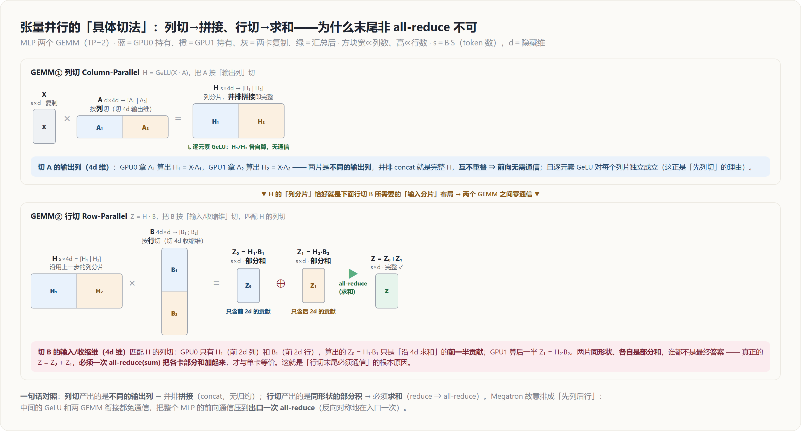
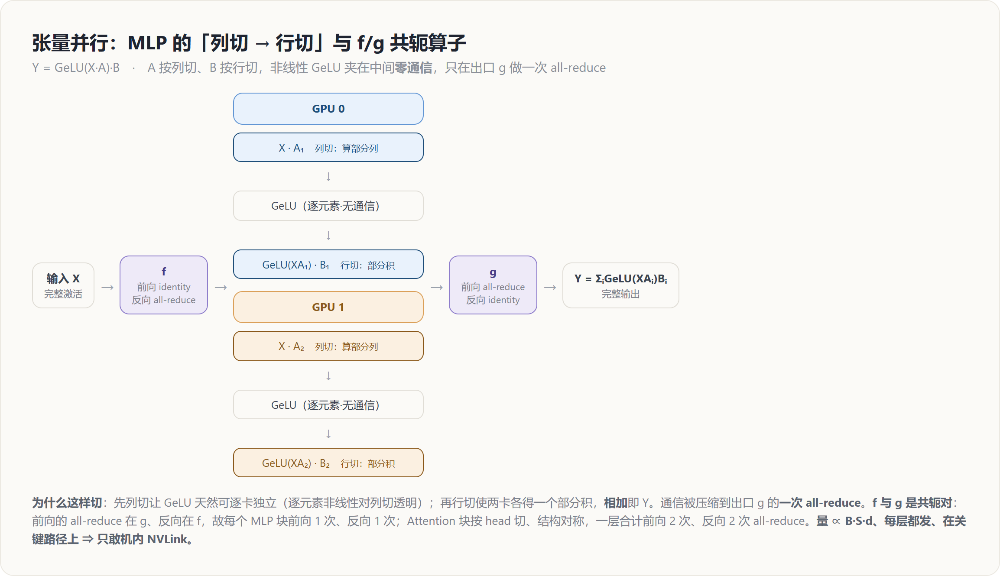
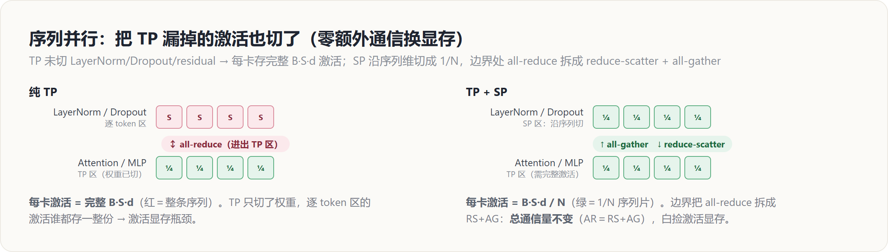
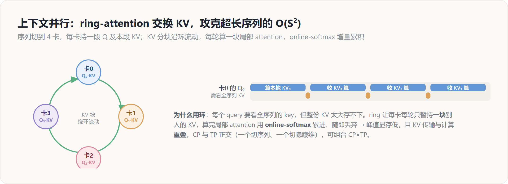

# 张量并行 TP / 序列并行 SP / 上下文并行 CP — 原理解读

> 层次：原理（principle）· 引擎无关
> 前置：[[10_collectives_analysis]]（all-reduce / all-gather / reduce-scatter 代价）
> 实现见 [[../../02_engineering/02_train_frameworks/megatron-lm/index]]（Megatron 手工 TP/SP）与 [[../../02_engineering/01_ai_frameworks/04_export_and_distributed/02_distributed_primitives/index]]（DTensor/TP）
> 最后更新：2026-07-01

---

## 罗盘：一句话定位

DP 复制整模型——可当**单份模型都放不下**、或**单层算得太慢**时，就得切模型**本身**。这一族沿「层内 / 序列」维度切，共享同一副性格：**通信量与激活挂钩（$\propto B\cdot S\cdot d$）、频次极高（每层都发）、只敢待在机内高带宽域**。

- **TP（Tensor Parallel）**：把**层内的权重矩阵**沿隐藏维切到 $N$ 卡，每卡算输出的一部分，再拼/加回来。解决「单层太大/太慢」。
- **SP（Sequence Parallel）**：把 TP **没切到**的 LayerNorm/Dropout/residual 区域，沿**序列维**切，进一步压激活显存。与 TP 配套、零额外通信。
- **CP（Context Parallel）**：当**序列极长**（$S$ 很大）导致 attention 的 $O(S^2)$ 与 KV 激活爆炸时，沿序列维切 Q/K/V，用 ring-attention 交换 KV。解决「上下文太长」。

三者正交、常叠加，是把「一份模型副本」塞进一组机内卡的主力手段。

---

## TP：把权重矩阵切开算（Megatron 范式）

Transformer 的两大算子块——MLP 和 Attention——都是「大矩阵乘」。TP 的核心洞察：**矩阵乘可以沿某一维切开并行，只在必要处补一次通信。** 关键是选对切法，让中间的非线性**不需要通信**。

### MLP：列切 → 行切，非线性夹在中间

MLP 是 $Y = \text{GeLU}(XA)\,B$。Megatron 的切法（[Megatron-LM, 1909.08053]）：

**第一层 $A$ 按列切** $A=[A_1, A_2]$：

$$XA = X[A_1, A_2] = [XA_1,\; XA_2]$$

每卡拿一个 $A_i$，独立算出 $XA_i$（输出的一部分列）。因为 **GeLU 是逐元素的**，$\text{GeLU}([XA_1,XA_2]) = [\text{GeLU}(XA_1), \text{GeLU}(XA_2)]$——**列切让非线性天然无需通信**，这是选「先列切」的全部理由。

**第二层 $B$ 按行切** $B=[B_1; B_2]$：

$$Y = \text{GeLU}(XA)B = \text{GeLU}(XA_1)B_1 + \text{GeLU}(XA_2)B_2$$

每卡算一个部分积 $\text{GeLU}(XA_i)B_i$，二者**相加**才是最终 $Y$ → 这里需要一次 **all-reduce**。整个 MLP 块：**前向 1 次 all-reduce，中间零通信**。

### 具体切法：为什么列切能「拼接」、行切必须「求和」

把两个 GEMM 的切法摊开看，通信的必要性就一目了然——**区别只在「各卡算出来的是不是同一块数据」**：

- **列切（GEMM①，切 $A$ 的输出列 / $4d$ 维）**：GPU0 算 $H_1=XA_1$、GPU1 算 $H_2=XA_2$，两者是输出张量**不同的列**（前 $2d$ 列 vs 后 $2d$ 列），彼此不重叠。把它们**并排拼起来**（concat）就是完整的 $H$——没有哪一块需要与另一块相加，所以**前向不产生通信**；而且逐元素 GeLU 对每个列片独立成立，非线性也免通信。$X$ 需在两卡上都有完整副本（灰色「复制」块），这份复制正是**反向**时输入梯度要 all-reduce 的来源（即下节的 $f$）。
- **行切（GEMM②，切 $B$ 的输入 / 收缩维 $4d$ 维）**：为匹配 $H$ 的列分片，$B$ 按**行**切。此时 GPU0 手里只有 $H_1$（前 $2d$ 列）和 $B_1$（前 $2d$ 行），它算出的 $Z_0=H_1B_1$ 只是矩阵乘「沿 $4d$ 求和」的**前一半贡献**；GPU1 算后一半 $Z_1=H_2B_2$。两片**形状完全相同、各自只是部分和**，谁都不是最终答案——真正的 $Z=Z_0+Z_1$。要把散在各卡的部分和加齐，**只能靠一次 all-reduce(sum)**。这就是「行切末尾必须通信」的根本原因。

一句话：**列切 → 各卡是不同片段 → 拼接（concat，无归约）；行切 → 各卡是同形状的部分和 → 求和（reduce ⇒ all-reduce）**。Megatron 特意排成「先列后行」，让中间的 GeLU 与两个 GEMM 的衔接**全部免通信**，把整个 MLP 的前向通信收敛到出口的**一次** all-reduce（反向对称地落在入口一次）。

### f / g：一对共轭算子，把通信收进两个点

Megatron 把通信抽象成两个共轭算子，插在 TP 区的入口和出口：

| 算子 | 前向 | 反向 | 位置 |
|---|---|---|---|
| **f**（入口） | identity（直接复制输入到各卡） | **all-reduce**（汇总各卡的输入梯度） | TP 区开始 |
| **g**（出口） | **all-reduce**（汇总各卡的部分输出） | identity（复制输出梯度到各卡） | TP 区结束 |

前向的 all-reduce 在 $g$，反向的 all-reduce 在 $f$——**一个 MLP 块前向 1 次、反向 1 次**。Attention 块同理（下）。所以**每个 Transformer 层前向 2 次 all-reduce（attention + MLP）、反向 2 次**。

### Attention：按注意力头切

多头注意力天然可切：把 $h$ 个 head 分给 $N$ 卡，每卡算 $h/N$ 个 head 的完整 $QK^\top V$（head 之间本就独立，无需通信），输出投影 $W_O$ 按行切，最后 all-reduce 求和。结构与 MLP 完全对称：入口 $f$、出口 $g$。

### TP 的代价与约束（为什么只敢机内）

- **通信量**：每次 all-reduce 规约的是**激活** $Y$，大小 $\propto B\cdot S\cdot d$，而且**每层都发、前向反向共 4 次/层**。深层大模型一次迭代下来 all-reduce 次数 $= 4L$，密集且在**关键路径**上（下一步计算必须等它）。
- **结论**：TP 的通信**又大又频又挡路** → 必须放在带宽最高、延迟最低的域，即**机内 NVLink/NVSwitch**。跨机做 TP 会被慢链路拖垮。因此 **TP 度数通常 ≤ 单机卡数（8）**。
- **收益**：每卡只存 $1/N$ 的权重、算 $1/N$ 的矩阵乘 → 直接解决「单层放不下 / 算太慢」。

---

## SP：把 TP 漏掉的激活也切了

**问题**：TP 切了 attention/MLP 的**权重与其内部激活**，但每个 Transformer 层还有 **LayerNorm、Dropout、residual add** 这些**逐 token** 的逐元素操作——TP 没碰它们，于是每卡都存着**完整的** $B\cdot S\cdot d$ 激活。大模型里这部分激活显存相当可观，成为新瓶颈。

**SP 的解法**（[Megatron-3, 2205.05198]）：这些逐 token 操作在序列维上彼此独立，于是**沿序列维 $S$ 把激活切成 $N$ 片**，每卡只存 $1/N$。

**精妙之处在边界衔接**：TP 区需要**完整**激活（矩阵乘要看到整条序列的 hidden），SP 区只需**分片**激活。于是在两区边界，原本 TP 的一次 all-reduce 被**拆开**：

$$\underbrace{\text{all-reduce}}_{\text{纯 TP}} \;=\; \underbrace{\text{reduce-scatter}}_{\text{TP}\to\text{SP 边界}} \;+\; \underbrace{\text{all-gather}}_{\text{SP}\to\text{TP 边界}}$$

这正是 [[10_collectives_analysis|分布式原语与通信代价模型]] 的核心恒等式在起作用。**总通信量与纯 TP 完全相同**（一次 all-reduce 的字节 = 一次 RS + 一次 AG），但换来了：**SP 区激活显存从 $B\cdot S\cdot d$ 降到 $B\cdot S\cdot d/N$**。所以 SP 是「**零额外通信换激活显存**」的白捡优化——因此实践中 **TP 几乎总是和 SP 一起开**。

---

## CP：为超长上下文沿序列维切

**问题**：当序列长度 $S$ 极大（长文档、长 CoT、百万上下文）时，attention 的计算是 $O(S^2)$、KV 激活 $\propto S$，单卡扛不住。TP 切的是隐藏维/头数，帮不了序列维；这时需要沿**序列维**切。

**CP（Context Parallel）**：把 Q、K、V 沿序列维切到 $N$ 卡，每卡负责一段 query。但 attention 里**每个 query 要看到所有 key/value** → 需要把别人手里的 KV 拿过来。两种做法：

- **all-gather KV**：直接把所有卡的 K、V 收齐（通信 $\propto B\cdot S\cdot d$），各卡算自己 query 段对全序列的 attention。简单但峰值显存高。
- **ring-attention**：KV 分块沿环流动，每卡轮流收到一块别人的 KV，算局部 attention 并用 **online-softmax** 增量累积，算完即弃——把 KV 交换与 attention 计算**重叠**，峰值显存低。这是长序列训练的主流。

CP 与 TP **正交**（一个切序列、一个切隐藏维），可组合成 `CP × TP`。它的通信也与激活挂钩、频次高，**同样偏好机内**。DeepSeek-V4 等长上下文模型的 CP 细节见 [[../01_models/deepseek/23_deepseek_v4_cp_analysis]]。

---

## 三者小结与组合

| 维度 | 切什么 | 主原语 | 解决的瓶颈 | 通信频次 |
|---|---|---|---|---|
| **TP** | 层内权重（隐藏维/头） | all-reduce（4 次/层） | 单层放不下 / 算太慢 | 极高 |
| **SP** | 序列维激活（TP 区外） | reduce-scatter + all-gather（替代 TP 的 all-reduce） | TP 漏掉的激活显存 | 同 TP（拆开而已） |
| **CP** | 序列维 Q/K/V | ring 交换 / all-gather KV | 超长序列 $O(S^2)$ | 高 |

**组合直觉**：TP+SP 几乎总是打包一起（免费省激活），CP 在长序列场景叠加。三者都吃机内带宽，所以在 N 维布局里（见 [[01_theory/06_distributed_parallelism/index|分布式并行原理]]）它们共同占据「机内维」，把 DP/PP 挤到机间。

---

## Related Pages

- [[10_collectives_analysis]] — all-reduce = reduce-scatter + all-gather（SP 边界拆分的根据）
- [[11_data_parallel_analysis]] — DP：复制模型；TP 是它放不下时的下一步
- [[15_pipeline_parallel_analysis]] — PP：另一条切模型的路（切层而非切层内）
- [[12_zero_fsdp_analysis]] — ZeRO：切状态，常与 TP 正交组合
- [[14_expert_parallel_analysis]] — EP：MoE 场景常与 TP 组合
- [[01_theory/06_distributed_parallelism/index|分布式并行原理]] — TP/SP/CP 共同占据 N 维布局的「机内维」
- [[../01_models/deepseek/23_deepseek_v4_cp_analysis]] — CP 在长上下文模型中的实践
- [[../../02_engineering/02_train_frameworks/megatron-lm/index]] — **实现层**：Megatron 手工 TP/SP 的 ColumnParallel/RowParallel
- [[../../02_engineering/01_ai_frameworks/04_export_and_distributed/02_distributed_primitives/index]] — **实现层**：DTensor/TP 的 `parallelize_module`、ColwiseParallel/RowwiseParallel
