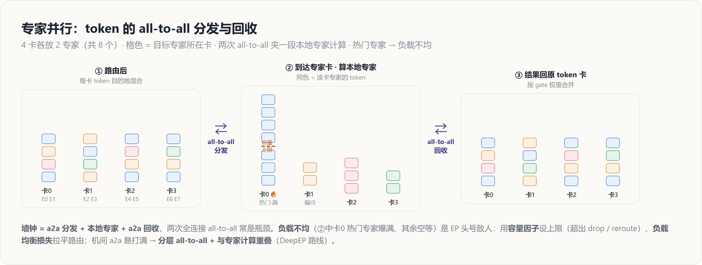

# 专家并行 EP（MoE）— 原理解读

> 层次：原理（principle）· 引擎无关
> 前置：[[10_collectives_analysis]]（all-to-all 的代价），MoE 模型见 [[../01_models/deepseek/20_deepseek_moe_analysis]]
> 实现见 [[../../02_engineering/02_train_frameworks/megatron-lm/14_megatron_ep_analysis]]、[[../../02_engineering/02_train_frameworks/torchtitan/15_torchtitan_ep_analysis]]
> 最后更新：2026-07-01

---

## 罗盘：一句话定位

**专家并行（Expert Parallelism, EP）＝ 把 MoE 的一堆专家分放到不同卡，token 经路由后用 all-to-all「送到它该去的专家卡、算完再送回来」。** MoE 用 $E$ 个专家 FFN 替换单个 FFN，每个 token 只激活 top-$k$ 个（通常 $k=1\sim2$）——**参数量涨 $E$ 倍、计算量几乎不涨**。但 $E$ 个专家一张卡放不下，于是按专家切到多卡。与 TP 的稠密规约不同，EP 的通信是**稀疏路由**：其命脉是两次 all-to-all，最大的敌人是**负载不均**。

---

## 为什么切专家用 EP 而非 TP

专家之间**彼此完全独立**（不同的 FFN 权重，不共享激活），这与 TP 面对的「一个大矩阵乘」截然不同：

- **TP 切的是一个算子内部**：切完各卡算部分和，必须 all-reduce 合并 → 稠密、每层每卡都参与。
- **EP 切的是一组独立算子**：每个专家整体放一张卡，token 只需**被送到**对应专家所在卡 → 稀疏、只有被路由到的卡才有该 token 的流量。

所以 MoE 天然按「专家」这个粒度切，用**路由 + all-to-all** 而非 all-reduce。这也决定了 EP 的代价结构完全不同。

---

## 机制：一次 MoE 层的四拍

设 4 卡，每卡 2 个专家（共 8 专家），每卡手里有若干 token：

1. **路由（gate/router）**：每个 token 过一个小 gate 网络，打分选出 top-$k$ 个目标专家。这些专家可能在**别的卡**上。此步本地、无通信。
2. **All-to-All 分发（dispatch）**：按「目标专家在哪张卡」把 token 重新分组，all-to-all 发过去。走完后，每卡收到的都是「该由本卡专家处理」的 token。
3. **专家计算**：每卡用本地专家对收到的 token 算 FFN。各卡独立、无通信。
4. **All-to-All 回收（combine）**：把每个 token 的输出**发回它原来所在的卡**，按 gate 权重加权合并（top-$k$ 时是加权和）。

一句话：**dispatch 把 token 送去专家，combine 把结果送回 token。** 两次 all-to-all 夹着一段本地专家计算。

---

## 代价：两次 all-to-all 与负载不均

**通信结构**：墙钟约为

$$
\begin{aligned}
T_{\text{MoE}}
&\approx \underbrace{T_{a2a}^{\text{dispatch}}}_{\text{送 token 去}} \\
&\quad + \underbrace{T_{\text{expert}}}_{\text{本地 FFN}} + \underbrace{T_{a2a}^{\text{combine}}}_{\text{送结果回}}
\end{aligned}
$$

两次 all-to-all 常是瓶颈。通信量 $\propto$（路由到**组外**的 token 数）$\times d$。由 [[10_collectives_analysis|分布式原语与通信代价模型]]，all-to-all 是**全连接通信**（每对 rank 都有流量），这带来两个尖锐问题：

**① 负载不均（EP 的头号敌人）**：token 路由由数据决定，某些「热门专家」会收到远超平均的 token，而它们只在一张卡上 → 那张卡的计算和收发都爆满，**其余卡空等**（木桶效应）。缓解手段：
- **容量因子（capacity factor）**：给每个专家设收 token 上限 $= \text{capacity} \times \frac{\text{tokens}}{E}$。超出的 token 被 **drop**（跳过该专家，走残差）或 **reroute**。容量大 → 浪费算力/通信；容量小 → drop 多、掉质量。这是一个成本-质量的权衡旋钮。
- **负载均衡损失（aux loss）**：训练时加一项鼓励 gate 把 token 均匀分给各专家的正则（DeepSeek 等还做 aux-loss-free 的偏置调节，见 [[../01_models/deepseek/12_deepseek_v3_analysis]]）。

**② 全连接通信打满网络**：机间做 all-to-all 极易把 IB 打满、打偏。所以 **EP 偏好机内**，或采用**分层 all-to-all**（先机内聚合、再机间交换一份），这正是 DeepEP 等库的核心优化——把两次 a2a 分层并与专家计算重叠。

---

## 组合与约束

- **EP × TP**：专家数不够分、或单个专家仍太大时，在 EP 之内再对每个专家做 TP。
- **EP × DP**：专家在 EP 组内切分、在 DP 组间复制；一个 token 的 batch 维走 DP，专家维走 EP。
- **EP 度数** 受专家数 $E$ 与可用卡数约束，且因负载不均，实际有效并行度常低于理论值 → EP 的调优核心是**让 token 尽量均匀、让 a2a 尽量重叠**。

在 N 维布局里（见 [[01_theory/06_distributed_parallelism/index|分布式并行原理]]），EP 与 TP 争抢「机内高带宽维」——因为二者都吃机内带宽、都在关键路径。

---

## Related Pages

- [[10_collectives_analysis]] — all-to-all 的代价与「全连接、怕不均」的由来
- [[13_tensor_sequence_parallel_analysis]] — TP：与 EP 争机内带宽，常组合 EP×TP
- [[11_data_parallel_analysis]] — DP：与 EP 组合时专家在组间复制
- [[01_theory/06_distributed_parallelism/index|分布式并行原理]] — N 维布局里 EP 占据机内维
- [[../01_models/deepseek/20_deepseek_moe_analysis]] — MoE 模型侧：细粒度专家、共享专家、路由设计
- [[../01_models/deepseek/12_deepseek_v3_analysis]] — aux-loss-free 负载均衡的实践
- [[../../02_engineering/02_train_frameworks/megatron-lm/14_megatron_ep_analysis]] — **实现层**：Megatron 的 EP token dispatcher 与 a2a
- [[../../02_engineering/02_train_frameworks/torchtitan/15_torchtitan_ep_analysis]] — **实现层**：torchtitan 的 EP
- [[../../02_engineering/02_train_frameworks/mindformers/mindformers_moe_token_dispatcher_analysis]] — **实现层**：token dispatcher 的分发/回收
- [[21_hw_friendly_llm_codesign_analysis]] — 推理侧视角：宽 EP 抬 GEMM-M 的定量论证（NVIDIA GB300）
- [[../01_models/moonshot_kimi/27_moonep_analysis]] — **本页“最大的敌人是负载不均”的 2026 年新答案**：MoonEP 用动态冗余专家把不均从“减小”改成“吸收”，源码级分析
