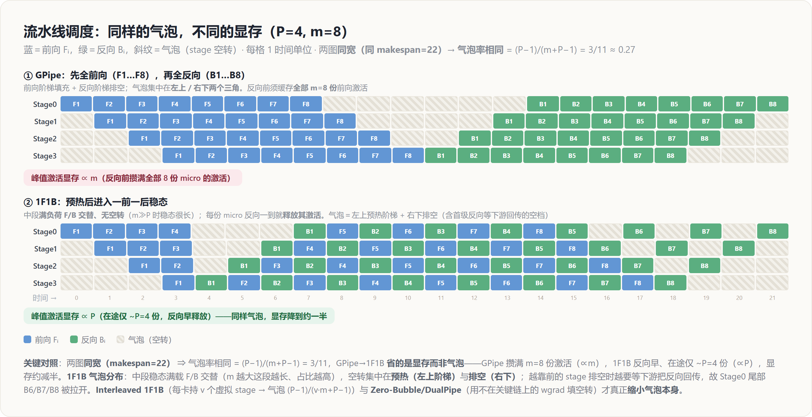

# 流水线并行 PP — 原理解读

> 层次：原理（principle）· 引擎无关
> 前置：[[10_collectives_analysis]]（p2p 的代价）
> 实现见 [[../../02_engineering/02_train_frameworks/megatron-lm/15_megatron_pp_schedulers_analysis]]、[[../../02_engineering/02_train_frameworks/torchtitan/14_torchtitan_pp_analysis]]
> 最后更新：2026-07-01

---

## 罗盘：一句话定位

**流水线并行（Pipeline Parallelism, PP）＝ 把模型按层切成若干 stage，每个 stage 放一组卡，相邻 stage 之间用 p2p 传激活（前向）和激活梯度（反向）。** 它解决「模型深到单卡放不下」，且通信**最省**：只在 stage 边界发 p2p，量 $\propto B\cdot S\cdot d$、频次 $= P$（stage 数，远低于 TP 的每层）。代价是引入**气泡（bubble）**——流水线填充和排空时，部分 stage 空闲。**PP 是唯一敢大方跨机、跨机架的模型并行维。**

---

## 为什么切层用 PP：层间本就顺序依赖

Transformer 是 $L$ 层顺序堆叠，$\text{layer}_{i+1}$ 的输入是 $\text{layer}_i$ 的输出——**层间是天然的顺序数据流**。把连续几层打包成一个 stage、stage 之间首尾相接，就得到一条流水线。通信只发生在**相邻 stage 的接缝**：前向传一份激活、反向传一份激活梯度，大小都 $\propto B\cdot S\cdot d$，**与总层数无关**，且一次迭代只发 $O(P)$ 次。

对比 [[13_tensor_sequence_parallel_analysis|TP]]（每层 4 次 all-reduce、在关键路径）：PP 的 p2p **又小又稀、只跨一对卡** → 可以放在带宽最差的机间/机架间链路。这就是 N 维并行里「**TP 待机内、PP 跨机**」分工的物理根源。

---

## 朴素 PP 的灾难：利用率只有 1/P

如果让一整个 batch 老老实实顺序流过 $P$ 个 stage：stage 0 算完传给 stage 1，此时 stage 0 就**闲了**，一直等到反向才有活干。任一时刻只有 1 个 stage 在忙，其余 $P-1$ 个空转 → **利用率仅 $1/P$**。8 段流水线浪费 7/8 的算力，完全不可接受。

**解法：microbatching。** 把一个 batch 切成 $m$ 个 micro-batch，像工厂流水线一样让它们**错峰进入**：stage 0 处理完 micro-1 就立刻开始 micro-2，同时 stage 1 处理 micro-1……稳态时所有 stage 都在忙不同的 micro-batch。

---

## 气泡率：填充与排空的固定损耗

即便 microbatching，流水线**启动**（填满 $P$ 个 stage 需要 $P-1$ 步）和**收尾**（排空需要 $P-1$ 步）时仍有空闲。这段固定损耗就是气泡：

$$\text{bubble ratio} = \frac{P-1}{m + P - 1}$$

**要点：气泡只由 $P$ 和 $m$ 决定** ——micro-batch 数 $m$ 越大，气泡越小（$m\to\infty$ 时趋于 0）。所以 PP 总想把 $m$ 开大；但 $m$ 大又会推高激活显存（见下），这正是各种调度要平衡的矛盾。

---

## 三种调度：同样的气泡，不同的显存

关键区分：**GPipe 与 1F1B 气泡率相同，差别在峰值显存；Interleaved 才真正降气泡。**

| 调度 | 做法 | 气泡率 | 峰值激活显存 | 代价 |
|---|---|---|---|---|
| **GPipe** | 所有 micro 先全部前向，再全部反向 | $\frac{P-1}{m+P-1}$ | **$\propto m$**（要缓存全部 $m$ 份激活到反向） | 显存高 |
| **1F1B** | 稳态一前一后交替，反向尽早做完即释放激活 | $\frac{P-1}{m+P-1}$（同 GPipe） | **$\propto P$**（在途激活数 = stage 数，与 $m$ 无关） | 主流选择 |
| **Interleaved 1F1B** | 每卡持 $v$ 个不连续的虚拟 stage | $\frac{P-1}{v\cdot m+P-1}$（**更小**） | $\propto P$ | p2p 次数 $\times v$ |

**为什么 1F1B 省显存**：GPipe 把 $m$ 个 micro 的前向激活全攒着，直到反向阶段才逐个消费 → 峰值要存 $m$ 份。1F1B 让每个 micro 一旦前向到底就尽快反向、随即释放其激活 → 任意时刻在途的激活只有 $\sim P$ 份。**同样的气泡，显存从 $\propto m$ 砍到 $\propto P$** ——这就是 1F1B 成为主流的原因。

**Interleaved（交错 1F1B）**：把每个 stage 再细分，让每张卡负责 $v$ 段**不连续**的层（虚拟 stage）。等效于把流水线加长 $v$ 倍，气泡按 $v$ 缩小，代价是 p2p 通信次数增加 $v$ 倍。Megatron 的 interleaved schedule 即此。

> **再进一步：Zero-Bubble / DualPipe**。把反向拆成 `dgrad`（激活梯度，在关键依赖链上）和 `wgrad`（权重梯度，不在链上），用 `wgrad` 去**填气泡**，可把气泡逼近 0。DeepSeek 的 DualPipe 还让前向、反向双向流动进一步掩盖。原理同源——**用不在关键路径的工作填空转**。

---

## 代价小结与整体布局

- **通信**：p2p，量 $\propto B\cdot S\cdot d$、频次 $O(P)$/迭代，**最省、可跨机**。
- **主要开销是气泡**，靠增大 $m$、选 1F1B/interleaved/zero-bubble 压缩。
- **PP 度数 = stage 数**；受层数与「切点能否让各 stage 计算量均衡」约束（切不匀会加剧气泡）。

在 N 维布局里（见 [[01_theory/06_distributed_parallelism/index|分布式并行原理]]），典型嵌套是 **DP（最外·跨机）× PP（跨机/机架）× TP·EP（机内）**：PP 承担「把太深的模型摊到多机」，与吃机内带宽的 TP/EP 井水不犯河水。

---

## Related Pages

- [[10_collectives_analysis]] — p2p 的代价（本页通信量的来源）
- [[13_tensor_sequence_parallel_analysis]] — TP：另一条切模型的路（切层内 vs PP 切层），二者常组合
- [[11_data_parallel_analysis]] — DP：PP 通常嵌在 DP 之内
- [[12_zero_fsdp_analysis]] — ZeRO：与 PP 正交，进一步省状态显存
- [[01_theory/06_distributed_parallelism/index|分布式并行原理]] — N 维布局里 PP 占据「跨机维」
- [[../../02_engineering/02_train_frameworks/megatron-lm/15_megatron_pp_schedulers_analysis]] — **实现层**：Megatron 的 GPipe/1F1B/interleaved 调度器
- [[../../02_engineering/02_train_frameworks/torchtitan/14_torchtitan_pp_analysis]] — **实现层**：torchtitan 的 PP 调度
- [[21_hw_friendly_llm_codesign_analysis]] — 推理侧特化：Chunked Pipeline Parallelism 压长上下文首 token 延迟
