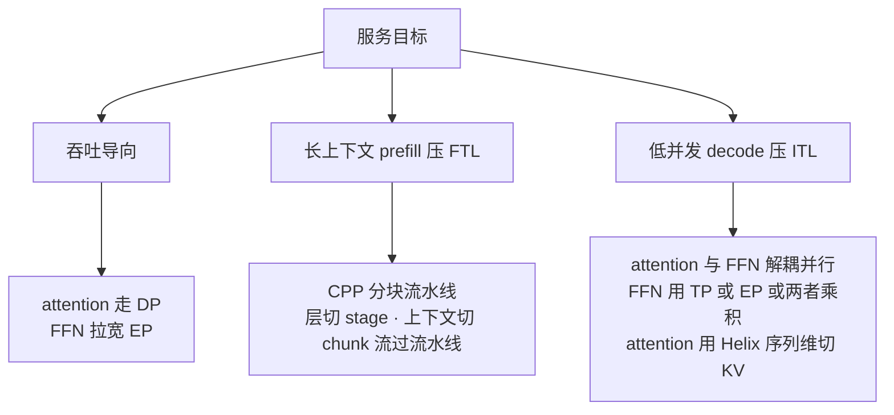

# 硬件友好的 LLM 模型设计(NVIDIA 软硬协同指南)— 模型超参就是部署性能参数

> **来源基线**: NVIDIA Developer Blog《AI Model Co-Design: Hardware-Friendly LLM Design》,2026-07-10,作者 Ritika Borkar / Nidhi Bhatia / Bhargava Gopireddy / Nick Comly / Brian Pharris / Julien Demouth / Bita Darvish Rouhani。原文快照: `raw/01_theory/06_distributed_parallelism/NVIDIA_HW_Friendly_LLM_CoDesign_2026-07-10.html`(2026-07-15 存档)。文中自述为**系列第一篇**("Each subsequent chapter of the series…")。
> **维度**: Entity 深析(机制级)。定位符 = 原文小节名 / Table / Figure / Guideline 编号。数字均基于 **GB300 (Blackwell Ultra)**,迁移到其它硬件时结论定性成立、阈值需重标定。
> **视角声明**: 这是 NVIDIA 的硬件本位叙事(推销 NVFP4/TensorRT-LLM 生态),但其 roofline/GEMM 论证是通用的第一性原理,本页照录机制、在 §7 单独评注立场偏差。

---

## 一、主线

**一句话: H、H'、层数 L、维度对齐、量化精度这些"模型结构超参",直接决定推理时每个 GEMM 落在 roofline 的哪一侧、以及并行策略能不能把它救回来——所以它们应当作为部署性能参数在设计期就锁定,而不是训练完再让 infra 团队兜底。** 全文 7 条 Guideline(原文均有编号,逐条核录):

| # | Guideline(意译) | 机制依据 | 出处 |
|---|---|---|---|
| 1 | 权重矩阵尽量近方阵,投影/归约维都别太小 | 方阵算术强度最高(§三) | Guideline 1 |
| 2 | 维度至少是 128 的倍数,优先 256/512 | tile 量化效应(§三) | Guideline 2 |
| 3 | 少而大的算子优于多而小的;宽优于深 | 权重复用 + 串行关键路径(§三) | Guideline 3 |
| 4 | 昂贵算子设计时就考虑能否低精度部署 | NVFP4 双层缩放(§四) | Guideline 4 |
| 5 | 稀疏 MoE 靠拉宽 EP 拿吞吐 | GEMM-M 公式(§五) | Guideline 5 |
| 6 | 层模式规则可重复,便于切均衡流水级 | CPP 气泡(§六) | Guideline 6 |
| 7 | attention 与 FFN 的并行化解耦设计 | KV 头数限制 TP / Helix(§六) | Guideline 7 |

## 二、问题框架: 三维目标与部署象限

- 性能三维 = **accuracy / throughput(tokens/s/数据中心)/ interactivity(首 token 延迟 FTL + token 间延迟 ITL)**;固定 accuracy 后是吞吐-交互性的二维 Pareto 前沿,目标是把整条前沿外推(Fig. 1)。
- 部署象限(Fig. 2): 上下文长短 × 吞吐/延迟导向。**长上下文+吞吐导向的时间大头在 attention**;原文举例: 若 attention 占 77% 运行时间,调 FFN 收益甚微——**Amdahl 定律先于一切优化,先测清自己所在象限**("Deployment landscape" 节)。

## 三、线性层定维: 让 GEMM 站进 compute-bound 区

**Roofline 记账**("Role of arithmetic intensity" 节): GEMM $C_{M\times N}=A_{M\times K}B_{K\times N}$,
$$\text{FLOPs}=2MNK,\quad \text{Read}=MK\,b_A+NK\,b_B,\quad \text{Write}=MN\,b_C$$
transformer 各线性层的映射(Table 1): M = Tokens(并发×序列长),QKV 投影 N=3H/K=H,输出投影 N=K=H,FFN-1 N=H'/K=H,FFN-2 N=H/K=H'。

- **方阵论证**: 当 Tokens=H'=H 时,单 GEMM 做 $2H^3$ FLOPs、只动约 $3H^2$ 个元素,算术强度随 H 增长——**任一维过小,token 维再大也救不回来**。
- **反例定量化**(Table 2,GB300 = 15 PFLOPS FP4 峰值 + 8 TB/s): FFN-2 取 H'=512、H=8192(FP4 读/FP8 写),M 从 256 扫到 16384,**访存时间始终压过计算时间**(M=16384: math 9.16µs vs 写 16.8µs)——小归约维把层钉死在 memory-bound,且低精度下"写比读贵"(输出 FP8 是输入 FP4 的两倍字节)。
- **实测阈值**(Fig. 4,NVFP4 GEMM): 归约维 K 在 ≈6144 饱和,**80% 持续吞吐需 K>3072**;投影维 N 同样 ≈6144 饱和,**80% 需 N>2560**。
- **Tile 量化效应**(Fig. 5): GPU 按 tile 切输出矩阵,clusterMMA 两 SM 合作一 tile、CGA 一簇 SM 合作;256×128 基础 tile + clusterMMA + 4×2 CGA 下,吞吐在 N 为 **256 的倍数(clusterMMA)/512 的倍数(CGA)** 处出现局部极大;非对齐时边缘 tile 空转。**128 的倍数是可移植的地板,256/512 吃满合作 tile**(Guideline 2 原文)。
- **宽 vs 深**("Wider models…" 节): 等参数预算下,宽模型算术强度更高(权重复用更多)、串行关键路径更短,吞吐延迟双赢。**但原文自带刹车**: 深度贡献表征能力,"there is a useful width-to-depth band rather than 'wider is always better'"——精度守得住才加宽,不为宽而砍层。

## 四、量化: NVFP4 的双层缩放

机制("Quantization as a performance lever" 节): 每 **16 个值的 micro-block 配一个 FP8 (E4M3) 细粒度 scale,整张量再配一层 FP32 scale**——两级缩放压量化误差,保 4-bit 计算速度。量化同时抬 FLOPS 上限、降访存流量,**compute-bound 和 memory-bound 两侧同时受益**(这是它区别于只帮一侧的其它优化的关键)。

证据(Fig. 7,DeepSeek-R1,基线 FP8): NVFP4 在多数基准差距约 1 分以内,**SciCode / Math-500 / AIME 2024 上持平或反超 FP8**(图注原文)。工具链: TensorRT Model Optimizer、LLM Compressor(PTQ/QAT/校准);训练侧另见其 Pretraining with NVFP4 论文(NVIDIA Research 2025)。

## 五、吞吐导向: 把 EP 拉宽

("Large expert parallelism boosts throughput" 节)标准配方 = **attention 走 DP + 专家跨卡 EP**。为什么 attention 不用 TP: TP 合并部分结果的 AllReduce 开销随并发增长,吞吐场景是毒药;DP 加卡直接抬全局并发。均匀路由假设下:

$$\text{GEMM-}M=\frac{\text{全局并发}\times\text{top-}k}{\#\text{experts}}\qquad(\text{DeepSeek-R1: top-}k=8,\ 256\ \text{experts})$$

**GEMM-M 随并发涨、随稀疏度缩**——稀疏 MoE 的 per-expert 有效 batch 被除以 32(=256/8),而单卡并发又被 KV cache 显存卡死,所以**拉宽 EP 是抬 GEMM 利用率的主杠杆**。即使 per-expert batch 仍小,宽 EP 还有两笔白赚: ① 聚合内存带宽变大,读专家权重更快;② 每卡只存部分专家,腾出的显存反哺并发。代价 = all-to-all 通信 + 专家负载不均,原文把解托付给 TensorRT-LLM 的 Wide-EP(高性能 all-to-all kernel + 实时自适应负载均衡器)。

## 六、交互性导向: CPP 与 Helix

前提是 **prefill/decode 分离**(引其 2025 论文 Beyond the Buzz, arXiv 2506.05508),两阶段各自选并行:

- **CPP(Chunked Pipeline Parallelism)**: 层跨卡切 stage,同时把输入上下文切成 chunk 流过流水线——不必靠拉宽 TP 就能在紧 FTL 预算内啃长序列。证据(Fig. 9): DeepSeek-R1 prefill @ 256K 输入,PP 规模增大时 **FTL 稳步下降而 tokens/s/GPU 基本不变**。前提是 stage 均衡,否则气泡空转 → 模型侧配合项就是 Guideline 6 的"规则可重复层模式"。
- **低并发 decode 的困境**: 缩 batch 只降 attention 延迟,FFN 的 N/K 不随 M 缩,权重读取($N\times K$)成为 memory-bound 瓶颈 → FFN 要靠 TP/EP/TP×EP 摊权重(**粗粒度大专家适合 TP,细粒度小 H' 专家适合 EP**——TP 会把本就小的 GEMM 切得更碎,原文明说)。
- **Helix Parallelism**(arXiv 2507.07120): attention 的 TP 上限是 KV 头数,超过就得复制 KV cache 做冗余功——**MQA/GQA/MLA 时代 KV 头极少,这个墙来得很早**。Helix 在 attention 阶段把 **KV cache 沿序列维切分**,过后**同一批 GPU 复用去做 FFN 的 TP×EP**;额外通信靠 NVL72 的 NVLink 域吸收 + 计算重叠。

## 七、边界与本库评注(以下为本库推断/立场标注,非原文)

- **立场偏差**: 阈值(K>3072、N>2560、128/256/512 对齐)全部是 GB300 + NVFP4 的实测,别当跨硬件常数;工具解全部指向自家 TensorRT-LLM。定性结论(方阵、对齐、宽深、解耦)是 roofline 层面的通用原理,可移植。
- **与细粒度 MoE 路线的张力**: 博客 Table 2 的"小 K 反例"(K=512)恰是 DeepSeek 系细粒度专家路线的日常形态——原文自己的和解方案是 §五: 小专家的 GEMM-M 靠宽 EP 的并发聚合抬起来,并明说细粒度 MoE 该用 EP 而非 TP。对照 [[hy3_analysis]]: Hy3 专家中间维 1536(= 6×256,对齐达标)但作为 FFN-2 的 K 仍远低于 3072 阈值——同样要靠 EP 并发兜底,印证两条路线的耦合关系。
- **训练视角缺位**: 全文只谈推理;宽深比、维度对齐同样影响训练效率,但训练侧的约束(如 PP 气泡对 micro-batch 的要求、MFU)不在其范围,本域训练侧原理见 [[15_pipeline_parallel_analysis]] / [[14_expert_parallel_analysis]]。
- **attention 内核不在本篇**: 长上下文象限时间大头在 attention(其 Fig. 2 自述),但本篇只给了并行化(Helix)一条路,稀疏化路线见 [[stem_sparse_attention_analysis]] 一类工作,属互补维度。

## Related Pages

- [[01_theory/06_distributed_parallelism/index|分布式并行原理]] — 分布式并行原理域入口(α-β 代价模型是本页 roofline 记账的姊妹尺)
- [[14_expert_parallel_analysis]] — EP 原理与 all-to-all 代价,本页 §五的原理底座
- [[15_pipeline_parallel_analysis]] — PP 气泡与调度,CPP 是其推理 prefill 特化
- [[13_tensor_sequence_parallel_analysis]] — TP/SP/CP 原理;Helix 的序列维 KV 切分与 CP 同轴
- [[10_collectives_analysis]] — AllReduce/all-to-all 原语代价
- [[24_deepseek_v4_fp4_qat_analysis]] — FP4 的训练侧实践(QAT),与 §四 NVFP4 部署侧互补
- [[12_deepseek_v3_analysis]] — 博客通篇的实验模型 DeepSeek-R1 之底座(256 专家 top-8)
- [[hy3_analysis]] — §七评注的对照样本(1536 专家维 vs K>3072 阈值)
- [[longcat_flash_analysis]] — 宽 EP + 计算通信重叠的工业实践
- [[26_glm5_low_precision_chip_deepdive]] — 低精度与芯片协同的另一家叙事,可对照 NVIDIA 立场
