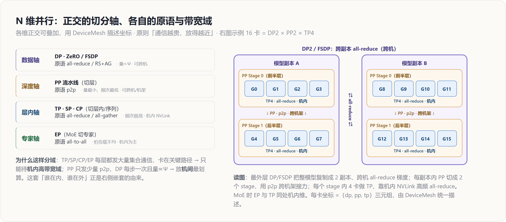

# 分布式并行原理 — 目录索引

> 覆盖：分布式集合原语 → DP → TP/SP/CP → EP → PP → ZeRO/FSDP → N 维组合
> 层次：**原理（principle）· 引擎无关**——讲「为什么这么切、代价函数长什么样」；「源码怎么实现」交叉链接到 [[../../02_engineering/index|工程实现]] 各页，不重复
> 最后更新：2026-07-15

---

## 罗盘：一句话定位

单卡训练里「谁和谁通信」不是问题；一旦模型或数据大到单卡放不下，**所有分布式并行都归结为同一句话**——把某个张量在一组进程间、用某个**集合原语**、在某个**时机**同步，使这组进程算出与单卡**等价**的结果。不同并行的差别只在三点：**切什么张量、用哪个原语、在什么时机同步**。理解并行的钥匙，是两根贯穿全簇的主线：

- **通信代价**：$\alpha$-$\beta$ 模型（$T=\alpha+n/B_w$），决定「一次同步多贵、能不能跨机」。
- **显存账本**：参数 $\Psi$ / 梯度 / 优化器态 / 激活，决定「为什么非切不可、该切哪一样」。

本簇先用 [[collectives_analysis]] 打好这两把尺子，再用它们丈量每一种并行。

---

## 全景：正交的切分轴与设备布局



各并行维**彼此正交、可自由叠加**，用 `DeviceMesh` 描述每张卡在各维上的坐标。核心分工由**通信代价 + 带宽域**决定：**通信量大、频次高的（TP/SP/CP/EP）挤进机内高带宽域，通信量小的（DP/PP）才敢跨机**。

---

## 显存 / 通信总账（一表看全）

| 并行 | 切什么 | 主原语 | 单步通信量级 | 省什么显存 | 带宽域 | 详见 |
|---|---|---|---|---|---|---|
| **DP** | 数据（复制模型） | all-reduce 梯度 | $\propto\Psi$，与 batch 无关 | 不省（复制 $16\Psi$） | 可跨机 | [[data_parallel_analysis]] |
| **ZeRO-1/2** | 优化器态 / 梯度 | RS + AG | $\approx\Psi$（同 DP） | 状态 → $\sim14\Psi/N$ | 可跨机 | [[zero_fsdp_analysis]] |
| **ZeRO-3 / FSDP** | + 参数 | RS + AG（多一次 AG） | $\approx 1.5\times$ DP | 状态 → $16\Psi/N$ | 可跨机 | [[zero_fsdp_analysis]] |
| **TP** | 层内权重（隐藏维/头） | all-reduce（4 次/层） | $\propto B\!\cdot\!S\!\cdot\!d$，频次极高 | 权重+激活 → $1/N$ | **机内** | [[tensor_sequence_parallel_analysis]] |
| **SP** | 序列维激活（TP 区外） | RS + AG（替代 TP 的 AR） | 同 TP | 激活 → $1/N$ | 机内 | [[tensor_sequence_parallel_analysis]] |
| **CP** | 序列维 Q/K/V | ring 交换 / AG KV | $\propto B\!\cdot\!S\!\cdot\!d$ | 长序列激活 → $1/N$ | 机内 | [[tensor_sequence_parallel_analysis]] |
| **EP** | 专家（MoE） | all-to-all（×2） | $\propto$ 组外 token 数 | 专家参数 → $1/N$ | 机内（怕不均） | [[expert_parallel_analysis]] |
| **PP** | 层（stage） | p2p（相邻 stage） | $\propto B\!\cdot\!S\!\cdot\!d$，频次最低 | 模型深度摊到多机 | **可跨机/机架** | [[pipeline_parallel_analysis]] |

**一句话总纲**：DP/ZeRO 靠 all-reduce 族（挂钩参数量、可跨机）；TP/SP/CP 靠 all-gather/reduce-scatter（挂钩激活、频次高、只敢机内）；EP 靠 all-to-all（怕负载不均）；PP 靠 p2p（最省、可远距离）。

---

## 建议阅读顺序

1. **[[collectives_analysis]]** — 分布式原语 + $\alpha$-$\beta$ 代价模型（**先读**，后面都引用它的记法）
2. **[[data_parallel_analysis]]** — DP：最简单的并行，引出「显存冗余」问题
3. **[[zero_fsdp_analysis]]** — ZeRO/FSDP：DP 的省显存版（同一数据轴）
4. **[[tensor_sequence_parallel_analysis]]** — TP/SP/CP：当模型本身放不下时切层内 / 序列
5. **[[expert_parallel_analysis]]** — EP：MoE 的专家路由（读完可接 [[../01_models/moonshot_kimi/moonep_analysis|MoonEP 源码级分析]]，看“负载不均”这个老问题在 2026 年被怎样从“减小不均”改成“吸收不均”）
6. **[[pipeline_parallel_analysis]]** — PP：切层、气泡与调度

---

## 页面列表

| 页面 | 核心主题 |
|------|---------|
| [[collectives_analysis]] | 六大原语语义、$\alpha$-$\beta$ 模型、all-reduce = RS+AG、ring 带宽最优性 |
| [[data_parallel_analysis]] | DP：复制模型/切数据、all-reduce 梯度、$16\Psi$ 账本、通信重叠 |
| [[zero_fsdp_analysis]] | ZeRO 1/2/3 逐级切状态、通信 vs DP 增量、ZeRO-3 = FSDP |
| [[tensor_sequence_parallel_analysis]] | TP（列切/行切 + f/g）、SP（零额外通信换激活）、CP（ring-attention） |
| [[expert_parallel_analysis]] | EP：路由 + 两次 all-to-all、容量因子、负载均衡 |
| [[pipeline_parallel_analysis]] | PP：microbatching、气泡率、GPipe / 1F1B / interleaved |
| [[hw_friendly_llm_codesign_analysis]] | NVIDIA 软硬协同指南：GEMM roofline 定维、tile 对齐、NVFP4、宽 EP、CPP、Helix（推理侧视角） |

---

## N 维组合：怎么把它们叠起来

各维正交，实践中按「**通信越贵、放得越近**」的原则嵌套（用 `DeviceMesh` 表达）。一个典型的大模型（含 MoE）布局，从外到内：

```
DP / FSDP（最外，跨机）
  └── PP（跨机 / 跨机架，p2p 最省）
        └── TP · SP · EP（机内 NVLink，通信最重）
              └── CP（长序列时叠加，机内）
```

- **为什么这个顺序**：TP/EP 每层都发大量 all-reduce/all-to-all、在关键路径 → 必须机内；PP 只发少量 p2p → 可跨机；DP/FSDP 每步一次、量 $\propto\Psi$ → 放最外层的机间维最划算。
- **自动求解这套布局**属另一课题——搜索空间、代价模型、搜索算法，见 [[../../02_engineering/06_auto_parallel/index]]。

---

## 关联域

- [[../../02_engineering/01_ai_frameworks/15_distributed_primitives/index]] — **实现层**：c10d / DDP / FSDP / DTensor·TP·PP 的 PyTorch 源码
- [[../../02_engineering/02_train_frameworks/index]] — **实现层**：Megatron-LM / torchtitan 把这些原语组合成端到端训练配方
- [[../../02_engineering/06_auto_parallel/index]] — 自动并行：自动求解 N 维布局
- [[../02_pretraining/index]] — 预训练技术：优化器、低精度、激活重计算（与并行正交的另一组显存/算力手段）
- [[../01_models/moonshot_kimi/moonep_analysis]] — **EP 负载均衡的 2026 年新解法（源码级）**：MoonEP 用动态冗余专家把“每 rank 恰收 `S×K`”变成硬保证；因属 Kimi K3 栈，页面收在模型目录

## Related Pages

- [[../index]] — 理论研究知识地图
- [[../../index]] — 知识库总索引
- [[../../changelog]] — 变更日志
