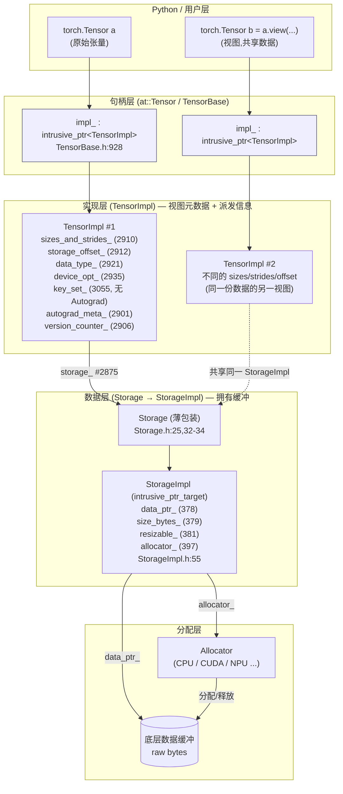

# 00 · Tensor 与 Storage(张量表达机制) — 目录索引

> 层次:overview
> 核验基准:PyTorch upstream `E:\97-codes\pytorch\pytorch`(v2.13.0a0, commit 9922478)
> 最后更新:2026-06-15

---

## 一、模块概述

### 是什么

在 Python 里 `torch.Tensor` 看起来是个"数组对象",但在 C++ 表面之下,一个张量被拆成**三层、各司其职**的结构:

1. **`at::Tensor` / `TensorBase`** —— 只是一个**胖指针(句柄)**。它的全部状态就是一个成员:
   ```cpp
   c10::intrusive_ptr<TensorImpl, UndefinedTensorImpl> impl_;
   ```
   见 `aten/src/ATen/core/TensorBase.h:93`(`class TORCH_API TensorBase`)、`aten/src/ATen/core/TensorBase.h:928`(`impl_` 字段)。空张量的 NullType 是单例 `UndefinedTensorImpl` 而非 `nullptr`。

2. **`TensorImpl`** —— 张量的"真身"。它持有**这一视图(view)的元数据**:`sizes` / `strides` / `storage_offset`、`dtype`、`device`、以及一组描述如何派发的 **dispatch keys**;同时持有一个指向数据缓冲的 `Storage`。定义见 `c10/core/TensorImpl.h:510`(`struct C10_API TensorImpl : public c10::intrusive_ptr_target`),其类总览 doc 注释在 `c10/core/TensorImpl.h:439-509` 完整阐述了这套设计。

3. **`Storage` → `StorageImpl` → `Allocator`** —— **真正拥有底层数据缓冲**的一层。`Storage` 是 `intrusive_ptr<StorageImpl>` 的薄包装(`c10/core/Storage.h:25`,字段在 `c10/core/Storage.h:32-34`);`StorageImpl`(`c10/core/StorageImpl.h:55`)持有 `data_ptr_` / `size_bytes_` / `resizable_` / `allocator_`(字段在 `c10/core/StorageImpl.h:378-397`),数据的实际申请/释放委托给 `Allocator`。

一句话:**`Tensor = intrusive_ptr<TensorImpl>`;`TensorImpl` 描述"怎么看这块数据",`StorageImpl` 拥有"这块数据本身"。**

### 为什么这么分:句柄/视图/数据三分

这套句柄(handle)与实现(impl)分离、视图元数据与数据缓冲分离的设计,直接服务于 PyTorch 最核心的两个语义:

- **零拷贝视图(view)与别名(alias)**:`x.view(...)`、`x.t()`、`x[1:3]`、`as_strided(...)` 等不复制数据——它们只新建一个 `TensorImpl`,改写其 `sizes`/`strides`/`storage_offset`,然后让它**指向同一个 `StorageImpl`**。多个视图共享一份缓冲,各看各的形状。源码总览 doc 在 `c10/core/TensorImpl.h:447-455` 明确给出此理由("This allows multiple tensors to alias the same underlying data")。

- **跨语言、可裸指针操作的引用计数**:`TensorImpl`/`StorageImpl` 都继承 `intrusive_ptr_target`(`c10/util/intrusive_ptr.h:144`)。相比 `shared_ptr`,intrusive 计数把引用计数内嵌进对象自身——少一次堆分配,且可以在裸指针上做计数操作,便于跨 C++/Python 边界传递(理由见 `c10/core/TensorImpl.h:457-461`)。计数本身用一个 64-bit 原子量 `combined_refcount_`(`c10/util/intrusive_ptr.h:188`)同时打包 strong/weak 计数,最高位 `kHasPyObject` 还用于在 C++ 引用存活期间保活对应的 Python 包装对象(`Note [PyObject preservation...]`,`c10/util/intrusive_ptr.h:171-186`)。

- **数据生命周期 = 引用计数**:`StorageImpl` 的不变量是"一份数据对应一个 `StorageImpl`";当最后一个引用消失,`Allocator` 的 deleter 释放缓冲。该不变量的代价与违反后果(deleter、deepcopy 的 storage-equality、版本计数全失效)写在 `c10/core/StorageImpl.h:40-54` 的设计 Note。

### 在框架中的定位:dispatcher 与 autograd 之下的地基

本模块是 PyTorch 运行时的**最底层数据模型**。它向上支撑两套机制,但自己不实现它们,只提供原语:

- **向 dispatcher(见 [[01_dispatcher_and_device/index]])**:每个 `TensorImpl` 持有 `key_set_`(`c10/core/TensorImpl.h:3055`),dispatcher 对所有输入张量的 keyset 取并、再选最高优先级派发。务必注意:`key_set_` **不含 Autograd**——注释在 `c10/core/TensorImpl.h:3052-3054` 明确写 "NB: this does NOT include Autograd"。
- **向 autograd(见 [[10_eager_autograd/index]])**:`TensorImpl` 持有 `autograd_meta_`(`c10/core/TensorImpl.h:2901`,默认 `nullptr` 表示不 require grad)与独立的 `version_counter_`(`c10/core/TensorImpl.h:2906`)。版本计数刻意放在 `TensorImpl` 而非 `AutogradMeta`,以避免前向保存张量时惰性初始化引入数据竞争(详见 deepdive)。

换言之:**Tensor/Storage 是地基,dispatcher 决定"算子去哪",autograd 决定"梯度怎么传",二者都建立在本层的字段之上。**

### 全景图:Tensor → TensorImpl → StorageImpl → Allocator



图中 `a` 与 `b` 是同一份数据的两个视图:两个独立的 `TensorImpl`(各自的 sizes/strides/offset),通过各自的 `storage_` 字段(`c10/core/TensorImpl.h:2875`)指向**同一个** `StorageImpl`;数据的真正所有权与生命周期落在 `StorageImpl` 的引用计数上,缓冲由 `Allocator` 申请/释放。判断两个 `Storage` 是否别名同一缓冲,用 `isSharedStorageAlias()`(`c10/core/Storage.h:21`)。

---

## 二、页面列表(按层次)

| 页面 | 层次 | 核心主题 |
|------|------|---------|
| [[tensor_internals_quickstart]] | **quick start** | 怎么"看穿"一个张量:从 Python 读 `sizes()`/`strides()`/`storage_offset()`/`is_contiguous()`/`dtype`/`device`(访问器 `TensorImpl.h:615/783/749/856/1731/1293`);用 `.untyped_storage().data_ptr()` 验证视图共享数据;`MemoryFormat` 枚举易错点(`Contiguous=0, Preserve=1`,`torch/headeronly/core/MemoryFormat.h:29-35`);`TensorOptions` → dispatch key(`c10/core/TensorOptions.h:136/447`);dtype 的 `TypeMeta ↔ ScalarType` 桥接 |
| [[tensor_impl_and_storage_analysis]] | deep dive | `TensorImpl` 字段与位域全景、`SizesAndStrides` 紧凑存储、访问器 fastpath/policy 机制、contiguity 缓存与 memory-format 推断、视图/`shallow_copy`/版本计数共享、`DispatchKeySet`(functionality 位 vs backend 位、为何取并派发)、`SymInt` 符号形状、`AutogradMeta` 解耦与惰性初始化、`PyObjectSlot`/intrusive 引用计数与 PyObject 保活、未初始化态与 `UndefinedTensorImpl` 单例 |

---

## 三、关联域

- [[01_dispatcher_and_device/index]] —— dispatcher 如何消费 `TensorImpl::key_set_`;`TensorOptions::computeDispatchKey` 如何把 dtype/layout/device 归一化为 backend key。深析见 [[pytorch_dispatcher_analysis]]。
- [[10_eager_autograd/index]] —— `autograd_meta_` 与 `version_counter_` 如何支撑反向图与原地修改检测;为何版本计数放在 `TensorImpl` 而非 `AutogradMeta`。
- [[03_aot_autograd/index]] —— `SymInt` 符号形状(`has_symbolic_sizes_strides_`)在 export / AOTAutograd 动态形状下的角色。
- [[07_op_registration/index]] —— 算子注册的供给侧:算子最终读写的正是本层的 `sizes`/`strides`/`storage`。
- [[01_ai_frameworks/index]] —— 本域总索引。

---

## Related Pages

- [[tensor_internals_quickstart]]
- [[tensor_impl_and_storage_analysis]]
- [[01_dispatcher_and_device/index]]
- [[pytorch_dispatcher_analysis]]
- [[03_aot_autograd/index]]
- [[07_op_registration/index]]
- [[10_eager_autograd/index]]
- [[01_ai_frameworks/index]]
