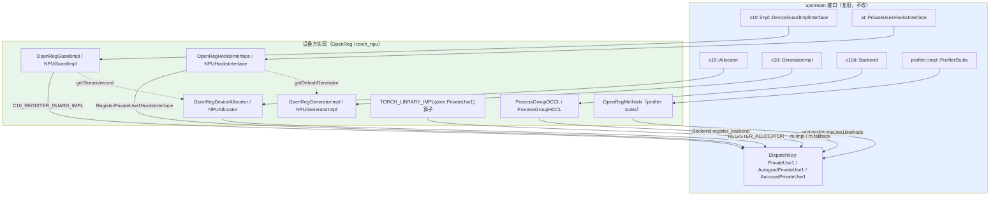

# PyTorch PrivateUse1 out-of-tree 芯片接入全解析

> 第三方芯片**不改 PyTorch 源码**、通过 PrivateUse1 接入 PyTorch 的完整接入面。本页**对齐 PyTorch 官方加速器接入指南**（`docs/source/accelerator/`，与官方参考后端 `torch_openreg` 代码同步），按官方 **9 个接入点**（device / hooks / guard / autoload / operators / amp / profiler / distributed / ci）逐一展开「做什么 / 为什么 / 怎么做」，每个点配 OpenReg 参考代码 + torch_npu 生产实现 + 类关系 + 复用对照。
>
> 基于版本：PyTorch 上游 `E:\97-codes\pytorch\pytorch`、torch_npu `E:\97-codes\pytorch\torch_npu` 当前 checkout
> 分析日期：2026-06-13
> 权威来源：① 官方指南 `pytorch/docs/source/accelerator/*.md`；② 官方参考后端 `pytorch/test/cpp_extensions/open_registration_extension/torch_openreg/`（下称 **OpenReg**，是 in-tree 的 PrivateUse1 测试后端 + 接入范例）；③ 生产实现 torch_npu。

---

## 目录

1. [为什么：out-of-tree 的设计哲学与权威框架](#1-为什么out-of-tree-的设计哲学与权威框架)
2. [9 个接入点总览](#2-9-个接入点总览)
3. [接入点 1：Device 管理](#3-接入点-1device-管理)
4. [接入点 2：Guard](#4-接入点-2guard)
5. [接入点 3：Hooks](#5-接入点-3hooks)
6. [接入点 4：Operators](#6-接入点-4operators)
7. [接入点 5：AMP](#7-接入点-5amp)
8. [接入点 6：Autoload](#8-接入点-6autoload)
9. [接入点 7：Profiler](#9-接入点-7profiler)
10. [接入点 8：Distributed](#10-接入点-8distributed)
11. [接入点 9：CI](#11-接入点-9ci)
12. [运行时底层组件（承载在 1/2/3 背后）](#12-运行时底层组件承载在-123-背后)
13. [类关系图](#13-类关系图)
14. [复用 upstream vs 必须自写](#14-复用-upstream-vs-必须自写)

---

## 1. 为什么：out-of-tree 的设计哲学与权威框架

PrivateUse1 是 PyTorch 预留的一个**匿名设备 DispatchKey**（`c10/core/DispatchKey.h`）。自 PyTorch 2.1 起，社区把它打磨成第三方加速器接入的**官方主流路径**：厂商**不修改 upstream 代码**，只在一组预留扩展点上「填实现 + 调注册」，就能接入。其价值（官方 `index.md`）：

- **速度**：扩展性内建于所有核心模块，厂商在自己的下游代码独立接入，不受社区评审带宽限制；
- **面向未来**：这是所有未来 PyTorch 特性的默认接入路径，新模块会自动支持按此路径接入的加速器；
- **自主**：厂商完全掌控接入节奏。

官方指南围绕**四大轴**组织：**Runtime**（Event / Stream / Memory / Generator / Guard / Hooks + C++ 脚手架）、**Operators**、**Python Frontend**、**High-level Modules**（AMP / Compiler / Distributed 等）；落到文档是 9 个章节（接入点）。**OpenReg** 是官方最小参考后端（用 CPU 模拟一个类 CUDA 设备），每个接入点都有对应代码；**torch_npu** 是 Ascend 的生产实现。

> 命名前置（所有接入点的基础）：`c10::register_privateuse1_backend("npu")` 把字符串名绑到 PrivateUse1，`torch.utils.rename_privateuse1_backend("npu")` 让 Python 侧 `device='npu'`/`tensor.npu()` 可用。torch_npu 在 `NPUGuardImpl.cpp:281-290`（`REGISTER_PRIVATEUSE1_BACKEND` 宏，靠静态初始化在 `.so` 加载时触发）+ `_init/registry/backend.py:7`。

## 2. 9 个接入点总览

| # | 接入点 | 接什么（注册点 + 接口） | OpenReg 代码 | torch_npu |
|---|--------|----------------------|-------------|-----------|
| 1 | **Device 管理** | `set/get/exchange_device`、`device_count` + pybind + Python API | `Module.cpp:53-105`、`OpenRegFunctions.cpp` | `c10_npu::SetDevice/GetDevice`、`csrc/npu/Module.cpp` |
| 2 | **Guard** | `c10::impl::DeviceGuardImplInterface` + `C10_REGISTER_GUARD_IMPL` | `OpenRegGuard.h:15` | `NPUGuardImpl.h:30` / `.cpp:280` |
| 3 | **Hooks** | `at::PrivateUse1HooksInterface` + `RegisterPrivateUse1HooksInterface` | `OpenRegHooks.cpp:6-10` | `NPUHooksInterface` |
| 4 | **Operators** | `TORCH_LIBRARY_IMPL(aten,PrivateUse1)` + fallback + STUB + 自定义 + meta | `OpenRegMinimal.cpp:119/141/148` | op-plugin（约 1393 func） |
| 5 | **AMP** | `AutocastPrivateUse1` key + `KERNEL_PRIVATEUSEONE` + `get_amp_supported_dtype` | `amp/autocast_mode.cpp` | torch_npu autocast |
| 6 | **Autoload** | `setup.py` 的 `entry_points` + `_autoload()` | `setup.py` / `__init__.py` | torch_npu autoload |
| 7 | **Profiler** | `profiler::impl::ProfilerStubs` + `registerPrivateUse1Methods` | `profiler/stubs/openreg.cpp` | torch_npu profiler stubs |
| 8 | **Distributed** | `c10d::Backend` 子类 + `Backend.register_backend(devices=[...])` | `ProcessGroupOCCL` + `distributed/init.cpp` | `ProcessGroupHCCL` |
| 9 | **CI** | 接入 PyTorch CI 测试矩阵，保证机制不回退 | `ci.md` | — |

> 运行时底层组件（Memory Allocator / Stream / Event / Generator / Host-pinned Allocator / Serialization）**没有各自单独成章**，而是承载在 device/guard/hooks 背后的 `csrc/runtime/` 里——OpenReg `csrc/runtime/` 正好 9 个文件（`OpenRegFunctions/Guard/Hooks/Generator/Stream/Event/DeviceAllocator/HostAllocator/Serialization`）。详见 §12。

---

## 3. 接入点 1：Device 管理

- **做什么**：封装芯片 runtime 的设备增删查改——`device_count` / `current_device` / `set_device` / `exchange_device` / `maybe_exchange_device`。
- **为什么**：这是 stream、event、memory、guard 的基石；guard 的 RAII 切换、tensor 的设备放置都依赖它。`exchange_device`（原子换设备并返回旧设备）专为 RAII guard 设计。
- **怎么做**（三段）：① C++ 包裹 runtime API + 错误处理（OpenReg `OpenRegFunctions.cpp` 的 `SetDevice`）；② pybind 绑定到 Python（`Module.cpp:53-105` 的 `_setDevice/_getDevice/_exchangeDevice/_getDeviceCount` + `PyMethodDef methods[]`）；③ 用户友好的 Python API（`torch.npu.set_device(idx)`）。映射关系：`_C._set_device` → `torch.openreg.set_device`。
- **torch_npu**：`c10_npu::SetDevice/GetDevice`（被 NPUGuardImpl 委托）+ `csrc/npu/Module.cpp` 绑定 + `torch_npu/npu` Python API。
- **复用**：命名后端框架（`c10/core/Device.cpp`）、`device_lazy_init` / fork handler。

## 4. 接入点 2：Guard

- **做什么**：RAII 的设备 / 流 / 事件管理——进入作用域切换、离开自动恢复。一个 `DeviceGuardImplInterface` 实现同时覆盖三类。
- **为什么**：保证算子在指定设备/流上执行，无论全局状态如何；`c10::DeviceGuard`/`StreamGuard` 是模板薄封装，运行时查表调到设备实现。
- **怎么做**：实现 `c10::impl::DeviceGuardImplInterface`，`C10_REGISTER_GUARD_IMPL(PrivateUse1, …)` 注册。三类虚函数（OpenReg `OpenRegGuard.h:15` 一个类全实现）：
  - **Device**：`exchangeDevice`(`:35`→`ExchangeDevice`) / `setDevice` / `getDevice` / `uncheckedSetDevice` / `deviceCount`(noexcept，出错返 0) / `synchronizeDevice`
  - **Stream**：`getStream`(`:100`→`getCurrentOpenRegStream`) / `getDefaultStream` / `getNewStream` / `getStreamFromGlobalPool` / `exchangeStream` / `queryStream` / `synchronizeStream`
  - **Event**：`record`(`:180`→`orEventRecord`) / `block`(→`orStreamWaitEvent`) / `queryEvent` / `synchronizeEvent` / `destroyEvent` / `elapsedTime`
  这一层正是把 **Stream / Event** 两个 runtime 组件挂进框架的地方。
- **torch_npu**：`NPUGuardImpl`（`NPUGuardImpl.h:30`，`static_type=PrivateUse1`），委托 `getCurrentNPUStream` + `NPUEvent`；`C10_REGISTER_GUARD_IMPL` 在 `NPUGuardImpl.cpp:280`。
- **复用**：DeviceGuard/StreamGuard/InlineDeviceGuard 模板、注册框架、Device/Stream/Event 抽象。

## 5. 接入点 3：Hooks

- **做什么**：让 PyTorch 的**设备无关通用代码回调到设备实现**。
- **为什么**：`torch.Generator(device='npu')`、`pin_memory=True`、`tensor.is_pinned()`、框架初始化等通用路径，需要回调到设备的 generator / pinned allocator / init。与 Guard 互补：Guard 是 PyTorch→设备的主动控制，Hooks 是通用代码→设备的被动回调。
- **怎么做**：实现 `at::PrivateUse1HooksInterface`（继承 `AcceleratorHooksInterface`），静态初始化里 `at::RegisterPrivateUse1HooksInterface(new XxxHooksInterface())`（OpenReg `OpenRegHooks.cpp:6-10`）。
  - **高优先级钩子**（必须）：`init` / `hasPrimaryContext` / `getDefaultGenerator` / `getNewGenerator` / `getDeviceFromPtr` / `getPinnedMemoryAllocator` / `isPinnedPtr`
  - **低优先级钩子**（可选）：`isBuilt` / `isAvailable` / `deviceCount` / `setCurrentDevice` / `getCurrentDevice` / `exchangeDevice` / `maybeExchangeDevice`
  `getDefaultGenerator` 把 **Generator** 接进来，`getPinnedMemoryAllocator` 把 **HostAllocator** 接进来。完整 6 层调用链（hooks.md）：`torch.npu.manual_seed(42)` → 扩展 Python API → `_get_default_generator` → `at::globalContext().defaultGenerator()` → hooks → 设备 generator 实现。
- **torch_npu**：`NPUHooksInterface`。
- **复用**：`AcceleratorHooksInterface` 抽象、`Context` 的 hooks 分发、hooks 注册单例框架。

## 6. 接入点 4：Operators

- **做什么 / 为什么**：PyTorch 有 3500+ 内置算子，全实现不现实。策略：先实现**最小算子集**（让 tensor 能创建/拷贝/取值），其余用 **CPU fallback** 兜底保功能，再逐步补性能算子。
- **怎么做（4 种注册形式）**：
  1. **内置算子最小集**：`TORCH_LIBRARY_IMPL(aten, PrivateUse1, m){ m.impl("empty.memory_format", wrapper_…); }`。OpenReg 最小集 13 个（`OpenRegMinimal.cpp:119-137`）：`empty.memory_format / empty_strided / as_strided / view / _reshape_alias / resize_ / _copy_from / _copy_from_and_resize / _local_scalar_dense / set_.source_*`——覆盖工厂函数、跨设备拷贝（`_copy_from`）、`.item()`（`_local_scalar_dense`）。
  2. **Fallback**：全局 `TORCH_LIBRARY_IMPL(_, PrivateUse1, m){ m.fallback(makeFromBoxedFunction<&wrapper_cpu_fallback>()) }`（`:141`，包 `at::native::cpu_fallback`）；单算子 fallback `m.impl("sub.Tensor", …cpu_fallback…)`（`:148`）；可配黑名单组合。
  3. **STUB**：`REGISTER_PRIVATEUSE1_DISPATCH(abs_stub, &abs_kernel)`，复用 PyTorch 二级分发（基于 `DECLARE_DISPATCH` 的算子，签名 `void(TensorIteratorBase&)`），开发成本低。
  4. **自定义算子**：`TORCH_LIBRARY(openreg)` 定 schema → `TORCH_LIBRARY_IMPL(openreg, PrivateUse1)` 注 kernel → Python `torch.library.impl(..., "Meta")` 注 meta（图模式必需）；可选 `torch.autograd.Function`。
- **torch_npu**：op-plugin codegen 生成 `TORCH_LIBRARY_IMPL(aten,PrivateUse1)` + `TORCH_LIBRARY(npu)`，详见 [[op_plugin_config_and_classification_guide]] / [[op_registration_pipeline_analysis]]。
- **复用（最大头）**：**Autograd Fallback for PrivateUse1**——只写前向时反向自动 fallthrough（涉及反向才报错）；**CompositeImplicitAutograd 算子自动分解**，不用为它们写 kernel；CPU fallback 机制。
- **调试工具**：`torch._C._dispatch_dump_table("aten::add.Tensor")` 查各 key 实现；`TORCH_SHOW_DISPATCH_TRACE=1` 看分发轨迹。

## 7. 接入点 5：AMP

- **做什么 / 为什么**：自动混合精度——部分算子用低精度（fp16/bf16）提速，部分保 fp32 保精度。
- **怎么做**：
  - **C++**：在 `AutocastPrivateUse1` key 上注册——`TORCH_LIBRARY_IMPL(_, AutocastPrivateUse1, m){ m.fallback(fallthrough) }`（未处理算子透传）+ 用 `KERNEL_PRIVATEUSEONE(op, CastPolicy)` 给每个算子挂精度策略（`amp/autocast_mode.cpp`）。
  - **Python**：实现 `get_amp_supported_dtype` 返回该加速器支持的 AMP dtype。
  - CastPolicy 五种：`lower_precision_fp / fp32 / fp32_set_opt_dtype / fp32_append_dtype / promote`。
- **复用**：CastPolicy 枚举 + 每种策略的算子清单都是 upstream 提供的（`aten/src/ATen/autocast_mode.h`），厂商照搬即可。

## 8. 接入点 6：Autoload

- **做什么 / 为什么**：`import torch` 时自动发现并初始化后端，免去显式 `import torch_npu`，让 out-of-tree 设备体验对齐 in-tree。
- **怎么做**：① `setup.py` 用 Python `entry_points`（`torch.backends` 组）注册 `_autoload`；② 包 `__init__.py` 定义 `_autoload()` 初始化钩子，PyTorch 启动时自动调用。
- **复用**：Python entry-points 插件发现机制 + PyTorch 的 autoload 框架。

## 9. 接入点 7：Profiler

- **做什么 / 为什么**：把 ATen 算子、`record_function` 区间归因到设备活动，产出 timeline。
- **怎么做**：实现 `torch::profiler::impl::ProfilerStubs`（`record` / `elapsed` / `onEachDevice` / `synchronize` / `mark` / `rangePush` / `rangePop`），构造时 `registerPrivateUse1Methods(&methods)` 注册（OpenReg `profiler/stubs/openreg.cpp`）。`record` 抓当前 stream、建 event、记 CPU 时间戳；`elapsed` 同步两 event 算微秒。走 legacy autograd profiler（`use_device="openreg"`），因 modern `torch.profiler` 强制 kineto。
- **复用**：profiler 控制面（Python `prepare→start→stop→step`）、`ProfilerStubs` 抽象。

## 10. 接入点 8：Distributed

- **做什么 / 为什么**：接入集合通信（allreduce/broadcast/allgather/...），支撑分布式训练。
- **怎么做（3 步）**：① C++ 实现 `c10d::Backend` 子类（+ `Work` 子类跟踪异步、+ `Options` 子类配置），最小实现 `broadcast/allreduce/allgather/reduce_scatter/barrier`，`getBackendName()` 返回注册名；② pybind 暴露（`py::class_` 以 `c10d::Backend` 为基类、`c10::intrusive_ptr` 为 holder，`distributed/init.cpp`，`#if USE_DISTRIBUTED` 守卫）；③ Python `Backend.register_backend("occl", func, devices=["openreg"])`——加入 backend_list、映射 device→backend、存工厂函数。
- **torch_npu**：**HCCL**（`ProcessGroupHCCL`）。OpenReg 参考是 **OCCL**。
- **复用**：`c10d::Backend`/`Work`/`Options` 抽象、`init_process_group` 调度、`ProcessGroup` 注册表、device→backend 解析。

## 11. 接入点 9：CI

- **做什么 / 为什么**：把后端机制接进 PyTorch CI 测试矩阵，保证 upstream 改动不破坏 PrivateUse1 接入路径。OpenReg 本身就是 in-tree 的 PrivateUse1 测试后端，承担这一职责。
- **怎么做**：见 `ci.md`（本页未逐行核读，按官方 toctree 列入）。这是"接入流程"的质量保障环，不是运行时代码。

---

## 12. 运行时底层组件（承载在 1/2/3 背后）

这些没有单独成章，但**必须实现**，分布在 `csrc/runtime/`：

| 组件 | 接口 / 注册 | OpenReg | torch_npu |
|------|------------|---------|-----------|
| **Device Allocator** | `c10::Allocator` + `REGISTER_ALLOCATOR(PrivateUse1,&g)` | `OpenRegDeviceAllocator.cpp:169`(allocate→DataPtr)、`:265`(recordStream)、`:273`(注册) | `NPUAllocator`(`NPUCachingAllocator.h:227`)、`.cpp:3806` |
| **Host(pinned) Allocator** | hooks 的 `getPinnedMemoryAllocator` 暴露 | `OpenRegHostAllocator.cpp` | torch_npu pin allocator |
| **Stream** | 封装 `c10::Stream`，被 Guard 的 `getStream` 用 | `OpenRegStream` | `NPUStream.h:21`（薄封装 + `pack3/unpack3` 复用 upstream） |
| **Event** | 封装设备 event，被 Guard 的 `record/block` 用 | `OpenRegEvent` | `NPUEvent.h:22`（封装 `aclrtEvent` + EventPool） |
| **Generator** | `c10::GeneratorImpl`，被 hooks 的 `getDefaultGenerator` 返回 | `OpenRegGenerator` | `NPUGeneratorImpl.h:159`（override set_current_seed/seed/state… + graph-safe RNG） |
| **Serialization** | device-specific 张量序列化 | `OpenRegSerialization.cpp` | torch_npu 序列化 |
| **Exception** | runtime 错误码转 PyTorch 异常 | `OpenRegException.cpp`（`OPENREG_CHECK`） | `NPUException`（`NPU_CHECK_ERROR`） |

## 13. 类关系图

## 14. 复用 upstream vs 必须自写

| 必须设备方自写（每芯片不同） | 直接复用 upstream（白送） |
|---------------------------|------------------------|
| Guard 实现（Device/Stream/Event 三类） | PrivateUse1 及派生 DispatchKey（`DispatchKey.h`，含 Autograd/Autocast PrivateUse1） |
| Hooks 实现（generator/pin/init 回调） | Dispatcher 全套 + redispatch |
| Device Allocator + Host(pinned) Allocator | DeviceGuard/StreamGuard/InlineGuard 模板 |
| Stream / Event（封装 runtime） | Device/Stream/Event 抽象 + StreamId 编码 |
| Generator（RNG） | `c10::Allocator`/`GeneratorImpl` 基类 + 注册宏 |
| 算子：最小集 + 性能算子（fallback 兜底） | **Autograd 引擎**（前向自动反向 fallthrough / `derivatives.yaml`） |
| AMP cast 规则（C++）+ `get_amp_supported_dtype`（Py） | **CompositeImplicitAutograd 算子自动分解** |
| Profiler stubs | **CPU fallback** 机制（`cpu_fallback`） |
| Distributed backend（HCCL/OCCL） | AMP CastPolicy 框架 + 算子清单 |
| device 管理函数 + Python 绑定 + autoload 钩子 | autoload 框架、`generate_methods_for_privateuse1_backend` 自动生成 `.npu()`、序列化框架、profiler 控制面 |

**两块最大复用**：① **Autograd**——原生算子反向来自 upstream，设备方只实现前向 leaf 算子；② **Composite 算子自动分解**——大量 aten 算子是 `CompositeImplicitAutograd`，自动拆成基础算子，不用单独写 kernel。这就是为什么 torch_npu 适配约 1393 个 func 就能撑起整个 PyTorch 算子面。

---

## Related Pages

- [[op_plugin_config_and_classification_guide]] —— 接入点 4（算子）：op-plugin 配置与分类
- [[op_registration_pipeline_analysis]] —— 接入点 4（算子）：yaml→codegen→dispatcher 注册链路与「库加载即注册」（与命名注册同一静态初始化机制）
- [[npu_operator_graph_eligibility_guide]] —— 算子入图判别（与 Allocator/Generator 的 graph-safe 关联）
- [[pytorch_dispatcher_analysis]] —— PrivateUse1 key 在 Dispatcher 中如何分发（本页上游基础）
