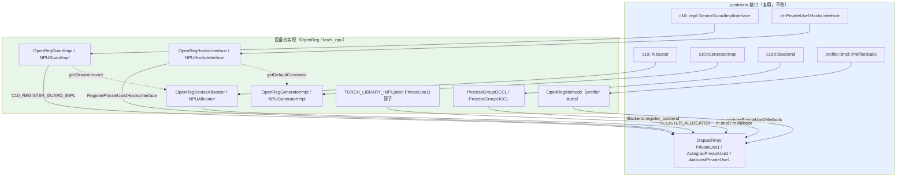

# PyTorch PrivateUse1 out-of-tree 芯片接入全解析

> 第三方芯片**不改 PyTorch 源码**、通过 PrivateUse1 接入 PyTorch 的完整接入面。本页**对齐 PyTorch 官方加速器接入指南**（`docs/source/accelerator/`，与官方参考后端 `torch_openreg` 代码同步），按官方 **9 个接入点**（device / hooks / guard / autoload / operators / amp / profiler / distributed / ci）逐一展开「做什么 / 为什么 / 怎么做」，每个点配 OpenReg 参考代码 + torch_npu 生产实现 + 类关系 + 复用对照。
>
> 基于版本：PyTorch 上游 `E:\97-codes\pytorch\pytorch`、torch_npu `E:\97-codes\pytorch\torch_npu` 当前 checkout
> 分析日期：2026-06-13
> 更新（2026-06-14）：为 §1 设计哲学、9 个接入点、§12 运行时组件各补充「**为什么·深入（根本原因）**」小节——基于本地 checkout（pytorch `trunk/6f26be8`、torch_npu）逐条核对源码 `file:line` + 社区资料（RFC / PR / dev-discuss / 官方博客）。原有内容保留不删，深入小节只扩展。
> 权威来源：① 官方指南 `pytorch/docs/source/accelerator/*.md`；② 官方参考后端 `pytorch/test/cpp_extensions/open_registration_extension/torch_openreg/`（下称 **OpenReg**，是 in-tree 的 PrivateUse1 测试后端 + 接入范例）；③ 生产实现 torch_npu。

---

## 目录

1. [为什么：out-of-tree 的设计哲学与权威框架](#1-为什么out-of-tree-的设计哲学与权威框架)
2. [9 个接入点总览](#2-9-个接入点总览)
3. [接入点 1：Device 管理](#3-接入点-1device-管理)
4. [接入点 2：Guard](#4-接入点-2guard)
5. [接入点 3：Hooks](#5-接入点-3hooks)
6. [接入点 4：Operators](#6-接入点-4operators)
7. [接入点 5：AMP](#7-接入点-5amp)
8. [接入点 6：Autoload](#8-接入点-6autoload)
9. [接入点 7：Profiler](#9-接入点-7profiler)
10. [接入点 8：Distributed](#10-接入点-8distributed)
11. [接入点 9：CI](#11-接入点-9ci)
12. [运行时底层组件（承载在 1/2/3 背后）](#12-运行时底层组件承载在-123-背后)
13. [类关系图](#13-类关系图)
14. [复用 upstream vs 必须自写](#14-复用-upstream-vs-必须自写)

---

## 1. 为什么：out-of-tree 的设计哲学与权威框架

PrivateUse1 是 PyTorch 预留的一个**匿名设备 DispatchKey**（`c10/core/DispatchKey.h`）。自 PyTorch 2.1 起，社区把它打磨成第三方加速器接入的**官方主流路径**：厂商**不修改 upstream 代码**，只在一组预留扩展点上「填实现 + 调注册」，就能接入。其价值（官方 `index.md`）：

- **速度**：扩展性内建于所有核心模块，厂商在自己的下游代码独立接入，不受社区评审带宽限制；
- **面向未来**：这是所有未来 PyTorch 特性的默认接入路径，新模块会自动支持按此路径接入的加速器；
- **自主**：厂商完全掌控接入节奏。

官方指南围绕**四大轴**组织：**Runtime**（Event / Stream / Memory / Generator / Guard / Hooks + C++ 脚手架）、**Operators**、**Python Frontend**、**High-level Modules**（AMP / Compiler / Distributed 等）；落到文档是 9 个章节（接入点）。**OpenReg** 是官方最小参考后端（用 CPU 模拟一个类 CUDA 设备），每个接入点都有对应代码；**torch_npu** 是 Ascend 的生产实现。

> 命名前置（所有接入点的基础）：`c10::register_privateuse1_backend("npu")` 把字符串名绑到 PrivateUse1，`torch.utils.rename_privateuse1_backend("npu")` 让 Python 侧 `device='npu'`/`tensor.npu()` 可用。torch_npu 在 `NPUGuardImpl.cpp:281-290`（`REGISTER_PRIVATEUSE1_BACKEND` 宏，靠静态初始化在 `.so` 加载时触发）+ `_init/registry/backend.py:7`。

- **为什么·深入（根本原因）**：表层的"速度/面向未来/自主"之下，真正的硬约束是 **DispatchKey 是稀缺的全局资源**——`DispatchKeySet` 是 64-bit 位掩码（`c10/core/DispatchKeySet.h:65` "only 64 tensor type ids are supported"），backend 槽位被 `static_assert` 锁死在 **≤16 个且现已基本用满**（`c10/core/DispatchKey.h:549` Note [No More Than 16 Backends]、`DispatchKeySet.h:807`），上游物理上无法给每家长尾厂商分配一个 in-tree 专用 key。于是预留 PrivateUse1/2/3 三个**匿名占位 backend key**（`Note [Private use DispatchKey]`，`DispatchKey.h:480-483`：类比 HTTP private-use 字段、"无需提交 PR 来标准化你的 type ID"），"谁 `register_privateuse1_backend("xxx")` 谁占用"。
  - **为什么不是"全员上游"、也不是"各自 fork"**：全员上游会同时撞上 key 稀缺与 review/维护带宽两堵墙（长尾加速器无法都进 core 评审）；各自 fork 则要永久 rebase 主干、生态碎片化、用户拿到的是"另一个 torch"。PrivateUse1 是第三条路——**源码零改动**，只在预留 key 上 `TORCH_LIBRARY_IMPL(aten, PrivateUse1)` 填 kernel，再用 `rename_privateuse1_backend` + `generate_methods_for_privateuse1_backend` 把匿名 key 重命名并自动挂上 `Tensor.is_xxx`/`.xxx()`/`Module.xxx()`（`torch/utils/backend_registration.py:76, 409`），把厂商发布节奏与 PyTorch release 彻底解耦。
  - **placeholder→一等公民的演进**：PrivateUse1 最初只是占位 key，缺 Storage/AMP/Distributed/Generator/序列化等支撑；社区在 2.1 前后一场"多设备集成"攻坚以 **100+ PR** 把它"从占位符做成可用 dispatch key"（官方教程原话），并让它享有全 functionality 笛卡尔积槽位（`Sparse/Quantized/Autograd/AutocastPrivateUse1`）。**本页的 9 个接入点 + §12 运行时组件，正是这套扩展点的全集。**
  - **Authenticity / dogfooding**：OpenReg 以"和真实加速器**完全相同**的方式"接入并进 CI（`torch_openreg/README.md:13, 17-20`），使这条 out-of-tree 通道被持续自验证、不被上游回归悄悄破坏（即接入点 9 CI 的由来）。
  - 延伸：[PyTorch 多设备集成博客](https://pytorch.org/blog/pt-multidevice-integration/)、[Facilitating New Backend Integration by PrivateUse1（"100+ PR"出处）](https://docs.pytorch.org/tutorials/advanced/privateuseone.html)、[OpenReg 官方博客](https://pytorch.org/blog/openreg/)。

## 2. 9 个接入点总览

| # | 接入点 | 接什么（注册点 + 接口） | OpenReg 代码 | torch_npu |
|---|--------|----------------------|-------------|-----------|
| 1 | **Device 管理** | `set/get/exchange_device`、`device_count` + pybind + Python API | `Module.cpp:53-105`、`OpenRegFunctions.cpp` | `c10_npu::SetDevice/GetDevice`、`csrc/npu/Module.cpp` |
| 2 | **Guard** | `c10::impl::DeviceGuardImplInterface` + `C10_REGISTER_GUARD_IMPL` | `OpenRegGuard.h:15` | `NPUGuardImpl.h:30` / `.cpp:280` |
| 3 | **Hooks** | `at::PrivateUse1HooksInterface` + `RegisterPrivateUse1HooksInterface` | `OpenRegHooks.cpp:6-10` | `NPUHooksInterface` |
| 4 | **Operators** | `TORCH_LIBRARY_IMPL(aten,PrivateUse1)` + fallback + STUB + 自定义 + meta | `OpenRegMinimal.cpp:119/141/148` | op-plugin（约 1393 func） |
| 5 | **AMP** | `AutocastPrivateUse1` key + `KERNEL_PRIVATEUSEONE` + `get_amp_supported_dtype` | `amp/autocast_mode.cpp` | torch_npu autocast |
| 6 | **Autoload** | `setup.py` 的 `entry_points` + `_autoload()` | `setup.py` / `__init__.py` | torch_npu autoload |
| 7 | **Profiler** | `profiler::impl::ProfilerStubs` + `registerPrivateUse1Methods` | `profiler/stubs/openreg.cpp` | torch_npu profiler stubs |
| 8 | **Distributed** | `c10d::Backend` 子类 + `Backend.register_backend(devices=[...])` | `ProcessGroupOCCL` + `distributed/init.cpp` | `ProcessGroupHCCL` |
| 9 | **CI** | 接入 PyTorch CI 测试矩阵，保证机制不回退 | `ci.md` | — |

> 运行时底层组件（Memory Allocator / Stream / Event / Generator / Host-pinned Allocator / Serialization）**没有各自单独成章**，而是承载在 device/guard/hooks 背后的 `csrc/runtime/` 里——OpenReg `csrc/runtime/` 有 9 个运行时组件（对应 9 个 .cpp，不计 OpenRegEvent.cpp）：`OpenRegFunctions/Guard/Hooks/Generator/Stream/DeviceAllocator/HostAllocator/Serialization/Exception`（Event 组件仅头文件 `OpenRegEvent.h`、无 .cpp）。详见 §12。

---

## 3. 接入点 1：Device 管理

- **做什么**：封装芯片 runtime 的设备增删查改——`device_count` / `current_device` / `set_device` / `exchange_device` / `maybe_exchange_device`。
- **为什么**：这是 stream、event、memory、guard 的基石；guard 的 RAII 切换、tensor 的设备放置都依赖它。`exchange_device`（原子换设备并返回旧设备）专为 RAII guard 设计。
- **为什么·深入（根本原因）**：c10 核心必须在**完全不链接任何加速器库**的前提下编译，却又要在运行时切设备、并在析构/异常路径上原样恢复——这对矛盾逼出一套按 `DeviceType` 下标 O(1) 虚分派的设备运行时抽象（`device_guard_impl_registry`，`c10/core/impl/DeviceGuardImplInterface.h:382`），Device 管理就是厂商必填的最小内核，其余 stream/event/memory/guard 全建其上。
  - **`exchange_device` 为何是原语而非 get+set**：RAII guard 构造时要"一次原语读旧写新"并把旧设备存进成员，析构时再用 `noexcept` 的 `uncheckedSetDevice` **无分配、不抛异常**地恢复（C++ 析构禁止抛异常）；若拆成 get-then-set 则多一次跨库虚调用、且两步间留下竞态窗口（`c10/core/impl/InlineDeviceGuard.h:72-77, 112-114`）。
  - **`device_count` 为何 noexcept、出错返回 0**：`is_available()`、模块导入期能力探测、静态初始化等路径**不能抛异常**，故"数设备"必须容错、且进程级只做一次（接口注释 `DeviceGuardImplInterface.h:200` "REQUIRED to not raise ... report zero available devices"）。
  - **对标 CUDA per-thread context**：current-device 走线程局部，并用 `thread_local targetDeviceIndex` 做 lazy-set，规避 CUDA 12 "`cudaSetDevice` 即 eager 建 primary context"在无关卡上凭空建 context、污染显存的坑（`c10/cuda/CUDAFunctions.cpp:206-224`）；torch_npu 同款 `targetDeviceIndex` + TLS 软缓存。
  - **lazy init + fork 防护**：driver 上下文在 `fork()` 后不可复用，故 `pthread_atfork` 把子进程标 bad-fork，再碰设备即报 "Cannot re-initialize ... use spawn"；该状态按 DeviceType 数组管理，PrivateUse1 直接复用同一套（`torch/csrc/utils/device_lazy_init.cpp:80-96`）。
  - 延伸：[OpenReg 官方博客](https://pytorch.org/blog/openreg/)、[Issue #91122（CUDA12 eager context）](https://github.com/pytorch/pytorch/issues/91122)、[Issue #24292（lazy init 与 fork）](https://github.com/pytorch/pytorch/issues/24292)。
- **怎么做**（三段）：① C++ 包裹 runtime API + 错误处理（OpenReg `OpenRegFunctions.cpp` 的 `SetDevice`）；② pybind 绑定到 Python（`Module.cpp:53-105` 的 `_setDevice/_getDevice/_exchangeDevice/_getDeviceCount` + `PyMethodDef methods[]`）；③ 用户友好的 Python API（`torch.npu.set_device(idx)`）。映射关系：`_C._set_device` → `torch.openreg.set_device`。
- **torch_npu**：`c10_npu::SetDevice/GetDevice`（被 NPUGuardImpl 委托）+ `csrc/npu/Module.cpp` 绑定 + `torch_npu/npu` Python API。
- **复用**：命名后端框架（`c10/core/Device.cpp`）、`device_lazy_init` / fork handler。

## 4. 接入点 2：Guard

- **做什么**：RAII 的设备 / 流 / 事件管理——进入作用域切换、离开自动恢复。一个 `DeviceGuardImplInterface` 实现同时覆盖三类。
- **为什么**：保证算子在指定设备/流上执行，无论全局状态如何；`c10::DeviceGuard`/`StreamGuard` 是模板薄封装，运行时查表调到设备实现。
- **为什么·深入（根本原因）**：`libtorch` 编译期**根本不知道后端是谁**、更链接不到尚不存在的第三方 `.so`，但每次算子分发前后都要设/还原设备与流。跨这条库边界唯一的办法就是抽象出纯虚 `DeviceGuardImplInterface`，让每个 `DeviceType` 在静态初始化期经 `C10_REGISTER_GUARD_IMPL` 把实现指针注册进一张**按 DeviceType 直接下标的定长原子数组**，`getDeviceGuardImpl` O(1) 查表后虚分发——刻意不用哈希注册表，因"每次 DeviceGuard 都要查，绝不能吃 unordered_map"（`DeviceGuardImplInterface.h:388`）。
  - **device/stream/event 为何合一个接口**：三者上下文强耦合（录 event 前要先切到 stream 所在设备、录完再切回），合并成一张 vtable、每后端一个注册槽最省——一次查表拿到的指针三类全覆盖（OpenReg 的 `record` 内部就在做 set/restore device）。
  - **性能 vs 可扩展的分界线**：in-tree CUDA 用 `InlineDeviceGuard<CUDAGuardImpl>`（`final`+模板，编译期**去虚化**成直线 `cudaSetDevice`，零虚调用，`c10/cuda/CUDAGuard.h:70`）；框架侧通用 `c10::DeviceGuard` 是 `InlineDeviceGuard<VirtualGuardImpl>`，每次真正虚跳转（`c10/core/DeviceGuard.h:84`）。判据是"**编译期能否见到具体 GuardImpl 类型**"——故第三方在框架侧只能虚调用，但**其自家 `.so` 内可另写内联 guard**（torch_npu 即"注册进表供框架虚分发 + 自用 `InlineDeviceGuard<NPUGuardImpl>` 去虚化"两路并存）。
  - **为何 RAII 而非手动 set/restore**：构造 set+存旧值、析构 `noexcept` 还原，换来三个手写难保证的性质——异常安全（中途抛异常栈回退也必恢复）、可嵌套（每个 guard 只还原到自己构造那一刻）、单一所有权（拷贝/移动全 `delete`）。
  - 延伸：[Edward Yang《Let's talk about the PyTorch dispatcher》](https://blog.ezyang.com/2020/09/lets-talk-about-the-pytorch-dispatcher/)、[PR #9396（全代码库迁到 at::DeviceGuard 的 RAII 化历史）](https://github.com/pytorch/pytorch/pull/9396)。
- **怎么做**：实现 `c10::impl::DeviceGuardImplInterface`，`C10_REGISTER_GUARD_IMPL(PrivateUse1, …)` 注册。三类虚函数（OpenReg `OpenRegGuard.h:15` 一个类全实现）：
  - **Device**：`exchangeDevice`(`:35`→`ExchangeDevice`) / `setDevice` / `getDevice` / `uncheckedSetDevice` / `deviceCount`(noexcept，出错返 0) / `synchronizeDevice`
  - **Stream**：`getStream`(`:100`→`getCurrentOpenRegStream`) / `getDefaultStream` / `getNewStream` / `getStreamFromGlobalPool` / `exchangeStream` / `queryStream` / `synchronizeStream`
  - **Event**：`record`(`:180`→`orEventRecord`) / `block`(→`orStreamWaitEvent`) / `queryEvent` / `synchronizeEvent` / `destroyEvent` / `elapsedTime`
  这一层正是把 **Stream / Event** 两个 runtime 组件挂进框架的地方。
- **torch_npu**：`NPUGuardImpl`（`NPUGuardImpl.h:30`，`static_type=PrivateUse1`），委托 `getCurrentNPUStream` + `NPUEvent`；`C10_REGISTER_GUARD_IMPL` 在 `NPUGuardImpl.cpp:280`。
- **复用**：DeviceGuard/StreamGuard/InlineDeviceGuard 模板、注册框架、Device/Stream/Event 抽象。

## 5. 接入点 3：Hooks

- **做什么**：让 PyTorch 的**设备无关通用代码回调到设备实现**。
- **为什么**：`torch.Generator(device='npu')`、`pin_memory=True`、`tensor.is_pinned()`、框架初始化等通用路径，需要回调到设备的 generator / pinned allocator / init。与 Guard 互补：Guard 是 PyTorch→设备的主动控制，Hooks 是通用代码→设备的被动回调。
- **为什么·深入（根本原因）**：Hooks 的根因是**编译/链接期解耦下的控制反转（IoC）**——`libtorch` 核心不能链接厂商 `.so`，但有一类**设备相关却不走算子分发、因而没有 device key 可路由**的通用路径仍必须调进设备实现。于是核心持有一个抽象 `AcceleratorHooksInterface` 指针，后端 `.so` 加载时在静态初始化里 `RegisterPrivateUse1HooksInterface(new XxxHooks())` 把实现回填（锁内、仅一次），核心经虚函数被动回调（`aten/src/ATen/detail/PrivateUse1HooksInterface.cpp:8-25`、`aten/src/ATen/Context.h:80-109`）。
  - **与 Guard 的本质区别（"无 key 可分发"才是 Hooks 的存在根因）**：Guard 处理的是"算子已被 dispatcher 路由到设备 key **之后**"的主动控制，总有 key 兜底；Hooks 专补"**根本没进算子分发、也没有 device key 可路由**"的空白——典型如 `is_pinned`/`pin_memory` 作用在 **CPU tensor**（dispatch key 是 CPU）上，却要问"这块 host 内存对某加速器是否 page-locked"，无法靠 tensor 的 key 路由，只能由 `globalContext().isPinnedPtr(...)` 按 `device_type` 显式选 hooks（`aten/src/ATen/native/Memory.cpp:41, 62`）；`torch.Generator(device=...)` 构造时 tensor 还不存在，同理只能经 hooks（`torch/csrc/Generator.cpp:62-69`）。
  - **统一基类 `AcceleratorHooksInterface` 的意义**：CUDA/XPU/MPS/MTIA/PrivateUse1 全继承它，`Context::getAcceleratorHooksInterface(device_type)` 按设备类型返回对应 hooks，`torch.accelerator` 的通用 API 才能写成**一份与设备无关的代码**、新增后端不改核心。
  - **高/低优先级划分依据**：是否被基础 tensor 功能直接依赖——`getDefaultGenerator`/`getNewGenerator`/`getPinnedMemoryAllocator`/`getDeviceFromPtr`/`init`/`hasPrimaryContext` 必须实现（`hasPrimaryContext` 在基类是纯虚 `=0`），而多卡/体验类的 `deviceCount`/`getCurrentDevice`/`exchangeDevice` 等给了默认实现、可选。
  - 延伸：[Accelerator Hooks 官方文档](https://docs.pytorch.org/docs/main/accelerator/hooks.html)、[PyTorch 多设备集成博客（讲 DispatchKeySet 64-bit 上限催生 PrivateUse1 收敛）](https://pytorch.org/blog/pt-multidevice-integration/)。
- **怎么做**：实现 `at::PrivateUse1HooksInterface`（继承 `AcceleratorHooksInterface`），静态初始化里 `at::RegisterPrivateUse1HooksInterface(new XxxHooksInterface())`（OpenReg `OpenRegHooks.cpp:6-10`）。
  - **高优先级钩子**（必须）：`init` / `hasPrimaryContext` / `getDefaultGenerator` / `getNewGenerator` / `getDeviceFromPtr` / `getPinnedMemoryAllocator` / `isPinnedPtr`
  - **低优先级钩子**（可选）：`isBuilt` / `isAvailable` / `deviceCount` / `setCurrentDevice` / `getCurrentDevice` / `exchangeDevice` / `maybeExchangeDevice`
  `getDefaultGenerator` 把 **Generator** 接进来，`getPinnedMemoryAllocator` 把 **HostAllocator** 接进来。完整 6 层调用链（hooks.md）：`torch.npu.manual_seed(42)` → 扩展 Python API → `_get_default_generator` → `at::globalContext().defaultGenerator()` → hooks → 设备 generator 实现。
- **torch_npu**：`NPUHooksInterface`。
- **复用**：`AcceleratorHooksInterface` 抽象、`Context` 的 hooks 分发、hooks 注册单例框架。

## 6. 接入点 4：Operators

- **做什么 / 为什么**：PyTorch 有 3500+ 内置算子，全实现不现实。策略：先实现**最小算子集**（让 tensor 能创建/拷贝/取值），其余用 **CPU fallback** 兜底保功能，再逐步补性能算子。
- **为什么·深入（根本原因）**：后端只需实现十几个算子就能跑通整个 PyTorch，根因在 dispatcher 的**分层 alias key + redispatch** 设计——Autograd、CompositeImplicitAutograd、CompositeExplicitAutograd 都是凌驾于 Backend key 之上的**别名层**，查表时后端 key 若无直接注册就沿优先级链回退继承（`aten/src/ATen/core/dispatch/OperatorEntry.cpp` 的 `computeDispatchTableEntryWithDebug`、`c10/core/DispatchKey.h:430-466` Note [Alias Dispatch Keys]）。
  - **三层"省力"机制**：① **反向白送**——内置算子反向由上游 `derivatives.yaml` 生成的 `VariableType` 经 `Autograd` 别名展开到含 PrivateUse1 的全部后端；纯前向的自定义算子走 `autograd_fallback`，等价 fallthrough 继续下沉、真要反向才报错（`c10/core/DispatchKeySet.cpp:68-74`、`aten/src/ATen/core/VariableFallbackKernel.cpp:44-57`）。② **复合算子自动分解**——`native_functions.yaml` 里没写 `dispatch:` 段的算子默认注册成 `CompositeImplicitAutograd`，用别的 aten 算子组合实现、层层 redispatch（几百个算子白送）。③ **CPU 兜底**——boxed `cpu_fallback` 把任意未实现算子的张量搬到 CPU 跑、再拷回（`aten/src/ATen/native/CPUFallback.cpp:90-162`）。
  - **不可约核心（必须设备亲自实现）**：触碰物理内存/取标量的算子既无更基础的 aten 算子可分解、又是 fallback 搬数据的**地基**——`empty.memory_format`/`empty_strided`（向设备 allocator 真分配显存）、`as_strided`/`view`/`_reshape_alias`/`set_`（构造共享 storage 的视图）、`_copy_from`/`_copy_from_and_resize`（真正的 H2D/D2H 拷贝）、`_local_scalar_dense`（`.item()` 取设备标量）、`resize_`（OpenReg `Minimal.cpp:8-141` 一次性注册）。若用 fallback 实现它们就会**无限递归**。
  - **STUB 与 meta**：`REGISTER_PRIVATEUSE1_DISPATCH(abs_stub, ...)` 借 `TensorIterator` 二级分发，复用上游结构化骨架（迭代/广播/dtype 提升/输出分配），后端只交付内层 element loop（`aten/src/ATen/native/DispatchStub.h:222-258`）；meta kernel 为 FakeTensor 图模式做 shape 推导（内置算子多自动获得，自定义算子必须显式注册）。
  - **为何不能"全部实现"**：3500+ 算子 × N 后端是不可维护的笛卡尔积；dispatcher 的 redispatch + composite 分解 + alias 继承本就是为把后端表面积刻意压到最小，并允许后端**随时用直接注册覆盖**继承来的 composite/fallback 来逐步换性能算子（runtime key 优先级永远高于 alias key）。这正是 torch_npu 适配约 1393 个 func 就能撑起整个算子面的原因。
  - 延伸：[Edward Yang《Let's talk about the PyTorch dispatcher》](https://blog.ezyang.com/2020/09/lets-talk-about-the-pytorch-dispatcher/)、[PyTorch 多设备集成博客](https://pytorch.org/blog/pt-multidevice-integration/)。
- **怎么做（4 种注册形式）**：
  1. **内置算子最小集**：`TORCH_LIBRARY_IMPL(aten, PrivateUse1, m){ m.impl("empty.memory_format", wrapper_…); }`。OpenReg 最小集 13 个（`OpenRegMinimal.cpp:119-137`）：`empty.memory_format / empty_strided / as_strided / view / _reshape_alias / resize_ / _copy_from / _copy_from_and_resize / _local_scalar_dense / set_.source_*`——覆盖工厂函数、跨设备拷贝（`_copy_from`）、`.item()`（`_local_scalar_dense`）。
  2. **Fallback**：全局 `TORCH_LIBRARY_IMPL(_, PrivateUse1, m){ m.fallback(makeFromBoxedFunction<&wrapper_cpu_fallback>()) }`（`:141`，包 `at::native::cpu_fallback`）；单算子 fallback `m.impl("sub.Tensor", …cpu_fallback…)`（`:148`）；可配黑名单组合。
  3. **STUB**：`REGISTER_PRIVATEUSE1_DISPATCH(abs_stub, &abs_kernel)`，复用 PyTorch 二级分发（基于 `DECLARE_DISPATCH` 的算子，签名 `void(TensorIteratorBase&)`），开发成本低。
  4. **自定义算子**：`TORCH_LIBRARY(openreg)` 定 schema → `TORCH_LIBRARY_IMPL(openreg, PrivateUse1)` 注 kernel → Python `torch.library.impl(..., "Meta")` 注 meta（图模式必需）；可选 `torch.autograd.Function`。
- **torch_npu**：op-plugin codegen 生成 `TORCH_LIBRARY_IMPL(aten,PrivateUse1)` + `TORCH_LIBRARY(npu)`，详见 [[op_plugin_config_and_classification_guide]] / [[op_registration_pipeline_analysis]]。
- **复用（最大头）**：**Autograd Fallback for PrivateUse1**——只写前向时反向自动 fallthrough（涉及反向才报错）；**CompositeImplicitAutograd 算子自动分解**，不用为它们写 kernel；CPU fallback 机制。
- **调试工具**：`torch._C._dispatch_dump_table("aten::add.Tensor")` 查各 key 实现；`TORCH_SHOW_DISPATCH_TRACE=1` 看分发轨迹。

## 7. 接入点 5：AMP

- **做什么 / 为什么**：自动混合精度——部分算子用低精度（fp16/bf16）提速，部分保 fp32 保精度。
- **为什么·深入（根本原因）**：AMP 不是"算子内部的 if 判断"，而是一个**层叠在后端 compute key 之上的独立 dispatch key**（`AutocastPrivateUse1`，`c10/core/DispatchKey.h:345`；注释 `:332` 明写 "Autocasting precedes VariableTypeId"，即先于 autograd/backend 处理）。一次调用先落到 autocast 层按 CastPolicy 把输入 cast 成目标 dtype，再**排除自身 key** 后 redispatch 到真正的 backend kernel（`aten/src/ATen/autocast_mode.h:478` 的 `ExcludeDispatchKeyGuard no_autocast`）——混合精度逻辑与算子实现被 dispatch 边界彻底切开。
  - **cast 是算子属性、不是设备属性**：matmul/conv/SDPA 走低精度、softmax/归约/loss/exp/log 必须 fp32，这是**数值稳定性**决定的、对任何后端都成立。故五种 CastPolicy（`lower_precision_fp`/`fp32`/`fp32_set_opt_dtype`/`fp32_append_dtype`/`promote`）及其算子清单作为**设备无关知识沉淀在上游**（`autocast_mode.h:819-956`，注释直言"让其它后端能复用 policy 清单"），所有后端照搬（torch_npu `AutoCastOps.cpp` 几乎逐行复用）。
  - **上游定策略、后端填 dtype**：后端只做两件事——① 注册 key + `m.fallback(makeFallthrough())` 让未列算子**零成本透传**；② 用 `get_amp_supported_dtype` 声明本硬件支持的低精度类型（OpenReg 返回 `[fp16, bf16]`；torch_npu 按 `is_bf16_supported()` 动态返回）。策略是"知识"、dtype 是"硬件能力"，二者正交。
  - **独立 key = 关注点分离**：cast 逻辑只实现一次即服务所有后端；否则要在每个 backend 的每个 kernel 里手写"是否在 autocast 区间、cast 到什么、要不要 promote/强制 fp32"，是 N 算子 × M 后端的重复判断。
  - 延伸：[RFC #55374（把 autocast 扩展为 dispatcher feature）](https://github.com/pytorch/pytorch/issues/55374)、[Issue #101509（out-of-tree backend 启用 autocast）](https://github.com/pytorch/pytorch/issues/101509)。
- **怎么做**：
  - **C++**：在 `AutocastPrivateUse1` key 上注册——`TORCH_LIBRARY_IMPL(_, AutocastPrivateUse1, m){ m.fallback(fallthrough) }`（未处理算子透传）+ 用 `KERNEL_PRIVATEUSEONE(op, CastPolicy)` 给每个算子挂精度策略（`amp/autocast_mode.cpp`）。
  - **Python**：实现 `get_amp_supported_dtype` 返回该加速器支持的 AMP dtype。
  - CastPolicy 五种：`lower_precision_fp / fp32 / fp32_set_opt_dtype / fp32_append_dtype / promote`。
- **复用**：CastPolicy 枚举 + 每种策略的算子清单都是 upstream 提供的（`aten/src/ATen/autocast_mode.h`），厂商照搬即可。

## 8. 接入点 6：Autoload

- **做什么 / 为什么**：`import torch` 时自动发现并初始化后端，免去显式 `import torch_npu`，让 out-of-tree 设备体验对齐 in-tree。
- **为什么·深入（根本原因）**：out-of-tree 后端活在**独立 pip 包**里，其 guard/hooks/算子/`PrivateUse1` 命名后端全靠"**包被 import 时的模块级副作用**"来注册；而 in-tree CUDA 是随 torch 一起编译、自然初始化的。这就形成一个**先有鸡还是先有蛋**的死结：注册依赖 import，用户却只写 `import torch`。Autoload 用 Python `entry_points` 插件机制在 `import torch` 收尾处替用户补上这次 import（`torch/__init__.py:3018-3038, 3074-3078`）。
  - **发现-调用链**：后端在 `setup.py` 声明 `entry_points={"torch.backends": ["pkg = pkg:_autoload"]}`；`import torch` 末尾用 `importlib.metadata.entry_points(group="torch.backends")` 发现各后端（`group_name="torch.backends"`，`torch/__init__.py:3025-3026`），`.load()` 为取到 `_autoload` 属性**必须先 `import 后端包`**——真正的注册正是这次 import 的副作用，`_autoload()` 本身常是占位 `pass`（OpenReg `__init__.py:17-19` 做注册、`:38-40` 是空壳）。
  - **为何要 `TORCH_DEVICE_BACKEND_AUTOLOAD=0` 开关**（默认开，`:3055`）：① 后端自己 `setup.py` 构建时要 `import torch`，若此时 autoload 反向 import 尚未装好的后端会**循环 import**，须先关（torch_npu `setup.py:29`）；② 多 accelerator 冲突时报错并提示关闭（torch_npu `__init__.py:32-53`）；③ 调试/避免误加载。
  - **隐式加载的代价**：import 顺序敏感（曾因被 autoload 的模块用到尚未定义的 `torch._as_tensor_fullprec` 而让 `import torch` 整体崩溃，PR #145611 把后端导入移到模块末尾修复，对应 `:3074-3076` 注释）；任何后端异常被统一吞成 `RuntimeError`（`:3034-3038`）、可调试性差——这也是早期 dev-discuss 上 albanD 倾向"让用户显式 import 该包"的保守理由。
  - 延伸：[RFC #122468（Autoload Device Extension）](https://github.com/pytorch/pytorch/issues/122468)、[PR #127074（落地，随 PyTorch 2.5 发布）](https://github.com/pytorch/pytorch/pull/127074)、[dev-discuss 讨论](https://dev-discuss.pytorch.org/t/automatic-out-of-tree-backend-loading/443)。
- **怎么做**：① `setup.py` 用 Python `entry_points`（`torch.backends` 组）注册 `_autoload`；② 包 `__init__.py` 定义 `_autoload()` 初始化钩子，PyTorch 启动时自动调用。
- **复用**：Python entry-points 插件发现机制 + PyTorch 的 autoload 框架。

## 9. 接入点 7：Profiler

- **做什么 / 为什么**：把 ATen 算子、`record_function` 区间归因到设备活动，产出 timeline。
- **为什么·深入（根本原因）**：核心 profiler 必须**设备无关**（不能直调任何厂商 runtime），但产出 timeline 又**必须拿设备侧真实计时**。PyTorch 用一层 `ProfilerStubs` 纯虚函数指针做**依赖倒置**：核心只持抽象协议（`torch/csrc/profiler/stubs/base.h:20-37`），后端在静态初始化期 `registerPrivateUse1Methods` 把实现热插进全局槽，未插则 `TORCH_CHECK(false, "... not enabled")` 兜底（`stubs/base.cpp:46-48`）。
  - **设备耗时为何用 event 对、不用 CPU 时钟**：设备执行相对 CPU 是**异步**的——`record()` 只是把计时 event 入队到 stream 就立即返回，此刻 CPU 时间戳测的是提交/调度开销而非 device 执行时长；故在 stream 上排两个 `EnableTiming` 的 event，`elapsed()` 先 `EventSynchronize` 等设备真正跑到该点、再取两 event 间隔为真实耗时（CPU 时间戳仅作 timeline 关联锚点，OpenReg `openreg.cpp:46-78`）。
  - **legacy fallback vs kineto 的门槛权衡**：现代 `torch.profiler` 把 `use_kineto=True` 写死（`torch/profiler/profiler.py:315`），其"原生" PrivateUse1 路径要求后端实现并向 kineto 注册一个 `IActivityProfiler`（等价 CUDA 的 CUPTI 客户端：解析设备 trace、对接 kineto 状态机，门槛高、要链 libkineto）；OpenReg 走 `use_kineto=False` 的 fallback，只填七个 stub 就能拿基本设备 timeline，代价是放弃 kernel 级 trace、`mark/rangePush/rangePop` 退化为 no-op（对照 CUDA stubs 这三个真接 NVTX）。
  - **精度澄清（对原文"走 legacy autograd profiler"的细化）**：PrivateUse1 的 stub 实际消费在 `profiler_kineto.cpp` 的 `KINETO_PRIVATEUSE1_FALLBACK` 分支（`:630-634, 1192-1199`），并不在 CUDA-only 的 `profiler_legacy.cpp`；"without Kineto" 的准确含义是**不需要 libkineto 的 `IActivityProfiler` 采集客户端**，而非完全不走 kineto 代码路径（CPU 侧编排仍复用 kineto 那套）。
  - 延伸：[Profiler Integration 官方文档](https://docs.pytorch.org/docs/stable/accelerator/profiler.html)、[Issue #166205（PrivateUse1 profiler 接入缺口）](https://github.com/pytorch/pytorch/issues/166205)。
- **怎么做**：实现 `torch::profiler::impl::ProfilerStubs`（`record` / `elapsed` / `onEachDevice` / `synchronize` / `mark` / `rangePush` / `rangePop`），构造时 `registerPrivateUse1Methods(&methods)` 注册（OpenReg `profiler/stubs/openreg.cpp`）。`record` 抓当前 stream、建 event、记 CPU 时间戳；`elapsed` 同步两 event 算微秒。走 legacy autograd profiler（`use_device="openreg"`），因 modern `torch.profiler` 强制 kineto。
- **复用**：profiler 控制面（Python `prepare→start→stop→step`）、`ProfilerStubs` 抽象。

## 10. 接入点 8：Distributed

- **做什么 / 为什么**：接入集合通信（allreduce/broadcast/allgather/...），支撑分布式训练。
- **为什么·深入（根本原因）**：集合通信的**语义**（allreduce/allgather/reduce_scatter…）是设备/算法层的稳定契约，但其**实现**必然绑定厂商通信库与硬件 stream（NCCL/HCCL/OCCL），二者变化频率与维护方完全不同。c10d 因此把"做什么"（抽象基类 `c10d::Backend` 的纯虚集合通信接口 + 设备无关的 `ProcessGroup` 前端）与"怎么做"（厂商后端子类）解耦，用一张 **device→backend 注册表**让 `init_process_group` 在运行期完成绑定——上层 DDP/FSDP 零改动即可换底层通信库（`torch/csrc/distributed/c10d/Backend.hpp:45`，基类默认实现只抛 "does not support"）。
  - **`Work` = 集合通信的异步句柄**：通信在厂商 stream 上排队后**立即返回**、不能阻塞调用线程；`Work` 封装这次异步操作——`isCompleted()` 非阻塞轮询、`wait()` 阻塞到完成、`synchronize()` 为设备**插 stream 同步**让后续 kernel 正确排在通信之后（`Work.hpp:56-125`）。没有 `Work` 就无法表达"已下发未完成"、也做不了计算/通信 overlap。
  - **device→backend 运行期解析**：`register_backend(name, func, devices=[...])` 把 `devices` 里每个设备类型写进 `default_device_backend_map`（如 `openreg→occl`），于是用户只给 `device_id`、`init_process_group` 即可反查后端（`torch/distributed/distributed_c10d.py:343, 380-386, 1842-1845`），也支撑 `cpu:gloo,openreg:occl` 这种多后端串。
  - **pybind holder 与编译守卫**：`Backend` 继承 `torch::CustomClassHolder`、生命周期靠 intrusive 引用计数；子类 pybind 须**以 `c10d::Backend` 为基类、`c10::intrusive_ptr` 为 holder**，才能向上转型存进以 `intrusive_ptr<Backend>` 为单位的注册表/`deviceTypeToBackend_`（`init.cpp:3082`）；整套用 `#if USE_DISTRIBUTED` 守卫，使裁剪掉分布式的构建下扩展仍能编译/导入。
  - 延伸：[c10d 后端 Cpp 扩展官方教程](https://docs.pytorch.org/tutorials/intermediate/process_group_cpp_extension_tutorial.html)、[RFC #39662（c10d ProcessGroup 扩展机制）](https://github.com/pytorch/pytorch/issues/39662)。
- **怎么做（3 步）**：① C++ 实现 `c10d::Backend` 子类（+ `Work` 子类跟踪异步、+ `Options` 子类配置），最小实现 `broadcast/allreduce/allgather/reduce_scatter/barrier`，`getBackendName()` 返回注册名；② pybind 暴露（`py::class_` 以 `c10d::Backend` 为基类、`c10::intrusive_ptr` 为 holder，`distributed/init.cpp`，`#if USE_DISTRIBUTED` 守卫）；③ Python `Backend.register_backend("occl", func, devices=["openreg"])`——加入 backend_list、映射 device→backend、存工厂函数。
- **torch_npu**：**HCCL**（`ProcessGroupHCCL`）。OpenReg 参考是 **OCCL**。
- **复用**：`c10d::Backend`/`Work`/`Options` 抽象、`init_process_group` 调度、`ProcessGroup` 注册表、device→backend 解析。

## 11. 接入点 9：CI

- **做什么 / 为什么**：把后端机制接进 PyTorch CI 测试矩阵，保证 upstream 改动不破坏 PrivateUse1 接入路径。OpenReg 本身就是 in-tree 的 PrivateUse1 测试后端，承担这一职责。
- **为什么·深入（根本原因）**：PrivateUse1 的扩展点（GuardImpl、Hooks、算子注册、AMP、分发键…）**散落在整个代码库，且只有运行期契约、无编译期强约束**——它们靠 `C10_REGISTER_GUARD_IMPL`、`RegisterPrivateUse1HooksInterface` 这类运行期注册挂接，上游一次重构（改虚函数签名、改 hooks 分发路径）可能**静默破坏**某扩展点、编译第三方代码时甚至不报错；而第三方硬件与代码**不在 upstream CI 内，无法 gate 上游 PR**（官方 CRCR / Cross-Repository CI Relay 当前仅 L1 非阻塞，`docs/source/accelerator/ci.md:5, 19-21, 47-49`）。
  - **OpenReg = 接入面的可执行规格（executable spec）**：与其依赖外部下游回报，PyTorch 把一个走"和真实加速器同样方式接入"的最小 in-tree PrivateUse1 后端纳入自家 CI——它全绿即代表接入机制完好（`test/run_test.py:982-986` 注释原文如此），破坏即红灯。这把松散的接入契约钉成**可回归的可执行文档**。
  - **CPU 模拟才能进通用 CI**：OpenReg 用 CPU 模拟一个类 CUDA 设备（刻意复刻 Runtime API 一致性与**内存隔离**语义），故无需专用硬件就能在普通 runner 上跑（`pull.yml`/`trunk.yml` 里 openreg job 全落在 `linux.2xlarge`/`arm64`/`macos-m1`/`windows` 等 CPU runner，无 GPU），又能让"把 CPU 指针当设备内存"之类错误**真实暴露**而非被 CPU 直通掩盖。
  - **它是质量保障、不是运行时代码**：这一环活在 `test/`、`.ci/`、`.github/workflows/` 而非 libtorch，产出的不是设备算力，而是"机制没回退"这一保证。
  - 延伸：[OpenReg 官方博客](https://pytorch.org/blog/openreg/)、[PR #141815（用 torch_openreg 取代旧扩展并接入 CI）](https://github.com/pytorch/pytorch/pull/141815)。
- **怎么做**：见 `ci.md`（本页未逐行核读，按官方 toctree 列入）。这是"接入流程"的质量保障环，不是运行时代码。

---

## 12. 运行时底层组件（承载在 1/2/3 背后）

这些没有单独成章，但**必须实现**，分布在 `csrc/runtime/`：

| 组件 | 接口 / 注册 | OpenReg | torch_npu |
|------|------------|---------|-----------|
| **Device Allocator** | `c10::Allocator` + `REGISTER_ALLOCATOR(PrivateUse1,&g)` | `OpenRegDeviceAllocator.cpp:169`(allocate→DataPtr)、`:265`(recordStream)、`:273`(注册) | `NPUAllocator`(`NPUCachingAllocator.h:227`)、`.cpp:3806` |
| **Host(pinned) Allocator** | hooks 的 `getPinnedMemoryAllocator` 暴露 | `OpenRegHostAllocator.cpp` | torch_npu pin allocator |
| **Stream** | 封装 `c10::Stream`，被 Guard 的 `getStream` 用 | `OpenRegStream` | `NPUStream.h:21`（薄封装 + `pack3/unpack3` 复用 upstream） |
| **Event** | 封装设备 event，被 Guard 的 `record/block` 用 | `OpenRegEvent` | `NPUEvent.h:22`（封装 `aclrtEvent` + EventPool） |
| **Generator** | `c10::GeneratorImpl`，被 hooks 的 `getDefaultGenerator` 返回 | `OpenRegGenerator` | `NPUGeneratorImpl.h:159`（override set_current_seed/seed/state… + graph-safe RNG） |
| **Serialization** | device-specific 张量序列化 | `OpenRegSerialization.cpp` | torch_npu 序列化 |
| **Exception** | runtime 错误码转 PyTorch 异常 | `OpenRegException.cpp`（`OPENREG_CHECK`） | `NPUException`（`NPU_CHECK_ERROR`） |

### 为什么·深入（根本原因，逐组件）

这些组件"必须设备自写"不是偶然——每个都对应一条**设备异步执行 / 物理内存 / 厂商 runtime** 带来的硬约束。§3–§5（device/guard/hooks）是"**把这些组件挂进框架**"的注册面，本节讲"**组件本身为什么长这样**"：前者是接线，后者是元件。

- **Device Allocator**：厂商裸 `cudaMalloc`/`aclrtMalloc` 慢且**强制 device 同步**，会击穿"CPU 跑在设备前面"的异步流水线 → 真实后端必须做 **caching allocator**（向驱动批发大块、用户态 best-fit 切分/复用、双池抗碎片，把裸 API 频率压到稳态近零）；又因 free 与 kernel 一样是"流上的异步 usage"，需 `recordStream` 记录"还有哪些流在用该 block"、打 event 延迟回收以防 **use-after-free**（`c10/core/CachingDeviceAllocator.h:230-232`、`c10/cuda/CUDACachingAllocator.cpp:82-111`）。经 `REGISTER_ALLOCATOR(PrivateUse1, &g)` 插进 c10 按 DeviceType 的 allocator 表，被 `empty.memory_format` 经 `at::GetAllocator(kPrivateUse1)` 取用。⚠️ OpenReg 仅落地接口、caching/recordStream 仍是 TODO no-op（`OpenRegDeviceAllocator.cpp:261-269`），真实实现见 CUDA / `NPUCachingAllocator`。
- **Host(pinned) Allocator**：异步 H2D 走 DMA **要求 host 缓冲是 page-locked（pinned）**，否则 `cudaMemcpyAsync` 退化为"先拷进内部 pinned staging、再同步逐页 DMA"、无法与 compute overlap；pinned 内存须由驱动注册（`cudaHostAlloc`/`aclrtMallocHost`）且 API 昂贵，故也要 caching、也要按 `streams_`/event 延迟回收。它经 `REGISTER_HOST_ALLOCATOR` 注册、再由 hooks 的 `getPinnedMemoryAllocator` 暴露给设备无关的 `pin_memory` 路径（呼应接入点 3，`OpenRegHooks.h:63-65`）；注意其 `DataPtr` 的 device 标的是 `kCPU`——它是"能被设备高效 DMA 的特殊 CPU 内存"，非设备内存。
- **Stream**：设备 kernel 异步执行、同流隐式有序、跨流才并发 → PyTorch 把"流"抽象成**后端无关的值类型 `c10::Stream`**，只携带 Device + 不透明 64-bit `StreamId`。后端要把"流种类（default/外部/池中第几条）"**位编码**进该 StreamId（OpenReg 5+3+1、CUDA 5+4+1 位）；而 `pack3`/`unpack3` 是**另一层**——把 Stream 拆成 `{stream_id, device_index, device_type}` 三字段跨语言/序列化传递（曾压进单个 int64_t，因指针型 StreamId 超 48 位虚拟地址而改三字段，见 issue #75854），厂商均一行复用上游（`c10/core/Stream.h:158-168`、`NPUStream.h:88-101`）。被 Guard 的 `getStream` 取用。
- **Event**：host 无法直接知道异步 kernel **何时跑完** → 用设备 event 做"标记"，实现**跨流同步**（`record` 入队标记、`block`→`StreamWaitEvent` 让另一条流在**设备侧**等待，而非 host 阻塞丢并发）与**计时**（`elapsed_time`，profiler 用）。因创建/销毁开销大且常 record 后不用，event 一律**首次 record 才 lazy 创建**（默认 `DisableTiming` 更省），并以 per-device **EventPool**（借出归还、可预热）摊薄成本（`c10/core/Event.h:80-119`、`OpenRegEvent.h:69-135`、CUDA `CUDAEventPool`）。被 Guard 的 `record`/`block` 取用。
- **Generator（RNG）**：设备侧随机 kernel 需**就近、可读写**的 PRNG 状态 → 每设备一个 `c10::GeneratorImpl`、经 hooks 的 `getDefaultGenerator` 暴露。深层难点是 **graph-safe RNG**：CUDA graph/aclgraph 的 capture→replay 下，若把 philox seed/offset 当 **host 常量烤进图**，每次 replay 必出**同一串随机数**、RNG 不推进 → 必须把 seed/offset 放进**设备内存的 1 元素 tensor**、kernel 运行时经**指针**读取并叠加图内累计 offset，replay 前回填当前 offset（`PhiloxCudaState` 的 `union{val; ptr}` + `captured_`，`PhiloxCudaStateRaw.cuh:20-41`、`CUDAGeneratorImpl.cpp:458-479`）。基类 `graphsafe_*` 默认 `TORCH_CHECK(false)`，**做不做正是"最小可用"与"生产级"的分水岭**——OpenReg 直接继承 `CPUGeneratorImpl` 未做，torch_npu 有完整 `Note [NPU Graph-safe RNG states]`。
- **Serialization**：`torch.save/load` 底层是 pickle，**不懂"字节属于哪个设备、load 时搬回哪"** → 须在序列化框架注册每设备的钩子：① storage 层 `register_package(priority, tagger, deserializer)` 给 storage 打设备 tag、load 时按 location `obj.to(device)` 搬回（PrivateUse1 优先级 23）；② 张量 backend-meta 层 `TensorBackendMetaRegistry` 持久化设备私有元数据——torch_npu 正是在此记录并用 `npu_format_cast_` 恢复 NC1HWC0/FRACTAL_NZ 等**设备私有 layout**（`OpenRegSerialization.cpp:4-46`、`NPUSerialization.cpp:23-60`、`torch/serialization.py:671-693`）。
- **Exception**：厂商 runtime 按 **C 风格错误码**返回，逐处手写 `if (ret != ok)` 既冗余又易漏 → 用一个 CHECK 宏（`OPENREG_CHECK`/`NPU_CHECK_ERROR`）在**每个 API 边界**把错误码翻成带 `file:line:func` 上下文的 `c10::Error`（即 `TORCH_CHECK` 同源异常、可被 Python 捕获为 `RuntimeError`）；并针对**异步错误**（kernel 可能后于 launch 才失败），在报错前 `PeekAtLastError` 回捞设备上延迟暴露的错误、再分流 OOM/abort（`OpenRegException.cpp:3-9`、`NPUException.h:142-209`）。

## 13. 类关系图

## 14. 复用 upstream vs 必须自写

| 必须设备方自写（每芯片不同） | 直接复用 upstream（白送） |
|---------------------------|------------------------|
| Guard 实现（Device/Stream/Event 三类） | PrivateUse1 及派生 DispatchKey（`DispatchKey.h`，含 Autograd/Autocast PrivateUse1） |
| Hooks 实现（generator/pin/init 回调） | Dispatcher 全套 + redispatch |
| Device Allocator + Host(pinned) Allocator | DeviceGuard/StreamGuard/InlineGuard 模板 |
| Stream / Event（封装 runtime） | Device/Stream/Event 抽象 + StreamId 编码 |
| Generator（RNG） | `c10::Allocator`/`GeneratorImpl` 基类 + 注册宏 |
| 算子：最小集 + 性能算子（fallback 兜底） | **Autograd 引擎**（前向自动反向 fallthrough / `derivatives.yaml`） |
| AMP cast 规则（C++）+ `get_amp_supported_dtype`（Py） | **CompositeImplicitAutograd 算子自动分解** |
| Profiler stubs | **CPU fallback** 机制（`cpu_fallback`） |
| Distributed backend（HCCL/OCCL） | AMP CastPolicy 框架 + 算子清单 |
| device 管理函数 + Python 绑定 + autoload 钩子 | autoload 框架、`generate_methods_for_privateuse1_backend` 自动生成 `.npu()`、序列化框架、profiler 控制面 |

**两块最大复用**：① **Autograd**——原生算子反向来自 upstream，设备方只实现前向 leaf 算子；② **Composite 算子自动分解**——大量 aten 算子是 `CompositeImplicitAutograd`，自动拆成基础算子，不用单独写 kernel。这就是为什么 torch_npu 适配约 1393 个 func 就能撑起整个 PyTorch 算子面。

---

## Related Pages

- [[torch_npu_upstream_adaptation_analysis]] —— 将本页的上游标准接入点与 torch_npu 实际硬件实现、框架补丁边界做横向对照
- [[op_plugin_config_and_classification_guide]] —— 接入点 4（算子）：op-plugin 配置与分类
- [[op_registration_pipeline_analysis]] —— 接入点 4（算子）：yaml→codegen→dispatcher 注册链路与「库加载即注册」（与命名注册同一静态初始化机制）
- [[npu_operator_graph_eligibility_guide]] —— 算子入图判别（与 Allocator/Generator 的 graph-safe 关联）
- [[pytorch_dispatcher_analysis]] —— PrivateUse1 key 在 Dispatcher 中如何分发（本页上游基础）
