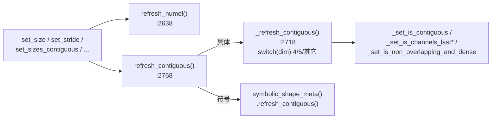
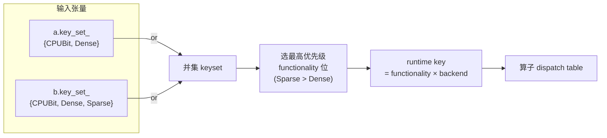
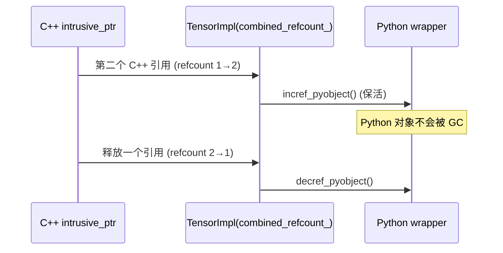
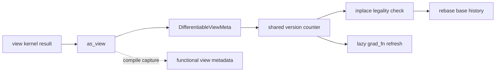

# TensorImpl 与 Storage 源码深析:字段、视图、派发与生命周期

> 层次:deep dive
> 核验基准:PyTorch upstream `E:\97-codes\pytorch\pytorch`(v2.13.0a0, commit 9922478)
> 最后更新:2026-07-30(§13 并入 A01 独有的 View/Autograd/编译器视角内容)

本页是 [[index]] 模块的深入页,假设你已读过 overview 的三层全景(`Tensor → TensorImpl → StorageImpl → Allocator`)与 [[tensor_internals_quickstart]] 的访问器用法。这里逐机制深入 `TensorImpl` 的字段布局、视图与浅拷贝、contiguity 缓存、`DispatchKeySet` 设计、符号形状、autograd 解耦与 PyObject 保活——每一处都对照 `c10/core` 下的真实源码。

---

## 0. 字段全景:一个 TensorImpl 里到底装了什么

`struct C10_API TensorImpl : public c10::intrusive_ptr_target`(`c10/core/TensorImpl.h:510`)的类总览 doc 注释在 `c10/core/TensorImpl.h:439-509`,它一句话概括了整套设计:一个 `TensorImpl` 持有「指向 storage 的指针 + 描述本视图的元数据(sizes/strides/offset)」(`c10/core/TensorImpl.h:440-442`)。

成员字段集中定义在 `c10/core/TensorImpl.h:2874-3055`,可分四组:

| 组 | 字段(行号) | 作用 |
|----|------------|------|
| 数据指针 | `storage_` (2875) | 指向拥有缓冲的 `StorageImpl`(薄包装 `Storage`) |
| 视图元数据 | `sizes_and_strides_` (2910)、`storage_offset_` (2912)、`numel_` (2917)、`data_type_` (2921)、`device_opt_` (2935) | 「怎么看这块数据」 |
| autograd / 版本 | `autograd_meta_` (2901)、`version_counter_` (2906)、`extra_meta_` (2904) | 反向图钩子与原地修改追踪 |
| 派发 / 互操作 | `key_set_` (3055)、`pyobj_slot_` (2908)、以及 2963-3050 的一大片位域 | dispatcher key、Python 对象槽、policy/contiguity 缓存位 |

注意 `numel_` 默认值是 `1` 而非 `0`(`c10/core/TensorImpl.h:2917` 的注释解释:空 sizes/strides 时按数学约定 numel=1,构造时再立刻置 `{0}`)。下面按机制展开。

---

## 1. 构造、初始化与析构:三类构造、惰性分配与两种「未初始化态」

### 1.1 三个公有构造 + VIEW 枚举

`TensorImpl` **删除了默认构造**(`c10/core/TensorImpl.h:511` `TensorImpl() = delete;`),只暴露三类公有构造(`c10/core/TensorImpl.h:521-558`):

1. **带 storage 的 1 维 0 尺寸张量**(`:524`)——最常用,storage 已就绪;
2. **VIEW 构造**(`:530`,配合 `enum ImplType { VIEW }` 在 `:519`)——为视图特化;`Note [Enum ImplType]`(`:513-518`)坦言这是临时方案:视图目前只特化了 `key_set_`,未来希望连 `version_counter_` 也直接共享而不必先建后改;
3. **无 storage 的 1 维 0 尺寸张量**(`:539`)——给只有 device 没有缓冲的场景。

另有一个 private 构造(`:565`)和两个 legacy 的 `DispatchKey`(单 key)转 `DispatchKeySet` 的桥接构造(`:546`、`:554`)。拷贝/移动构造与赋值全部 `= delete`(`:572-575`)——`TensorImpl` 永远通过 `intrusive_ptr` 共享,不允许值语义复制。

### 1.2 惰性分配与两种历史遗留的「未初始化态」

类 doc 的 `:463-509` 用很长篇幅描述 Caffe2 时代遗留的两种未初始化态(官方明确「正在消除,不要写新代码依赖它们」,`:506-508`):

- **DTYPE UNINITIALIZED**(`:467-471`):dtype 未定;首次调 `mutable_data<T>()` 才确定。
- **STORAGE UNINITIALIZED**(`:473-480`):有非零 size 但 storage 的 data pointer 为空——Caffe2 的惰性分配:数据直到 `mutable_data<T>()` 才真正申请。

关键不变量(`:478-480`):**零尺寸张量永远是 storage-initialized**,因为根本不需要分配。另一条(`:495-498`):**未初始化的 storage 必须唯一拥有**,否则「共享 + 未初始化」会破坏模型——所以会拒绝任何让未初始化 storage 变共享的操作。

### 1.3 UndefinedTensorImpl:不是 nullptr 的空张量哨兵

空 `Tensor` 的 `impl_` 不是 `nullptr`,而是单例 `UndefinedTensorImpl`(`c10/core/UndefinedTensorImpl.h:12` `struct UndefinedTensorImpl final : public TensorImpl`)。它是 `intrusive_ptr<TensorImpl, UndefinedTensorImpl>` 的 NullType(见 `aten/src/ATen/core/TensorBase.h:928`),通过 `singleton()`(`UndefinedTensorImpl.h:20-26`,Windows/非 Windows 分别用 `getInstance()`/`_singleton`)返回。它覆写了 `strides_custom()`/`sym_strides_custom()`/`sym_is_contiguous_custom()`/`set_storage_offset()`(`UndefinedTensorImpl.h:32-37`)以给出「未定义」语义。

> 用「空 keyset = undefined tensor」的另一面:`c10/core/DispatchKeySet.h:166` 的注释 "An undefined tensor is one with an empty tensor type set." —— undefined 在派发层就是空 keyset。

析构 `~TensorImpl() override`(`c10/core/TensorImpl.h:512`)与 `release_resources()`(`:582`)负责 decref `storage_` 等外部分配;真正的释放由 intrusive 引用计数归零驱动(见 §11)。

---

## 2. SizesAndStrides:≤5 维内联的紧凑存储

`sizes_and_strides_`(`c10/core/TensorImpl.h:2910`)的类型是 `c10::impl::SizesAndStrides`(`c10/core/impl/SizesAndStrides.h:23`)。它把 sizes 与 strides 打包进一个容器,并做了一个针对性优化(内存布局 doc 在 `SizesAndStrides.h:14-22`):

- **≤5 维内联**(`#define C10_SIZES_AND_STRIDES_MAX_INLINE_SIZE 5`,`SizesAndStrides.h:10`):5 个 size + 5 个 stride 直接放在对象内,无堆分配;
- **>5 维转 out-of-line**:析构时只有非内联才 `free()`(`SizesAndStrides.h:37-42`)。

相比旧实现「一对 `SmallVector<int64_t, 5>`」,它的收益有二(`SizesAndStrides.h:15-18`):① 省掉两次 SmallVector 的内联/堆分配开销;② **强制 size 个数 == stride 个数**——从数据结构层面杜绝了二者长度不一致的 bug。默认构造把第 0 维 size 置 0、stride 置 1(`SizesAndStrides.h:32-35`),这正是 §0 里 `numel_=1` 随即被压到 0 的配套动作。

---

## 3. 访问器的 fastpath / policy 机制:热路径零虚调用

`sizes()`/`strides()`/`storage_offset()`/`is_contiguous()`/`device()`/`storage()`/`dtype()` 都是热到发烫的访问器。PyTorch 的设计 recipe 写在 `c10/core/TensorImpl.h:597-608`:**fastpath 函数先做一次 `C10_UNLIKELY` 的 policy 测试,不命中就直读字段,命中才落到 `_custom()` 虚函数**(子类 / Python 子类 / 符号形状)。这样普通张量的访问器是纯字段读取,零虚调用、零额外分支预测惩罚。

以 `sizes()`(`c10/core/TensorImpl.h:615`)和 `storage_offset()`(`:749`)为例:

```cpp
// c10/core/TensorImpl.h:615
IntArrayRef sizes() const {
  if (C10_UNLIKELY(matches_policy(SizesStridesPolicy::CustomSizes)))
    return sizes_custom();
  return sizes_and_strides_.sizes_arrayref();
}
// c10/core/TensorImpl.h:749 (storage_offset 同构)
int64_t storage_offset() const {
  if (C10_UNLIKELY(matches_policy(SizesStridesPolicy::CustomSizes)))
    return storage_offset_custom();
  return storage_offset_;
}
```

`device()`(`:1293`)、`storage()`(`:1073`)、`dtype()`(`:1731`)同理:`device()` 测 `device_policy_`、`storage()` 测 `storage_access_should_throw_`、`dtype()` 直接返回 `data_type_`。注意 `key_set()`(`:590`)无 policy 测试——它永远直读 `key_set_`。

policy 位本身是一组位域:`sizes_strides_policy_:2`(`:3023`)、`custom_sizes_strides_:2`(`:3030`)、`device_policy_:1`(`:3033`)、`layout_policy_:1`(`:3034`)、以及 `python_custom_*`(`:3044-3050`)。它们由三个 refresh 函数合成(`c10/core/TensorImpl.h:2856-2872`):

```cpp
// c10/core/TensorImpl.h:2856
void refresh_sizes_strides_policy() {
  if (has_symbolic_sizes_strides_)
    sizes_strides_policy_ = static_cast<uint8_t>(SizesStridesPolicy::CustomSizes);
  else
    sizes_strides_policy_ = std::max(custom_sizes_strides_, python_custom_sizes_strides_);
}
```

关键点:**符号形状(`has_symbolic_sizes_strides_`)会强制 policy 进入 CustomSizes**——这把 §9 的 SymInt 路径与普通访问器统一到了同一个 `matches_policy` 闸门后面。

---

## 4. contiguity 缓存与基于 stride 的 memory-format 推断

### 4.1 这些 bool 是缓存,不是属性

`is_contiguous_`、`is_channels_last_(_3d)_`、`is_channels_last_(_3d_)contiguous_`、`is_non_overlapping_and_dense_` 是一组 1-bit 位域(`c10/core/TensorImpl.h:2963-2992`),由 `init_bitfields()`(`:2939`)初始化为「连续」状态(`is_contiguous_=true`、各 channels-last 标记为 false)。它们是 **缓存**:contiguity 查询极频繁,缓存掉每次重算的开销。

一个反直觉但重要的认知(`torch/headeronly/core/MemoryFormat.h:9-12`):**memory format 不是 Tensor 的属性**——它只是「告诉算子输出该如何在内存里组织」的提示。channels-last 是从 **stride 模式** 推断出来的,而非张量内禀状态。注释 `TensorImpl.h:2747-2751` 也强调:channels-last-contiguous 不必然意味着 stride 真的是 channels-last 排布。

`enum class MemoryFormat : int8_t`(`torch/headeronly/core/MemoryFormat.h:29-35`)成员顺序是 `Contiguous(0), Preserve(1), ChannelsLast(2), ChannelsLast3d(3), NumOptions(4)`——**`Preserve` 不是 0**,这是写代码时最易踩的点。

### 4.2 刷新链:任何 setter 都必须 refresh

改 sizes/strides 后必须重算缓存,入口是 `refresh_contiguous()`(`c10/core/TensorImpl.h:2768`):

```cpp
// c10/core/TensorImpl.h:2768
void refresh_contiguous() {
  if (has_symbolic_sizes_strides_)
    symbolic_shape_meta().refresh_contiguous();   // 符号路径
  else
    _refresh_contiguous();                         // 具体路径
}
```

`_refresh_contiguous()`(`:2718`)按维度数 switch:`case 4` 走 channels-last-2d 判定、`case 5` 走 2d+3d 判定、`default` 只算普通 contiguous + non-overlapping-and-dense(`:2724-2760`),分别调 `compute_contiguous()` / `compute_channels_last_*` / `compute_non_overlapping_and_dense()` 等。numel 的缓存由 `refresh_numel()`(`:2638`)独立刷新(`numel_ = compute_numel()`)。

每个 setter 都自觉调用刷新链:

```cpp
// c10/core/TensorImpl.h:1830 set_size
sizes_and_strides_.size_at(dim) = new_size;
refresh_numel();
refresh_contiguous();
// c10/core/TensorImpl.h:1887 set_sizes_contiguous
sizes_and_strides_.set_sizes(new_size);
refresh_numel();
empty_tensor_restride(MemoryFormat::Contiguous);  // 内部再调 refresh_contiguous()
```

`empty_tensor_restride(MemoryFormat)`(`:2405`)是「按指定 memory format 重排 strides」的核心:`Contiguous` 分支从最后一维起回填 `stride[i]=stride[i+1]*max(size[i+1],1)`(`:2417-2434`,带 `mul_overflows` 溢出检查);`ChannelsLast`/`ChannelsLast3d` 分支要求 rank 4/5 并改用 `get_channels_last_strides_*`(`:2436-2447`);`Preserve` 直接报错(`:2449`)。末尾必调 `refresh_contiguous()`(`:2459`)。其他 setter:`set_stride()`(`:1849`)、`set_storage_offset()`(`:1868`)、`set_sizes_and_strides()`(SymInt 版 `:1812`)。



---

## 5. 视图、shallow_copy 与版本计数共享(as_strided / detach / set_data)

### 5.1 浅拷贝的三条原语

视图与 detach 在 ATen/autograd 层是算子,但最终都落到 `TensorImpl` 提供的三条地基原语:

- `shallow_copy_and_detach()`(`c10/core/TensorImpl.h:2109`、`:2119`,左值/右值版)——返回一个新 `TensorImpl`,复制元数据,版本计数按参数决定共享或断开;
- `shallow_copy_from()`(`:2129`)——把另一个 `TensorImpl` 的元数据写进 `this`(`set_data` 类语义);
- 静态 `copy_tensor_metadata()`(`:2783`、`:2796`)——前两者共用的底层拷贝,逐字段复制 sizes/strides/storage/offset 等。

```cpp
// c10/core/TensorImpl.h:2129
virtual void shallow_copy_from(const c10::intrusive_ptr<TensorImpl>& impl) {
  copy_tensor_metadata(
      /*src_impl=*/impl.get(), /*dest_impl=*/this,
      /*version_counter=*/version_counter(),
      /*allow_tensor_metadata_change=*/allow_tensor_metadata_change());
}
```

这三者的语义合同写在 `Note [ TensorImpl Shallow-Copying ]`(由上述函数的 doc 反复引用)。

### 5.2 版本计数:为什么在 Storage 粒度、又为什么共享

版本计数 `version_counter_`(`c10/core/TensorImpl.h:2906`)的类型是 `c10::VariableVersion`(`:328`)。它内部持有 `intrusive_ptr<VersionCounter>`(`:334`),`VersionCounter` 只包一个 `std::atomic<uint32_t> version_`(`:330-332`)——**多个视图共享同一个原子计数**。`bump_version()`(`:2157`)递增它,`version_counter()`(`:2153`)取它。

为什么原地修改要在 **Storage 粒度** 追踪?见 `c10/core/StorageImpl.h:52-54`:VC 追踪做在 storage 层,因此「两个 StorageImpl 指向同一 data pointer」会让 VC 失效(除非用 detach 显式断开 VC)——这也是 §6 里「一份数据一个 StorageImpl」不变量的一个理由。

### 5.3 detach 出来的张量为什么不能回写原张量

`allow_tensor_metadata_change_`(`c10/core/TensorImpl.h:3011`)与 `Note [ Metadata Change for a Detached Tensor ]`(`:2996-3010`)是配套设计:Python 的 `t.data` / `t.detach()` 产生的张量,改它的 sizes/strides/storage/offset **不应** 传回原张量。于是所有 setter 开头都先 `TORCH_CHECK(allow_tensor_metadata_change(), ...)`(如 `set_size` `:1831`、`set_stride` `:1850`、`set_storage_offset` `:1869`),detach 出来的张量该标记为 false,从而把这类改动显式变为非法。

### 5.4 浅拷贝的兼容性判定

不是任意两个 `TensorImpl` 都能互相浅拷贝。`has_compatible_shallow_copy_type(DispatchKeySet from)`(`c10/core/TensorImpl.h:2062-2094`)用 keyset 判定:dense↔dense、sparse↔sparse、sparse-compressed↔sparse-compressed 才兼容(`:2090-2092`),其中 `is_dense`/`is_sparse` 用 backend 位 + functionality 位的组合判断(`:2063-2088`)。这直接桥到 §7 的 functionality/backend 位设计。

---

## 6. Storage 别名与无协调的共享所有权

`Storage`(`c10/core/Storage.h:25`)是 `intrusive_ptr<StorageImpl>` 的薄包装(构造 `:32-34`)。多个 `Storage` 句柄对同一个 `StorageImpl` 共享所有权,数据生命周期纯由引用计数决定——**没有任何中心协调者**,最后一个引用消失时 `Allocator` 的 deleter 释放缓冲。

`StorageImpl`(`c10/core/StorageImpl.h:55`)的字段在 `:378-399`:`data_ptr_`(378)、`size_bytes_`(379)、`resizable_`(381)、`allocator_`(397)、`pyobj_slot_`(398)。它的核心不变量写在 `c10/core/StorageImpl.h:38-54`:

> 「storage 应当唯一拥有一个 data pointer;两个非空 data pointer 别名 当且仅当 它们来自同一个 storage。」

违反它(例如 `at::from_blob` 造一个非拥有的 StorageImpl)会连环破坏三处(`StorageImpl.h:44-54`):① 普通 deleter 假设唯一所有权,会出错;② Python 侧 deepcopy 依赖 storage 相等而非 data pointer 相等,会把数据复制成两份;③ 版本计数在 storage 粒度追踪(见 §5.2),共享 data pointer 的原地修改会完全不被追踪。

判断两个 `Storage` 是否别名同一缓冲,用自由函数 `isSharedStorageAlias(s0, s1)`(`c10/core/Storage.h:21`)——这是 quickstart 里「证明视图共享数据」演示的底层依据。

---

## 7. 张量上的 DispatchKeySet:functionality 位 vs backend 位

### 7.1 字段:key_set_ 不含 Autograd

`key_set_`(`c10/core/TensorImpl.h:3055`)是每个张量自带的派发信息。务必记住注释 `:3052-3054`:

```cpp
// c10/core/TensorImpl.h:3052
// The set of DispatchKeys which describe this tensor.  NB: this
// does NOT include Autograd (historically, it did, but not anymore!)
DispatchKeySet key_set_;
```

Autograd 不再编码进张量的 `key_set_`,它由 functionality 位在派发期独立管理。

### 7.2 为什么拆成 functionality 位 + backend 位

`class DispatchKeySet final`(`c10/core/DispatchKeySet.h:167`)内部是一个 64-bit `repr_`。`Note [DispatchKeySet Internal Representation]`(`c10/core/DispatchKeySet.h:50-164`)解释了它为什么不把每个 `(backend × functionality)` 组合直接映射成一位:

> 「key 的总数会随 [#backends] × [#functionalities] **平方增长**,使得直接映射会让 bitset 体积爆炸。」(`DispatchKeySet.h:87-90`)

于是拆成两类「building block」位(`:95-98`):
- **backend 位**(`BackendComponent`,如 CPUBit/CUDABit,约 12 个)——**无序**;
- **functionality 位**(如 Dense/Sparse/SparseCsr/Quantized/AutogradFunctionality)——**有序**,优先级 Autograd > Sparse > Quantized > Dense(`:54-56`、`:82-86`)。

运行时的具体 key 是两者的组合(`DispatchKeySet.h:106-115` 给了示例:`{CPUBit, Dense}` 组合出 runtime 的 `CPU` key)。这把表的维度从「乘积」降到了「和」。

### 7.3 dispatcher 如何取并派发

派发的 multiple dispatch 规则在 `DispatchKeySet.h:50-60`:**dispatcher 抓取每个输入张量的 keyset,or 在一起,再选其中最高优先级的 functionality 位去派发**。functionality 位有序保证了「选最高优先级」良定义;backend 位无序,但理论上多个 backend 位可同时存在(如 CPU+CUDA 混合输入,尽管支持有限,`:56-60`)。`undefined tensor = 空 keyset`(`DispatchKeySet.h:166`)。



派发的完整故事见 [[01_eager_runtime/02_dispatcher_and_device/index]] 与 [[pytorch_dispatcher_analysis]];本层只负责给出每个张量的 `key_set_`。

---

## 8. TensorOptions::computeDispatchKey 与 dtype 的 TypeMeta↔ScalarType 桥接

### 8.1 dtype/device/layout → backend key

`torch.zeros(..., dtype=, device=)` 的用户意图由 `TensorOptions`(`c10/core/TensorOptions.h:136`)承载,经 `computeDispatchKey()`(成员 `:447`)归一化成单一 backend dispatch key:

```cpp
// c10/core/TensorOptions.h:447
DispatchKey computeDispatchKey() const {
  return c10::computeDispatchKey(
      optTypeMetaToScalarType(dtype_opt()), layout_opt(), device_opt());
}
```

不变量在 `:443-446`:它只返回 `dispatchKeyToBackend` 单射的子集,**永不返回 Autograd key**。自由函数 `computeDispatchKey()`(定义 `c10/core/TensorOptions.h:631`)是双层 switch:外层按 `layout`(Strided/Jagged → 走 dense 分支,`:638-639`;Sparse → SparseXXX,`:675-681`),内层按 `device.type()`,且 dense 分支里若 dtype 是 QInt 则升级成 `Quantized##device`(`:644-647`)。

### 8.2 dtype 的两种表示

`TensorImpl` 内部存的是 `caffe2::TypeMeta data_type_`(`c10/core/TensorImpl.h:2921`),对外 `dtype()`(`:1731`)直接返回它;而 `ScalarType` 是 int8 枚举的对外表示(`torch/headeronly/core/ScalarType.h:258`)。两者通过 `ScalarTypeToTypeMeta.h` 互转:`scalarTypeToTypeMeta()`(`:16`)、`typeMetaToScalarType()`(`:23`)、`optTypeMetaToScalarType()`(`:30`)。`computeDispatchKey` 正是用最后一个把 `dtype_opt()` 转成 `optional<ScalarType>` 喂进去。

---

## 9. SymInt 符号形状:把 sizes/strides 抽象成符号

`has_symbolic_sizes_strides_`(`c10/core/TensorImpl.h:3026`)为 true 时,sizes/strides/offset 不再是具体 int 字段,而走 `symbolic_shape_meta()`。这是 torch.compile / Dynamo / export 动态形状的地基:不固化具体数值,从而让同一段图复用于不同输入尺寸。

机制上它与 §3 的 policy 闸门统一:`refresh_sizes_strides_policy()`(`:2856-2859`)在符号态下把 policy 强制为 `CustomSizes`,于是 `sizes()`/`strides()` 的 `C10_UNLIKELY` 分支命中、落到 `sym_*` 路径。具体路径与符号路径在 refresh 时也分叉:`refresh_contiguous()`(`:2769`)、`refresh_numel()`(`:2639`)、`empty_tensor_restride()`(`:2406`)都先判 `has_symbolic_sizes_strides_` 再决定走 `symbolic_shape_meta().*` 还是具体计算。反向保护:在符号张量上调具体 `sizes_default()` 会 `throw_cannot_call_with_symbolic`(声明 `:595`,如 `:632-633` 处的检查)。

符号形状在 export/AOTAutograd 的角色见 [[02_compile_stack/02_aot_autograd/index]]。

---

## 10. AutogradMeta 解耦与惰性初始化

`autograd_meta_`(`c10/core/TensorImpl.h:2901`)默认 `nullptr`,语义等价于「不 require grad」。它的三态文档在 `:2877-2900`:① `nullptr`;② default-constructed(语义同 ①);③ 含实质信息。访问器 `autograd_meta()`(`:1997`)可能返回 `nullptr`,调用方必须自己处理这种情况;`set_autograd_meta()`(`:1990`)安装它。设计意图:**不 require grad 的张量零 autograd 开销**——真正需要梯度时才分配。

为什么版本计数(§5.2)不能放进 `AutogradMeta`?`c10/core/TensorImpl.h:306-327` 的长注释给了答案:Variable/Tensor 合并后,`requires_grad=false` 的张量没有 `AutogradMeta`;但当它在前向中被「保存以供反向」时,需要追踪版本号。如果此刻才惰性初始化 `AutogradMeta` 来建版本计数,而前向必须线程安全(不变量),多线程下这个惰性初始化会引入数据竞争(`:320-327`)。因此版本计数被独立放在 `TensorImpl`、始终可用,与 `AutogradMeta` 的有无解耦。autograd 全貌见 [[01_eager_runtime/05_autograd_engine/index]]。

---

## 11. PyObjectSlot 与 intrusive 引用计数:C++ 引用期间保活 Python 对象

`TensorImpl` 与 `StorageImpl` 各持一个 `impl::PyObjectSlot pyobj_slot_`(`c10/core/TensorImpl.h:2908`、`c10/core/StorageImpl.h:398`),访问器 `pyobj_slot()`(`TensorImpl.h:2161`)。`TargetTraits` 对两者的 `can_have_pyobject` 均为 true(`c10/core/StorageImpl.h:426-431`)。

引用计数模型在 `intrusive_ptr_target`(`c10/util/intrusive_ptr.h:144`)。`Note [Weak references for intrusive refcounting]`(`:145-169`)说明 strong/weak 计数被打包进单个 64-bit 原子量 `combined_refcount_`(`:188`),以便对两者做原子复合操作;`refcount==0` 单调不可逆。`Note [PyObject preservation for Tensor and Storages]`(`:171-186`)说明最高位 `kHasPyObject` 标记是否有 Python 包装对象,并定义保活规则:

> 「refcount 从 1→2 时 incref PyObject;从 2→1 时 decref。」(`intrusive_ptr.h:181-183`)

效果是:**只要还有 C++ 侧引用,Python 包装对象就不会被 GC 回收**(`:185-186`)——避免「C++ 持有张量但 Python `id()` 漂移/`__dict__` 丢失」之类的语义裂缝。`TensorImpl` 据此实现了 `incref_pyobject()`/`decref_pyobject()`/`try_incref_pyobject()`(`TensorImpl.h:2169-2171`)。



---

## 12. Device 与 DeviceGuard

`device_opt_`(`c10/core/TensorImpl.h:2935`)是 `std::optional<c10::Device>`,**仅 undefined tensor 为 `nullopt`**(不变量见 `:2933`)。`Device`(`c10/core/Device.h:31` `struct C10_API Device final`)= `DeviceType type_` + `DeviceIndex index_`(构造 `:36-39`)。访问器 `device()`(`:1293`)走 §3 的 `device_policy_` 闸门。切换当前设备用 RAII 的 `DeviceGuard`(`c10/core/DeviceGuard.h:23`):构造时设、析构时复位,无未初始化态(可空场景用 `OptionalDeviceGuard`)。Device/DeviceGuard 与具体后端(CUDA/NPU)的对接见 [[01_eager_runtime/02_dispatcher_and_device/index]]。

---

## 13. 编译器视角:View 语义为什么必须跨 TensorImpl、AutogradMeta 和编译期表示建模

> 本节内容原属 P4 知识库整改被删除的 A 卷回顾页(`19_torch_compile_end_to_end/a01_tensor_storage_layout_and_views_analysis.md`),因其"编译器为什么关心这些字段"视角在本模块与 [[01_eager_runtime/05_autograd_engine/index]] 均无覆盖,逐字迁入本页。来源页固定源码基线为 `e8f97c1a`,与本页核验基准 `9922478` 不同;本节引用的符号在两个基线间抽样核验兼容,未见语义或行号漂移。

### 13.1 View 是共享 Storage 加额外语义

一个 view 至少包含两种关系:

1. **存储关系**:view 与 base 共享底层 Storage;
2. **autograd 关系**:梯度是否沿 view operation 回到 base。

二者不等价。源码明确区分 differentiable view 和 non-differentiable view:
后者仍可共享 storage/version counter,但梯度不沿 view relation 传播
(`torch/csrc/autograd/variable.h:645-664`)。

#### DifferentiableViewMeta 保存什么

`DifferentiableViewMeta`分别保存 backward/forward view info,并在常见的二者相同时
只保留一份以减少对象数量(`torch/csrc/autograd/variable.h:721-736`)。
它还保存创建 `grad_fn` 时观察到的 `attr_version_`;当前 version 不同就意味着缓存的
`grad_fn`可能过期(`torch/csrc/autograd/variable.h:738-745`)。

构造 differentiable view 时,view TensorImpl 会共享 base 的 version counter
(`torch/csrc/autograd/variable.cpp:47-59`)。所以 base/view 任一可见 mutation 都能让
另一侧观察到版本变化。

### 13.2 Mutation 状态机与 view+inplace 为什么复杂

```text
创建 base
  → TensorImpl 持有 Storage + version v
创建 view
  → 新 TensorImpl
  → 共享 Storage
  → 共享或关联 version counter
执行 inplace
  → ADInplaceOrView / autograd wrapper 检查合法性
  → mutation 写入 Storage
  → version bump
后续访问 view grad_fn 或 saved tensor
  → 比较记录版本与当前版本
  → 更新历史或拒绝不安全执行
```

version counter 使用共享的原子计数对象。`bump()`在普通 Tensor 上增加版本;Inference
Tensor 在普通模式下禁止不安全 inplace,并且没有可读 version counter
(`c10/core/TensorImpl.h:390-416`)。

为什么 version counter 不能在 saved-for-backward 时才懒创建——即为什么它必须始终可用而不能等到前向保存张量那一刻才初始化——见 §10 已给出的线程安全论证(`c10/core/TensorImpl.h:306-327`:多个线程可能在 forward 中同时保存同一 Tensor,懒初始化会引入数据竞争)。

如果 base 被原地修改,view 的 `grad_fn`可能过期;如果 view 被修改,base 的历史又需要
rebase。源码因此要求:

- base inplace 后,访问 view grad_fn 时根据 version 重建;
- view inplace 后,`rebase_history()`更新 base;
- 单个 Node 的多个 view outputs 需要额外 creation metadata,避免错误丢弃原 grad_fn。

对应机制集中说明于 `torch/csrc/autograd/variable.h:605-622`。

这也是编译 pass 不能仅依据"输入和输出 shape 相同"把 view/inplace 随意替换的原因。
合法性还依赖 Storage alias、version 和 autograd creation context。

### 13.3 源码跟读:一个 view 如何从 Storage 关系进入 Autograd 与编译器

这一节沿着"创建 view → 共享版本 → inplace 检查 → 梯度历史重接 → 编译期显式化"走一遍。
目标不是背类名,而是确认一个关键事实:**view 语义同时跨越 TensorImpl、AutogradMeta
和编译期 alias 表示,任何一层单独存在都不足以保证改图正确。**



#### 13.3.1 `as_view` 不是只返回一个共享 Storage 的 Tensor

Autograd 生成代码在 view kernel 得到结果后进入 `as_view`。入口首先区分 inference tensor:
inference mode 不需要追踪 differentiable view,因而可以直接返回原结果
(`torch/csrc/autograd/VariableTypeUtils.h:189-205`)。正常路径则读取 base 已有的
backward/forward view metadata;当 view-of-view 可以安全串联时,它把当前 view function
与原链组合,再调用 `make_variable_differentiable_view`
(`torch/csrc/autograd/VariableTypeUtils.h:207-225`)。

`make_variable_differentiable_view` 会确认新 Tensor 还没有 AutogradMeta,然后安装
`DifferentiableViewMeta`,而不是改写 kernel 已经创建的 TensorImpl
(`torch/csrc/autograd/variable.h:837-864`)。这解释了为什么"底层 Storage 已共享"和
"Autograd 知道它是哪个 base 的 view"是两种不同的关系:前者由 Tensor 实现承载,后者由
Autograd metadata 补齐。

#### 13.3.2 version counter 为什么必须沿 alias 共享

`DifferentiableViewMeta` 构造时会标记 `is_view_`,并把当前变量的 version counter 指向
backward view base 的 counter,同时记录创建时的 `attr_version_`
(`torch/csrc/autograd/variable.cpp:42-59`)。因此,对 base 或任一共享 counter 的 view
做 inplace,其他 view 下次读取时能够观察到版本变化。

真正的 counter 接口位于 TensorImpl:可以设置、读取和 bump;inference tensor 在
inference mode 之外 bump 会报错(`c10/core/TensorImpl.h:2137-2159`)。Autograd 的
`set_version_counter` 与 `bump_version` 只是把操作转交给 TensorImpl
(`torch/csrc/autograd/variable.cpp:355-365`)。所以 counter 的所有权在 Tensor 实现层,
Autograd 用它检测自己记录的 view/梯度信息是否陈旧。

#### 13.3.3 inplace 检查和 rebase 分别解决什么问题

写操作前,`check_inplace` 会根据 `can_mutate_inplace` 的结果区分普通可写、需要处理的
non-default backward view、leaf view 和 leaf Tensor;后两类在 grad mode 下直接报错
(`torch/csrc/autograd/VariableTypeUtils.h:67-82`)。它不是一般意义上的 alias analysis,
而是在当前 Autograd 规则下判断这次修改是否允许以及是否需要重接历史。

若修改的是 backward view,`rebase_history` 不会仅给这个 view 换 `grad_fn`。源码会在
base 上构造 `CopySlices`,把原 view 的 geometry、view function 和新 backward edge
编码进去,再把 hooks 移到新的节点
(`torch/csrc/autograd/variable.cpp:212-240`)。原因是后续梯度必须沿 base 的历史看见
这次写入;若只更新 view 对象,本来共享 base 的其他路径会得到不一致的梯度关系。

#### 13.3.4 为什么 `grad_fn` 读取也可能触发修复

`VariableHooks::grad_fn` 对 backward view 比较当前 version 与 `attr_version_`。不相等时
调用 `handle_view_on_rebase`,再返回刷新后的 `grad_fn`
(`torch/csrc/autograd/variable.cpp:650-665`)。这是一种惰性一致性机制:mutation 通过
共享 counter 发出"历史可能失效"的信号,真正需要 Autograd 历史时再验证和重建。

由此也能解释编译器为什么不能把 version counter 简化成一个普通整数 guard:
counter 只负责暴露变化,合法性检查、历史重接和错误诊断仍依赖 view metadata 与创建上下文。

#### 13.3.5 functionalization 把隐式关系改写成什么

编译捕获希望 pass 看到显式 value flow,而不是依赖运行时对象之间隐藏的 Storage/view
关系。functionalization 的 view fallback 会调用 functional view 表达,计算输出 stride;
若 symbolic stride 无法求出会明确报错,然后把 sizes/strides 写回包装结果
(`aten/src/ATen/FunctionalizeFallbackKernel.cpp:350-367`;
`aten/src/ATen/FunctionalizeFallbackKernel.cpp:369-383`)。

这一步不是删除 view 语义,而是把"这个对象悄悄共享了谁"转成可追踪的 functional
metadata 和 value relation。类似地,TensorImpl 的 shallow-copy/detach 路径仍必须决定
Python dispatch/subclass 参与方式,并显式设置 version counter
(`c10/core/TensorImpl.cpp:562-590`)。因此,编译期复制 metadata 或创建替代值时,也不能
默认"复制 TensorImpl 字段"就等价于复制完整 Tensor 语义。

#### 13.3.6 跟读后应保留的设计结论

1. Storage alias 回答"数据可能共享",DifferentiableViewMeta 回答"梯度历史如何关联"。
2. version counter 是跨 alias 的失效信号,不是 mutation 合法性的完整证明。
3. inplace 后需要把历史 rebase 到 base 可见的位置,不能只修改局部 view。
4. functionalization 的价值是把隐式对象关系提升为 pass 能分析的显式图关系。
5. 因此,FX Node identity、Tensor identity、Storage identity 和 Autograd view identity
   必须分别建模,任何两个都不能无条件互换。

### 13.4 这些字段如何进入编译器

`torch.compile` 最终优化的是 Tensor 计算,但编译期看到的从来不是一块裸内存——它读取的是下表左列这些 eager 字段的编译期投影:

| eager 状态 | 编译期常见表示 | 用途 |
|---|---|---|
| sizes/strides/offset | FakeTensor/meta、SymInt、layout | shape/layout guard 与 codegen |
| dtype/device | FakeTensor/meta | dispatch、lowering、kernel 选择 |
| Storage alias | functionalization alias info、mutation metadata | 合法改写、保序、复用 |
| version/mutation | guards、functionalization、runtime wrapper checks | saved tensor 与输入 mutation |
| Python Tensor identity | Source/guard | cache entry 是否适用 |

编译图中的 FX `Node`不是 TensorImpl,也不拥有 Storage。Node 只描述程序中的一次值产生;
`node.meta["val"]`通常是用来承载编译期属性的 FakeTensor。把 Node identity 当作 Storage
identity 会错误地合并别名或把 fresh value 当成原对象。

若把 Tensor 的四类事实(逻辑元素集合、地址映射、存储身份与容量、变化与梯度历史)压成"一个数据指针",编译器就无法判断:两个 Tensor 是否 alias、一个 view mutation 会影响谁、layout 能否满足某个 kernel、输入是否仍满足已编译图的 guards、saved tensor 在 backward 前是否被原地修改。

### 13.5 为什么编译器倾向 functionalization

直接优化 mutation graph 会让每次移动、删除或融合都必须重新证明 Storage 与版本关系。
functionalization 尽量把 mutation 转成 functional value flow,再通过显式 mutation
outputs/runtime writeback 恢复用户可见语义。

它没有消除 alias/mutation 问题,而是把隐含 Storage side effect 转换为更容易分析的
图接口。最终 reinplace、buffer reuse 和 wrapper writeback 仍必须重新检查 layout、
liveness 与别名。

### 13.6 复杂度与成本

设 Tensor rank 为 \(r\),关联 alias/view 数为 \(a\):

- 读取 dtype/device/storage identity 通常为常数级字段访问;
- 读取或比较完整 sizes/strides 为 \(O(r)\);
- 计算连续性、可重排 layout 等一般至少扫描 rank,常为 \(O(r)\);
- 单次 version bump 为 \(O(1)\);
- 编译器建立完整 alias closure 的成本取决于 alias graph,而不是 TensorImpl 字段访问,
  可写为 \(O(V_a+E_a)\)。

不要把"version bump 是常数"外推成"mutation 合法性检查也是常数";后者还包含 view、
effect、graph users 和 runtime ABI。

### 13.7 常见误解

| 误解 | 修正 |
|---|---|
| Tensor 就是一块连续内存 | TensorImpl 用 sizes/strides/offset 解释 Storage |
| DataPtr 相同就足以表达 alias | Storage identity、ownership 和 version 也必须一致 |
| view 只是 metadata,不影响梯度 | differentiable view 还维护 base、grad history 和 version |
| FX Node 就是 runtime Tensor | Node 是程序值定义;runtime Tensor/Storage 是执行结果 |
| functionalization 后再也没有 mutation | mutation 被重编码,runtime writeback/reinplace 仍需恢复语义 |

---

## 小结:一张表回到字段

| 机制 | 关键字段 / 函数(行号) | 一句话 |
|------|----------------------|--------|
| 句柄/实现分离 | `TensorBase::impl_` (`TensorBase.h:928`) | Tensor = intrusive_ptr&lt;TensorImpl&gt; |
| 紧凑形状 | `sizes_and_strides_` (`TensorImpl.h:2910`)、`SizesAndStrides` (`SizesAndStrides.h:23`) | ≤5 维内联 |
| 访问器 fastpath | `sizes()` (`:615`)、policy 位 (`:3023-3050`) | 热路径零虚调用 |
| contiguity 缓存 | `refresh_contiguous()` (`:2768`)、`empty_tensor_restride()` (`:2405`) | setter 必刷 |
| 视图/浅拷贝 | `shallow_copy_and_detach()` (`:2109`)、`copy_tensor_metadata()` (`:2783`) | 复制元数据 |
| 版本计数 | `version_counter_` (`:2906`)、`VariableVersion` (`:328`) | Storage 粒度、共享原子量 |
| Storage 所有权 | `StorageImpl` (`StorageImpl.h:55`)、不变量 (`:38-54`) | 一份数据一个 StorageImpl |
| 派发 keyset | `key_set_` (`:3055`,不含 Autograd)、`DispatchKeySet` (`DispatchKeySet.h:167`) | functionality 位 + backend 位 |
| options→key | `computeDispatchKey()` (`TensorOptions.h:447/631`) | dtype/layout/device → backend key |
| 符号形状 | `has_symbolic_sizes_strides_` (`:3026`) | Dynamo/export 动态形状 |
| autograd 解耦 | `autograd_meta_` (`:2901`,三态 `:2877-2900`) | 默认 nullptr 零开销 |
| PyObject 保活 | `pyobj_slot_` (`:2908`)、`combined_refcount_` (`intrusive_ptr.h:188`) | C++ 引用期间不被 GC |
| view↔Autograd 关联 | `DifferentiableViewMeta` (`variable.h:721`)、`rebase_history()` (`variable.cpp:212`) | 版本失效信号 + 历史 rebase,而非合法性证明 |

---

## 社区参考

- Edward Z. Yang, **《PyTorch internals》** — http://blog.ezyang.com/2019/05/pytorch-internals/(TensorImpl / Storage / dispatch / autograd 元数据的权威全景,本页结构与之呼应)
- PyTorch 官方文档,**Tensor Views** — https://pytorch.org/docs/stable/tensor_view.html(哪些算子返回视图、共享 storage 的语义)
- PyTorch 官方文档,**Tensor Attributes**(dtype / device / layout / memory_format)— https://pytorch.org/docs/stable/tensor_attributes.html

## Related Pages

- [[index]]
- [[tensor_internals_quickstart]]
- [[01_eager_runtime/02_dispatcher_and_device/index]]
- [[pytorch_dispatcher_analysis]]
- [[02_compile_stack/02_aot_autograd/index]]
- [[01_eager_runtime/03_op_registration/index]]
- [[01_eager_runtime/05_autograd_engine/index]]
