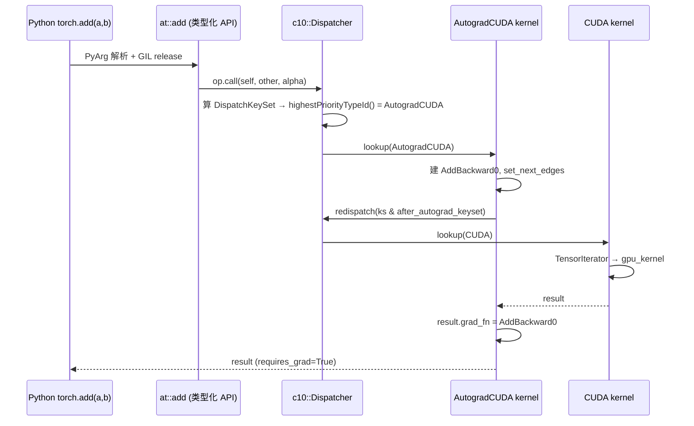
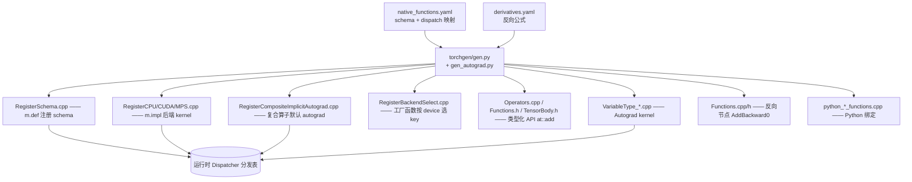
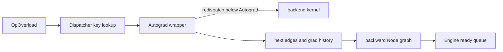

# PyTorch Dispatcher：算子分发机制与自定义扩展

> 从 `DispatchKey` 到 `__torch_dispatch__`：一个算子如何路由到 CPU/CUDA/Autograd/Autocast kernel，分发顺序由什么决定，以及用户如何包装自定义分发
> 最后更新: 2026-07-30(§12 并入 A02 独有的 ADInplaceOrView 分层与 mutation rebase 内容)
> 来源：PyTorch 源码（github.com/pytorch/pytorch，`c10/` + `aten/` + `torch/csrc/`）。本页符号引用以稳定的类/函数名为准，行号随版本漂移不标注。

---

## 1. Dispatcher 是什么 & 为什么需要

一次 `torch.add(a, b)` 背后，PyTorch 要根据参数动态决定到底执行哪段代码：

- **后端不同**：CPU / CUDA / XLA / MPS / Meta …
- **是否要 autograd**：要不要记录反向图
- **是否 autocast**：要不要先把输入转成 fp16/bf16
- **是否 vmap / tracing / 稀疏 / 量化 / FakeTensor …**

如果用 `if-else` 堆叠，复杂度会爆炸（算子数 × 特性数）。Dispatcher 的本质是一张 **多维虚函数表（multiple dispatch）**：以「算子」和「从 Tensor 参数算出来的 DispatchKey」为二维索引，查表找到对应 kernel；并且 kernel 之间可以 **层层 redispatch**，形成一个「洋葱」。

> [!note] 一句话思维模型
> `kernel = OperatorEntry[op].dispatchTable[ keyset.highestPriorityTypeId() ]`
> 高优先级 key 的 kernel 先跑（外层），处理完自己的事后 redispatch 进下一层，最内层是真正算数值的 backend kernel。

```
torch.add(a, b)   (a, b 在 CUDA 上且 requires_grad)
 └─ AutocastCUDA   把输入 cast 成 fp16，redispatch ↓        (若开了 autocast)
     └─ AutogradCUDA   记录反向图 (grad_fn=AddBackward0)，redispatch ↓
         └─ CUDA       TensorIterator → gpu_kernel 真正算数值   ← 最内层
```

---

## 2. 核心数据结构（底层实现原理）

### 2.1 DispatchKey 与 BackendComponent — `c10/core/DispatchKey.h`

`DispatchKey` 是一个枚举：`CPU, CUDA, AutogradCPU, AutogradCUDA, AutocastCUDA, Tracer, Batched, Functionalize, Python, Sparse, Quantized …`

2021 年（Ed Yang 主导）的重构把它拆成两个正交维度，用组合来压缩 key 空间：

| 维度 | 含义 | 例子 |
|------|------|------|
| `BackendComponent` | 后端 bit | `CPUBit, CUDABit, XLABit, MPSBit, PrivateUse1Bit …` |
| functionality | 功能 | `Dense, Sparse, Quantized, AutogradFunctionality, AutocastCUDA …` |

像 `AutogradCUDA` = 功能 `AutogradFunctionality` × 后端 `CUDABit` 组合出来的「per-backend 功能键」。这让「N 个后端 × M 个功能」从 N×M 个枚举值压缩成 N+M 个 bit。

### 2.2 DispatchKeySet：每个 Tensor 携带的位集 — `c10/core/DispatchKeySet.h`

一个 **64-bit 位集**。每个 Tensor 都携带一个 `DispatchKeySet`，存在 `c10::TensorImpl::key_set_` 里。低位放 backend bits，高位放 functionality bits。一个在 CUDA 上、`requires_grad=True` 的 dense tensor，它的 keyset 同时含 `AutogradCUDA`、`ADInplaceOrView`、`CUDA`。

关键方法：

```cpp
// 取「最高位」对应的 key → 决定先跑哪个 kernel
DispatchKey DispatchKeySet::highestPriorityTypeId() const;
```

**枚举里越靠后 = bit 越高 = 优先级越高 = 越「外层」先执行**。所以 `Autograd` 高于 `CPU`：autograd kernel 先跑、再 redispatch 进 CPU。

### 2.3 OperatorEntry：每个算子的分发表 — `aten/src/ATen/core/dispatch/OperatorEntry.h`

每个算子（如 `aten::add.Tensor`）对应一个 `OperatorEntry`，核心是一张按 key 索引的 kernel 表：

```cpp
// 示意
class OperatorEntry {
  FunctionSchema schema_;
  std::array<KernelFunction, num_runtime_entries> dispatchTable_;  // 分发表
  const KernelFunction& lookup(DispatchKeySet ks) const {
    return dispatchTable_[ks.getDispatchTableIndexForDispatchKeySet()];
  }
};
```

注册 kernel 时（含 alias key、fallback、fallthrough）会被预先「编译」进这张表（`computeDispatchTableEntry`）。这一步把别名展开、把 fallthrough 折叠掉，使运行时查表是 **O(1)**。

### 2.4 KernelFunction：boxed vs unboxed — `aten/src/ATen/core/boxing/KernelFunction.h`

一个 kernel 有两种调用约定，`KernelFunction` 可同时持有：

| | 机制 | 用途 |
|---|---|---|
| **unboxed** | 直接用 C++ 原生类型调用（快路径） | 普通后端 kernel，`at::add(a,b)` |
| **boxed** | 参数压进 `torch::jit::Stack`（`vector<IValue>`），kernel 自己 pop | 通用 fallback：autograd 兜底、vmap、`__torch_dispatch__`、`torch.ops` 路径 |

Boxed 之所以存在，是因为像「autograd 兜底」这类 kernel 必须 **对所有算子通用**，只能类型擦除。`make_boxed_from_unboxed_functor` 在两者间做适配。

---

## 3. 一次调用的完整流程 — `aten/src/ATen/core/dispatch/Dispatcher.h`



核心三步（`Dispatcher::call`）：

```cpp
// 1. DispatchKeyExtractor 从所有 Tensor 参数 OR 出 keyset
DispatchKeySet ks = op.dispatchKeyExtractor().getDispatchKeySetUnboxed(args...);
// 2. 叠加算子 mask + 线程局部 include/exclude(TLS)
ks = c10::impl::computeDispatchKeySet(ks, op_mask);
// 3. 取最高优先级 key，查表拿 kernel，调用（隐藏的 ks 首参用于后续 redispatch）
return op.lookup(ks).call<Return, Args...>(op, ks, args...);
```

**Redispatch（洋葱的关键）**：包装类 kernel（autograd/autocast/fallback）收到一个隐藏的 `DispatchKeySet` 首参，处理完后用

```cpp
ks & DispatchKeySet(DispatchKeySet::FULL_AFTER, currentKey)  // 去掉当前 key 及更高位
```

调 `Dispatcher::redispatch`，把控制权交给「下一层」。

---

## 4. 深入①：requires_grad 算子 Python → CUDA 的逐层调用栈

设 `a, b` 是 CUDA 上 `requires_grad=True` 的张量，执行 `c = torch.add(a, b)`。完整路径（生成代码路径以 `*` 标注，文件名/编号随版本变化）：

**① Python → C 绑定** `torch/csrc/autograd/generated/python_torch_functions_*.cpp` *
`torch.add` 先过 `torch/overrides.py` 的 `has_torch_function` 检查（`__torch_function__` 协议）；无覆写则进生成的 `THPVariable_add`，用 `PythonArgParser` 解析参数、`gil_scoped_release` 释放 GIL，调类型化 API。

**② 类型化 C++ API** `build/aten/src/ATen/Operators_*.cpp` *
`at::add(self, other, alpha)` 找到 `OperatorHandle` 并 `op.call(...)` 进入 dispatcher：

```cpp
// 示意
static auto op = c10::Dispatcher::singleton()
    .findSchemaOrThrow("aten::add", "Tensor")
    .typed<Tensor(const Tensor&, const Tensor&, const Scalar&)>();
return op.call(self, other, alpha);
```

**③ Dispatcher 选 key**：`a.key_set() | b.key_set()` ⊇ `{AutogradCUDA, ADInplaceOrView, CUDA}`，叠加 TLS 后 `highestPriorityTypeId()` = **AutogradCUDA**，查表得 autograd kernel。

**④ Autograd kernel** `torch/csrc/autograd/generated/VariableType_*.cpp` *

```cpp
// 示意：建反向节点 → 排除 Autograd 后 redispatch 到 backend
Tensor add_Tensor(c10::DispatchKeySet ks, const Tensor& self,
                  const Tensor& other, const Scalar& alpha) {
  std::shared_ptr<AddBackward0> grad_fn;
  if (compute_requires_grad(self, other)) {
    grad_fn = std::make_shared<AddBackward0>();
    grad_fn->set_next_edges(collect_next_edges(self, other)); // 连到输入的 grad_fn/AccumulateGrad
    grad_fn->alpha = alpha;            // add 仅存 alpha；mul 才会 save_for_backward 张量
  }
  auto result = ([&]() {
    at::AutoDispatchBelowADInplaceOrView guard;               // 排除 Autograd + ADInplaceOrView
    return at::redispatch::add(ks & c10::after_autograd_keyset, self, other, alpha);
  })();
  if (grad_fn) set_history(result, grad_fn);                  // result.grad_fn = grad_fn
  return result;
}
```

**⑤ ADInplaceOrView**：`add` 是 out-of-place 非视图算子，此 key 上注册的是 **fallthrough**，直接跳过到下一层（视图/原地算子才会在此 bump version counter、建 view 关系）。

**⑥ Backend(CUDA) kernel** `build/aten/src/ATen/RegisterCUDA.cpp` *

```cpp
// 示意
TORCH_LIBRARY_IMPL(aten, CUDA, m) {
  m.impl("add.Tensor", TORCH_FN(wrapper_CUDA_add_Tensor));
}
// → structured kernel → TensorIteratorBase 处理广播/dtype 提升
// → gpu_kernel(iter, AddFunctor)  实际核：aten/src/ATen/native/cuda/BinaryAddSubKernel.cu
```

**⑦ 回程**：CUDA kernel 返回 Tensor → autograd kernel 给它挂上 `grad_fn=AddBackward0` 并置 `requires_grad=True` → 返回 Python。反向时 `loss.backward()` 沿 `grad_fn` 调 `AddBackward0::apply`（定义在生成的 `Functions.cpp` *）。

**redispatch 洋葱**（本例，外→内）：

```
AutogradCUDA  (建 AddBackward0)
  → ADInplaceOrView  (fallthrough，跳过)
  → CUDA  (TensorIterator → gpu_kernel → BinaryAddSubKernel.cu)
```

若额外开了 `torch.autocast("cuda")`，最外层会再套一层 `AutocastCUDA`：先把输入 cast 成 fp16 再 redispatch，cast 算子本身也会过 dispatcher 被 autograd 记录，梯度因此能穿过 cast。

---

## 5. 分发顺序由什么决定

由四件事共同决定：

### 5.1 静态优先级 — `DispatchKey` 枚举顺序

枚举里越靠后优先级越高。概念上从「外层先跑」到「内层」（精确顺序以 `c10/core/DispatchKey.h` 为准）：

| 优先级 | 典型 key | 作用 |
|--------|----------|------|
| 最高（最外） | `Python` / `PythonTLSSnapshot` | `__torch_dispatch__` 入口 |
| ↑ | `FuncTorchDynamicLayerFront` / `Functionalize` | functorch 变换 / 函数化 |
| ↑ | `FuncTorchBatched` / `Batched` / `VmapMode` | vmap 批处理 |
| ↑ | **`AutocastCUDA` / `AutocastCPU`** | 混合精度 cast（**高于 Autograd**） |
| ↑ | `Tracer` | JIT trace |
| ↑ | **`Autograd*`** / `ADInplaceOrView` | 反向图记录 / 视图原地追踪 |
| ↓ | `Conjugate` / `Negative` / `ZeroTensor` | 惰性共轭/取负 |
| ↓ | `Sparse*` / `Quantized` / `NestedTensor*` | 布局特化 |
| 最低（最内） | **`CPU` / `CUDA` / `MPS`（Dense）** | 真正算数值 |

> [!note] 为什么 Autocast 高于 Autograd？
> autocast 先决定精度并插入 cast，这些 cast 再 redispatch 进 autograd 被记录，梯度才能正确穿过 cast。所以 autocast 必须是更外层。

### 5.2 运行时 keyset 计算 — `c10/core/impl/LocalDispatchKeySet.h`

```cpp
// 算子 mask（该算子「永远忽略」的 key）+ 线程局部 include/exclude
DispatchKeySet computeDispatchKeySet(DispatchKeySet ks, DispatchKeySet op_mask) {
  auto tls = c10::impl::tls_local_dispatch_key_set();
  return ((ks | tls.included_) - tls.excluded_) & op_mask;
}
```

常见 TLS 用法：`c10::InferenceMode` 排除 Autograd；`ExcludeDispatchKeyGuard` 在 kernel 内排除自己以实现 redispatch；`AutoDispatchBelowADInplaceOrView` 同时排除 Autograd 和 ADInplaceOrView。

### 5.3 fallthrough vs fallback

- **fallthrough**：某 key 对该算子「无所谓」，直接跳到下一个 key（在建表时折叠，零运行时开销）。例如不需要 grad 的算子在 Autograd key 上 fallthrough。
- **fallback**：某 key 的「对所有算子通用」的兜底 kernel，用 `m.fallback(...)` 注册。如 autograd 兜底（`autogradNotImplementedFallback`）、`Python` key 兜底（转去调 `__torch_dispatch__`，见 `aten/src/ATen/core/PythonFallbackKernel.cpp`）。

### 5.4 Alias dispatch keys（注册时展开，易混淆）

`native_functions.yaml` 里算子常注册到别名 key，建表时被展开进真实运行表：

| Alias key | 含义 |
|---|---|
| `CompositeImplicitAutograd`（旧名 Math） | 用其它算子组合实现；对所有后端 **且** autograd 自动生效（靠拆解后的子算子求导）。`matmul/linear/relu` 等多属此类 |
| `CompositeExplicitAutograd`（旧名 DefaultBackend） | 对所有后端生效，但 **不** 自动 autograd |
| `Autograd` | 展开成 `AutogradCPU/CUDA/…` |

> [!note] 这解释了 `__torch_dispatch__` 看到的算子粒度
> `Python` key 优先级高于 Autograd，所以 mode 先拦到 **未拆解** 的 `aten.matmul.default`，而非内部分解出的 `aten.mm`。详见 §11。

---

## 6. 深入②：native_functions.yaml + torchgen 代码生成

算子不是手写注册的，而是从声明式 YAML 由 **torchgen** 批量生成。

**声明** — `aten/src/ATen/native/native_functions.yaml`：

```yaml
- func: add.Tensor(Tensor self, Tensor other, *, Scalar alpha=1) -> Tensor
  structured_delegate: add.out          # 委托给结构化 kernel
  variants: function, method            # 生成 at::add 与 Tensor::add
  dispatch:
    SparseCPU, SparseCUDA: add_sparse   # 仅这些 key 走特化；未列的走默认
    MkldnnCPU: mkldnn_add

- func: add.out(Tensor self, Tensor other, *, Scalar alpha=1, Tensor(a!) out) -> Tensor(a!)
  structured: True                      # 结构化 kernel：meta + impl 分离
  structured_inherits: TensorIteratorBase
  dispatch:
    CPU, CUDA: add_out                  # 开发者只写 TORCH_IMPL_FUNC(add_out)
    MPS: add_out_mps
```

关键字段：`func`=schema（决定 `OperatorHandle`）；`dispatch`=key→native 函数名（缺省即 `CompositeImplicitAutograd`）；`structured/structured_delegate`=结构化 kernel 框架（torchgen 生成 meta 形状/dtype 推导 + 输出分配，开发者只写 `TORCH_IMPL_FUNC` 填值）；反向公式在 `tools/autograd/derivatives.yaml`。

**生成** — `torchgen/gen.py` + `tools/autograd/gen_autograd.py`：



> `RegisterBackendSelect.cpp`：工厂函数（如 `torch.empty`）没有 Tensor 参数，无法从参数推 key，于是 `BackendSelect` key 从 `device=` 实参计算后端，再 redispatch。

---

## 7. 核心代码文件清单

| 层 | 文件 | 角色 |
|----|------|------|
| key | `c10/core/DispatchKey.h` | key 枚举、BackendComponent |
| key | `c10/core/DispatchKeySet.h` | 位集 & `highestPriorityTypeId()`（**优先级真相**） |
| 调度 | `aten/src/ATen/core/dispatch/Dispatcher.h/.cpp` | 单例 `c10::Dispatcher`、`OperatorHandle`、`call/redispatch/callBoxed` |
| 调度 | `aten/src/ATen/core/dispatch/OperatorEntry.h/.cpp` | 每算子分发表 |
| 调度 | `aten/src/ATen/core/dispatch/DispatchKeyExtractor.h` | 从参数抽 keyset |
| 调度 | `aten/src/ATen/core/boxing/KernelFunction.h` | boxed/unboxed |
| TLS | `c10/core/impl/LocalDispatchKeySet.h` | include/exclude guard |
| 注册 | `torch/library.h`、`aten/src/ATen/core/library.cpp` | `TORCH_LIBRARY` 等宏 |
| Python 分发 | `aten/src/ATen/core/PythonFallbackKernel.cpp` | `Python` key 兜底 → `__torch_dispatch__` |
| Python 桥 | `torch/_ops.py` | `OpOverload`/`OpOverloadPacket`/`torch.ops` |
| Python 桥 | `torch/library.py` | Python 端 `Library`/`custom_op` |
| Python 桥 | `torch/csrc/utils/python_dispatch.cpp` | 把 Python 注册接到 C++ dispatcher |
| 覆写 | `torch/overrides.py` | `__torch_function__` 机制 |
| 生成 | `torchgen/` | 由 `native_functions.yaml` 生成上述 Register*.cpp |

---

## 8. C++ → Python 类关系

```
Python                              C++
──────                              ───
torch.ops                           torch._ops._Ops
torch.ops.aten                      _OpNamespace
torch.ops.aten.add          ──►     OpOverloadPacket          (聚合所有重载)
torch.ops.aten.add.Tensor   ──►     OpOverload ─► c10::OperatorHandle ─► c10::OperatorEntry
                                                                            │ 持有分发表
                                                                            ▼
                                                          KernelFunction[DispatchKey]

torch.Tensor                ──►     THPVariable ─► at::Tensor ─► c10::TensorImpl
   (python_variable.cpp)                                           │ 携带
                                                                   ▼
                                                       DispatchKeySet key_set_

torch.library.Library       ──►     torch::Library
```

- `OpOverload.__call__`（Python）走 **boxed** 路径进 C++ dispatcher（参数转 `IValue` 入栈）。
- `torch.Tensor` 的 C++ 真身是 `THPVariable`（`torch/csrc/autograd/python_variable.cpp`），内含 `at::Tensor`，再内含携带 keyset 的 `TensorImpl`。

---

## 9. 核心接口（注册与调用）

**C++ 注册** — `TORCH_LIBRARY` / `TORCH_LIBRARY_IMPL`：

```cpp
TORCH_LIBRARY(mylib, m) {                 // 定义 schema
  m.def("my_op(Tensor x) -> Tensor");
}
TORCH_LIBRARY_IMPL(mylib, CPU, m)  { m.impl("my_op", &my_op_cpu); }   // 后端 kernel
TORCH_LIBRARY_IMPL(mylib, CUDA, m) { m.impl("my_op", &my_op_cuda); }
TORCH_LIBRARY_IMPL(_, AutogradCPU, m) { m.fallback(/* 通用兜底 */); } // 对所有算子
```

**Python 注册** — `torch.library`：

```python
# 现代 API（推荐）
@torch.library.custom_op("mylib::my_op", mutates_args=())
def my_op(x: torch.Tensor) -> torch.Tensor: ...

@my_op.register_kernel("cuda")
def _(x): ...

# 传统 API
lib = torch.library.Library("mylib", "DEF")
lib.define("my_op(Tensor x) -> Tensor")
lib.impl("my_op", my_cpu_impl, "CPU")
```

**调用侧**：`at::add(a,b)`（unboxed 快路径） / `op.redispatch<...>(ks_after_me, ...)`（kernel 内 redispatch） / `op.callBoxed(stack)`（通用 boxed）。

---

## 10. 用户能否包装自定义 dispatch？能，分多个层级

从「靠近 Python」到「靠近 C++ dispatcher」：

### 10.1 `__torch_function__` —— Python **API 层** 拦截
拦的是面向用户的接口（`torch.add`、`Tensor.__add__`）**调用前** 那一层，看不到内部 redispatch / 算子拆解。适合：改 Python API 行为、日志、类型协议。机制在 `torch/overrides.py` + C++ `handle_torch_function`。

### 10.2 `__torch_dispatch__` —— **dispatcher 层** 拦截（真正的「自定义分发」）⭐
通过 `Python` dispatch key 生效：算子在经过 autocast/autograd 等高优先级 key **之后**，落到 `Python` key 的兜底 kernel，转而调用你的 `__torch_dispatch__`。你在这里能看到 **所有 `aten::` 级算子（boxed 形式）** 并自由改写/拦截/转发。这是 FakeTensor、meta tensor、`make_fx` tracing、AOTAutograd、functorch 的实现基础。两种用法：

- **Tensor 子类**：定义 `__torch_dispatch__` 类方法，拦截涉及该子类实例的算子。
- **`TorchDispatchMode`**（`torch.utils._python_dispatch`）：栈式上下文，无需子类，拦截 `with` 块内 **所有** 算子。

### 10.3 自定义后端 / 自定义 key（C++ 层）
用 `PrivateUse1`（及 `AutogradPrivateUse1`）接入全新硬件后端，给一批算子注册 kernel，即可让自定义设备走完整 dispatch 流程——这是真正「扩展分发维度」。

> [!note] 选型速记
> 改 Python API 行为 → `__torch_function__`；拦截/重写所有底层 `aten` 算子 → `__torch_dispatch__` / `TorchDispatchMode`；接新硬件 → 自定义 key + `TORCH_LIBRARY_IMPL`。

---

## 11. 深入③：可运行的 `__torch_dispatch__` 实战

> [!warning] 输出为手算预期值
> 本机未安装 torch，下列「预期输出」由公式手算给出（已核对），运行环境需 `pip install torch`。`@` matmul 在 dispatch 层会被拆成 `aten.mm`，但 mode 先拦到外层 `aten.matmul.default`；为让计数确定，demo 直接用 `torch.mm`（非复合，直达 `aten.mm.default`）。

### 11.1 FLOP 计数器（TorchDispatchMode）

```python
import torch
from torch.utils._python_dispatch import TorchDispatchMode

aten = torch.ops.aten

def _prod(shape):
    out = 1
    for s in shape:
        out *= s
    return out

class FlopCounterMode(TorchDispatchMode):
    def __init__(self):
        self.flops = 0
        self.per_op = {}

    def __torch_dispatch__(self, func, types, args=(), kwargs=None):
        kwargs = kwargs or {}
        out = func(*args, **kwargs)             # mode 在此调用期间被临时挂起，不会无限递归
        f = self._flop(func, args)
        if f:
            self.flops += f
            self.per_op[func] = self.per_op.get(func, 0) + f
        return out

    @staticmethod
    def _flop(func, args):
        if func is aten.mm.default:                       # (n,k) @ (k,m)
            (n, k), (_, m) = args[0].shape, args[1].shape
            return 2 * n * k * m
        if func is aten.addmm.default:                    # addmm(bias, a, b)
            (n, k), (_, m) = args[1].shape, args[2].shape
            return 2 * n * k * m
        if func is aten.bmm.default:                      # (b,n,k) @ (b,k,m)
            (b, n, k), (_, _, m) = args[0].shape, args[1].shape
            return 2 * b * n * k * m
        if func is aten.linear.default:                   # linear(x, W, bias); x:(*,in) W:(out,in)
            x, w = args[0], args[1]
            return 2 * _prod(x.shape[:-1]) * w.shape[1] * w.shape[0]
        return 0

# ---- demo ----
a = torch.randn(64, 128)
b = torch.randn(128, 256)
linear = torch.nn.Linear(256, 512)

with FlopCounterMode() as fc:
    c = torch.mm(a, b)        # aten.mm   : 2*64*128*256 = 4,194,304
    y = linear(c)             # aten.linear: 2*64*256*512 = 16,777,216

print(f"total FLOPs = {fc.flops:,}")   # 预期: total FLOPs = 20,971,520
```

> 要点：`nn.Linear` 2D 输入对应复合算子 `aten::linear`，因 `Python` key 高于 Autograd，mode 拦到的是 **未拆解** 的 `aten.linear.default`（而非内部的 `addmm`），故为它单独注册公式。真实的 `torch.utils.flop_counter.FlopCounterMode` 即用同样思路登记一批高层算子公式。

### 11.2 算子替换：把所有 relu 换成 gelu

```python
import torch
from torch.utils._python_dispatch import TorchDispatchMode
aten = torch.ops.aten

class ReluToGeluMode(TorchDispatchMode):
    def __torch_dispatch__(self, func, types, args=(), kwargs=None):
        kwargs = kwargs or {}
        if func in (aten.relu.default, aten.relu_.default):
            return aten.gelu.default(args[0])      # 拦截并改道
        return func(*args, **kwargs)

x = torch.tensor([-1.0, 0.0, 1.0, 2.0])
print(torch.relu(x))            # 预期: tensor([0., 0., 1., 2.])
with ReluToGeluMode():
    print(torch.relu(x))        # 预期: tensor([-0.1587,  0.0000,  0.8413,  1.9545])
```

这演示了「包装自定义分发」最直接的形态——在 dispatcher 层拦截某算子并重写其语义。

### 11.3 Tensor 子类：LoggingTensor

```python
import torch
from torch.utils._pytree import tree_map

class LoggingTensor(torch.Tensor):
    @staticmethod
    def __new__(cls, elem):
        return torch.Tensor._make_wrapper_subclass(
            cls, elem.shape, dtype=elem.dtype, device=elem.device,
            requires_grad=elem.requires_grad)
    def __init__(self, elem):
        self.elem = elem

    @classmethod
    def __torch_dispatch__(cls, func, types, args=(), kwargs=None):
        unwrap = lambda t: t.elem if isinstance(t, LoggingTensor) else t
        wrap   = lambda t: LoggingTensor(t) if isinstance(t, torch.Tensor) else t
        print(f"[dispatch] {func._schema.name}")
        out = func(*tree_map(unwrap, args), **tree_map(unwrap, kwargs or {}))
        return tree_map(wrap, out)

x = LoggingTensor(torch.randn(3, 3))
y = LoggingTensor(torch.randn(3, 3))
z = x + y * 2     # 预期打印: [dispatch] aten::mul  然后  [dispatch] aten::add
```

子类路径比 mode 更强（能携带自定义存储/元数据，实现 FakeTensor 这类「假张量」），但要正确处理 `_make_wrapper_subclass` 与 unwrap/wrap，工程量更大。日常「全局拦截」优先用 `TorchDispatchMode`。

---

## 12. 深入④：ADInplaceOrView 分层与 mutation 算子的 rebase(手写 wrapper 样本)

> 本节内容原属 P4 知识库整改被删除的 A 卷回顾页(`19_torch_compile_end_to_end/a02_operator_schema_dispatch_and_autograd_analysis.md`),因其"Autograd 与 ADInplaceOrView 为什么分层、mutation 算子在 wrapper 层多做了什么"的手写样本在本页与 [[01_eager_runtime/05_autograd_engine/index]] 均无覆盖,逐字迁入本页。本节沿用来源页的行号引用风格,基线 e8f97c1a(与本页页头"行号随版本漂移不标注"的约定不同,此为例外)。

### 12.1 Autograd dispatch wrapper 做什么

以手写的 `copy_` autograd wrapper 为例，当前源码路径大致是：

```text
Autograd key 命中 VariableType::copy_
  → 判断是否需要 grad
  → 构造 CopyBackwards
  → collect_next_edges
  → AutoDispatchBelowAutograd
  → redispatch 到更低层实现
  → rebase_history
```

对应实现见 `torch/csrc/autograd/VariableTypeManual.cpp:201-215`。
Autograd wrapper 注册到 Autograd key
（`torch/csrc/autograd/VariableTypeManual.cpp:343-369`）；view/inplace 还有单独
`ADInplaceOrView`注册层（同文件 `:532-559`）。

#### 为什么 Autograd 和 ADInplaceOrView 分层

- Autograd 负责梯度公式与 next edges；
- ADInplaceOrView 负责 version bump、view/inplace bookkeeping；
- inference/no-grad 等模式可能需要其中一部分而跳过另一部分。

若二者完全耦合，inference、functionalization 和 view-only tracking 很难只选择需要的
语义层。

### 12.2 源码跟读：手写 `_fw_primal` 与 `copy_` wrapper 如何把 Dispatcher 接到 Autograd

这一节选取手写 Autograd wrapper 作为可见样本，把 forward 调用和 backward 执行接起来。
手写 wrapper 不是所有 operator 的统一实现；大量 wrapper 由生成器产生。但它完整暴露了
生成代码同样需要遵循的契约，因此适合观察层次边界。



#### 12.2.1 Autograd wrapper 本身也是 Dispatcher 选中的 kernel

手写 `_fw_primal` wrapper 展示了典型结构：先判断输出是否需要梯度，必要时创建
`Identity` backward Node 并收集 next edges；随后在排除 Autograd keys 的 guard 下
redispatch；最后给输出安装 history
（`torch/csrc/autograd/VariableTypeManual.cpp:123-139`）。

这段顺序很重要：Autograd 不是在 backend kernel 之后扫描结果、凭空恢复输入关系；wrapper
在调用 lower kernel 前已经保存了构建 backward edge 所需的输入语义，kernel 返回后再把
输出与新 Node 连接。

`compute_requires_grad` 会先尊重全局 GradMode，再扫描参数是否需要梯度；
`set_history` 为 Node 添加 output metadata，并把 Tensor 的 gradient edge 指向该 Node
（`torch/csrc/autograd/functions/utils.h:59-84`）。所以 `requires_grad=True` 只是建图条件，
真正的依赖关系由 Node 的 next edges 与输出 gradient edge 共同组成。

#### 12.2.2 mutation operator 为什么多出 inplace 检查和 rebase

`copy_` wrapper 先 unpack 输入并计算梯度需求，然后调用 `check_inplace`；需要建图时创建
`CopyBackwards`、设置 next edges，redispatch 执行真实写入，最后对被修改 Tensor
`rebase_history`（`torch/csrc/autograd/VariableTypeManual.cpp:196-215`）。

这比 functional operator 多出的步骤不是实现噪声。写操作保留了 Python 对象和 Storage，
却改变了它的数学历史；因此旧 gradient edge 不能原样继续代表"当前值从哪里来"。编译器
若把 mutation 改写为 functional op，也必须在图 ABI 或 runtime writeback 中恢复同一可见
语义。

### 12.3 跟读后应区分的三种"边"

一次算子调用附近至少存在三种不同的"边"，对象、所有者和生命周期都不同：

| 关系 | 产生位置 | 语义 |
|---|---|---|
| Dispatcher redispatch | wrapper 到下一 dispatch key | 选择下一层 operator 实现 |
| Autograd Edge | output gradient edge / Node next edge | backward value 应送到哪个 Node input |
| FX data edge | Node 参数引用另一个 Node | 编译 IR 中值定义与使用 |

pattern 匹配 ATen target 只是在 FX data graph 上匹配 operator 结构；它不会自动证明
Autograd Edge、mutation history 或 dispatch behavior 也保持不变。

---

## 13. 小结：思维模型

1. **本质**：`kernel = OperatorEntry[op].table[ keyset.highestPriorityTypeId() ]`，kernel 间层层 redispatch 成洋葱。
2. **数据结构**：`DispatchKey`（枚举即优先级）、`DispatchKeySet`（Tensor 携带的 64-bit 集）、`OperatorEntry`（分发表）、`KernelFunction`（boxed/unboxed）。
3. **顺序由四者决定**：枚举静态优先级 + 算子 mask + 线程 TLS(include/exclude) + fallthrough/fallback；别名 key 在建表时展开。关键相对关系：`Python > functorch/vmap > Autocast > Autograd > 后端(CPU/CUDA)`。
4. **算子从哪来**：`native_functions.yaml` + `derivatives.yaml` 经 `torchgen` 生成全部 `Register*.cpp`，运行时填满分发表。
5. **自定义分发**：`__torch_dispatch__` / `TorchDispatchMode`（Python 层全算子拦截，§11）或自定义后端 key（C++ 层）。
6. **入口真相**：优先级看 `DispatchKeySet.h`，key 定义看 `DispatchKey.h`，调用看 `Dispatcher.h`，注册看 `torch/library.h`。

---

## Related Pages

- [[01_ai_frameworks/index]] — PyTorch Compilation Stack 目录索引
- [[dispatch_modes_proxytensor_faketensor_analysis]] — AOTAutograd 用 `__torch_dispatch__`（`Python` key）+ ProxyTensor/FakeTensor 两套抽象执行状态追踪联合图，是本页机制的直接消费者
- [[torch_compile_architecture]] — torch.compile 端到端流水线建立在 dispatcher 之上
- [[02_compile_stack/01_dynamo/index]] — Dynamo 在「帧/字节码」层捕获，与 dispatcher 在「算子」层分发互补
- [[torchtitan_ac_analysis]] — SAC 激活重计算用 `TorchDispatchMode` 缓存/回放 save-op，是 §11 模式的工程应用
