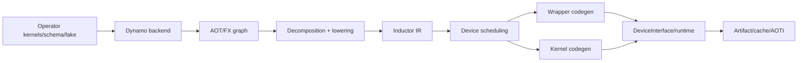

# F06 · Custom Backend 与 Device Integration

> 卷别：F · 训练、分布式、扩展与部署  
> 固定源码：PyTorch `e8f97c1a6ef8cbcdd0a946606bc1e924e4f07e52`  
> 前置：[[custom_operators_fake_kernels_and_decompositions_analysis]]  
> 后续：[[28_aotinductor_packaging_and_deployment_analysis]]  
> 最后更新：2026-07-30(kb-reorg P4 Task 9 迁入本目录,与 [[11_privateuse1_device_integration_analysis]]+[[34_codegen_extension_guide]] 三方划界)

> [!note] 三方划界:本页 vs [[11_privateuse1_device_integration_analysis]] vs [[34_codegen_extension_guide]]
> 三页讲的是完全不同的"设备接入"层次,容易被同一个词"device backend"混为一谈:
>
> - [[11_privateuse1_device_integration_analysis]] 讲**eager/dispatcher 层**——第三方加速器如何在完全不碰 `torch.compile` 的前提下,通过 Guard/Hooks/Operators/AMP/Autoload/Profiler/Distributed backend 九个接入点接入 PyTorch dispatcher。它通篇不涉及 Dynamo/Inductor。
> - 本页讲**编译栈的三层 backend 契约**——Dynamo backend(接收 FX GraphModule、可完全绕过 Inductor)、Inductor device backend(scheduler/codegen/wrapper)、dispatcher/custom op backend(单算子)如何分层且可独立组合,以及 §4 `DeviceInterface` 这个 Inductor 用来设备无关地查询 runtime(event/stream/device)的抽象——这两点(三层划分、`DeviceInterface`)是另外两页都未覆盖的内容。
> - [[34_codegen_extension_guide]] 是 Inductor device backend **怎么注册**的实操指南(`register_backend_for_device`/`DeviceOpOverrides`/`BackendFeature` 的具体调用、代码样例、验证清单),与本页 §5/§6/§8 在"注册什么"上有真实重叠——重叠部分已收缩为指向该页,本页只保留该指南未覆盖的框架性判断(三层 backend 如何组合、`DeviceInterface` 与 wrapper codegen 的层次区别、cache/ABI 与测试梯度)。
>
> 阅读顺序:先读 [[11_privateuse1_device_integration_analysis]] 理解设备怎样先接入 dispatcher(前提),再读本页理解 `torch.compile` 的三层 backend 契约怎样架在其上,细节实操翻 [[34_codegen_extension_guide]]。

## 1. 三种“backend”不要混为一层

### Dynamo backend

接收FX `GraphModule + example inputs`，返回可调用对象。可以完全绕过Inductor。

### Inductor device backend

继续使用Inductor GraphLowering/IR/Scheduler，但提供目标device的scheduling、kernel codegen、
wrapper codegen和runtime overrides。

### Dispatcher/custom op backend

为operator提供device kernel。它解决单op执行，不自动构成整图compiler backend。

三者可组合，也可独立存在。

## 2. Dynamo backend 的最小契约

类型定义是：

```text
CompilerFn(GraphModule, list[Tensor]) -> CompiledFn
CompiledFn(*runtime Tensor) -> tuple[Tensor, ...]
```

源码见 `torch/_dynamo/backends/registry.py:75-84`。

注册只提供string shorthand；外部项目也可直接传callable。registry保存name、tags和compiler
function，并拒绝重复name
（`torch/_dynamo/backends/registry.py:87-115`）。

lookup按需加载entry point、给无效name提供建议，最终返回稳定compiler callable
（`torch/_dynamo/backends/registry.py:124-142`）。

真正生产backend还需处理：

- FakeTensor/example input，不可读取真实数据；
- dynamic SymInt；
- boxed calling convention；
- mutation/alias输出ABI；
- forward/backward compiler；
- config/cache key；
- 线程、device和exception；
- 返回callable lifetime。

## 3. 为什么 backend callable identity 要稳定

Dynamo cache entry保存backend identity；同一逻辑backend若每次由新lambda/closure创建，可能
触发`BACKEND_MATCH` guard failure。注册名称解决发现，不自动解决内部config/version
identity。

建议backend对象具有：

- 稳定名称与版本；
- 可序列化、可hash配置；
- 确定性compile output；
- 清晰capability；
- 显式artifact/cache compatibility key。

## 4. DeviceInterface 解决 runtime 抽象

Inductor需要设备无关地查询：

- device context与数量；
- Event/Stream；
- current/exchange/set device；
- raw stream与synchronize；
- device properties/compute capability；
- multiprocessing worker安全查询。

抽象定义见 `torch/_dynamo/device_interface.py:40-68`、
`torch/_dynamo/device_interface.py:70-85`、
`torch/_dynamo/device_interface.py:86-100`、
`torch/_dynamo/device_interface.py:102-119` 与
`torch/_dynamo/device_interface.py:120-136`。

Event/Stream必须继承PyTorch基类才能被Dynamo捕获。Worker API之所以独立，是因为forked
compile worker不能随意初始化GPU runtime。

接口按device string注册和lazy lookup；内置注册包括cuda、xpu、mtia、cpu、mps、tpu
（`torch/_dynamo/device_interface.py:620-641` 与
`torch/_dynamo/device_interface.py:644-660`）。

## 5. Inductor backend 为什么需要 scheduler 与 wrapper

generated code有两部分：

- kernel code；
- 桥接kernel、allocation、stream和输出的wrapper。

只实现kernel emitter而没有wrapper、stream、allocation与call ABI，不能形成可运行整图——这是
理解本节的最小结论。`register_backend_for_device`怎样把device映射到具体的`BaseScheduling`/
`PythonWrapperCodegen`子类、注册时必须实现哪些方法、常见错误有哪些，属于实操细节，
见 [[34_codegen_extension_guide]] §3-§4、§9(该指南专讲这一步，不在本页重复)。

## 6. Device op overrides 与 DeviceInterface 是两个不同层

wrapper代码需要目标device专属的**代码字符串**表达（set/synchronize device、device/stream
guard、kernel header等）——这层是`DeviceOpOverrides`，注册方式与代码样例见
[[34_codegen_extension_guide]] §5。

它与本页 §4 的`DeviceInterface`是**两个不同层**，容易混淆：`DeviceOpOverrides`产出的是
**要塞进 wrapper 源码里的字符串**（code string / runtime ABI 层）；`DeviceInterface`是
Dynamo/Inductor 在**Python 侧直接调用**的 runtime 查询对象（Python runtime query 层），
二者一个管"生成什么代码"，一个管"编译器自己怎么查设备状态"，不能用同一套接口互相替代。

## 7. Operator coverage：decomposition、lowering、fallback

Inductor lowering把ATen target映射到IR构造函数，并统一处理broadcast、type promotion和IR
validation
（`torch/_inductor/lowering.py:481-510` 与
`torch/_inductor/lowering.py:511-532`）。

device backend需要回答每个可能op：

- 先decompose成已有op；
- 在共享/自定义lowering生成IR；
- 生成external/fallback call；
- 明确不支持并让上层失败/回退。

缺少一个路径会表现为lowering failure；错误fallback layout则可能导致runtime错或不必要
realization。

## 8. Capability 与 feature gating

不同device可支持不同的foreach、in-place buffers、scan/sort、tuple reduction、Triton
templates、single-element reduction、loop order偏好等能力。pass/scheduler应先查询这些
capability，而不是生成代码后再让compiler报错；feature集合还必须进入cache兼容性。
`BackendFeature`/`get_backend_features`的定义与查询接口见 [[34_codegen_extension_guide]]
API 表(该指南已列出，本页不重复行号)。

## 9. 完整接入链



每层都有独立单元测试和失败分类。用一个“device支持torch.compile”的布尔值无法描述能力。

## 10. Cache 与 ABI

cache key至少包含：

- backend版本；
- device architecture/capability；
- driver/runtime/compiler；
- feature flags；
- lowering/decomposition版本；
- wrapper/AOTI ABI；
- shape/dtype/layout specialization；
- custom op library version。

远端cache不能假设所有worker硬件等价。load前应验证兼容性，失败时rebuild或安全fallback。

## 11. 测试梯度

1. dispatcher op eager；
2. FakeTensor/meta；
3. Dynamo backend identity/contract；
4. dynamic shapes与guards；
5. AOT forward/backward；
6. lowering IR；
7. scheduler legality；
8. wrapper/kernel compile；
9. stream/event/device guard；
10. correctness与memory；
11. cache serialize/load；
12. AOTI/package；
13. multi-device/distributed。

CPU-only或codegen-only测试不能声称目标accelerator runtime已验证。

## 12. 复杂度与维护成本

接入成本大致是：

\[
O(|\text{ops}|+|\text{IR features}|+|\text{runtime features}|
+|\text{artifact ABIs}|)
\]

decomposition可降低直接lowering数量，但会增加图规模；fallback提高覆盖面但损失fusion；
自定义scheduler提高性能但扩大正确性与维护面。应先建立可用的最小纵向链，再按profiling扩展。

## 13. 常见误解

- **“注册Dynamo backend就等于接入Inductor新设备。”** 前者可完全独立。
- **“有custom op kernel就能编译整图。”** 还缺fake、AOT、lowering和wrapper。
- **“DeviceInterface就是codegen。”** 它是runtime抽象；kernel/wrapper有另一组接口。
- **“fallback意味着回到整个eager模型。”** 可能只在compiled graph内调用单个external op。
- **“能生成源码就是设备支持完成。”** native compile、load、execute、stream和ABI仍需验证。

## 配套 Demo

本页对应卷级入口 `tools/labs_torch_compile/demo_f_advanced_topics.py` 的 `custom_backend` 用例。默认以 CUDA 为验收设备：

```powershell
python -B tools\labs_torch_compile\demo_f_advanced_topics.py `
  --case custom_backend --device cuda `
  --output-dir tools\labs_torch_compile\artifacts\volume_demos\f06
```

先用 `--list --json` 查看用例声明的能力要求。无 CUDA 的机器可把 `--device` 改为 `cpu` 探索设备无关机制；CUDA/Triton/多卡专属用例会返回 `BLOCKED`，且不会执行用例正文。不要把 `BLOCKED` 写成 `PASS`。

重点读取 `summary.json` 与 `custom_backend/result.json`：`status` 区分 `PASS/BLOCKED/FAIL`，`environment` 固化运行环境，`observations` 保存本页机制的实测字段，`artifacts` 指向图代码、日志、trace 或进程证据。`PASS` 只表示该次运行中的断言通过，不外推到其他 PyTorch 版本、shape、dtype 或硬件。

## Related Pages

- [[00_torch_compile_end_to_end_index]]
- [[01_eager_runtime/02_dispatcher_and_device/index]] — 本模块 overview
- [[11_privateuse1_device_integration_analysis]] — 更底层的 eager/dispatcher 设备接入,见页头三方划界
- [[34_codegen_extension_guide]] — Inductor device backend 注册的实操指南,见页头三方划界
- [[18_backend_contract_and_custom_backend_analysis]]
- [[custom_operators_fake_kernels_and_decompositions_analysis]]
- [[28_aotinductor_packaging_and_deployment_analysis]]
- [[27_async_compile_workers_and_module_loading_analysis]]
- [[10_fx_lowering_to_inductor_ir_analysis]]
