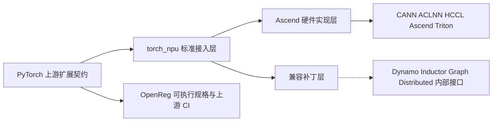

# torch_npu 对 PyTorch 的 out-of-tree 适配全景——标准插件面、硬件实现面与兼容补丁面

> **Source baseline**: `torch_npu` `v2.7.1@b3c8a815b4bf6f8ec28b418aa9ec42815db0d91e`；其记录的 `op-plugin` gitlink 为 `6ef73e3994433d2804eaf29b1f9f45b730d49087`；PyTorch upstream 为 `main@2b460d01b8a5d2c12188b9ea8f9b59a58b9f6a09`（均为 2026-07-15 本地快照）。
> **Dimension**: Overview / mechanism-level comparison
> **Last updated**: 2026-07-15
>
> 本页回答两个问题：Ascend 已经在哪些层面按 PyTorch 社区的 out-of-tree 契约接入；哪些代码是硬件必然差异，哪些则是上游扩展面不足或版本滞后造成的兼容债。注意这不是同版本 benchmark：`torch_npu` 明确绑定 PyTorch 2.7.1，而对照仓库是当前 upstream `main`（`setup.py:722`、`test_upstream/readme.md:68-74`）。

---

## 1. 核心结论：torch_npu 不是一层插件，而是三层叠加

**主线判断**：`torch_npu` 的 eager 地基已经相当标准化——设备命名、autoload、PrivateUse1、DeviceGuard、Hooks、Allocator、Dispatcher、AMP、c10d 都使用了上游正式或半正式扩展点；真正的维护压力集中在编译栈和框架周边，因为它们仍大量依赖 `torch._dynamo` / `torch._inductor` / distributed 私有对象的运行时改写。

三层必须分开评价：

| 层 | 典型代码 | 性质 | 是否应消除 |
|---|---|---|---|
| **标准接入层** | PrivateUse1、autoload、`register_backend`、`register_interface_for_device`、`register_backend_for_device` | 与社区方向一致 | 保留并尽量升级到新接口 |
| **硬件实现层** | ACL runtime、NPU stream/event/allocator、私有 format、ACLNN kernel、HCCL、Ascend Triton/MLIR/DVM | 芯片和软件栈决定的真实差异 | 不应为了“看起来像 CUDA”而消除 |
| **兼容补丁层** | 改写 Dynamo rule map、Inductor lowering/scheduler/wrapper、cudagraph tree、distributed/FSDP API | 上游扩展面与 2.7.1 版本能力不够时的 delta | 是版本升级最主要的风险面，应持续收缩 |

### 1.1 一张表看完当前主要适配点

| 适配面 | upstream 提供什么 | torch_npu 当前怎么接 | 差异定性 |
|---|---|---|---|
| 包加载与设备命名 | `torch.backends` entry point、PrivateUse1 rename、device module | wheel 声明 autoload；注册 `npu`、`torch.npu`、`.npu()` | **高度对齐** |
| 设备运行时 | Guard/Hooks/Allocator/Stream/Event/Generator 抽象 | ACL runtime 的完整 NPU 实现 | **接口对齐，实现在设备侧** |
| Tensor/Storage | 通用 Tensor/Storage + backend meta 扩展 | `NPUStorageImpl` 保存 ACL 私有 format 并参与序列化 | **硬件真实差异** |
| Eager 算子 | Dispatcher、torchgen、Composite/Autograd/fallback | op-plugin YAML + 二次 codegen + ACLNN/acl_op + CPU fallback | **机制复用，供给链私有且强版本化** |
| AMP/Autograd | `AutocastPrivateUse1`、Autograd key、上游 derivatives | 复用 policy 宏；原生算子复用上游反向，自定义算子另生成绑定 | **大体对齐** |
| Dynamo | compiler backend registry、`DeviceInterface` | 注册 NPU backend/interface，同时 patch trace rules 和 Variable 类 | **入口对齐，捕获语义有补丁** |
| Inductor | Scheduling/Wrapper 注册、custom pass/config | 注册 NPU scheduling/wrapper，同时 patch lowering/IR/scheduler/autotune/AOTI | **当前最大差异与风险面** |
| Graph capture | upstream 仍以 CUDAGraph 命名，但 main 已出现 policy 插槽 | 自建 NPUGraph/ACLGraph，并替换 cudagraphify/tree manager | **硬件实现 + 上游抽象缺口** |
| Distributed | 第三方 c10d backend 注册 | `ProcessGroupHCCL` + backend registry；另 patch 多个 public/internal API | **核心对齐，周边仍有补丁** |
| Profiler | PrivateUse1 profiler stubs / activity 接口 | stubs + Ascend profiler 管线 | **协议复用，采集端私有** |
| 测试与发布 | OpenReg 在 upstream CI 看护接入契约 | 本仓测试 + 上游 2.7.1 测试 patch/disabled 清单 + 严格版本 pin | **跨仓 CI 与升级债明显** |

---

## 2. 已经与上游社区对齐的部分

### 2.1 安装即发现：autoload 解决 out-of-tree 的“先 import 才能注册”问题

PyTorch `import torch` 的收尾阶段扫描 `torch.backends` entry points、加载并调用后端入口；默认开启，也允许用 `TORCH_DEVICE_BACKEND_AUTOLOAD=0` 关闭（upstream `torch/__init__.py:3529-3549, 3552-3566, 3585-3589`）。`torch_npu` 的 wheel 正式声明 `torch_npu = torch_npu:_autoload`（`setup.py:774-780`），并在自身导入 PyTorch 时暂时关闭 autoload 以避免循环依赖，最后恢复环境变量（`torch_npu/__init__.py:6-11, 68-72`）。

随后 `torch_npu` 走上游推荐链路：`rename_privateuse1_backend("npu")`、`torch._register_device_module("npu", torch_npu.npu)`、`generate_methods_for_privateuse1_backend(...)`（`torch_npu/_init/registry/backend.py:6-25`）。上游这套 API 的职责正是把 `privateuseone` 改成真实设备名，并生成 `Tensor.foo()` / `Module.foo()` 等便利方法（upstream `torch/utils/backend_registration.py:76-139, 409-463`）。

**结论**：用户能只写 `import torch`、`device="npu"`、`tensor.npu()`，不是 torch_npu 私造了一套设备系统，而是它完整消费了社区为 out-of-tree backend 设计的加载与命名协议。

### 2.2 C++ 运行时：PrivateUse1 是“槽位”，NPU 填入 ACL 实现

`torch_npu` 在静态初始化期做四件关键注册：

1. `C10_REGISTER_GUARD_IMPL(PrivateUse1, NPUGuardImpl)`，让通用 `DeviceGuard` 能切 NPU device/stream/event（`torch_npu/csrc/core/npu/impl/NPUGuardImpl.cpp:287-301`）。
2. `RegisterPrivateUse1HooksInterface(get_npu_hooks())`，把 lazy init、generator、pointer→device、可用性等挂进 ATen（同文件 `:289-301`；实现见 `NPUHooksInterface.cpp:18-73`）。
3. `REGISTER_ALLOCATOR(PrivateUse1, &caching_allocator)`，把 NPU caching allocator 放入 c10 allocator 表（`NPUCachingAllocator.cpp:3882-3884`）。
4. 注册 `TensorBackendMetaRegistry`，使设备私有 storage 元数据能被序列化（`NPUGuardImpl.cpp:293-296`）。

这与 upstream 当前的设计方向一致：`AcceleratorHooksInterface` 明确是一份供所有 accelerator 复用的通用 CPU→设备 hook 协议（upstream `aten/src/ATen/detail/AcceleratorHooksInterface.h:13-18, 23-91`），`Context` 再按 CUDA/XPU/MPS/PrivateUse1/MTIA 等设备类型选择具体 hooks（`aten/src/ATen/Context.h:80-100`）。

**差异不在抽象，而在实现**：CUDA 调 runtime/NCCL，NPU 调 ACL/HCCL；前者 in-tree、后者单独发 wheel，并不改变 Guard/Hooks/Allocator 的框架角色。

### 2.3 Eager 算子：Dispatcher 与 torchgen 复用程度高

`torch_npu` 没有绕开 ATen Dispatcher。其 codegen 最终仍生成 `TORCH_LIBRARY_IMPL(aten, PrivateUse1, m)` 注册表（`torchnpugen/gen_backend_stubs.py:688-709`），自定义 `npu::` schema 则生成 `TORCH_LIBRARY(npu, m)`、`TORCH_LIBRARY_IMPL(npu, PrivateUse1, m)` 和 `AutogradPrivateUse1` 实现（`torchnpugen/templates/CustomRegisterSchema.cpp:40-67`）。

它还直接读取已安装 PyTorch 自带的 `native_functions.yaml` / `tags.yaml`，调用 torchgen 的解析与分组逻辑，再把 torch_npu 与 op-plugin YAML 合并后生成注册、头文件、functionalization、autograd 和 AOTI shim（`torchnpugen/gen_backend_stubs.py:1455-1499, 1541-1619`）。upstream 本身也提供 external backend stub generator，并把“外部 YAML → BackendIndex”作为标准能力（upstream `torchgen/gen_backend_stubs.py:35-80`）。

Autograd/AMP 也不是另起炉灶：原生算子的反向关系优先复用 upstream derivatives，自定义算子或语义不同的算子才在插件侧配置绑定（`op-plugin@6ef73e3:op_plugin/config/README.md:273-291`）；autocast 则在 `AutocastPrivateUse1` 上注册 fallthrough 和 `KERNEL_PRIVATEUSEONE` policy（`torch_npu/csrc/aten/AutoCastOps.cpp:20-24, 25-60, 61-120`），policy 宏本身由 upstream 暴露（upstream `aten/src/ATen/autocast_mode.h:794-796`）。

### 2.4 Dynamo 与 c10d：入口协议都走社区 registry

Dynamo 侧，torch_npu 通过 `register_backend` 暴露 `npu` / `npugraph_ex` 编译器入口（`torch_npu/dynamo/__init__.py:167-178`），并通过 `register_interface_for_device("npu", NpuInterface)` 提供 device/stream/event/property 能力（`torch_npu/_init/registry/dynamo.py:1-9`、`torch_npu/utils/_dynamo_device.py:12-85`）。upstream 对 `DeviceInterface` 的定义就是“让 custom backend 以 device-agnostic 语义接入 Dynamo/Inductor”（upstream `torch/_dynamo/device_interface.py:40-44, 82-170`），注册表也是公开的运行时映射（同文件 `:616-641`）。

Distributed 侧，`ProcessGroupHCCL` 正式继承 `c10d::Backend`，每次 HCCL 操作排到独立 stream 并以 `WorkHCCL` 表达异步完成（`torch_npu/csrc/distributed/ProcessGroupHCCL.hpp:241-275`）；Python 再用 `Backend.register_backend(... devices=["npu"])` 注册 LCCL/HCCL（`torch_npu/_init/registry/distributed.py:34-56`）。upstream 的同一 API 明确面向第三方 ProcessGroup，并维护 device→default backend 映射（upstream `torch/distributed/distributed_c10d.py:401-407, 473-545`）。

---

## 3. Ascend 必须保留的真实差异

### 3.1 私有物理 layout：NPU Storage 不只是一段连续字节

`NPUStorageImpl` 除通用 `StorageImpl` 外，还保存 base size/stride、storage size、origin format、`npu_format_` 和 CANN dtype（`torch_npu/csrc/core/NPUStorageImpl.h:16-29, 31-60`）。这不是命名差异：NC1HWC0、FRACTAL_NZ、FRACTAL_Z 等 format 会改变物理存储解释，必须被 checkpoint 持久化并在 load 时恢复；反序列化甚至需要在正确 device guard 下执行 `npu_format_cast_`（`torch_npu/csrc/core/NPUSerialization.cpp:10-21, 23-58`）。

因此，以下代码不应简单视为“没有跟上社区”：

- 自定义 `NPUStorageImpl` 与 format descriptor；
- format cast、contiguous/stride 规则和序列化 backend meta；
- 对 graph-safe RNG、allocator stream ownership、ACL event 的 NPU 实现。

它们承载的是上游通用 Tensor 语义到 Ascend 物理布局/异步 runtime 的映射，是插件存在的核心价值。

### 3.2 算子供给链：不仅是 kernel 不同，还要管理 PyTorch×CANN 的版本矩阵

op-plugin 的配置同时区分 `official` 与 `custom` schema、`acl_op` 与 `op_api` 通路，并对每个算子标注支持的 PyTorch 版本；同一 ATen schema 跨版本变化时要并列维护（`op-plugin@6ef73e3:op_plugin/config/README.md:26-68`）。torch_npu 自己再把主仓与 op-plugin 配置合并（`torchnpugen/utils.py:142-156`），并把 torchgen 的 `PrivateUse1` 显示名映射为 `NPU`（同文件 `:209-224`）。

这说明 Ascend 算子适配的工作量有三部分，而不只是“写一个 ACLNN 调用”：

1. **语义对齐**：ATen schema、dtype、broadcast、out/inplace、autograd、meta/functionalization。
2. **运行通路选择**：新 ACLNN `op_api`、遗留 `acl_op`、结构化自动生成、自定义融合算子。
3. **版本治理**：PyTorch schema/derivatives 与 CANN 算子能力的二维兼容矩阵。

CPU fallback 是覆盖率安全网，不是性能实现：未注册的 PrivateUse1 op 会给出性能警告后搬到 CPU 执行（`torch_npu/csrc/aten/VariableFallbackKernel.cpp:247-261`）。因此“能跑”与“已完成 NPU 性能适配”必须分开统计。

### 3.3 编译器多路径本身不是问题

torch_npu 的 Inductor 有 `default`、`mlir`、`dvm` 三个 loader（`torch_npu/_inductor/__init__.py:32-68, 336-358`）。这是 Ascend 软件栈同时存在 Triton-Ascend、图编译器/MLIR 与 DVM 能力的结果；是否保留多路径应由覆盖率、编译时延、动态形状和性能证据决定，而不应以“上游只有 Triton”为前提。

因为 upstream `main` 自己也已经不是单一路径：`CUDACombinedScheduling` 同时持有 Triton、CUTLASS、ROCm C++、CuteDSL、NV Universal GEMM scheduler，并逐 node 选择（upstream `torch/_inductor/codegen/cuda_combined_scheduling.py:40-72`）；XPU 也在 Triton 与 CUTLASS 之间委派（`torch/_inductor/codegen/xpu/xpu_combined_scheduling.py:32-53`）。

> [!contradiction]
> 旧页 [[01_npu_compile_paths_overview]] 的“Ascend 三条路径 vs 社区统一 Triton 路径”只适用于较早观察口径，不能代表 2026-07-15 的 upstream `main`。当前真正应比较的是：各 codegen 是否通过标准 scheduling/wrapper/custom-pass 接口组合，还是通过 patch 私有实现完成组合。

### 3.4 ACLGraph 与 CUDAGraph 的行为映射不是简单改名

`torch.npu.NPUGraph` 暴露 capture、pool handle、task group/update、super-kernel scope 等 NPU 能力（`torch_npu/npu/graphs.py:1-13, 37-84, 87-118`）。其中 task group、operator handler、CANN graph 生命周期并不存在于 CUDA 公共 API 的同构位置，所以设备侧保留独立实现合理。

问题在“接线方式”：torch_npu 当前直接把 Inductor 的 `cudagraphify`、兼容性检查和 cudagraph-tree manager 替换成 NPU 版本（`torch_npu/utils/_graph_tree.py:385-400`）。这部分属于兼容补丁，不等同于 ACLGraph 核心实现本身。

---

## 4. 与上游差异最大的兼容补丁面

### 4.1 初始化已被集中治理，但集中治理不等于扩展面已经稳定

当前 `torch_npu/__init__.py` 把导入流程明确拆成 core module load、registry、patch、runtime lifecycle、optional feature 五步（`torch_npu/__init__.py:38-65`）；`PatchManager` 又按 monkey/api/distributed/dynamo/profiler/npu 等 group 自动发现、排序并幂等应用 patch（`torch_npu/_init/patches/patch_manager.py:10-49, 102-161, 210-216`）。

这是正确的工程治理：补丁从散落 import side effect 变成了可枚举的兼容层。但它也给出一个清晰架构边界——凡是走 `PatchManager` 或直接给 `torch._*` 赋值的代码，默认都应进入升级审计清单，而不能当成稳定插件 API。

### 4.2 Dynamo：backend/interface 是标准的，trace 语义仍靠改内部表

torch_npu 把几十个 `torch.npu` 与 `_C` 函数追加到 Dynamo 的 `torch_name_rule_map`，再改 constant-fold 表和 constant type 集合（`torch_npu/dynamo/trace_rule.py:10-99`）。除此之外，`add_dynamo_methods()` 还替换 `UserDefinedClassVariable`、`SkipFunctionVariable`、`TensorVariable.call_method`、VariableBuilder/BuiltinVariable/EventVariable，并 patch `torch._dynamo.optimize` 与 Inductor wrapper（`torch_npu/utils/_dynamo.py:389-402`）。

这带来两类风险：

- **符号风险**：上游私有类名、构造签名或 rule-map 结构变化，import 即可能失败。
- **语义风险**：即使函数名未变，上游追踪/guard/constant-fold 语义变化也可能造成静默 graph break 或误捕获。

因此 Dynamo 的“是否完成接入”不能只看 `register_backend`；应分别统计标准注册覆盖和私有 trace patch 覆盖。

### 4.3 Inductor：注册点已经标准化，执行链仍深度 fork-by-patch

好的一面是，NPU 正式通过 `register_backend_for_device("npu", NPUCombinedScheduling, NPUWrapperCodeGen, CppWrapperNpu)` 注册 kernel scheduling 与 wrapper（`torch_npu/_inductor/__init__.py:166-175`）。upstream 对这个 API 的定位也很明确：out-of-tree backend 应提供 Scheduling 和 PythonWrapperCodegen，按需扩展 C++/FX wrapper、custom pass 和 custom config（upstream `torch/_inductor/codegen/common.py:389-418`）。

但同一个 `_load_triton_backend()` 随后还会：

- 替换 lowering 的 `make_reduction`，注册大规模 fallback/decomposition 和 NPU GEMM（`torch_npu/_inductor/__init__.py:177-207`）；
- patch flex attention、scheduler、algorithm selector、async compile、sizevars、IR loop/indexing、runtime autotune、device properties、dependency analysis 和 AOT/C++ 选项（同文件 `:140-162, 209-256`）；
- 给 upstream `OpsHandler` 动态增加 NPU-only operation，并直接修改全局 Inductor config/env（同文件 `:258-334`）。

fallback 机制本身是 upstream Inductor 的合法能力，但 torch_npu 用一份超过千行的设备清单决定哪些 op 留作 ACLNN extern call；注册逻辑只对 `FALLBACK_LIST` 中且未被 decomposition 覆盖的 op 调 `make_fallback`（`torch_npu/_inductor/lowering_fallback_list.py:1-5, 978-1012`；`lowering.py:179-217`）。这表示当前编译覆盖是“fused lowering 与 eager ACLNN island 混合”，不是全图都由 Ascend Triton/MLIR 生成。

更脆弱的一层是 `patch_inductor_wrapper()`：它直接替换私有 `_TorchCompileInductorWrapper` 的 `__init__`、`__call__`、`apply_options`，还改通用 `ConfigModule.get_config_copy` 来塞入 NPU config（`torch_npu/utils/_dynamo.py:198-268`）。严格 pin `torch==2.7.1`（`setup.py:722`）正是这类跨私有接口耦合的直接后果之一。

### 4.4 Graph 与 distributed：核心实现合理，外围替换范围偏大

NPUGraph 当前通过给 upstream cudagraph 模块赋新函数来接入，见 §3.4。Distributed 也呈现相同形态：核心 `ProcessGroupHCCL`/backend registry 是标准扩展，但 patch 层仍替换 `_verify_params_across_processes`、sequence number、timeout helper，并把 `gather`、`gather_object`、batch P2P、FSDP ShardedGradScaler、rendezvous 等 public/internal API 指向 NPU 实现（`torch_npu/_init/patches/distributed_patches.py:8-67, 87-162`）。

**判断标准**：凡是 HCCL stream/event/work/communicator 语义，属于硬件实现；凡是给 `torch.distributed.*` 或 `_C._distributed_c10d.*` 重新赋值，则是上游通用层尚未完全参数化或 2.7.1 接口不够的信号。

---

## 5. upstream `main` 当前向哪里演进

这些变化不能直接倒推“torch_npu 2.7.1 写错了”，但它们指出升级时可以删除哪些历史补丁。

### 5.1 设备控制面继续泛化

upstream 已将各 accelerator 的共同 hooks 收敛为 `AcceleratorHooksInterface`，并让 RNG 等通用逻辑通过当前 accelerator 的 hooks 工作（upstream `aten/src/ATen/Context.h:684-707`）。Python 侧也有统一的 `torch.accelerator` current device/stream/synchronize API（`torch/accelerator/__init__.py:103-135, 189-247`）。

更激进的是，`main` 里已有实验性的纯 Python PrivateUse1 setup：Python 类可继承 `PrivateUse1Hooks` / `DeviceGuard` 并注册进 C++ 槽位（upstream `torch/utils/backend_registration.py:526-578`；绑定见 `torch/csrc/acc/Module.cpp:170-194`）。生产级 NPU runtime 仍适合留在 C++，但测试后端、轻量 backend 和部分控制面可以少写胶水。

### 5.2 Inductor 的 out-of-tree 注册面变宽

当前 `register_backend_for_device` 除 scheduling/wrapper 外，已经支持 FX wrapper、custom graph pass 和独立 config module（upstream `torch/_inductor/codegen/common.py:410-434`）。对 renamed PrivateUse1 backend，Inductor 还会尝试从注册的 device module 自动取得 `Scheduling`、`PythonWrapperCodegen`、`CppWrapperCodegen`、`WrapperFxCodegen` 并完成注册（同文件 `:604-624`）。

这为 torch_npu 提供了两个迁移方向：把现有 pre/post-grad pass 和 NPU config 从全局 patch 搬到 device registration；把 backend load 从改 `_TorchCompileInductorWrapper` 转为 device module 或独立 Dynamo backend 的显式配置。

### 5.3 Graph 和 distributed 也开始提供更明确的插件槽

upstream `main` 已提供 `CUDAGraphPolicy`，允许外部策略自定义 cudagraphify、是否包装 inner graph 和 compound output，而无需直接替换所有 post-compile 函数（upstream `torch/_inductor/cudagraph_utils.py:62-80`）。名字仍是 CUDA-centric，能力也未覆盖全部 ACLGraph 特性，但它已经比 torch_npu 2.7.1 的全局函数替换更接近稳定接点。

c10d 则可从 `torch.distributed.backends` entry point 延迟发现第三方 backend（upstream `torch/distributed/distributed_c10d.py:438-470`），并继续由 `register_backend` 绑定 device 和 creator（同文件 `:473-545`）。升级后 HCCL 的注册可以比当前 import-time registry 更解耦。

### 5.4 OpenReg 是 upstream 的可执行接入规格

PyTorch 把一个 CPU 模拟的第三方 accelerator 放进自身测试树（upstream `test/cpp_extensions/open_registration_extension/torch_openreg/third_party/openreg/README.md:1-5`）：`test_openreg` 的注释明确说，只要该 backend 测试通过，就表示第三方 accelerator integration mechanism 按预期工作（`test/run_test.py:992-1024`）。OpenReg 同时演示 Dynamo backend 与 `DeviceInterface` 注册（`test/cpp_extensions/open_registration_extension/torch_openreg/torch_openreg/compiler.py:16-36, 93-95`），并作为 `openreg` job 出现在 pull CI matrix（`.github/workflows/pull.yml:111, 159, 224`）。

torch_npu 则维护一套只适配 PyTorch 2.7.1 的 upstream test patch，README 明确警告其它版本会应用失败（`test_upstream/readme.md:40-73`）。二者的区别是：OpenReg 能 gate upstream 的通用扩展契约；Ascend 真机测试能看护设备正确性和性能，但通常不能在每个 upstream PR 上形成同等强度的阻塞信号。

---

## 6. 差异分类：哪些要保留，哪些要收缩

| 类别 | 例子 | 处置原则 |
|---|---|---|
| **A. 标准接口实现** | Guard/Hooks/Allocator、PrivateUse1 operator、AMP、HCCL backend、Dynamo/Inductor registry | 保留；升级时优先适配新签名 |
| **B. 硬件语义差异** | 私有 format、ACL event/stream、CANN graph、HCCL communicator、Ascend codegen | 保留并封装；不要用“与 CUDA 不同”作为删除理由 |
| **C. upstream main 已有替代接口** | Inductor custom pass/config、PrivateUse1 device-module codegen auto registration、CUDAGraphPolicy、distributed entry point | 升级时优先迁移，删除对应 monkey patch |
| **D. upstream 仍无完整扩展面** | Dynamo trace-rule 动态注册、NPU-only IR op、AOTI/extern kernel/设备 autotune 的部分钩子、通用 Graph API | 隔离在 adapter；形成最小复现并推动 upstream API |
| **E. 版本兼容债** | `_TorchCompileInductorWrapper`、Variable 类、Inductor private functions 的直接替换；2.7.1 test patches | 不能当硬件差异；应纳入逐版本删除清单 |
| **F. 能力/性能覆盖差异** | CPU fallback、Inductor extern fallback、disabled upstream tests | 分别统计 correctness、graph coverage、fusion coverage、performance，不能合成一个“支持率” |

### 6.1 三个最容易混淆的判断

1. **多 codegen ≠ 不社区化**：upstream CUDA/XPU 也在 combined scheduling 中混合多种 codegen；关键是组合边界是否公开、可测试。
2. **fallback ≠ 算子不可用**：eager CPU fallback 可能保证功能但代价很高；Inductor fallback 通常仍在 NPU 上调用 ACLNN，但会切断融合。两类 fallback 必须分开。
3. **out-of-tree ≠ ABI/API 松耦合**：C++ extension、torchgen schema、Dynamo/Inductor 私有对象和 AOTI shim 都会形成版本绑定；`torch==2.7.1` 是现实契约，不是打包细节。

---

## 7. 建议的收敛路线（基于源码的工程推断）

以下是建议，不是源码已经承诺的 roadmap。

### P0：先把“适配债”变成可度量资产

- 建立按 PyTorch commit/version 的 patch ledger：目标符号、原因、上游替代接口、删除条件、责任测试。
- 将覆盖率拆成四张表：eager device kernel、CPU fallback、Inductor native lowering、Inductor ACLNN fallback；禁止只报一个总算子数。
- 对所有写入 `torch._*`、`torch.distributed.*`、私有 Variable/Wrapper 类的语句做机械清单，并在升级 CI 中逐项验证。
- 固定 op-plugin gitlink 做分析/构建基线；当前工作区 op-plugin checkout 与 `torch_npu` 记录 commit 不同，不能混用结论。

### P1：升级时优先吃掉 upstream 已出现的接口

- 用 `register_backend_for_device` 的 custom pass/config/FX wrapper 承载 NPU pass 与配置，减少对全局 `ConfigModule`、wrapper 的修改。
- 评估用 `CUDAGraphPolicy` 接管 post-compile graph 包装，把 ACLGraph 核心保留在设备侧，只删除 cudagraph tree 的全局替换。
- 用 `torch.distributed.backends` entry point 延迟注册 HCCL；让 public collectives 尽量通过 c10d backend polymorphism 工作。
- 让通用控制面优先经过 `torch.accelerator` / AcceleratorHooks，`torch.npu` 只保留设备特有 API。

### P2：把仍需 patch 的部分压成小而清晰的 upstream 议题

- Dynamo：提供第三方 trace-rule / constant-fold rule 的正式注册 API，避免 append 私有全局表。
- Inductor：补齐 device-specific lowering override、extern kernel serialization、autotune runtime、NPU-only OpsHandler extension 的稳定钩子。
- Graph：推动从 `CUDAGraphPolicy` 继续抽象为 accelerator graph policy，同时保留厂商 task-group/handler 扩展。
- 测试：把可脱离 NPU 真机复现的契约问题转成 OpenReg 用例，让 upstream CI 能在合入前发现破坏；真机 CI 专注 ACL/CANN/HCCL 正确性与性能。

---

## 8. 本页边界与未下结论事项

- 本页是源码架构审计，没有在 Ascend 设备上跑性能测试，因此不对 default/MLIR/DVM 的性能优劣下结论。
- `torch_npu` 与 upstream `main` 不是同一 PyTorch 基线；§5 描述的是可迁移方向，不代表这些 API 能无修改反向移植到 2.7.1。
- op-plugin 工作树当前未停在 `torch_npu` gitlink commit；本页只使用 git 对象中可核验的 `6ef73e3...` 配置说明，不引用当前 checkout 的算子实现来代表该 torch_npu commit。
- 具体 Inductor 三路径、ACLGraph、算子 codegen 和 PrivateUse1 九接入点分别由下列专题页展开，本页只负责横向边界与差异分类。

---

## Related Pages

- [[11_privateuse1_device_integration_analysis]] —— upstream 为 out-of-tree accelerator 提供的设备/Dispatcher 基础契约
- [[op_registration_pipeline_analysis]] —— op-plugin YAML 到 Dispatcher 注册的生成链
- [[01_npu_compile_paths_overview]] —— NPU Inductor、ACLGraph 与多编译路径专题
- [[02_torch_compile_architecture]] —— upstream torch.compile 端到端流水线
- [[10_caching_allocator_autocast_profiler_analysis]] —— allocator、AMP、profiler 的 upstream 通用机制
- [[c10d_ddp_fsdp_dtensor_analysis]] —— c10d/ProcessGroup 与上层分布式原语
