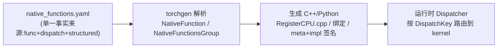
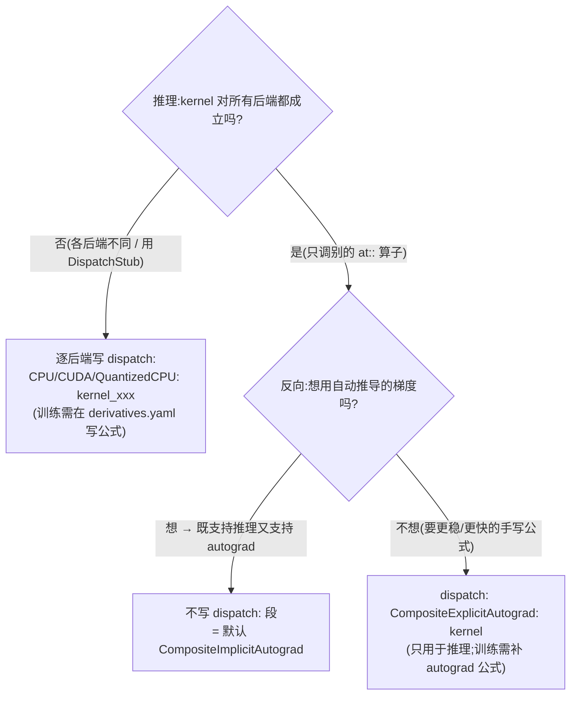

# 写一条 ATen 算子:native_functions.yaml 读写速查

> 层次:quick start(浅、实用)
> 核验基准:PyTorch upstream `E:\97-codes\pytorch\pytorch`(v2.13.0a0, commit 9922478)
> 最后更新:2026-06-15

**一句话**:每个 ATen 算子的「签名 + 后端映射 + 自动生成意图」都集中声明在 `aten/src/ATen/native/native_functions.yaml` 这一份 YAML 里;`torchgen` 读它,生成全部 C++/Python 样板(`m.def`/`m.impl` 注册、method/function 绑定、结构化 meta/impl 签名)。本页只讲「怎么写一条 `func`、怎么填 `dispatch`、怎么选 dispatch key、怎么声明结构化 out-function、生成产物落在哪、怎么验证」。所有引用都指向上述 checkout 的真实行号。

机制层的「为什么这么设计」(分发表优先级、AST 不变式、boxing/unboxing)在 [[10_aten_codegen_and_structured_kernels_analysis|ATen 算子代码生成与结构化内核]];端到端生命周期总览在 [[02_engineering/01_ai_frameworks/01_eager_runtime/04_aten_op_execution/index|ATen 算子定义与执行]]。

---

## 0. 最小心智模型



文档总入口是仓库内权威说明 `aten/src/ATen/native/README.md:1-30`(开篇即点明:native 函数声明在 `native_functions.yaml`,实现写在本目录某个 `.cpp`,并自动暴露给 C++ `at::` 与 Python)。本页的所有「怎么写」规则都来自这份 README,凡引用均给出行号。

---

## 1. 一条 `func` 怎么读、怎么写

最小骨架(`README.md:16-27`):

```yaml
- func: func_name(ArgType arg0[=default], ArgType arg1[=default], ...) -> Return
  variants: function, method
  dispatch:
    CPU: func_cpu
    CUDA: func_cuda
```

`func` 是「函数名 + 类型签名」的字符串(`README.md:31-38`),完整形式带 overload:

```
- func: func_name[.overload_name](ArgType arg0[=default], ...) -> Return
```

### 参数类型映射(`README.md:40-90`)

| YAML 写法 | C++ 形参类型 | 说明 |
|---|---|---|
| `Tensor` | `const Tensor&` | inplace 时变为 `Tensor&`(`README.md:42-43`) |
| `Tensor?` | optional tensor | 尾随 `?` 表可选,Python 可传 `None`(`README.md:44-45, 75-89`) |
| `Tensor[]` | `ArrayRef<Tensor>`(`TensorList`) | `README.md:55-56` |
| `int` / `float` / `bool` | `int64_t` / `double` / `bool` | `README.md:60-62` |
| `int[]` / `int[2]` | 长度标注只影响 Python 绑定(裸数标量会被展开成定长 list) | `README.md:57-59` |
| `Scalar` | `const Scalar&` | 只在算子真能同时接受 int/float 时用,否则优先 `int`/`float`(`README.md:64-69`) |
| `*` | (无对应形参) | sentinel:其后参数在 Python 侧强制为 keyword-only(`README.md:72-74`) |

无 Tensor 输入的算子叫 **factory function**,codegen 特殊处理;个别 factory 带 tensor 参数需显式 `category_override: factory`(`README.md:91-96`)。参数名有语义,改名是 BC-breaking(`README.md:98-100`)。

真实条目长什么样,直接看 `native_functions.yaml:1-100`:开头是一批 `_cast_*`(已废弃,`:3-38`)、`set_data(Tensor(a!) self, Tensor new_data) -> ()`(`:52-54`)、`requires_grad_(Tensor(a!) self, bool requires_grad=True) -> Tensor(a!)`(`:83-85`)等,可对照本页规则逐条解读。

### 变异 / 别名标注 `Tensor(a!)`(`README.md:49-54, 227-272`)

annotation 告诉 functionalization 与别名分析「哪些参数会被写、谁和谁共享内存」:

- `Tensor(a)` — `a` 是一组可能别名同一份数据的 Tensor(view 用,**不写**)。
- `Tensor(a!)` — `a` 的成员**可能被写**(inplace / out 用)。
- `Tensor(a! -> a|b)` — 写入后归属集合变化(`README.md:53`)。

以 `abs` 三件套为例(`README.md:247-257`):

```yaml
- func: abs(Tensor self) -> Tensor                          # 总是新分配,无标注
- func: abs_(Tensor(a!) self) -> Tensor(a!)                 # inplace:写 self 并返回它,函数名以单下划线结尾
- func: abs(Tensor self, *, Tensor(a!) out) -> Tensor(a!)   # out=:out 必须叫 out / out0 / out1...
```

view 算子用不带 `!` 的别名标注,如 `transpose(Tensor(a) self, int dim0, int dim1) -> Tensor(a)`(返回别名但不变异,`README.md:259-261`)。**硬性约束**:任何 out 函数都必须用 `(a!)`,否则 codegen 解析时报错(`README.md:270-272`)。

---

## 2. `variants`:生成 method 还是 function(`README.md:202-220`)

```yaml
variants: function, method
```

- `function` → 生成 `at::foo(...)`(namespace 函数)。
- `method` → 生成 `self.foo(...)`(Tensor 方法);此时签名里必须有 `Tensor self`,method 形式会把 `self` 从参数表里省掉(`README.md:208-214`)。
- **默认只生成 function**(`README.md:216`)。「核心」张量运算(add/sub 等)适合加 method;复杂网络层(conv2d)和专为绑定设计的内部函数不加(`README.md:217-220`)。

---

## 3. `dispatch` 表:`backend -> kernel`(`README.md:274-309`)

```yaml
dispatch:
    CPU: func_cpu
    CUDA: func_cuda
```

填的是「不同后端要 dispatch 到的实际 C++ 函数名」(默认在 `at::native` 命名空间;支持最多两级自定义命名空间,如 `CPU: custom::ns::func_cpu`,`README.md:282-289`)。

- 多个后端复用同名实现可合写:`CPU, CUDA: func`(`README.md:308-309`)。
- **省略整个 `dispatch:` 段** → 默认注册到 `CompositeImplicitAutograd`(`README.md:291-306`);out 函数则默认名字加 `_out` 后缀。
- 可用后端清单:在 codegen 里搜 `dispatch_keys`(`torchgen/gen.py`),README 明确指向此处(`README.md:311-312`)。

三个特殊「通用」后端键(`README.md:315-346`):

| 键 | 含义 | 典型用法 |
|---|---|---|
| `CompositeExplicitAutograd`(旧名 DefaultBackend) | 对所有后端都能跑的实现,但**需在 `derivatives.yaml` 显式写反向**才支持 autograd;等价于给每个后端都注册一遍。**调用 DispatchStub 的 kernel 不要用它**(DispatchStub 只对 CPU/CUDA 生效) | 委派型算子(`README.md:315-324`) |
| `CompositeExplicitAutogradNonFunctional` | 同上,但用于「非别名算子内部又调用了别名算子」的场景(如 `select_backward` 分解成 `select`);LazyTensor/XLA 这类函数式 IR 后端不希望把非别名 op 分解成别名 op(`README.md:326-336`) | 分解会产生别名的 CEA |
| `CompositeImplicitAutograd`(旧名 Math) | 对所有后端都能跑,且因为所调用的子算子都支持 autograd,**自动支持反向**;不写 `dispatch:` 时的默认值 | 纯组合算子(`README.md:338-346`) |

`CompositeImplicitAutograd` 的魔法:只要把 `my_op(self,other){ return self + 2*other; }` 注册到它,推理和反向都自动可用——autograd 用链式法则从 `+`/`*` 的导数自动推出 `my_op` 的反向(`README.md:351-365`)。

---

## 4. 选哪个 key:Implicit vs Explicit vs 逐 backend

按 `README.md:367-380` + `README.md:536-598` 的决策步骤:



对应 README 原文:

- 步骤 1 推理(`README.md:538-558`):后端相关 / 用 DispatchStub → 逐后端枚举 `dispatch:`(`README.md:546-551`)。
- 步骤 2 训练(`README.md:560-595`):全后端可跑且接受自动梯度 → **跳过 `dispatch:`**(`README.md:561-564`);想自己写数值稳定的反向 → `CompositeExplicitAutograd`(`README.md:566-572`);`_out` 样板这类无导数公式的也用 `CompositeExplicitAutograd`(`README.md:577-592`)。

两条必须记住的规则:

1. **给原本无 `dispatch:` 段的算子新增某后端 kernel 时**,必须同时补一条 `CompositeImplicitAutograd:` 指回原实现,否则其他后端就没 kernel 可用了(`README.md:377-380`)。
2. **别名键优先级** `CompositeExplicitAutograd > CompositeImplicitAutograd`:同一算子若同时注册这两个,`CompositeImplicitAutograd` 会被完全忽略,解析 YAML 时直接报错(`README.md:611-615`)。直接注册到具体后端永远高于任何别名键。

> 写 `CompositeImplicitAutograd`(组合)kernel 时有「Composite Compliance」红线:不得调 `resize_`、不得用 `out=` 算子、不得绕过 dispatcher 改 Tensor 元数据、不得 `data_ptr`/`item`(`README.md:400-412`),测试在 `test/test_ops.py`(`README.md:414-416`)。

---

## 5. 结构化 out-function:`structured` 的 meta + impl

「结构化内核」把**形状/dtype 推断(meta)**与**真实计算(impl)**拆开,用一套声明同时覆盖 functional / inplace / out 三个变体的内存管理。声明语法看 `native_functions.yaml` 里 `add` 的完整三件套(`:536-575`):

```yaml
# functional 变体:不写 structured,而是委派给 .out
- func: add.Tensor(Tensor self, Tensor other, *, Scalar alpha=1) -> Tensor
  structured_delegate: add.out                 # 把实现委派给 add.out 这条结构化算子
  variants: function, method
  dispatch:                                     # 仅特殊后端(稀疏/mkldnn/嵌套)单独给 kernel
    SparseCPU, SparseCUDA, ...: add_sparse

# inplace 变体:同样 delegate 给 .out
- func: add_.Tensor(Tensor(a!) self, Tensor other, *, Scalar alpha=1) -> Tensor(a!)
  variants: method
  structured_delegate: add.out

# out 变体:真正的结构化主体
- func: add.out(Tensor self, Tensor other, *, Scalar alpha=1, Tensor(a!) out) -> Tensor(a!)
  structured: True                              # 本条是结构化主体
  structured_inherits: TensorIteratorBase       # meta 类继承 TensorIterator(复用广播/类型提升)
  ufunc_inner_loop:                             # ufunc 内循环(逐元素算子)
    Generic: add (AllAndComplex, BFloat16, Half, ComplexHalf)
    ScalarOnly: add (Bool)
  dispatch:
    SparseCPU, SparseMeta: add_out_sparse_cpu
    MPS: add_out_mps
```

关键键:

- `structured: True` 标在 **out 变体**上,声明它是结构化组的主体(`native_functions.yaml:561`)。
- `structured_delegate: add.out` 标在 functional / inplace 变体上,把实现委派给那条 out 算子(`:538, 551`)。
- `structured_inherits: TensorIteratorBase` 让生成的 meta 类继承 TensorIterator,复用广播与类型提升(`:562`)。

codegen 怎么切参数(`torchgen/api/structured.py`,文件头 `:36-38` 说明它把 JIT schema 翻成 structured 函数 API):

- **结构化 kernel 从不 `return`**:meta 通过 `set_output` 报告输出,impl 直接写进 out 参数(`structured.py:91-94`)。
- **meta 的参数** = functional 变体的全部非 out 参数(`meta_arguments`,`structured.py:146-149`)。
- **impl 的参数** = out 变体的非 out 参数(若声明了 precomputed 则做替换/追加)**+** out 参数(`impl_arguments`,`structured.py:116-143`)。
- **out 的参数** = 仅 out 参数(`out_arguments`,`structured.py:152-155`)。

> 注意:旧锚点 `README.md:567-592` 并非「结构化声明语法」——这份 README 全文不含 “structured” 一词,`:567-592` 实为「选 dispatch 关键字」里 `_out` 样板的讨论(已在本页 §4 引用)。结构化语法的权威出处就是上面的 `native_functions.yaml` 实例 + `torchgen/api/structured.py`;背景概念见结构化内核 RFC(`pytorch/rfcs`)。

---

## 6. `autogen`:自动补齐变体(`README.md:478-498`)

functionalization 依赖「functional / inplace / out」变体集完整。用 `autogen` 让 codegen 据现有变体补齐缺失的:

```yaml
- func: my_op_(Tensor(a!) self) -> Tensor(a!)
  autogen: my_op, my_op.out          # in-place → 自动生成 functional 与 out=
```

- in-place 变体 → 生成 functional + out;functional 变体 → 生成 out(`README.md:488-490`)。
- view 算子、绕过 dispatcher 的算子、composite 算子不支持 autogen(`README.md:491`)。
- 满足条件的新算子**应当**写 `autogen`,codegen 会强制(`README.md:496-498`)。
- 自动生成的 view-copy kernel 落在 `<gen-out>/aten/src/ATen/CompositeViewCopyKernels.cpp`(`README.md:493-494`)。

---

## 7. 生成产物落在哪里

`torchgen` 把 YAML 翻成每个 dispatch key 的注册文件,构建后位于 `build/aten/src/ATen/Register<Key>.cpp`。`c10/core/DispatchKey.h` 的枚举行内注释直接标出了别名键各自的生成文件(`DispatchKey.h:444-461`):

| dispatch key | 生成的注册文件 |
|---|---|
| `CompositeImplicitAutograd` | `build/aten/src/ATen/RegisterCompositeImplicitAutograd.cpp`(`DispatchKey.h:444-445`) |
| `CompositeExplicitAutograd` / `...NonFunctional` | `build/aten/src/ATen/RegisterCompositeExplicitAutograd.cpp`(`DispatchKey.h:457-461`) |
| `CompositeImplicitAutogradNestedTensor` | `...RegisterCompositeImplicitAutogradNestedTensor.cpp`(`DispatchKey.h:455-456`) |
| 逐后端(CPU/CUDA/...) | `build/aten/src/ATen/RegisterCPU.cpp` / `RegisterCUDA.cpp` / `RegisterMkldnnCPU.cpp` 等 |

> 这些文件在源码 checkout 里不存在,只有完整构建后才会出现在 `build/aten/src/ATen/` 下。要找某算子最终注册到哪、生成了什么 `m.impl(...)`,构建后在对应 `Register*.cpp` 里搜算子名即可。codegen 入口与可用键清单都在 `torchgen/gen.py`(`README.md:311-312`)。

设备特化的实战(如 NPU 的逐后端 kernel)见 [[01_eager_runtime/03_op_registration/index]];运行时按 key 路由的机制见 [[01_eager_runtime/02_dispatcher_and_device/index]] 与 [[10_pytorch_dispatcher_analysis]]。

---

## 8. 验证:用 PythonDispatcher 看分发表

不必构建完整后端,就能验证「你的注册组合,最终每个后端用哪个 kernel」。`torch/_python_dispatcher.py` 是 C++ dispatcher 的薄封装,专门展示分发表 precompute 的结果(`_python_dispatcher.py:7-12`):

```python
from torch._python_dispatcher import PythonDispatcher

dispatcher = PythonDispatcher()
# 注册一组 key,模拟你在 native_functions.yaml 里写的 dispatch 段
dispatcher.register(["CPU", "XLA", "AutogradCPU", "CompositeImplicitAutograd"])
print(dispatcher.dispatchTable())   # 打印:每个后端最终落到哪个 kernel
# 更多调试:
# print(dispatcher.keys()); print(dispatcher.registrations())
# print(dispatcher.rawRegistrations()); print(dispatcher.rawDispatchTable())
```

`PythonDispatcher` 用 namespace `__test__`、算子名 `foo`(`_python_dispatcher.py:55-57`),为简化每类用例只放一个代表键:CPU/AutogradCPU(in-tree)、FPGA/AutogradOther(共享 AutogradOther)、XLA/AutogradXLA(out-of-tree),以及三个别名键(`_python_dispatcher.py:17-32`)。它正是「步骤 4:验证算好的分发表是否符合预期」(`README.md:599-607`),相关测试在 `test/test_dispatch.py`(`_python_dispatcher.py:50-51`)。

---

## 9. 速查 / 常见排查

| 你想做的事 | 怎么做 | 锚点 |
|---|---|---|
| 写一条新算子签名 | 加 `- func: name.overload(args) -> Ret` | `README.md:31-38` |
| 暴露成 `t.foo()` | `variants: function, method` | `README.md:202-220` |
| 标记 out / inplace 参数 | 用 `Tensor(a!)`(out 必须用) | `README.md:227-272` |
| 后端各写各的 kernel | 列 `dispatch: CPU/CUDA: ...` | `README.md:274-309` |
| 纯组合、自动支持反向 | 不写 `dispatch:`(= `CompositeImplicitAutograd`) | `README.md:561-564` |
| 全后端跑但手写反向 | `CompositeExplicitAutograd: kernel` | `README.md:566-572` |
| 给老组合算子加后端 kernel | 别忘补 `CompositeImplicitAutograd:` 回指 | `README.md:377-380` |
| 写逐元素 / 形状推断分离 | 结构化:`add.out` 三件套 | `native_functions.yaml:536-575` |
| 自动补齐 functional/out 变体 | `autogen: op, op.out` | `README.md:478-498` |
| 找最终注册文件 | 构建后 `build/aten/src/ATen/Register*.cpp` | `DispatchKey.h:444-461` |
| 验证分发表 | `PythonDispatcher().dispatchTable()` | `README.md:599-607` |

**易踩的报错**:① 同一算子同时给 `CompositeImplicitAutograd` 和 `CompositeExplicitAutograd` → 解析期报错(`README.md:611-615`);② out 函数的 out 参数没写 `(a!)` 或没命名为 `out`/`out0` → 断言失败(`README.md:255-257, 270-272`);③ 给老组合算子加后端 kernel 却漏了 `CompositeImplicitAutograd:` 回指 → 其他后端丢 kernel(`README.md:377-380`)。

---

## Related Pages

- [[02_engineering/01_ai_frameworks/01_eager_runtime/04_aten_op_execution/index|ATen 算子定义与执行]] — 本模块 overview:ATen 算子定义与执行 端到端生命周期
- [[10_aten_codegen_and_structured_kernels_analysis]] — 本模块 deepdive:torchgen AST 不变式、分发表优先级计算、结构化 meta/impl、boxing/unboxing
- [[01_eager_runtime/02_dispatcher_and_device/index]] — 运行时 Dispatcher 按 DispatchKey 路由
- [[10_pytorch_dispatcher_analysis]] — 分发器、alias 键、fallback 的设计与实现
- [[01_eager_runtime/03_op_registration/index]] — `TORCH_LIBRARY` / `m.def` / `m.impl` 实操与设备特化注册
- [[01_eager_runtime/01_tensor_and_storage/index]] — Tensor/Storage 内部结构(算子操作的对象)
- [[02_compile_stack/02_aot_autograd/index]] — autograd / functionalization 如何消费这些算子定义
