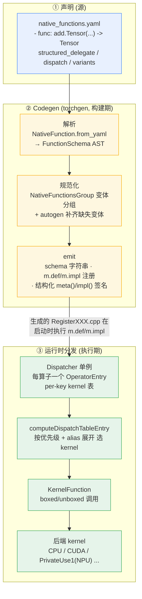

# 04 · ATen 算子定义与执行 — 目录索引

> 层次:overview(浅)
> 核验基准:PyTorch upstream `E:\97-codes\pytorch\pytorch`(v2.13.0a0, commit 9922478)
> 最后更新:2026-06-15

---

## 模块概述

### 是什么

本模块讲清**一个 ATen 算子从“声明”到“被调用”的端到端生命周期**:

- **声明**:每个算子在 `native_functions.yaml` 里写一条 `- func: name(args) -> Return`,这是 ATen 算子的**单一事实来源**(single source of truth)。`aten/src/ATen/native/README.md:1-19` 开宗明义:native functions 在该 YAML 中声明、在本目录的 `.cpp` 中实现,并同时暴露给 C++(`at::add` / `t.add()`)与 Python。
- **代码生成(codegen)**:`torchgen` 解析这条 YAML,产出全部 C++/Python 样板——schema 字符串、`m.def`/`m.impl` 注册、结构化内核的 `meta`/`impl` 签名等。`torchgen/gen.py:104-109` 自述其职责:“parsing native_functions.yaml and then generating various generated files … knows how to parse function schema, and then translate this into various C++ types and boilerplate code.”
- **运行时分发**:进程启动时,生成的注册代码把 kernel 灌入全局 `Dispatcher`;真正调用时由 `OperatorEntry` 按 DispatchKey 优先级挑选 kernel,再经 boxing/unboxing 调到具体后端实现。

### 为什么这样设计

把“算子签名 + 后端映射 + 自动生成意图”集中为一份**声明式数据**,而非散落在手写 C++ 里,是为了:① 让一处声明驱动多处生成,杜绝签名漂移;② 让 codegen 拥有强语义的数据模型做不变式校验。`torchgen/model.py:24-40` 阐明数据模型哲学——**以 JIT schema 表示为中心**(而非 C++ 类型),用**不可变 dataclass** 表达每个实体,且能**无损 roundtrip** 回原始声明,从而摆脱老 codegen“读成 C++ 类型再回译”的痛点。

### 核心数据结构(一句话)

| 结构 | 锚点 | 角色 |
|------|------|------|
| `NativeFunction` | `torchgen/model.py:506-519` | 一条 `func:` 的强类型 AST,持有 `func: FunctionSchema` 等全字段 |
| `NativeFunctionsGroup` | `torchgen/model.py:1193-1203` | 聚合 functional / inplace / mutable / out 四个变体;`structured` 由 `out.structured` 决定 |
| `SchemaKind` | `torchgen/model.py:1179-1184` | 变体种类:functional / inplace / out / mutable / scratch |
| `DispatchKey`(alias vs runtime) | `c10/core/DispatchKey.h:430-440` | alias 键(如 `CompositeImplicitAutograd`)是“合成键”,映射到多个运行时键,优先级**永远低于**直接注册的运行时键 |
| `Dispatcher` / `OperatorEntry` | `Dispatcher.h:71` / `OperatorEntry.h:70` | 全局单例 + 每算子一个条目,持 per-key kernel 表与计算出的分发表 |
| `KernelFunction` | `KernelFunction.h:90` | 类 `std::function` 的 kernel 包装,可 boxed/unboxed 互转调用 |

### 全景:一个算子的端到端生命周期

要点串讲:

1. **声明**(`native_functions.yaml:536-573` 的 `add` 三件套是范例):`add.Tensor`(functional,`structured_delegate: add.out`)、`add_.Tensor`(inplace)、`add.out`(`structured: True` + `structured_inherits: TensorIteratorBase` + `ufunc_inner_loop`)。
2. **解析 → 规范化**:`torchgen` 把每条 `func:` 解析为 `NativeFunction`,再按 `signature()` 把同名变体聚成 `NativeFunctionsGroup`;其 `__post_init__`(`model.py:1205-1226`)强约束——同组各变体签名必须一致、`functional.func.kind()` 必为 `functional`、`out.func.kind()` 必为 `out`。结构化算子**必有 functional + out**(inplace 可选)。
3. **emit**:对结构化算子,codegen 据 schema 生成 `meta()`(形状/dtype 推断)与 `impl()`(真实计算)两套 C++ 签名。注意 `torchgen/api/structured.py:91-94` 的关键约定——**结构化内核从不 `return`**:meta 通过 `set_output` 报告输出,impl 直接写入 `out` 参数,从而统一 out/functional/inplace 三变体的内存管理。
4. **运行时分发**:`OperatorEntry::computeDispatchTableEntryWithDebug`(`OperatorEntry.cpp:352-390`)的 `[Note] DispatchTable computation` 是整个运行时的权威规则,优先级链为:**(1) 直接注册到该键的 kernel → (2.1) CompositeExplicitAutogradNonFunctional → (2.2) CompositeExplicitAutograd → (2.3) CompositeImplicitAutograd → (2.4) Autograd → (2.5) FuncTorchBatchedDecomposition → (3) fallback**。alias 键优先级总结在 `OperatorEntry.cpp:379-380`:`CompositeExplicitAutogradNonFunctional > CompositeExplicitAutograd > CompositeImplicitAutograd > Autograd`,且**运行时键永远优先于 alias 键**。
5. **调用**:选中的 `KernelFunction`(`KernelFunction.h:90`)按需 boxing/unboxing 调到后端实现。

### 模块边界澄清(本模块 vs 邻域)

为避免与相邻模块重叠,三者职责切分如下:

- **本模块 11 = 算子定义 + codegen**:`native_functions.yaml` → `torchgen` 解析/规范化/emit → 生成 schema、`m.def`/`m.impl`、结构化 `meta`/`impl` 签名。即“算子从哪来、生成了什么”。
- **[[01_eager_runtime/02_dispatcher_and_device/index]] = 运行时路由**:DispatchKey/DispatchKeySet 的优先级与 redispatch“洋葱”、boxed/unboxed 调用机制、设备接入。即“调用时怎么被路由到正确 kernel”。本模块只在生命周期“运行时收尾”处触及它,细节交给 01。
- **[[01_eager_runtime/03_op_registration/index]] = 同一模式的 NPU 特化实例**:NPU op-plugin 如何把昇腾 kernel 通过 `TORCH_LIBRARY_IMPL(..., PrivateUse1, ...)` 注册进同一个 Dispatcher。即本模块通用机制在具体后端上的落地实例。

---

## 页面列表(按层次)

| 页面 | 层次 | 核心主题 |
|------|------|---------|
| [[adding_an_aten_operator_guide]] | **quick start** | 怎么加/查/验证一个 ATen 算子:`func` 与参数类型映射(`README.md:31-90`)、`variants`(202-226)、`annotations` 的 `Tensor(a!)`(227-272)、`dispatch` 表与默认 `CompositeImplicitAutograd`(274-309)、选 Composite vs 逐后端(338-380)、`autogen`(478-498)、用 `PythonDispatcher` 验证分发表(599-607);生成产物定位(`build/.../RegisterCPU.cpp` 等);结构化三件套范例(`native_functions.yaml:536-573`) |
| [[aten_codegen_and_structured_kernels_analysis]] | deep dive | 源码级深析:`NativeFunction`/`NativeFunctionsGroup` AST 不变式、`DispatchKey` 运行时 vs alias、`OperatorEntry.cpp:352-471` 分发表计算全文、结构化 `meta`/`impl` + `TensorIteratorBase` + precomputed、`BackendIndex`/`BackendMetadata` 逐后端特化、boxing/unboxing 与 `fallthrough_kernel`、autogen 变体生成、变异标注与 functionalization |

---

## 关联域

- [[01_eager_runtime/02_dispatcher_and_device/index]] — 运行时分发与设备接入(DispatchKey/KeySet 优先级、redispatch、PrivateUse1),本模块生命周期的“运行时”那一段在此深入
- [[01_eager_runtime/03_op_registration/index]] — 算子注册的 NPU 特化实例(op-plugin 供给侧),本模块通用机制的落地范例
- [[01_eager_runtime/01_tensor_and_storage/index]] — Tensor/Storage 内部表示,算子操作的数据载体
- [[02_compile_stack/02_aot_autograd/index]] — AOTAutograd 与 functionalization 消费完整变体集(autogen 的下游)
- [[01_ai_frameworks/index]] — 本域总索引

---

## Related Pages

- [[adding_an_aten_operator_guide]] — 本模块 quickstart
- [[aten_codegen_and_structured_kernels_analysis]] — 本模块 deepdive
- [[01_eager_runtime/02_dispatcher_and_device/index]] — 运行时路由
- [[pytorch_dispatcher_analysis]] — Dispatcher 优先级/redispatch/boxed-unboxed 深析
- [[01_eager_runtime/03_op_registration/index]] — NPU 算子注册特化实例
- [[01_eager_runtime/01_tensor_and_storage/index]] — Tensor/Storage 内部表示
- [[02_compile_stack/02_aot_autograd/index]] — functionalization 与变体集下游
