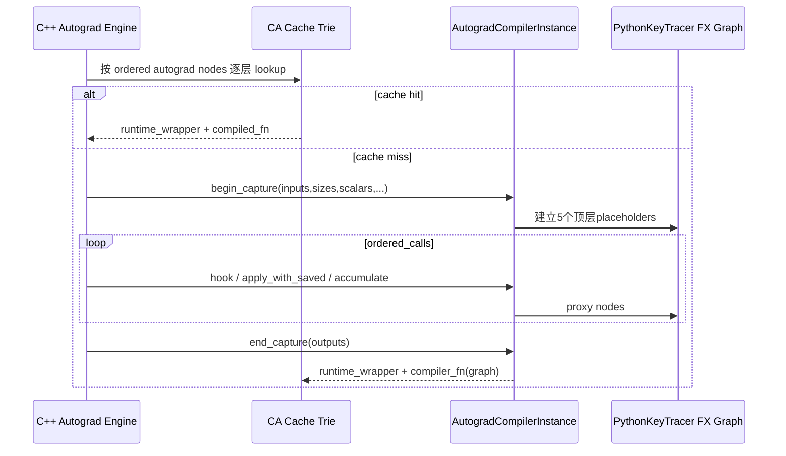

# F01 · Compiled Autograd：运行时反向图捕获

> 卷别：F · 训练、分布式、扩展与部署  
> 固定源码：PyTorch `e8f97c1a6ef8cbcdd0a946606bc1e924e4f07e52`  
> 前置：[[production_rollout_fallback_and_monitoring_analysis]]  
> 后续：[[20_activation_checkpoint_recompute_and_compile_analysis]]  
> 最后更新：2026-07-30(kb-reorg P4 Task 9 迁入本目录,与 [[10_autograd_engine_analysis]] 补充显式分工声明)

> [!note] 与 [[10_autograd_engine_analysis]] 的分工
> 两页共享同一个 C++ `Engine`/`Node`/`Edge`/`GraphTask`/`AccumulateGrad` 底层抽象(定义与执行细节见 [[10_autograd_engine_analysis]]),但描述的是**同一引擎的两种运行模式**：[[10_autograd_engine_analysis]] 讲 eager 模式——`Engine::execute` 在 `.backward()` 时直接遍历 DAG、逐 Node 调 `apply` 执行,不产生任何可编译产物；本页讲 **Compiled Autograd** 模式——同一个 C++ engine 在调度反向时改为驱动一个 Python `AutogradCompilerInstance`（`PythonKeyTracer`）把这次运行时反向"录制"成一张 FX 图，再交给 Dynamo/Inductor 编译执行，命中 cache 后不再重放 eager DAG。换言之：**eager 引擎负责"驱动/调度"，Compiled Autograd 只是给这次驱动接上一个"录制器"**，不是另一套独立反向机制。

## 1. 它为什么不是 AOTAutograd 的别名

AOTAutograd从一个forward callable和示例输入出发，在调用forward的编译阶段构造joint
fw/bw图并分区。Compiled Autograd则在真实backward由C++ autograd engine调度时，捕获更大
范围的autograd node、hooks和grad accumulation，再把这段运行时反向工作转为FX图。

所以二者的时间与边界不同：

| 机制 | 何时建图 | 起点 | 主要边界 |
|---|---|---|---|
| AOTAutograd | forward编译期间 | 可微forward | 单个Dynamo region的fw/bw |
| Compiled Autograd | backward首次运行/缓存miss | autograd engine任务 | 实际engine调度的反向图、hooks、accumulate-grad |

Compiled Autograd还可把AOT产生的lazy backward图复制到更大的CA图中；这不是两套反向图
互不相关，而是局部AOT backward成为整体runtime backward的一部分。

## 2. C++ engine 与 Python tracer 的握手

C++入口负责：

- 从autograd engine收集inputs、sizes、scalars、hooks和节点拓扑；
- 查Compiled Autograd cache；
- cache miss时调用Python compiler instance的`begin_capture`；
- 逐个代理autograd node/hook/accumulate-grad；
- 调用`end_capture`取得 `(runtime_wrapper, compiled_fn)`；
- 缓存并执行。

C++实现的capture入口与Python callback位置见
`torch/csrc/dynamo/python_compiled_autograd.cpp:878-907`、
`torch/csrc/dynamo/python_compiled_autograd.cpp:974-1003`；end-capture返回值契约见
`torch/csrc/dynamo/python_compiled_autograd.cpp:1135-1157`。

这解释了为什么CA graph不是由Python正向源码直接symbolic trace得到：driver是autograd
engine。

## 3. `AutogradCompilerInstance`持有什么

每个实例拥有：

- compiler callback；
- 独立`ShapeEnv`；
- 允许fallback/non-fake input的`FakeTensorMode`；
- `PythonKeyTracer`与ProxyTorchDispatchMode；
- context stack、hook proxy和compile context。

构造见 `torch/_dynamo/compiled_autograd.py:333-346`。

`begin_capture`建立固定的顶层placeholder：

```text
inputs, sizes, scalars, hooks, packed_data
```

随后把真实Tensor转换为FakeTensor，把sizes转为动态SymInt，并绑定对象与proxy。入口和
placeholder创建见 `torch/_dynamo/compiled_autograd.py:357-375` 与
`torch/_dynamo/compiled_autograd.py:376-392`；FakeTensor与SymInt准备见
`torch/_dynamo/compiled_autograd.py:394-423`。

## 4. 图内有哪些特殊对象

CA图不仅有ATen计算，还需要表达：

- autograd Node apply；
- tensor/node pre/post hooks；
- saved tensor pack/unpack hooks；
- AccumulateGrad与`.grad`更新；
- final callbacks；
- 动态sizes/scalars；
- 可能的AOT backward子图；
- 错误/NaN检查；
- 输出grad与`.grad()`返回值。

因此effect与顺序约束比纯函数forward更强，DCE和重排不能只看Tensor users。

## 5. 为什么结束捕获后还要重排

AOT或trace过程可能把accumulate-grad、hook等节点推到图末，而eager autograd engine会在
依赖满足时尽早调度。CA在end-capture中依次重排：

- unpack hooks；
- tensor/node pre-hooks；
- accumulate-grad；
- post-acc-grad hooks；
- post-hooks。

调用序列见 `torch/_dynamo/compiled_autograd.py:1192-1208` 与
`torch/_dynamo/compiled_autograd.py:1209-1223`。

例如`reorder_accumulate_grad_nodes`把更新移动到最后一个参数依赖之后，尽量模拟eager调度
（`torch/_dynamo/compiled_autograd.py:1308-1337`）。这会影响hook顺序、通信重叠和grad可见
时间，是语义机制，不是单纯性能pass。

## 6. DCE 为什么需要专用 impurity

CA graph中的placeholder unpack和特殊effect target即使无普通Tensor users也不能删除。
`dce()`先收集placeholder的unpack users，并把它们及 `_impure_targets`强制视为impure，再
调用FX DCE
（`torch/_dynamo/compiled_autograd.py:1090-1114`）。

这与普通“users为空即dead”的错误理解相反：在反向图里hook、grad mutation和callback是
用户可观察effect。

## 7. `end_capture`的产物

结束时：

1. 插入final callback stub和output；
2. 关闭trace contexts；
3. 可选处理CUDAGraph相关runtime inputs；
4. 清理dummy tensor metadata；
5. 记录重排前artifact；
6. hook/accumulate-grad重排；
7. DCE、移除未使用size；
8. 形成`CompiledAutograd{id}` GraphModule；
9. 返回runtime wrapper和`compiler_fn(graph)`。

前半流程见 `torch/_dynamo/compiled_autograd.py:1166-1190` 与
`torch/_dynamo/compiled_autograd.py:1192-1209` 与
`torch/_dynamo/compiled_autograd.py:1210-1228`；最终GraphModule与日志见
`torch/_dynamo/compiled_autograd.py:1228-1242`。

runtime wrapper过滤实际使用的sizes、必要时移动输入，并在 `_disable()`下调用compiled
function，防止递归capture
（`torch/_dynamo/compiled_autograd.py:1244-1259`、
`torch/_dynamo/compiled_autograd.py:1260-1275` 与
`torch/_dynamo/compiled_autograd.py:1276-1290`）。

## 8. Cache 与 specialization

CA cache必须覆盖的不只是Tensor metadata，还包括autograd graph结构、hooks、是否
accumulate-grad及其他runtime状态。改变以下任一项可能产生新图：

- loss到leaf的反向拓扑；
- hook注册/顺序；
- `backward()`与`autograd.grad()`输出契约；
- create_graph/retain_graph相关行为；
- 动态sizes/scalars；
- AOT backward子图；
- 参数是否需要grad。

因此“forward graph cache hit”不推出“Compiled Autograd cache hit”。

## 9. Enable/disable 生命周期

Python侧维护enabled、force-eager、in-region、disable-context和depth状态
（`torch/_dynamo/compiled_autograd.py:1621-1632`）。

`_enable`接收消费CA GraphModule的compiler callback和独立dynamic策略；注释建议通过配置
开启，并把对应forward也放在同一上下文
（`torch/_dynamo/compiled_autograd.py:1634-1658`）。

退出/重置时需要恢复C++ autograd compiler callback和logger/cache；不能在CA region内部
reset。该状态的全局性也意味着多线程/嵌套用法需遵守入口管理。

## 10. 与 DDP/通信的关系

Compiled Autograd看到AccumulateGrad与更完整的backward调度，因此理论上能优化跨region的
反向、hooks和通信边界。但：

- collective是effect，不能任意DCE/重排；
- DDP reducer对grad ready顺序有假设；
- 所有rank必须得到兼容图和collective序列；
- graph/cache差异可能导致rank间不一致。

不能因为CA“图更大”就自动推断通信重叠更好。

## 11. 源码跟读：C++ engine怎样驱动一张Python FX反向图

### 11.1 cache key来自真实 GraphTask，而不是forward GraphModule

C++ `_compiled_autograd_impl`从 `GraphTask.dependencies_`开始，建立worklist、
`AutogradCompilerCall`和cache root
（`torch/csrc/dynamo/python_compiled_autograd.cpp:878-906`）。处理每个autograd Node时，
`CompiledNodeArgs`收集node类型、next edges、sizes、hooks等数据并产生 `CacheKey`，随后
沿cache trie向下lookup
（`torch/csrc/dynamo/python_compiled_autograd.cpp:914-940`）。

node只有在所有依赖计数满足时才进入worklist
（`torch/csrc/dynamo/python_compiled_autograd.cpp:948-963`）。因此这次遍历同时完成两件事：

- 按真实engine调度依赖建立稳定的 `ordered_calls`；
- 用同一序列累积cache key和runtime inputs。

forward Dynamo cache、AOT fw/bw cache与这里的cache不是同一个命名空间；CA key包含的是
实际backward拓扑和engine语义。

### 11.2 miss后才创建Python tracer，命中不会重建FX图

动态size检查失败表示CA cache miss。此时C++才实例化Python compiler并调用
`begin_capture`
（`torch/csrc/dynamo/python_compiled_autograd.cpp:965-981`）。接着按前面保存的
`ordered_calls`逐个设置node origin并代理执行
（`torch/csrc/dynamo/python_compiled_autograd.cpp:984-1003`）；pre-hooks与
`apply_with_saved`也在这次驱动中进入Python tracer
（`torch/csrc/dynamo/python_compiled_autograd.cpp:1050-1064`）。



### 11.3 `begin_capture`把engine对象翻译成可编译输入

`AutogradCompilerInstance`为每次capture创建自己的 `ShapeEnv`、`FakeTensorMode`、
`PythonKeyTracer`与proxy mode
（`torch/_dynamo/compiled_autograd.py:333-346`）。`begin_capture`新建Graph并一次创建
`inputs/sizes/scalars/hooks/packed_data`五个placeholder
（`torch/_dynamo/compiled_autograd.py:357-392`）。

真实Tensor被转换成带 `GetItemSource(LocalSource(...), idx)`的FakeTensor并绑定proxy；
整数size被建成动态SymInt
（`torch/_dynamo/compiled_autograd.py:394-419`）。因此CA图的placeholder既是FX数据入口，
也是随后Dynamo/guard系统能够重取runtime值的Source根。

当engine遇到AOT backward时，Python不是保留一个不透明“调用另一张图”的node。实现将其
分为prologue、backward graph、epilogue，并明确把backward graph复制进CA graph，使后续
CA passes与Dynamo能看见内部算子
（`torch/_dynamo/compiled_autograd.py:495-514`）。这正是局部AOT backward如何进入更大
runtime backward图。

### 11.4 `end_capture`先恢复engine顺序，再编译

`end_capture`插入final-callback stub与output，关闭trace contexts，并移除dummy tensor
metadata（`torch/_dynamo/compiled_autograd.py:1166-1190`）。随后按固定次序移动unpack
hooks、pre-hooks、accumulate-grad和post-hooks，最后执行专用DCE
（`torch/_dynamo/compiled_autograd.py:1192-1223`）。

专用DCE把所有placeholder的直接unpack users和 `_impure_targets`视为impure，之后才调用
FX `eliminate_dead_code`
（`torch/_dynamo/compiled_autograd.py:1090-1114`）。这不是为了“保守一点”，而是因为
unpack承担guard/alias可见性，hook和grad更新承担用户可观察effect；普通users为空不能证明
它们无语义。

重排后创建 `CompiledAutograd{id}` GraphModule并计算实际用到的size输入
（`torch/_dynamo/compiled_autograd.py:1224-1242`）。C++严格验证
`end_capture`返回二元组，分别缓存callable `runtime_wrapper`和 `compiled_fn`
（`torch/csrc/dynamo/python_compiled_autograd.cpp:1135-1147`）。

### 11.5 runtime wrapper为何必须临时禁用CA

运行时wrapper过滤未使用sizes、处理需要移到CUDA的inputs，然后在 `_disable()`和同一
compile context中调用compiled function
（`torch/_dynamo/compiled_autograd.py:1244-1275`）。`_disable`把C++侧autograd compiler
暂时设为None，退出时恢复原callback与dynamic策略
（`torch/_dynamo/compiled_autograd.py:1716-1734`）。

否则执行这张“已经编译的backward图”内部的autograd相关路径可能再次触发CA，形成递归
capture。这里的disable是runtime重入保护，不会关闭已经生成的Inductor kernels。

## 12. 复杂度与成本

若runtime autograd图有 \(V_b\) 个node、\(E_b\) 条依赖：

- capture与FX建立至少 \(O(V_b+E_b)\)；
- 专用重排/DCE通常线性或与users遍历相关；
- 后续Dynamo/AOT/Inductor编译成本随图规模增长；
- cache lookup依赖CA cache entries与specialization；
- 稳态收益需要摊销首次backward capture/compile。

CA扩大优化范围，也可能显著增加编译延迟和失败面。

## 13. 常见误解

- **“AOTAutograd已经编译反向，所以CA没作用。”** AOT边界通常较局部，CA从engine捕获更大
  runtime backward。
- **“CA图只是ATen backward op列表。”** 还包含hooks、grad accumulation和callbacks。
- **“forward命中cache意味着backward不会编译。”** CA与lazy AOT backward有独立时点。
- **“hook无Tensor输出即可DCE。”** hook是effect。
- **“更大的backward图一定更快。”** 编译成本、effect和distributed约束同样增加。

## 配套 Demo

本页对应卷级入口 `tools/labs_torch_compile/demo_f_advanced_topics.py` 的 `compiled_autograd` 用例。默认以 CUDA 为验收设备：

```powershell
python -B tools\labs_torch_compile\demo_f_advanced_topics.py `
  --case compiled_autograd --device cuda `
  --output-dir tools\labs_torch_compile\artifacts\volume_demos\f01
```

先用 `--list --json` 查看用例声明的能力要求。无 CUDA 的机器可把 `--device` 改为 `cpu` 探索设备无关机制；CUDA/Triton/多卡专属用例会返回 `BLOCKED`，且不会执行用例正文。不要把 `BLOCKED` 写成 `PASS`。

重点读取 `summary.json` 与 `compiled_autograd/result.json`：`status` 区分 `PASS/BLOCKED/FAIL`，`environment` 固化运行环境，`observations` 保存本页机制的实测字段，`artifacts` 指向图代码、日志、trace 或进程证据。`PASS` 只表示该次运行中的断言通过，不外推到其他 PyTorch 版本、shape、dtype 或硬件。

## Related Pages

- [[00_torch_compile_end_to_end_index]]
- [[01_eager_runtime/05_autograd_engine/index]] — 本模块 overview(eager Engine 全景 + 与本页的分工)
- [[10_autograd_engine_analysis]] — eager 模式下 C++ Engine 如何直接执行反向 DAG(本页驱动的是同一引擎,录制而非替代)
- [[13_aot_runtime_wrappers_and_lazy_backward_compile_analysis]]
- [[aotautograd_and_inductor_failure_localization_analysis]]
- [[20_activation_checkpoint_recompute_and_compile_analysis]]
- [[ddp_compile_boundaries_and_optimizer_analysis]]
- [[11_aotautograd_joint_forward_backward_graphs_analysis]]
