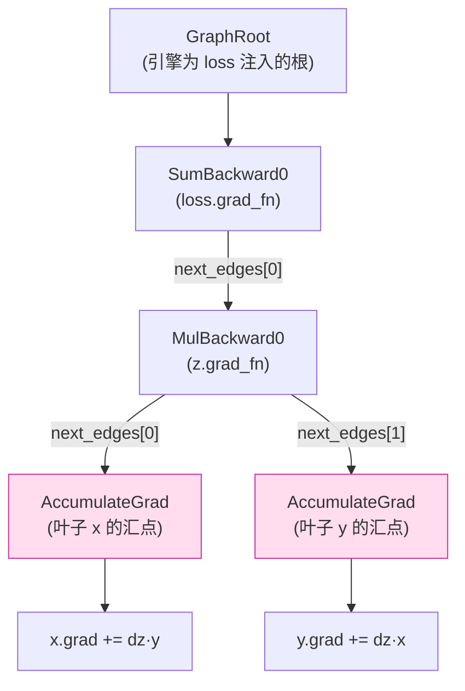
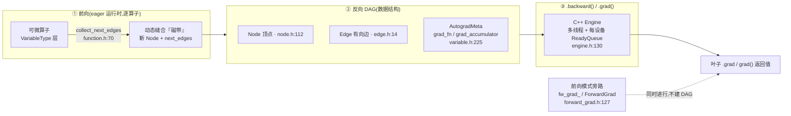

# 05 · Eager 反向自动微分引擎 — 目录索引

> 层次:overview(浅)
> 核验基准:PyTorch upstream `E:\97-codes\pytorch\pytorch`(v2.13.0a0, commit 9922478)
> 最后更新:2026-06-15

---

## 模块概述

### 是什么

本模块讲的是 PyTorch **默认(eager)模式下的反向自动微分**:你在前向逐个算子地运行可微计算时,框架同步地、动态地长出一张**反向有向无环图(reverse DAG)**——俗称「磁带(tape)」;当你调用 `loss.backward()` 或 `torch.autograd.grad(...)` 时,一个常驻的 **C++ 引擎**沿这张 DAG 反向遍历,把梯度一路回灌到叶子张量的 `.grad` 上。

整张机器由三个数据结构 + 一个执行器构成:

- **Node**(`torch/csrc/autograd/node.h:112`)—— 反向 DAG 的**顶点**,一个抽象操作:输入是「前向输出的梯度」,输出是「前向输入的梯度」。`MulBackward0`、`AccumulateGrad`、`GraphRoot`、`PyNode` 等都是它的子类,各自重写 `apply`。Node 的概念注释见 `node.h:62-111`:它可以零输入(`GraphRoot`)、也可以零输出(`AccumulateGrad` 是个只累加、不产出的 *sink*)。
- **Edge**(`torch/csrc/autograd/edge.h:14`)—— 顶点之间的**有向边**,是一个 `(Node*, input_nr)` 对:把上游节点的某个输出接到下游节点的第 `input_nr` 个输入。当多条边指向同一输入时,它们携带的梯度在 `InputBuffer` 里**隐式求和**。
- **AutogradMeta**(`torch/csrc/autograd/variable.h:225`)—— 挂在每个 `Tensor` 上的 autograd 历史。它是图与张量的连接点(`Variable = at::Tensor`,二者已合并,见 `variable.h:32`)。
- **Engine**(`torch/csrc/autograd/engine.h:130`)—— 多线程执行器,每个加速器设备一个常驻 worker 线程 + 一个优先级 `ReadyQueue`;`.backward()` 触发它从 root 开始拓扑驱动地执行整张 DAG。

### grad_fn vs grad_accumulator:反向入口在哪

读懂 eager autograd 的关键是 `AutogradMeta` 上这两个字段(`variable.h:229-230`):

```cpp
// torch/csrc/autograd/variable.h:229-230
c10::intrusive_ptr<Node> grad_fn_;                 // 非叶子:产生它的反向函数(强引用)
c10::weak_intrusive_ptr<Node> grad_accumulator_;   // 叶子:汇点 AccumulateGrad(弱引用,避免成环)
```

每个张量都有一个**梯度边(gradient edge)**的概念(`variable.h:69-79`):

- **非叶子张量**(某个算子的输出)→ 它的 `grad_fn` 就是反向入口。`y = x * 2` 后 `y.grad_fn` 是 `MulBackward0`;`loss.grad_fn` 就是整张反向 DAG 的根。
- **叶子张量**(`requires_grad=True` 的参数/输入)→ 没有 `grad_fn`,它的边指向 `grad_accumulator`(一个 `AccumulateGrad` 节点),反向跑到这里就把梯度累加进 `.grad`。

`requires_grad()` 因此对叶子看 `requires_grad_` 标志、对非叶子看是否存在 `grad_fn_`(`variable.h:301-303`:`return requires_grad_ || grad_fn_;`)。

### 建图:前向运行时「动态长出」磁带

eager 没有预先捕获的图。每个可微算子在 codegen 的 `VariableType` 层运行时,会构造它的反向 Node,并调用 `collect_next_edges` 把这个 Node 的 `next_edges` 指向各个输入张量的 gradient edge——叶子取 `grad_accumulator`、内部张量取 `grad_fn`:

```cpp
// torch/csrc/autograd/function.h:22  detail::MakeNextFunctionList
if (variable.defined())
  next_edges.emplace_back(impl::gradient_edge(variable)); // 叶→grad_acc,内→grad_fn
else
  next_edges.emplace_back();                              // 无效边占位
// function.h:70  collect_next_edges(...) / function.h:53  create_gradient_edge(...)
```

这就是「磁带」的本质:**没有 trace、没有中间 IR,就是一次次 `emplace_back` 把新算子缝进现有 DAG 的尾部**(`grad_fn` 强引用下游,链条一路向叶子延伸)。

### 反向 DAG 长什么样

以 `z = x * y; loss = z.sum()`(`x`、`y` 均为 `requires_grad=True` 的叶子)为例,`loss.backward()` 时引擎遍历的反向 DAG:



边的方向 = 梯度流动方向(前向的逆向)。每个 `MulBackward0` 收到上游传来的 `∂loss/∂z`,产出 `∂loss/∂x`、`∂loss/∂y`,再沿 `next_edges` 散射到两个 `AccumulateGrad` 汇点。

### 前向模式(forward-mode AD)的对偶路径

除上面的**反向模式(reverse-mode / VJP)**外,本模块还包含一条独立的**前向模式(forward-mode / JVP,对偶数)**路径,它不建反向 DAG,而是在前向求值的**同时**沿计算传播「切向量(tangent)」:

- 每个张量的 `AutogradMeta::fw_grad_`(`variable.h:241`)惰性地存一个 `ForwardGrad`(`torch/csrc/autograd/forward_grad.h:127`),按 **level**(嵌套层级,支持二阶)映射到对应的 tangent。
- 切向量的设置/传播入口是 `AutogradMeta::set_fw_grad(...)`(`torch/csrc/autograd/autograd_meta.cpp:148`),它还负责 inplace/view 下把 tangent 正确地接到 base 上。

forward-mode 适合「输入维度远小于输出维度」的雅可比场景,与 reverse-mode 互补。细节见 deep dive。

### Python 自定义 Function 的桥接

用户用 Python 写的 `torch.autograd.Function` 通过一层 C++/Python 桥接接入这套 C++ 引擎(`torch/csrc/autograd/README.md:23-28`):`Node`(C++ 抽象类)↔ `THPFunction`(Python 对象)↔ `PyNode`(`Node` 的子类,其 `apply` 转发到 Python)。反向时引擎调用的就是 `PyNode::apply` → 用户的 `backward/vjp`。这条桥接的 API 面见 quickstart。

### 全景图



---

## 与编译期 AOTAutograd 的区别(读者最易混的一点)

这是本模块**必须讲清**的对照点。eager autograd 与 AOTAutograd 都产出「反向计算」,但**何时、以什么形态**截然不同:

| 维度 | **eager autograd(本模块)** | **AOTAutograd**([[02_compile_stack/02_aot_autograd/index]]) |
|------|------------------------------|---------------------------------------------|
| 何时构建反向 | **运行时**,前向逐算子地动态长出磁带 | **编译期(ahead-of-time)**,trace 期一次性捕获 |
| 反向的形态 | 一张由 `Node`/`Edge` 组成的 **C++ DAG 数据结构**(无显式 IR) | 一张显式的 **FX 图**(前/反向联合图切分而来) |
| 谁来执行 | C++ **Engine** 在 `.backward()` 时多线程遍历 DAG,逐 Node 调 `apply` | 切分出的 forward / backward FX 图交给 **Inductor** 等后端 lowering 成 kernel |
| 能否图级优化反向 | 不能——反向只是运行时一串 Tensor 调用,编译器插不进手 | 能——反向成为显式图,可做融合、重计算换显存、decomposition |
| Python/C++ | 混跑(`PyNode` 桥接到 Python) | trace 后纯 ATen 图,functionalize 掉副作用 |

一句话:**eager = 「前向边跑边记磁带,反向时 C++ 引擎重放磁带」;AOTAutograd = 「编译期把前向+反向一起 trace 成联合 FX 图、min-cut 切成两张图交给后端编译」**。后者是前者在 `torch.compile` 流水线里的**编译期对应物**,深入对照见 [[11_aotautograd_joint_forward_backward_graphs_analysis]]。

> 关系而非替代:`torch.compile` 路径下,AOTAutograd 仍**复用** eager autograd 的机制来 trace 出反向(它在 trace 期跑一遍带 autograd 的前向以采集反向),只是把结果固化成了静态图。理解 eager autograd 是理解 03 的前提。

### 与 Compiled Autograd 的关系(同一引擎的第三种运行模式)

除上表的 eager / AOTAutograd 两极外,还有第三种模式——**Compiled Autograd**:同一个 C++ `Engine` 在 `.backward()` 时仍按本页 §建图/调度逻辑驱动执行顺序,但不直接对每个就绪 `Node` 调 `apply()`,而是把它代理给 Python tracer,把这次运行时反向"录制"成 FX 图交给 Dynamo/Inductor 编译执行。它与 eager 共享驱动/调度机制(是运行时录制,不是替代),与 AOTAutograd 的编译期 trace 是两条独立路径。详见 [[20_compiled_autograd_analysis]]。

---

## 页面列表(按层次)

> **段位与阅读顺序**(kb-reorg P4 Task 9.5,2026-07-30):段 0(01-09)入门;段 1(10-19)核心机制(eager 引擎本身);段 2(20-29)深潜/专题——Compiled Autograd 是同一引擎的第三种运行模式,建立在 10 号页的理解之上。

| 页面 | 层次 | 核心主题 |
|------|------|---------|
| [[01_autograd_engine_quickstart]] | **quick start**(段 0) | `requires_grad` / 叶子-非叶子 / `grad_fn.next_functions`;自定义 `torch.autograd.Function`(`forward`/`backward`/`save_for_backward`/`mark_dirty`);`no_grad`/`enable_grad`/`inference_mode`;`retain_graph`/`create_graph`;`detect_anomaly` 与 inplace 报错排查 |
| [[10_autograd_engine_analysis]] | deep dive(段 1) | Node/Edge 建图、`sequence_nr`/`topological_nr`、`SavedVariable` 循环引用规避与版本检测、`GraphTask`、多线程 Engine + `ReadyQueue` + 可重入反向、`evaluate_function`/`InputBuffer`、`AccumulateGrad` Layout 契约、`ForwardGrad` JVP、`PyNode` 桥接 |
| [[20_compiled_autograd_analysis]] | deep dive(专题,段 2) | Compiled Autograd:C++ engine 如何驱动 Python tracer 把运行时反向录制成 FX 图、`begin_capture`/`end_capture`、hook/accumulate-grad 重排、专用 DCE、cache specialization、与 DDP/通信的交互 |

---

## 关联域

- [[02_compile_stack/02_aot_autograd/index]] — **编译期对应物**:前/反向联合图、partition、functionalization(本模块的 `torch.compile` 侧投影)
- [[01_eager_runtime/01_tensor_and_storage/index]] — `Tensor`/`Storage` 与版本计数(`AutogradMeta` 挂载基础、inplace 检测依据)
- [[01_eager_runtime/02_dispatcher_and_device/index]] — Dispatcher:`VariableType`(Autograd key)正是在分发层拦截算子、触发建图
- [[01_ai_frameworks/index]] — 本域总索引

---

## Related Pages

- [[01_autograd_engine_quickstart]] — 本模块 quick start(怎么用)
- [[10_autograd_engine_analysis]] — 本模块 deep dive(源码级)
- [[02_compile_stack/02_aot_autograd/index]] — AOTAutograd:编译期反向图
- [[11_aotautograd_joint_forward_backward_graphs_analysis]] — AOTAutograd 深析(joint graph / partitioner)
- [[01_eager_runtime/02_dispatcher_and_device/index]] — Dispatcher 与 Autograd key
- [[01_eager_runtime/01_tensor_and_storage/index]] — Tensor / Storage / 版本计数
