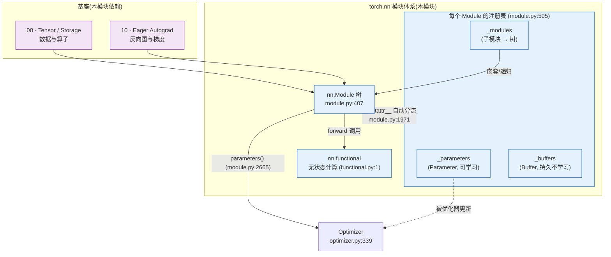

# 06 · torch.nn 模块体系 — 目录索引

> 层次:overview(浅)
> 核验基准:PyTorch upstream `E:\97-codes\pytorch\pytorch`(v2.13.0a0, commit 9922478)
> 最后更新:2026-06-15

---

## 模块概述

`torch.nn` 解决的是一个**组织问题**,而不是计算问题。张量(见 [[01_eager_runtime/01_tensor_and_storage/index]])提供数据与算子,autograd(见 [[01_eager_runtime/05_autograd_engine/index]])提供自动微分,但当你要搭一个有几百层、上千个权重的网络时,谁来回答这些问题:**哪些张量是可学习参数?哪些是要存档但不训练的状态?如何一次性把整棵网络搬到 GPU?如何把全部权重序列化又恢复?如何把全部参数喂给优化器?** 这些「按类别递归遍历整棵网络」的能力,正是 `nn.Module` 树的全部价值。

核心抽象是一棵 **Module 树**。`class Module`(`torch/nn/modules/module.py:407`)是所有网络层的基类;一个 Module 可以把别的 Module 作为属性持有,从而嵌套成树。让这棵树「活起来」的,是 `Module.__init__`(`module.py:482`)在每个实例上建立的**三张核心注册表**(`module.py:505`):

```python
# torch/nn/modules/module.py:505
super().__setattr__("training", True)
super().__setattr__("_parameters", {})   # 可学习参数
super().__setattr__("_buffers", {})      # 持久但不学习的状态
...
super().__setattr__("_modules", {})      # 子模块 → 形成树
```

> 注意它用 `super().__setattr__` 直接建表,故意绕开 Module 自己的 `__setattr__`,避免初始化时的注册开销。

### 注册「魔法」:`__setattr__` 三路分派

用户从不手动维护这三张表。当你写 `self.conv = nn.Conv2d(...)` 或 `self.w = nn.Parameter(...)`,`Module.__setattr__`(`module.py:1971`)按赋值对象的类型把它**自动分流**进对应的表:

```python
# torch/nn/modules/module.py:1980
params = self.__dict__.get("_parameters")
if isinstance(value, Parameter):
    ...
    self.register_parameter(name, value)   # → _parameters
# 否则若是 Module → _modules;若是 buffer → _buffers;
# 都不是 → 退化为普通 Python 属性(不进任何表)
```

这就是为什么「赋值即注册」。一个普通 `Tensor` 赋给属性**不会**进表(只是缓存),这正是 RNN 隐藏态等临时量不该被当成参数的体现。普通属性与注册表的分离,是 `parameters()` / `state_dict()` / `.to()` 能够按类别递归的根本前提。

### 两类状态:Parameter vs Buffer

注册表把网络状态二分为两类张量子类:

| | `Parameter`(`parameter.py:30`) | `Buffer`(`parameter.py:249`) |
|---|---|---|
| 默认 `requires_grad` | `True` | 跟随源张量(通常 `False`) |
| 被 `parameters()` 收集 | 是 → 喂给优化器 | 否 |
| 被优化器更新 | 是 | 否 |
| 进 `state_dict`(存档) | 是 | 是(除非 `persistent=False`) |
| 随 `.to()` / `.cuda()` 搬运 | 是 | 是 |
| 典型例子 | 线性层 `weight` / `bias` | BatchNorm 的 `running_mean` / `running_var` |

一句话:**Parameter 是「会被训练的张量」,Buffer 是「属于模型但不训练的张量」**。BatchNorm 的滑动统计量必须随模型一起存档、一起搬设备,却不能被优化器当成权重去更新——这正是 Buffer 存在的理由。两者都是 `torch.Tensor` 的子类,通过 metaclass 重写 `__instancecheck__`,让带 `_is_param` / `_is_buffer` 标记的自定义张量也能通过 `isinstance` 判定(细节见 deepdive)。

### 谁消费 parameters:Optimizer

`parameters()`(`module.py:2665`)是 Module 树与优化器之间的接口。它委托 `named_parameters` 遍历整棵树、按张量身份去重后,产出一个参数迭代器——这就是 `optim.SGD(model.parameters(), lr=...)` 里那一串。

`class Optimizer`(`torch/optim/optimizer.py:339`)接过这个迭代器(`__init__`,`optimizer.py:377`),建立两份核心结构(`optimizer.py:395`):

```python
# torch/optim/optimizer.py:395
self.state: defaultdict[torch.Tensor, Any] = defaultdict(dict)  # 每参数的惰性状态(如动量)
self.param_groups: list[dict[str, Any]] = []                    # 分组超参(分层 lr 等)
```

`state` 用 `defaultdict(dict)` 实现「首次访问某参数即建空状态」的惰性分配;`param_groups` 支持「不同层不同 lr / weight_decay」。Module 负责**持有并组织参数**,Optimizer 负责**按参数维护更新状态并推进一步**——职责清晰分离。

### 状态 vs 计算:与 `nn.functional` 的二分

最后一块拼图是 `torch.nn.functional`(`functional.py:1`,模块 docstring 即 `"""Functional interface."""`)。它是一组**无状态纯函数**:权重、`training` 标志全部经入参传入,函数自身不持有任何状态。`nn.Module` 持有状态(参数/buffer),`F.*` 负责计算——例如 `nn.Linear` 在 forward 里调用 `F.linear(input, self.weight, self.bias)`。这套「状态归 Module、计算归 functional」的二分,既让模块有清晰的状态边界,又让计算便于函数式组合与 FX tracing。

### 全景图:nn 建立在 tensor(00) 与 autograd(10) 之上



### Module 树与注册表(一棵网络的内部视图)

下图展示一个 `Sequential(Linear, BatchNorm)` 在内存里的真实结构:`_modules` 把树连起来,每个叶子模块各自持有 `_parameters` 与 `_buffers`。`named_modules`(`module.py:2836`)等遍历族就是沿 `_modules` 做深度优先递归。

```mermaid
graph TD
    Root["root: Sequential<br/>_modules = {'0','1'}"]
    L["'0': Linear<br/>_parameters={weight,bias}<br/>_buffers={}"]
    BN["'1': BatchNorm1d<br/>_parameters={weight,bias}<br/>_buffers={running_mean,<br/>running_var,num_batches_tracked}"]

    Root -->|_modules['0']| L
    Root -->|_modules['1']| BN

    L --- LW["weight: Parameter<br/>requires_grad=True"]
    L --- LB["bias: Parameter"]
    BN --- BW["weight/bias: Parameter"]
    BN --- BRM["running_mean: Buffer<br/>(持久, 不学习)"]

    classDef param fill:#e8f5e9,stroke:#2e7d32;
    classDef buf fill:#fff3e0,stroke:#ef6c00;
    class LW,LB,BW param;
    class BRM buf;
```

`parameters()` 遍历这棵树时只收集绿色的 Parameter(`L.weight, L.bias, BN.weight, BN.bias`),交给优化器;`state_dict()` 同时收集 Parameter 与持久 Buffer(含三个橙色 buffer),用于存档;`.to(device)` 则递归对**所有** Parameter 和 Buffer 施加搬运。同一棵树、三种按类别的递归——这正是 Module 抽象的回报。

## 页面列表(按层次)

| 页面 | 层次 | 核心主题 |
|------|------|---------|
| [[nn_module_quickstart]] | **quick start** | 搭模块与注册(`register_parameter`/`register_buffer`/`add_module`);遍历族(`parameters`/`buffers`/`children`/`modules`);存取(`state_dict`/`load_state_dict` 的 strict/assign);`train`/`eval` 模式切换;forward/backward hook;容器(`Sequential`/`ModuleList`/`ModuleDict`);优化器循环与分组 lr;可跑的最小示例 |
| [[nn_module_and_optimizer_analysis]] | deep dive | `__setattr__`/`__getattr__` 分派内核;`_apply` 变换流水线三路径(swap_tensors vs `.data=` 与 grad 保留);`_call_impl` 的 hook 执行编排(顺序/短路/`always_call`);`_save/_load_from_state_dict` 与 `_named_members` 去重引擎;Lazy 物化(`UninitializedParameter`/`materialize`/`cls_to_become`);Parameter/Buffer 元类;Optimizer 深水区(`defaults` 合并、param_groups 隔离、foreach/fused) |

---

## 关联域

- [[01_eager_runtime/01_tensor_and_storage/index]] — 基座:Parameter / Buffer 都是 `torch.Tensor` 的子类,搬运与存储语义源于此
- [[01_eager_runtime/05_autograd_engine/index]] — 基座:Parameter 默认 `requires_grad=True`,作为 autograd 叶子参与反向;`.to()` 搬运需保住叶子性与 `.grad`
- [[02_compile_stack/02_aot_autograd/index]] — 下游语境:`nn.functional` 的无状态设计利于 FX tracing 与编译期联合图构建
- [[01_ai_frameworks/index]] — 本域总索引

## Related Pages

- [[nn_module_quickstart]] — 本模块 quick start:怎么用、怎么查、怎么验证
- [[nn_module_and_optimizer_analysis]] — 本模块 deep dive:源码级机制深析
- [[01_eager_runtime/01_tensor_and_storage/index]] — 张量与存储基座
- [[01_eager_runtime/05_autograd_engine/index]] — eager autograd 基座
- [[02_compile_stack/02_aot_autograd/index]] — 编译期 autograd 与无状态 functional 语境
