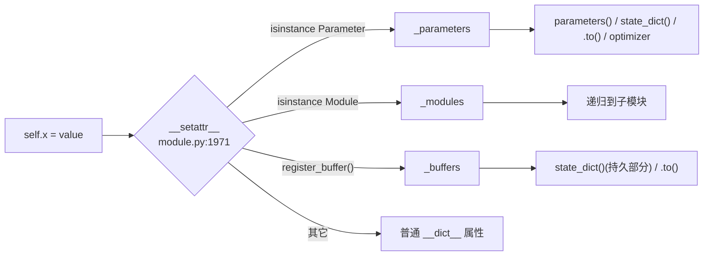

# nn.Module 体系 Quick Start：搭模块 / 遍历 / 存取 / 模式 / Hook / 容器 / 优化器循环

> 层次：quick start（浅、实用）
> 核验基准：PyTorch upstream `E:\97-codes\pytorch\pytorch`(v2.13.0a0, commit 9922478)
> 最后更新：2026-06-15

**一句话**：`nn.Module` 是「带结构化状态的可调用对象」——你把 `Parameter`（可学习）、`Buffer`（持久但不学习）、子 `Module` 赋成实例属性，它自动登记进三张内部表，于是 `parameters()` / `state_dict()` / `.to()` / `train()` 全都能按类别递归。`Optimizer` 消费 `model.parameters()` 并按 `param_groups` 分组更新。本页给出最小可跑路径，所有引用均指向 `E:\97-codes\pytorch\pytorch` 真实行号。

概念背景与全景图见 [[index]]；源码级深析见 [[nn_module_and_optimizer_analysis]]。

---

## 0. 心智模型：三张表 + 自动注册

`Module.__init__` 用 `super().__setattr__` 直接建好三张核心字典（绕开自身 `__setattr__` 开销）：`_parameters` / `_buffers` / `_modules`，外加一批 hooks 字典与 `_non_persistent_buffers_set`（`torch/nn/modules/module.py:505`-`521`）。



`self.x = value` 触发 `__setattr__`（`torch/nn/modules/module.py:1971`）按 `value` 类型三路分派：`Parameter` 进 `_parameters`、`Module` 进 `_modules`、其余走普通属性。**关键陷阱**：直接 `self.buf = torch.zeros(3)` 只是普通属性，**不会**进 `state_dict`、也**不会**随 `.to()` 搬运——buffer 必须用 `register_buffer`。

---

## 1. 搭一个 Module

```python
import torch
import torch.nn as nn
import torch.nn.functional as F


class Net(nn.Module):
    def __init__(self, in_dim=4, hidden=8, out_dim=2):
        super().__init__()                         # 必须先调，否则三张表未建 → 赋值报错
        self.fc1 = nn.Linear(in_dim, hidden)       # 子模块 → _modules
        self.fc2 = nn.Linear(hidden, out_dim)      # 子模块 → _modules
        self.scale = nn.Parameter(torch.ones(1))   # 可学习 → _parameters
        self.bn = nn.BatchNorm1d(hidden)           # 自带 running_mean/var buffer
        self.register_buffer("step_count", torch.zeros(1, dtype=torch.long))  # 持久 buffer
        self.dropout = nn.Dropout(p=0.5)

    def forward(self, x):
        x = F.relu(self.fc1(x))
        x = self.bn(x)
        x = self.dropout(x)
        return self.fc2(x) * self.scale


net = Net()
print(net)   # 漂亮树状打印,来自 _modules 递归
```

涉及的注册入口（均已对照源码）：

| 你写的 | 实际落点 | 源码锚点 |
|---|---|---|
| `self.scale = nn.Parameter(...)` | `_parameters`（经 `register_parameter`） | `torch/nn/modules/module.py:592`，分派在 `module.py:1971` |
| `self.fc1 = nn.Linear(...)` | `_modules`（经 `add_module`） | `torch/nn/modules/module.py:642` |
| `self.register_buffer("step_count", ...)` | `_buffers` | `torch/nn/modules/module.py:528` |
| `nn.Parameter` / `nn.Buffer` 类 | 张量子类（metaclass 重写 `isinstance`） | `torch/nn/parameter.py:30` / `torch/nn/parameter.py:249` |

> 顺序很重要：`super().__init__()` 必须先调。否则 `register_parameter` 会因 `_parameters not in self.__dict__` 抛 `AttributeError`（`torch/nn/modules/module.py:605`-`608`）。

---

## 2. 遍历参数 / buffer / 子模块

`parameters()` 是 `named_parameters()` 的薄包装；后者再委托去重引擎 `_named_members`（用 `memo` 集合**按张量身份去重**，权重共享只产出一次）。

```python
# 只要张量,喂给优化器(module.py:2665)
for p in net.parameters():
    ...

# 带名字,常用于冻结/分组/调试(module.py:2690)
for name, p in net.named_parameters():
    print(name, tuple(p.shape), p.requires_grad)
# fc1.weight (8, 4) True ... scale (1,) True ...

# 只看本层,不递归
list(net.named_parameters(recurse=False))   # 只有 'scale'

# buffer 遍历(module.py:2722 / 2745):BN 统计量 + 自定义 step_count 都在
for name, b in net.named_buffers():
    print(name, tuple(b.shape))
# bn.running_mean (8,) ... bn.running_var (8,) ... bn.num_batches_tracked () ... step_count (1,)

# 子模块树(module.py:2776 children / 2805 modules / 2836 named_modules)
for name, m in net.named_modules():
    print(repr(name), type(m).__name__)
```

| API | 产出 | 源码锚点 |
|---|---|---|
| `parameters()` / `named_parameters()` | 可学习张量（递归 + 去重） | `module.py:2665` / `module.py:2690` |
| `buffers()` / `named_buffers()` | 持久 + 非持久 buffer | `module.py:2722` / `module.py:2745` |
| `children()` / `named_children()` | 直接子模块 | `module.py:2776` / `module.py:2785` |
| `modules()` / `named_modules()` | 整棵子树 | `module.py:2805` / `module.py:2836` |
| 去重引擎 | `_named_members`（`memo` 身份去重） | `module.py:2645` |

> tied weights（如输入 embedding 与输出投影共享）下，`named_parameters()` **只产出一次**该张量——这正是优化器不会重复更新它的原因（去重逻辑 `module.py:2658`：`if v is None or v in memo: continue`）。

---

## 3. 存取：state_dict / load_state_dict(strict)

`state_dict()` 收集**参数 + 持久 buffer**（默认 `detach`，是浅拷贝引用），键 = `prefix + name`，按 `named_modules` 拼前缀；非持久 buffer（`register_buffer(..., persistent=False)`）不入档。

```python
# 保存(module.py:2194)
sd = net.state_dict()
print(list(sd.keys())[:3])   # ['fc1.weight', 'fc1.bias', 'fc2.weight', ...]
torch.save(sd, "net.pt")

# 加载(module.py:2530;strict 默认 True)
net2 = Net()
missing, unexpected = net2.load_state_dict(torch.load("net.pt"))
# 返回 NamedTuple(missing_keys=[], unexpected_keys=[])

# strict=False:容忍键集合不完全匹配(迁移/微调常用)
net2.load_state_dict(partial_sd, strict=False)   # 缺/多的键进 missing/unexpected,不报错

# assign=True:用 state_dict 里的张量"替身",而非原地 copy_(meta-device 加载等)
net2.load_state_dict(sd, assign=True)
# 注意:assign=True 后必须"重新构造 optimizer",因为参数对象被换掉了(module.py:2539-2542 warning)
```

要点（均对照源码）：

- `load_state_dict(self, state_dict, strict=True, assign=False)` 签名见 `torch/nn/modules/module.py:2530`-`2532`。
- `strict=True` 时键集合必须**精确匹配**，否则在 missing/unexpected 上报错。
- 返回值是 `NamedTuple(missing_keys, unexpected_keys)`（`module.py:2557`-`2561`），即便 `strict=False` 也照常返回，用它检查到底缺/多了什么。
- 非持久 buffer 不进 `state_dict`：取舍由 `register_buffer(..., persistent=False)` 决定（语义见 `module.py:537`-`540`）。

---

## 4. train() / eval() 对 Dropout / BatchNorm 的影响

`train(mode=True)` 只做一件事：把 `self.training` 标志**递归**刷到每个子模块；`eval()` 就是 `train(False)`。

```python
# module.py:2885 train  /  module.py:2907 eval
net.train()        # self.training=True 递归下发
net.eval()         # 等价 net.train(False)
```

源码本体极简（`torch/nn/modules/module.py:2902`-`2905`）：

```python
self.training = mode
for module in self.children():
    module.train(mode)
return self
```

**行为差异不在 Module 基类里，而在各层 forward 读取 `self.training`**：

- **Dropout**：`training=True` 才随机置零并按 `1/(1-p)` 缩放；`eval()` 下变成恒等。对应无状态实现 `F.dropout(input, p, training, inplace)`——`training` 是**显式入参**（`torch/nn/functional.py:1467`，落到 `_VF.dropout(input, p, training)` 见 `functional.py:1490`），由 `nn.Dropout.forward` 传入 `self.training`。
- **BatchNorm**：`training=True` 用当前 batch 统计量并更新 `running_mean/var`；`eval()` 改用累计的 running 统计量、**不更新** buffer。对应 `F.batch_norm(input, running_mean, running_var, weight, bias, training, momentum, eps)`，`training` 同样是入参（`torch/nn/functional.py:2859`-`2868`）。

> 推理前忘记 `model.eval()` 是最常见的「精度对不上」根因：Dropout 还在丢、BN 还在用 batch 统计量。

---

## 5. 注册 forward / backward hook

四类 hook 都返回一个 `RemovableHandle`，调 `.remove()` 即注销。

```python
# forward-pre hook:forward 之前,可改输入(module.py:1624)
def pre(module, args):
    print("input shape:", args[0].shape)
    return None   # 返回非 None 则替换 args
h1 = net.register_forward_pre_hook(pre)

# forward hook:forward 之后,可改输出(module.py:1687)
acts = {}
def fwd(module, args, output):
    acts["fc1"] = output.detach()
    return None   # 返回非 None 则替换 output
h2 = net.fc1.register_forward_hook(fwd)

# backward hook(整模块梯度):module.py:1460 register_full_backward_hook
def bwd(module, grad_input, grad_output):
    print("grad_out norm:", grad_output[0].norm().item())
h3 = net.fc2.register_full_backward_hook(bwd)

# 用完注销
for h in (h1, h2, h3):
    h.remove()
```

关键开关（在 `register_forward_hook` 签名里，`torch/nn/modules/module.py:1687`-`1695`）：

| 关键字 | 作用 | 备注 |
|---|---|---|
| `prepend=True` | 把本 hook 插到队首先执行 | 内部用 `OrderedDict.move_to_end(..., last=False)` |
| `with_kwargs=True` | hook 也能看到 forward 的 kwargs | 签名变 `hook(module, args, kwargs, output)` |
| `always_call=True` | 即便 forward 抛异常也补跑该 forward hook | 仅 `register_forward_hook` 有 |

补充锚点：forward-pre hook `module.py:1624`；full-backward-pre hook `register_full_backward_pre_hook`（`module.py:1385`，在梯度计算前触发）。**注意**：旧式 `register_backward_hook` 已弃用，新代码用 `register_full_backward_hook`（`module.py:1460`）。无任何 hook 时，`__call__` 会短路直接进 `forward`（性能路径，见 [[nn_module_and_optimizer_analysis]]）。

---

## 6. 容器：Sequential / ModuleList / ModuleDict

普通 Python `list` / `dict` 里的子模块**不会**进 `_modules`，于是 `parameters()` / `.to()` 看不到它们。容器就是为解决这点而生。

```python
# Sequential:自带链式 forward(container.py:59)
seq = nn.Sequential(
    nn.Linear(4, 8), nn.ReLU(), nn.Linear(8, 2),
)
y = seq(torch.randn(3, 4))   # forward 内部:for module in self: input = module(input)

# 也可用 OrderedDict 命名各层
from collections import OrderedDict
seq2 = nn.Sequential(OrderedDict(fc1=nn.Linear(4, 8), act=nn.ReLU()))

# ModuleList:只登记,无 forward,需自己循环(container.py:335)
class Stack(nn.Module):
    def __init__(self, n=3):
        super().__init__()
        self.layers = nn.ModuleList([nn.Linear(8, 8) for _ in range(n)])
    def forward(self, x):
        for layer in self.layers:
            x = F.relu(layer(x))
        return x

# ModuleDict:按 key 取子模块,适合分支/可选头(container.py:505)
class MultiHead(nn.Module):
    def __init__(self):
        super().__init__()
        self.heads = nn.ModuleDict({"cls": nn.Linear(8, 2), "reg": nn.Linear(8, 1)})
    def forward(self, x, task):
        return self.heads[task](x)
```

| 容器 | 提供 forward？ | 用途 | 源码锚点 |
|---|---|---|---|
| `Sequential` | 是（顺序串联） | 固定线性管线 | `torch/nn/modules/container.py:59`，forward 在 `container.py:248` |
| `ModuleList` | 否 | 子模块列表，自己循环 | `torch/nn/modules/container.py:335` |
| `ModuleDict` | 否 | 子模块按 key 取 | `torch/nn/modules/container.py:505` |

> `Sequential.forward` 真身就一行循环（`container.py:252`-`254`）：`for module in self: input = module(input)`。

---

## 7. Optimizer：param_groups + 分组 lr 的训练循环

`Optimizer` 接收 `model.parameters()`（裸张量列表）或一组 `dict`（每组带自己的超参）。`__init__` 把惰性状态表与空分组建好（`torch/optim/optimizer.py:377`），核心两行：`self.state = defaultdict(dict)`（`optimizer.py:395`）、`self.param_groups = []`（`optimizer.py:396`）；裸列表会被包成单组后逐组调 `add_param_group`（`optimizer.py:404`-`405`）。

```python
# 分组 lr:不同子模块用不同学习率(param_groups)
opt = torch.optim.SGD(
    [
        {"params": net.fc1.parameters(), "lr": 1e-2},   # 第 1 组:大 lr
        {"params": net.fc2.parameters(), "lr": 1e-4},   # 第 2 组:小 lr
        {"params": [net.scale]},                         # 第 3 组:用 defaults 的 lr
    ],
    lr=1e-3,            # 充当 defaults:未指定 lr 的组回退到它
    momentum=0.9,
)

x = torch.randn(16, 4)
target = torch.randint(0, 2, (16,))
net.train()
for step in range(100):
    opt.zero_grad(set_to_none=True)      # 清梯度(optimizer.py:1024;Module 侧同名在 module.py:2948)
    out = net(x)
    loss = F.cross_entropy(out, target)
    loss.backward()                       # autograd 填 .grad
    opt.step()                            # 子类(SGD/Adam)实现真正更新

# 训练中途加新组(如解冻某层),lr 可单独设
opt.add_param_group({"params": net.bn.parameters(), "lr": 5e-3})  # optimizer.py:1103
```

机制要点（均对照源码）：

- **defaults 合并**：每组缺省的超参从 `self.defaults` 填入；标记为 `required` 而又没给值的会报错（`torch/optim/optimizer.py:1157`-`1163`）。所以上面第 3 组没写 `lr`，会拿到 defaults 的 `1e-3`。
- **param_groups 互斥（隔离）**：跨组参数必须不相交，否则 `add_param_group` 抛 `"some parameters appear in more than one parameter group"`（`optimizer.py:1186`-`1187`）——避免同一参数被更新两次。
- **state 惰性**：`self.state` 是 `defaultdict(dict)`（`optimizer.py:395`），首次访问某参数即建空 dict，动量等按需创建。
- **`step()` 是抽象基**：基类 `Optimizer.step` 直接 `raise NotImplementedError`（`def` 在 `optimizer.py:1093`，抛错在 `optimizer.py:1100`）；真正的更新算法在子类（`torch/optim/sgd.py`、`torch/optim/adam.py` 等）。引用「step 实现」时应转向具体子类文件。
- `class Optimizer` 定义在 `torch/optim/optimizer.py:339`。

> 想验证分组生效：`for g in opt.param_groups: print(g["lr"], len(g["params"]))`，应看到 `0.01 / 0.0001 / 0.001` 三组。

---

## 8. 排查速查表

| 现象 | 多半原因 | 怎么查 |
|---|---|---|
| `cannot assign parameter before Module.__init__()` | 忘了先 `super().__init__()` | 检查子类 `__init__` 第一行（`module.py:605`） |
| buffer 没进 `state_dict` / 没随 `.to()` 走 | 用了 `self.x = tensor` 而非 `register_buffer` | 看 `named_buffers()` 里有没有它 |
| `load_state_dict` 报 missing/unexpected | 键集合不匹配 | 先 `strict=False` 拿到 missing/unexpected 两列表（`module.py:2557`） |
| 推理精度异常 | 忘了 `model.eval()` | Dropout/BN 仍在训练态（见 §4） |
| 优化器对某参数没更新 | 该参数没进任何 param_group / `requires_grad=False` | `for g in opt.param_groups: ...` + `named_parameters()` 看 `requires_grad` |
| 共享权重被「更新两次」的担心 | 实际不会，`_named_members` 已去重 | 见 §2 去重说明（`module.py:2645`） |
| 改了 `param.data` 后梯度异常 | `.data=` 旁路了 autograd | 优先 `.to()` / `swap_tensors`，细节见 [[nn_module_and_optimizer_analysis]] |

---

## Related Pages

- [[index]] — NN · 模块体系 总览（全景图、页面列表、关联域）
- [[nn_module_and_optimizer_analysis]] — 源码级深析（`__setattr__` 分派、`_apply` 三路径、hook 编排、lazy 物化、optimizer foreach/fused）
- [[01_eager_runtime/01_tensor_and_storage/index]] — Parameter/Buffer 是张量子类，理解其底层先看张量与 storage
- [[01_eager_runtime/05_autograd_engine/index]] — `loss.backward()` 填 `.grad`、backward hook 的来龙去脉
- [[02_compile_stack/02_aot_autograd/index]] — 训练图捕获与函数化，把 nn.functional 的「无状态计算」推到编译期
