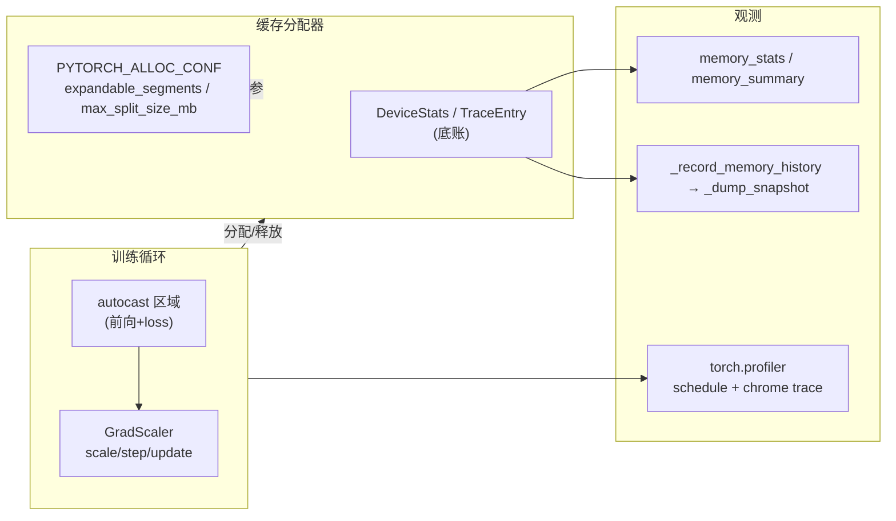

> 层次:quick start(用)
> 核验基准:PyTorch upstream `E:\97-codes\pytorch\pytorch`(v2.13.0a0, commit 9922478)
> 最后更新:2026-06-15

# 运行时三件套实操:AMP 训练循环 / 显存观测 / Profiler 与分配器调参

> [!note] 页面角色与审计状态
> **页面角色**：AMP 训练循环、allocator 观测、Profiler 导出与运行时调参的实操入口；它保留用户 API 和排障流程，不承担 Inductor 编译期 buffer planner 的机制证明。
> **原始基线**：页内 PyTorch `9922478`（v2.13.0a0）；**当前审计基线**：PyTorch `e8f97c1a6ef8cbcdd0a946606bc1e924e4f07e52`。
> **审计状态**：已纳入历史 manifest，但代码块、locator 与当前环境尚未逐项复跑；使用时应保留原基线限定。编译期 logical buffer、liveness 与静态 peak 见 [[12_buffer_liveness_memory_planning_and_reuse_analysis]]，运行时领域导航见 [[01_eager_runtime/07_memory_amp_profiler/index]]。

本页面向「已经会写训练循环、但还没系统用过 AMP / 显存工具 / Profiler」的工程师,给出**最小可跑路径**、**关键 API + 真实源码锚点**、以及**排查与调参速查**。源码深析见 [[10_caching_allocator_autocast_profiler_analysis]],三支柱全景见 [[01_eager_runtime/07_memory_amp_profiler/index]]。

> 一句话定位:`autocast`/`GradScaler` 让你**省显存、跑更快**;`memory_stats`/`snapshot` 让你**看清显存被谁吃了**;`torch.profiler` 让你**看清时间花在哪**;`PYTORCH_ALLOC_CONF` 让你**调缓存分配器行为以治碎片**。四者围绕同一个缓存分配器底账协作。



---

## 1. AMP 最小训练循环(autocast + GradScaler)

### 1.1 能跑的最小例子

`autocast` 只包**前向(含 loss 计算)**,不要包 `backward()`;`GradScaler` 负责放大 loss 防 fp16 下溢、并在梯度出现 inf/NaN 时跳过该步。下面是 CUDA 版,与官方 docstring 示例一致(`torch/amp/autocast_mode.py:68-84`、`torch/amp/grad_scaler.py:63-83`):

```python
import torch
from torch import nn, optim

model = Net().cuda()
optimizer = optim.SGD(model.parameters(), lr=1e-2)
scaler = torch.amp.GradScaler("cuda")          # 训练开始前创建一次

for input, target in data:
    optimizer.zero_grad()

    # 仅前向 + loss 在 autocast 区域内;matmul/conv 走 fp16,reduction 仍保 fp32
    with torch.autocast(device_type="cuda", dtype=torch.float16):
        output = model(input)
        loss = loss_fn(output, target)

    scaler.scale(loss).backward()              # 放大后的 loss 产生放大的梯度
    scaler.step(optimizer)                     # 内部先 unscale + 查 inf/NaN,干净才 step
    scaler.update()                            # 据本步结果放大或回退 scale
```

CPU 训练改 `device_type="cpu", dtype=torch.bfloat16`(`autocast_mode.py:122-138`)。CPU 推理只需 `autocast`,不需要 `GradScaler`(`autocast_mode.py:141-149`)。

### 1.2 关键 API 与默认值

| 调用 | 作用 | 源码锚点 |
|---|---|---|
| `torch.autocast(device_type, dtype=...)` | 进入混合精度区域,按算子类别自动选 dtype | `torch/amp/autocast_mode.py:52`(类)、`308`(`__enter__`)、`343`(`__exit__`) |
| `GradScaler(device, init_scale, growth_factor, backoff_factor, growth_interval)` | 动态梯度缩放器 | `torch/amp/grad_scaler.py:53`(类)、`123`(`__init__`) |
| `scaler.scale(loss)` | 把 loss 乘以当前 scale | `grad_scaler.py:193` |
| `scaler.step(optimizer)` | unscale + 查非有限值,干净才 `optimizer.step()` | `grad_scaler.py:375`;实际跳过逻辑 `_maybe_opt_step` 在 `363` |
| `scaler.update(new_scale=None)` | 根据本步是否出现 inf/NaN 调整 scale | `grad_scaler.py:484` |

`GradScaler` 默认参数(`grad_scaler.py:123-130`):

```python
init_scale = 2.0**16   # 初始放大倍数
growth_factor = 2.0    # 连续 growth_interval 步无 inf/NaN → scale ×2
backoff_factor = 0.5   # 出现 inf/NaN → scale ×0.5 且跳过该 step
growth_interval = 2000 # 连续多少步无溢出才放大
```

`step` 真正跳过的判定很直白——`found_inf` 求和非零就不调 `optimizer.step()`(`grad_scaler.py:371-372`):

```python
if not sum(v.item() for v in optimizer_state["found_inf_per_device"].values()):
    retval = optimizer.step(*args, **kwargs)
```

### 1.3 易踩的坑

- **`autocast` 不要包 `backward()`**:反向算子会自动沿用前向所用 dtype(`autocast_mode.py:64-66`)。
- **`step` 之后必须 `update`**:`GradScaler` 内部用 `OptState` 状态机强约束这个次序,详见 [[10_caching_allocator_autocast_profiler_analysis]]。
- **缓存语义**:同一 fp32 权重在一次前向里多次用到时,其低精度 cast 结果会被缓存复用;退出最外层 `autocast`(nesting 归零)时自动清缓存(`autocast_mode.py:348-349` 调 `clear_autocast_cache()`)。因此**不要跨 step 持有 autocast 区域里产出的张量**。
- **不要手动 `model.half()`**:autocast 已在 dispatcher 层做类型转换(`autocast_mode.py:61-62`)。

---

## 2. 显存观测:看清显存被谁吃了

### 2.1 memory_stats / memory_summary —— 当前累计统计

```python
import torch
torch.cuda.empty_cache()                       # 可选:先把缓存还给驱动,便于读数对齐
print(torch.cuda.memory_summary())             # 人类可读的分桶表
stats = torch.cuda.memory_stats()              # dict,可程序化断言
peak = stats["reserved_bytes.all.peak"]        # 进程向驱动预留的峰值
alloc = stats["allocated_bytes.all.current"]   # 当前真正被张量占用的字节
```

`memory_stats()`(`torch/cuda/memory.py:231`)/`memory_summary()`(`torch/cuda/memory.py:651`)的字段语义,直接对应 C++ 侧 `DeviceStats`(`c10/core/CachingDeviceAllocator.h:13-70`):

| 关注字段 | 含义 | C++ 锚点 |
|---|---|---|
| `allocated_bytes` | 张量实际占用字节 | `CachingDeviceAllocator.h:24-25` |
| `reserved_bytes` | 向设备**预留**的字节(含空闲缓存) | `:26-27` |
| `inactive_split[_bytes]` | 已切分但未分配、无法整段归还设备 → **碎片信号** | `:20-22`、`:35-36` |
| `num_alloc_retries` | 触发缓存回收重试的次数 → 内存吃紧信号 | `:40-42` |
| `num_ooms` | 缓存回收后仍 OOM 的次数 | `:44-46` |
| `reserved_bytes_by_private_pools` | CUDA Graph 私有池占用(按 `MempoolId_t`) | `:28-32`,详见 [[03_runtime_graphs/index]] |

**经验法则**:`reserved` 远大于 `allocated`,且 `inactive_split_bytes` 高,通常就是碎片——转去第 4 节调 `expandable_segments`。

### 2.2 snapshot —— 逐分配的时间线/快照(定位泄漏与碎片)

`memory_stats` 只给聚合数;要知道**具体哪段代码分配了哪块**,用历史记录 + 快照:

```python
import torch
torch.cuda.memory._record_memory_history(max_entries=100_000)  # 开始记录带栈的 alloc/free 历史
#  ... 跑若干训练步 ...
torch.cuda.memory._dump_snapshot("mem_snapshot.pickle")        # 落盘
torch.cuda.memory._record_memory_history(enabled=None)         # 关闭记录
```

- `_record_memory_history`(`torch/cuda/memory.py:892`):`enabled="all"` 记录全部 alloc/free 历史,`"state"` 只记当前存活分配的栈;长任务务必设 `max_entries` 上限防爆内存(docstring `:905-915`)。
- `_dump_snapshot`(`torch/cuda/memory.py:1129`):落 pickle,可用 `pytorch.org/memory_viz` 交互式可视化(docstring `:1133`)。
- 底层每条事件就是 `TraceEntry`,其 `Action` 枚举(`CachingDeviceAllocator.h:116-127`)区分 `ALLOC / FREE_REQUESTED / FREE_COMPLETED / SEGMENT_ALLOC / SEGMENT_FREE / SEGMENT_MAP / SEGMENT_UNMAP`;`SEGMENT_MAP/UNMAP` 即 expandable segments 的 `cuMemMap`/解映射,在可视化里能直观看到段的增长。
- 快照里每个段是 `SegmentInfo`(`CachingDeviceAllocator.h:95-109`,含 `total_size / allocated_size / is_expandable / owner_private_pool_id`),段内每个子块是 `BlockInfo`(`:83-91`)。

---

## 3. torch.profiler:看清时间花在哪

### 3.1 用 schedule 周期采样 + 导出 chrome trace

直接对整段训练开 profiler 会产生巨量数据;生产做法是用 `schedule` 只采样若干个稳定步:

```python
import torch
from torch.profiler import profile, schedule, tensorboard_trace_handler, ProfilerActivity

my_schedule = schedule(wait=1, warmup=1, active=3, repeat=2)  # 跳1 + 预热1 + 采集3,循环2轮

with profile(
    activities=[ProfilerActivity.CPU, ProfilerActivity.CUDA],
    schedule=my_schedule,
    on_trace_ready=tensorboard_trace_handler("./tb_logs"),    # 每个采集周期末自动落盘
    record_shapes=True,
    profile_memory=True,
    with_stack=True,
) as prof:
    for step, (input, target) in enumerate(data):
        train_one_step(input, target)
        prof.step()                                           # 必须每步调用,驱动状态机
```

也可不用 handler、手动导出:

```python
prof.export_chrome_trace("trace.json")        # chrome://tracing 或 perfetto.dev 打开
```

### 3.2 关键 API 锚点

| 调用 | 作用 | 源码锚点 |
|---|---|---|
| `schedule(wait, warmup, active, repeat=0, skip_first=0)` | 生成每步返回 `ProfilerAction` 的回调 | `torch/profiler/profiler.py:667` |
| `profile(...)`(上下文管理器) | 按 schedule 在 NONE/WARMUP/RECORD/RECORD_AND_SAVE 间切换 | `torch/profiler/profiler.py:773` |
| `prof.step()` | 推进一步,触发状态切换与 `on_trace_ready` | `torch/profiler/profiler.py:1150` |
| `prof.export_chrome_trace(path)` | 导出 chrome JSON(有 schedule 时只导最后一个周期) | `torch/profiler/profiler.py:409` |
| `tensorboard_trace_handler(dir)` | 自动按 `*.pt.trace.json[.gz]` 命名落盘 | `torch/profiler/profiler.py:737`,文件名规则 `:762` |
| `prof.export_memory_timeline(path)` | 导出按类别(参数/激活/梯度/优化器态)的显存时间线 | `torch/profiler/profiler.py:591` |

`schedule` 状态机的核心是对周期取模(`profiler.py:701-714`):每个周期 `wait + warmup + active` 步,最后一个 active 步返回 `RECORD_AND_SAVE` 触发导出。注意 `warmup=0` 会告警(`:721-725`),`active` 必须 `> 0`(`:716`)。

### 3.3 显存时间线(谁占了激活/梯度)

`export_memory_timeline`(`profiler.py:591`)按后缀决定格式:`.html` 内嵌 PNG 曲线、`.json`/`.json.gz` 出 `[times, [各类别 sizes]]`、`.raw.json.gz` 出原始点。它把每块 storage 在时间轴上归类为 INPUT/ACTIVATION/GRADIENT/PARAMETER/OPTIMIZER_STATE 等(`torch/profiler/_memory_profiler.py:37-44` 的 `Category`),与 §2 的分配器底账互为印证。

---

## 4. 调缓存分配器:PYTORCH_ALLOC_CONF

### 4.1 先记住一个变化:环境变量主名升级

> 配置已下沉为**设备无关**的 `AcceleratorAllocatorConfig`(`c10/core/AllocatorConfig.h:162`),主环境变量从 `PYTORCH_CUDA_ALLOC_CONF` 升级为通用的 **`PYTORCH_ALLOC_CONF`**;旧名仍兼容但**优先级更低**(`AllocatorConfig.h:157-159`)。`c10/cuda/CUDAAllocatorConfig.h` 里那些静态方法如今多是带 `C10_DEPRECATED_MESSAGE` 的**转发壳**(如 `pinned_use_background_threads` 在 `CUDAAllocatorConfig.h:85-90` 直接转发到 `AcceleratorAllocatorConfig`),真身在 `AllocatorConfig.h`。

环境变量在进程启动**前**设置(Python import torch 之前):

```bash
# Linux / NPU 容器
export PYTORCH_ALLOC_CONF="expandable_segments:True,max_split_size_mb:128"
```

```powershell
# Windows PowerShell
$env:PYTORCH_ALLOC_CONF = "expandable_segments:True,max_split_size_mb:128"
```

解析入口是 `AcceleratorAllocatorConfig::parseArgs(const std::string& env)`(`AllocatorConfig.h:296`),其 docstring 给了完整示例串(`:295`):
`max_split_size_mb:100,max_non_split_rounding_mb:20,garbage_collection_threshold:0.5,roundup_power2_divisions:[64:8,256:4,1024:4,>:1],expandable_segments:true`。

### 4.2 两个最常用开关

| 配置项 | 作用 | 何时用 | 源码锚点 |
|---|---|---|---|
| `expandable_segments:True` | 每个 stream 维护一个可增长大段(`cuMemMap` 按需映射物理页),而非「一次分配一段」 | **batch/seq 长度抖动导致 `reserved` 高、碎片重**时首选 | 开关 `c10/cuda/CUDAAllocatorConfig.h:34-46`;真身 `AllocatorConfig.h:212`(`use_expandable_segments()`) |
| `max_split_size_mb:N` | 超过 N MB 的大块**不再切分**复用,避免大块被切碎后无法归还 | 大张量与小张量混用、`inactive_split_bytes` 高时 | `AllocatorConfig.h:179`(`max_split_size()`);`DeviceStats::max_split_size` 在 `CachingDeviceAllocator.h:68-69` |
| `garbage_collection_threshold:0.X` | 已用/上限比例超过阈值时主动回收 | 长任务里想更激进回收缓存 | `AllocatorConfig.h:204` |
| `pinned_use_cuda_host_register:True` / `pinned_num_register_threads:N` | 多线程注册 pinned host 内存,加速 H2D | DataLoader `pin_memory=True` 且拷贝成瓶颈时 | `CUDAAllocatorConfig.h:77-101`(线程数上限 128 见 `pinned_max_register_threads` `:96-101`) |

**`expandable_segments` 的平台守卫**:不支持的平台(如缺 driver API、旧 ROCm)会 `TORCH_WARN_ONCE` 并强制返回 `false`(`CUDAAllocatorConfig.h:37-44`),所以在某些环境设了也可能不生效——用 §2 的 `reserved_bytes` 对比验证是否真的生效。

### 4.3 验证调参是否生效

```python
import torch
x = torch.empty(1, device="cuda")              # 触发分配器初始化
# 设了 expandable_segments 后,reserved 应更贴近 allocated,碎片型 inactive_split 显著下降
s = torch.cuda.memory_stats()
print("reserved MB :", s["reserved_bytes.all.current"] / 1024**2)
print("alloc    MB :", s["allocated_bytes.all.current"] / 1024**2)
print("inactive_split MB:", s["inactive_split_bytes.all.current"] / 1024**2)
print("alloc_retries / ooms:", s["num_alloc_retries"], s["num_ooms"])
```

---

## 5. 排查速查表

| 症状 | 先看 | 处理方向 |
|---|---|---|
| OOM,但 `nvidia-smi` 显存没满 | `memory_summary()` 里 `reserved` vs `allocated` 差距、`inactive_split_bytes` | 碎片:`expandable_segments:True`;或 `max_split_size_mb` 限制大块切分 |
| `num_alloc_retries` / `num_ooms` 持续增长 | `memory_stats()` | 降 batch、`empty_cache()`、`garbage_collection_threshold` |
| 不知道显存被谁吃 | `_record_memory_history` + `_dump_snapshot` → `pytorch.org/memory_viz` | 定位到分配栈;激活过大可查 profiler 显存时间线 |
| fp16 训练 loss 变 NaN | `GradScaler` 是否用了、`step` 后是否 `update` | 确认 autocast 只包前向;让 scaler 自动回退 scale |
| profiler 文件巨大 / 卡 | 是否用了 `schedule` | 用 `schedule(wait,warmup,active,repeat)` 只采样稳定步 |
| 想看算子级耗时 | `export_chrome_trace` → perfetto / chrome://tracing | 结合 `record_shapes`、`with_stack` 定位热点 |

---

## Related Pages

- [[courses/torch_compile_end_to_end]] — 当前固定基线的图编译系统化课程入口
- [[01_eager_runtime/07_memory_amp_profiler/index]] — 本模块 overview(三支柱全景与 mermaid)
- [[10_caching_allocator_autocast_profiler_analysis]] — 本模块 deep dive(Block/Expandable Segments/recordStream、autocast dispatch key、Kineto shim 源码级深析)
- [[12_buffer_liveness_memory_planning_and_reuse_analysis]] — Inductor 编译期 logical buffer/liveness；与本页运行时 allocator 观测分层
- [[03_runtime_graphs/index]] — CUDA Graph 私有池隔离(`reserved_bytes_by_private_pools`、`beginAllocateToPool`)
- [[01_eager_runtime/01_tensor_and_storage/index]] — `DataPtr`/`Storage` 与分配器的关系
- [[01_eager_runtime/02_dispatcher_and_device/index]] — autocast 作为 dispatch key 的拦截机制背景
