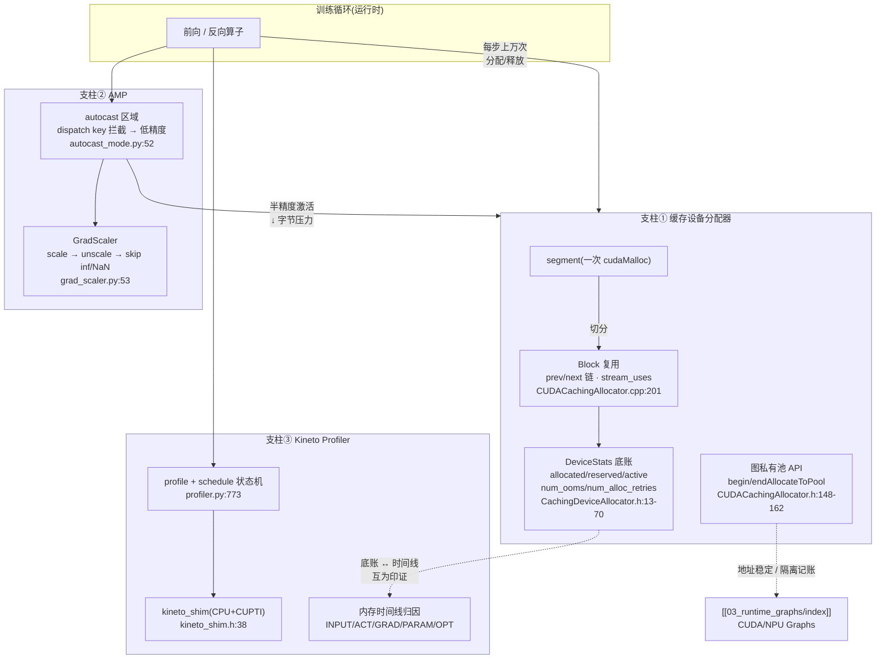

# 07 · 运行时:缓存分配器 / AMP / Profiler — 目录索引

> 层次:overview(浅)
> 核验基准:PyTorch upstream `E:\97-codes\pytorch\pytorch`(v2.13.0a0, commit 9922478)
> 最后更新:2026-07-27

---

## 模块概述

### 是什么

本模块讲的不是「算子怎么算」,而是**算子在运行时被什么托着跑**——三根互相咬合的运行时支柱:

- **缓存设备分配器(Caching Allocator)**——在裸 `cudaMalloc/cudaFree` 之上做一层 **block 复用**的内存池。它把一次性向驱动申请到的大 segment 切成可反复借还的小 block,让训练循环每步成千上万次的张量分配/释放不再每次都打扰驱动。入口结构体在 `c10/cuda/CUDACachingAllocator.h:49`(namespace)与 `:61-84`(`AllocatorState`/`AllocatorConfigInfo`/`SnapshotInfo`);复用的基本单位 `Block` 在 `c10/cuda/CUDACachingAllocator.cpp:201`。
- **AMP(Automatic Mixed Precision)**——在你圈定的 `autocast` 区域里**按算子类别覆盖计算精度**(matmul/conv 走 fp16/bf16,reduction 等保 fp32),再配一个 **`GradScaler`** 在反向时动态放缩损失、跳过 inf/NaN 步,保住 fp16 训练的数值稳定。`autocast` 上下文在 `torch/amp/autocast_mode.py:52`,`GradScaler` 在 `torch/amp/grad_scaler.py:53`。
- **Kineto Profiler**——统一 CPU 与 GPU(CUPTI)的 tracing,把算子时间线、kernel、内存事件汇成一份可在 Chrome/TensorBoard 里看的 trace。用户级上下文 `torch.profiler.profile` 在 `torch/profiler/profiler.py:773`,底层对 libkineto 的薄封装在 `torch/csrc/profiler/kineto_shim.h:38`。

### 为什么放在一起

因为三者在运行时**共享同一笔账、互相咬合**,单独看任何一根都会缺一角:

- **AMP ⇄ 分配器**:autocast 把激活/中间量降到半精度,直接**砍掉分配器的字节压力**——同样的 batch,fp16 下 `reserved_bytes` 往往腰斩,碎片与 OOM 风险随之变化。调 AMP 不看分配器统计,等于盲调。
- **Profiler ⇄ 分配器**:profiler 的内存时间线(把每块 storage 归类为 INPUT/ACTIVATION/GRADIENT/PARAMETER/OPTIMIZER_STATE)其数据底账,正是分配器吐出的 `DeviceStats`(`c10/core/CachingDeviceAllocator.h:13-70`)与逐事件 `TraceEntry`。一边是「分配器底账」,一边是「profiler 时间线」,互为印证。
- **分配器 ⇄ 图捕获**:CUDA/NPU Graphs 重放要求地址稳定,分配器为此提供**图私有内存池**隔离 API(`beginAllocateToPool`/`endAllocateToPool`/`releasePool`,`c10/cuda/CUDACachingAllocator.h:148-162`),并在 `DeviceStats::reserved_bytes_by_private_pools` 里按池单独记账。详见 [[03_runtime_graphs/index]]。

> 配置层的现状(写手提醒):分配器的配置真身已**下沉**到设备无关的 `c10/core/AllocatorConfig.h:162 AcceleratorAllocatorConfig`(`max_split_size`/`use_expandable_segments`/`garbage_collection_threshold` 等都在这里,如 `:212 use_expandable_segments()`);老的 `c10/cuda/CUDAAllocatorConfig.h` 里的同名项现在多是带 `C10_DEPRECATED_MESSAGE` 的**转发壳**。环境变量主名也升级为通用的 **`PYTORCH_ALLOC_CONF`**,旧名 `PYTORCH_CUDA_ALLOC_CONF` 仅作低优先级兼容(`AllocatorConfig.h:157-159`)。读旧资料时务必区分「壳」与「真身」。

### 编译期与运行时的三层内存边界

| 层 | 对象/决策 | 它能回答什么 | 不能直接推出什么 |
|---|---|---|---|
| AOTAutograd boundary | saved tensor、recompute、fw/bw ABI | 哪些activation跨前反向阶段持有 | 单张Inductor图内的buffer reuse |
| Inductor graph | logical value、IR Buffer、Scheduler last-use、wrapper reuse | 哪些中间量realize、何时可free/reuse、静态peak估计 | allocator最终保留多少segment/block |
| runtime allocator | storage、block、segment、stream event | 实际allocated/reserved/active与物理峰值 | 某个FX value为何被save或fusion |

对应主线分别见
[[saved_tensors_recompute_and_runtime_abi_analysis]]与
[[buffer_liveness_memory_planning_and_reuse_analysis]]。排查peak时必须先说
清是哪一层；AOT逻辑saved bytes、Scheduler静态peak和allocator snapshot不能混成同一个数。

### 三支柱全景图

---

## 三支柱速览(各自的「做什么 / 关键机制」)

### ① 缓存设备分配器

| 机制 | 一句话 | 锚点 |
|------|--------|------|
| Block 复用 | 一次 `cudaMalloc` 的 segment 切成 `prev/next` 双链相邻子块,反复借还 | `CUDACachingAllocator.cpp:201`(`is_split()` 在 `:254`) |
| Expandable Segments | 每 stream 一个可增长大 segment,按需 `cuMemMap` 物理页,缓解 batch 抖动碎片 | `CUDACachingAllocator.cpp:296`(`Note [Expandable Segments]`) |
| 跨流安全复用 | `recordStream` 登记 `stream_uses`,释放要等相关流 event 完成才真正归还 | `CUDACachingAllocator.cpp:2526` |
| 可观测性底账 | `DeviceStats`(`memory_stats()` 背身)、`TraceEntry`(快照时间线)、`SegmentInfo`(snapshot) | `CachingDeviceAllocator.h:13-70` / `:116` |
| 图私有池隔离 | 捕获期把分配路由进私有 mempool,保地址稳定、与普通分配隔离 | `CUDACachingAllocator.h:148-162` |

### ② AMP

`autocast` 本质是 **dispatch key 拦截**:进入区域等价于在线程局部状态里把 `Autocast*` key 从 exclude 集合移除,算子据此被路由到低精度类型转换包装(`is_autocast_enabled == 未被 exclude`,`aten/src/ATen/autocast_mode.cpp:11-13`;设备→key 映射在 `aten/src/ATen/autocast_mode.h:174`,注意 **CUDA 用裸 `Autocast`、CPU 用 `AutocastCPU`**)。逐设备默认 dtype(CPU=bf16、CUDA=half)硬编码在 `autocast_mode.cpp:59`。`GradScaler` 则用 `OptState` 状态机保证 `step` 后必 `update`,默认 `init_scale=2**16`、`growth_factor=2.0`、`backoff_factor=0.5`、`growth_interval=2000`(`grad_scaler.py:126-129`),仅当本步无 inf/NaN 才真正 `optimizer.step()`(`_maybe_opt_step`,`grad_scaler.py:363`)。AMP 依赖的 dispatch 机制见 [[01_eager_runtime/02_dispatcher_and_device/index]]。

### ③ Kineto Profiler

`torch.profiler.profile`(`profiler.py:773`)按 `schedule` 在每个 `step()` 切换 NONE/WARMUP/RECORD/RECORD_AND_SAVE 四态周期采样,周期末触发 `on_trace_ready`(典型为 `tensorboard_trace_handler` 或 `export_chrome_trace`)。底层 `kineto_shim.h:38` 把 libkineto/CUPTI 包成薄抽象,`USE_KINETO` 关闭时退化为 Dummy 类型使上层无条件编译。内存时间线把每块 storage 在时间轴上归类为 INPUT/ACTIVATION/GRADIENT/PARAMETER/OPTIMIZER_STATE,数据来源与分配器的 `TraceEntry`/`DeviceStats` 呼应。

---

## 页面列表(按层次)

| 页面 | 层次 | 核心主题 |
|------|------|---------|
| [[19_torch_compile_end_to_end/00_pytorch_graph_series_index]] | **系统主线** | 从 FX/AOT saved activation 进入 Inductor logical buffer、Scheduler last-use、wrapper reuse，并严格区分 runtime allocator 的 physical block/segment |
| [[amp_and_memory_tooling_quickstart]] | **quick start** | autocast + GradScaler 训练循环最小写法、默认参数与排查;`memory_stats()`/`memory_summary()`/`snapshot` 字段语义;`PYTORCH_ALLOC_CONF`(`max_split_size_mb`/`expandable_segments`)开关;`profile` + `schedule` 用法、`export_chrome_trace`/`tensorboard_trace_handler`/`export_memory_timeline` |
| [[caching_allocator_autocast_profiler_analysis]] | deep dive | 源码级:`Block`/`malloc`/`free_block`/`process_events`/`recordStream`、Expandable Segments 设计、`DeviceStats`/`TraceEntry`/`SegmentInfo`、`DeviceCachingAllocator`;autocast 的 TLS exclude 与 weakref cast 缓存、逐设备 dtype;`GradScaler` 的 `_unscale_grads_`/`_amp_update_scale_`;`kineto_shim` 与 `_memory_profiler` 时间线归因 |

---

## 关联域

- [[03_runtime_graphs/index]] — 运行时图捕获:复用本模块分配器的**图私有内存池**(`beginAllocateToPool`/`releasePool`)保证重放地址稳定
- [[01_eager_runtime/02_dispatcher_and_device/index]] — Dispatcher:autocast 正是作为 `Autocast*` **dispatch key** 在分发层拦截算子
- [[01_eager_runtime/01_tensor_and_storage/index]] — `Tensor`/`Storage`/`DataPtr`:分配器交付的内存句柄(`Allocator`/`DataPtr` 抽象)与 storage 是 profiler 内存归因的统计单元
- [[saved_tensors_recompute_and_runtime_abi_analysis]] — AOT saved activation与recompute
- [[buffer_liveness_memory_planning_and_reuse_analysis]] — Inductor logical buffer、last-use、reuse与静态peak
- [[01_ai_frameworks/index]] — 本域总索引

---

## Related Pages

- [[19_torch_compile_end_to_end/00_torch_compile_end_to_end_index]] — 编号化端到端课程：卷 D–E 连接 wrapper、内存、CUDAGraph、观测与性能
- [[amp_and_memory_tooling_quickstart]] — 本模块 quick start(怎么用 / 怎么查 / 怎么验证)
- [[caching_allocator_autocast_profiler_analysis]] — 本模块 deep dive(源码级)
- [[03_runtime_graphs/index]] — CUDA / NPU Graphs(图私有内存池消费方)
- [[01_eager_runtime/02_dispatcher_and_device/index]] — Dispatcher 与 Autocast dispatch key
- [[01_eager_runtime/01_tensor_and_storage/index]] — Tensor / Storage / DataPtr / Allocator 抽象
- [[saved_tensors_recompute_and_runtime_abi_analysis]]
- [[buffer_liveness_memory_planning_and_reuse_analysis]]
