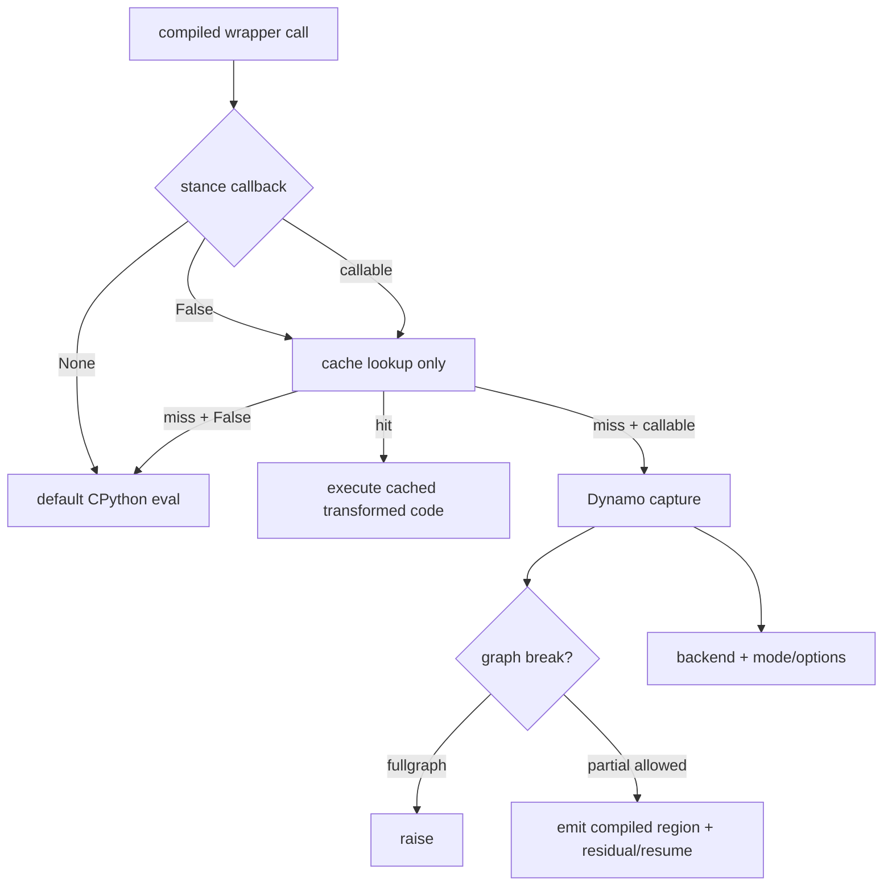

# B02 · Backend、Mode、Options、Stance 与 Fullgraph：五个正交控制面

> 卷别：B · TorchDynamo 捕获  
> 固定源码：PyTorch `e8f97c1a6ef8cbcdd0a946606bc1e924e4f07e52`  
> 前置：[[10_torch_compile_api_and_first_call_lifecycle_analysis]]  
> 后续：[[11_eval_frame_callback_and_code_cache_analysis]]  
> 最后更新：2026-07-30(§13-§14 并入 `torch_compile_source_analysis` 独有的 CompilerBisector 入口钩子、三个 wrapper 类方法级实现与 AOTInductor 变体内容)

## 1. 为什么这些参数经常被混为一谈

它们都出现在“编译”附近，却作用在不同时间和组件：

- backend决定图交给谁；
- mode是后端预设；
- options是后端细粒度配置；
- stance改变当前线程如何使用已有编译和是否允许新编译；
- fullgraph改变 Dynamo遇到 graph break时的合法行为。

**核心结论**：它们不是五档优化强度，而是五个近似正交的控制平面。判断一个行为时，
先问“这个参数由哪层消费、在 lookup/capture/backend/runtime哪个时刻生效”。

## 2. Backend：定义“图的消费者”

普通 backend可以是 registry名字或 callable。Dynamo的契约是：

```python
compiled_callable = backend(gm, example_inputs)
```

`_optimize`的 docstring明确要求 backend接收 `torch.fx.GraphModule`和 example inputs并返回
可调用对象（`torch/_dynamo/eval_frame.py:1759-1772`）。

字符串 backend在 registry中惰性展开，callable则直接保留
（`torch/_dynamo/backends/registry.py:124-142`）。

因此 `backend="eager"`仍可执行 Dynamo捕获；它不是“完全关闭 Dynamo”，而是使用一个不做
native优化的图消费者。

## 3. Mode：后端维护的配置预设

默认 Inductor wrapper把 mode展开成配置项，再叠加用户 options
（`torch/__init__.py:2951-2975`、`torch/__init__.py:2976-2982`）。当前公开语义包括：

| mode | 设计目标 | 代价/边界 |
|---|---|---|
| `default` | 编译开销与性能平衡 | 不承诺最大性能 |
| `reduce-overhead` | 主要借助 CUDA Graph降低 Python/launch overhead | 更多常驻内存；仅适用满足 capture条件的图 |
| `max-autotune` | profile候选并选择实现 | 增加编译时间，GPU默认关联 CUDA Graph |
| `max-autotune-no-cudagraphs` | autotune但不启用 CUDA Graph | 保留普通 launch路径 |

公开说明见 `torch/__init__.py:3192-3210`。mode只是 config bundle，不改变 Dynamo的
`GraphModule + example_inputs → callable`基本接口。

## 4. Options：后端配置 patch，不是通用 Dynamo开关

Inductor wrapper检查配置名和类型，并将有效项存入自己的 `config`
（`torch/__init__.py:2957-2982`）；调用时与 per-graph patches合并后传给
`compile_fx`（`torch/__init__.py:2984-2999`）。

普通自定义 backend wrapper则把非默认 mode和 options作为 kwargs传给 backend
（`torch/__init__.py:3057-3080` 与 `torch/__init__.py:3090-3095`）。

这带来一个重要边界：

- `options`键的语义由 backend定义；
- Inductor options不自动适用于另一个 backend；
- 自定义 backend若不接受 `mode=`/`options=`，调用方就不应传这些参数；
- `guard_filter_fn`虽然从 public options提取，但它是明确标注 unsafe的特殊入口。

## 5. Stance：改变“当前是否编译/复用”的运行策略

`torch.compiler.set_stance`是动态作用域策略，而不是 graph优化 mode。公开 stance包括
`default`、`force_eager`、`eager_on_recompile`、`fail_on_recompile`、
`eager_then_compile`和`aot_eager_then_compile`
（`torch/compiler/__init__.py:426-441`）。

Dynamo在每次 wrapper执行前把原 callback映射为当前 stance：

| stance | callback行为 |
|---|---|
| `default` | 原 callback，必要时 force backend |
| `force_eager` | `None`，完全绕过 Dynamo |
| `eager_on_recompile` | `False`，只运行可命中的 cache，miss则 eager |
| `fail_on_recompile` | miss callback改为抛错 |
| `eager_then_compile` | 延迟首次编译 |
| `aot_eager_then_compile` | 首次走 AOT eager，再延迟编译 |

分支实现在 `torch/_dynamo/eval_frame.py:279-300`。`None`与`False`绝不能混淆：
前者关闭 Dynamo；后者仍查 cache但禁止新编译。

## 6. Fullgraph：graph break策略，不是“整个训练系统一个图”

`fullgraph=True`映射为 Dynamo的 `nopython=True`
（`torch/__init__.py:3369-3377`），后者要求 graph break成为错误
（`torch/_dynamo/eval_frame.py:1771-1778`）。

它保证的是：**对这个被捕获的 Python frame/compiled region，不允许靠 graph break产生
多个部分图继续运行。**

它不保证：

- forward和backward合并为一张图；
- 所有被调用 Python frame都内联为同一 FX graph；
- backend不再分区或生成多个 kernel；
- 没有 runtime wrapper、guards或外部库调用；
- 数据相关控制流自动变成可表达的图控制流。

## 7. `error_on_graph_break`与 fullgraph的差别

源码特别说明：`error_on_graph_break`可以在局部作用域改变 break行为，但不像
`nopython=True`那样保证单一 whole-program graph；当 `nopython=True`时前者不生效
（`torch/_dynamo/eval_frame.py:1772-1778`）。

设计上二者分开，是为了同时支持：

- API级强契约：这次 compile必须完整捕获；
- 调试级局部策略：某个作用域内把 break升级为错误；
- 常规部分捕获：可捕获区编译，不可捕获区继续 Python。

## 8. 五个控制面的组合示例

```text
backend="inductor"
mode="max-autotune-no-cudagraphs"
fullgraph=False
stance="eager_on_recompile"
dynamic=None
```

含义是：

1. 已有匹配 entry时运行 Inductor产物；
2. cache miss时不新编译，而是 eager；
3. 若此前允许编译，Dynamo可产生部分图；
4. Inductor进行 autotune但不使用 CUDA Graph；
5. 自动动态策略只有在真正发生新捕获时才有机会生效。

任何一项都不能从另一项推导出来。

## 9. 状态优先级



## 10. 安全边界

- `skip_guard_eval_unsafe`不是普通性能选项。公开文档明确说明错误假设可能静默地产生错误
  结果（`torch/compiler/__init__.py:444-457`）。
- `guard_filter_fn`会删除保护 compiled artifact适用域的条件，public doc同样标为 unsafe
  （`torch/__init__.py:3228-3235`）。
- `force_eager`适合总开关式降级；`eager_on_recompile`适合保留已预热 artifacts但禁止
  新 specialization。
- fullgraph应当用来建立捕获契约或定位 break，而不是默认当作性能开关。

## 11. 复杂度与性能影响

- backend/mode/options在 wrapper构造时的配置处理大体随 options数量 \(O(P)\)；
- stance判断是每次调用的常数级分支，但 `fail_on_recompile` miss时会收集 guard失败原因；
- fullgraph本身不降低 capture复杂度；它只改变失败路径；
- max-autotune可能把 backend编译成本从一次 codegen放大为多个候选的编译和测量；
- reduce-overhead可能增加常驻内存和 warmup/record成本，以换取 replay overhead下降。

## 12. 常见误解

- **“mode就是 backend。”** mode是 backend内部预设。
- **“eager backend等于没走 Dynamo。”** 它通常仍接收 Dynamo FX graph。
- **“force_eager和eager_on_recompile一样。”** 前者不查 Dynamo cache；后者可复用 cache。
- **“fullgraph会生成一个 kernel。”** graph数量和 kernel数量是不同层的概念。
- **“删除 guards只影响性能。”** 它可能扩大错误 artifact的适用域并损害正确性。

## 13. 源码补充:CompilerBisector 对 backend 的入口级覆盖

> 本节内容原属 P4 知识库整改被删除的旧大文(`04_inductor/torch_compile_source_analysis.md`)。本页 §1-§12 讲 backend/mode/options/stance/fullgraph 五个控制面各自的语义,未覆盖 `compile()` 函数体在构造这些控制面**之前**先做的一次 backend 覆盖,逐字迁入本页。

`compile()` 归一化 `mode`/`options` 之后、提取 `guard_filter_fn`/`use_aoti` 之前,会先问 `CompilerBisector` 是否要求覆盖 backend(`torch/__init__.py:3330-3342`):

```python
from torch._inductor.compiler_bisector import CompilerBisector

if bisect_backend := CompilerBisector.get_backend():
    import torch._inductor.config as inductor_config

    # don't override the backend for use cases like vllm
    # which leverages their custom backend.
    if not (
        inductor_config.test_configs.bisect_keep_custom_backend_for_inductor
        and bisect_backend == "inductor"
        and not isinstance(backend, str)
    ):
        backend = bisect_backend
```

即:若 bisector 处于激活状态(`get_backend()` 返回非空),它可以直接替换用户传入的 `backend` 字符串或 callable——这是一次**API 入口级**的 backend 覆盖,发生在任何 wrapper 类实例化之前。保护条件只有一种情况会拒绝覆盖:用户传入了**非字符串的自定义 backend**(例如 vLLM 的 `VllmBackend`),且 bisector 想切到 `"inductor"`,且配置显式要求保留自定义 backend——这防止 bisector 在第三方框架自带编译后端时错误地把它替换成 Inductor。`CompilerBisector` 自身的二分定位算法(backend 阶梯搜索、subsystem 禁用、pass 级二分)不属于本页范围,见 [[15_minifier_repro_and_compiler_bisector_analysis]] §7。

## 14. 源码补充:三个 wrapper 类的方法级实现与 AOTInductor 变体

> 本节内容原属 P4 知识库整改被删除的旧大文(`04_inductor/torch_compile_source_analysis.md`)。§2「Backend：定义图的消费者」只讲了 backend 的调用契约,未展开三个具体 wrapper 类各自怎样实现这份契约,逐字迁入本页。

### 14.1 `_TorchCompileInductorWrapper`:mode/options 怎样变成 config

`backend="inductor"`(默认)时实例化的 wrapper 把 `mode`/`options` 归一化为一份 `self.config` 字典(`torch/__init__.py:2907-2941`):

- `apply_mode(mode)`:`mode` 非 `"default"` 时,调用 `list_mode_options(mode, self.dynamic)` 把预设展开成一组 options,再委托给 `apply_options`(`torch/__init__.py:2951-2955`);
- `apply_options(options)`:逐项核对 key 是否属于 Inductor 已知配置、并按 `config.get_type` 做类型校验,校验通过才写入 `self.config`(`torch/__init__.py:2957-2982`);
- `__init__` 末尾还会额外 `apply_options(CompilerBisector.get_config_change("inductor"))`,把二分调试期间的临时配置改动叠加进来;
- 若最终 `config` 里 `triton.cudagraphs=True` 且 CUDA < 12.6(或 CUPTI 懒重初始化探测失败),设置 `DISABLE_CUPTI_LAZY_REINIT=1` + `TEARDOWN_CUPTI=0` 环境变量,规避 CUDA Graph 与 CUPTI teardown 的已知崩溃(`torch/__init__.py:2926-2941`);
- `__call__(model_, inputs_, config_patches=...)` 把 `self.config` 与调用期 `config_patches` 合并后传给 `compile_fx`(`torch/__init__.py:2984-2999`);
- `get_compiler_config()` 返回合并后的完整配置快照;`reset()` 在配置了 `triton.cudagraphs` 时重置 CUDAGraph tree(`torch/__init__.py:3001-3013`)。

### 14.2 `_TorchCompileAOTInductorWrapper`:同一入口的另一条打包路径

`use_aoti=True`(从 `options` 中 pop 出的特殊键,`torch/__init__.py:3344-3348`)时,`backend="inductor"` 分支实例化的不是上面的类,而是它的子类(`torch/__init__.py:3016-3054`):

```python
class _TorchCompileAOTInductorWrapper(_TorchCompileInductorWrapper):
    compiler_name = "aotinductor"

    def __init__(self, mode, options, dynamic, name=None):
        super().__init__(mode, options, dynamic, name)
        self.apply_options({"cpp_wrapper": True})
        self.apply_options({"aot_inductor.package": True})

    def __call__(self, model_, inputs_, *, config_patches=None):
        ...
        with V.set_aot_compilation(True), ctx, torch._inductor.config.patch("enable_autograd_for_aot", True):
            return super().__call__(model_, inputs_, config_patches=config_patches)
```

除了复用父类的 `apply_mode`/`apply_options`,它额外强制打开 `cpp_wrapper` 和 `aot_inductor.package`,并在 `__call__` 里用 `V.set_aot_compilation(True)` 包住编译上下文。

> [!note] 已核实:与 [[28_aotinductor_packaging_and_deployment_analysis]] §2-§3 export 驱动路径的关系(2026-07-30,kb-reorg P4 Task 9 随 F07 迁入一并解答原 todo;同日据 spec 复核修正"runner 对称"表述)
> `_TorchCompileAOTInductorWrapper.__call__` 最终仍调用父类的 `compile_fx(...)`(§14.1 `__call__`)——与普通 JIT 编译**是同一个函数入口**;而 F07 §2-§3 的 `aoti_compile_and_package` 底层调用的 `compile_fx_aot`(`torch/_inductor/compile_fx.py:2221`)内部也是调用这同一个 `compile_fx(...)`(`compile_fx.py:2282-2284`)。两条路径在 `compile_fx` 内部汇合于同一段代码:`V.aot_compilation` 为真时,直接返回 `CompiledAOTI(filename=compiled_fn, device_type=graph.device_type)`(`compile_fx.py:1849-1859`)——这正是 `compile_fx_aot` 断言并解包 `.filename` 的同一个 `CompiledAOTI` 类型(`compile_fx.py:2285-2289`)。也就是说**两条路径汇合于同一套 AOT 代码生成/artifact 机制**,产物都是同一个 `CompiledAOTI` 类型。
>
> 但 `CompiledAOTI` 变成"可直接调用对象"这一步**不对称**,不能笼统说两条路径共享同一个已就绪的 C ABI runner。`CompiledAOTI.__post_init__` 只有在 `config.enable_autograd_for_aot` 为真(以及 `link_libtorch`/非 macOS-Windows/非 `package_cpp_only` 等其他门控都通过)时才会构造 `AOTIModelContainerRunner{Cuda,Xpu,Cpu}`(即 [[28_aotinductor_packaging_and_deployment_analysis]] §8 讲的同一个 `model_container_runner.cpp` runner)并装进 `current_callable`;否则直接 `return`,`current_callable` 保持 `None`(`torch/_inductor/output_code.py:1071-1088`)。`enable_autograd_for_aot` 默认 `False`(`torch/_inductor/config.py:1696`),**只有** `_TorchCompileAOTInductorWrapper.__call__` 用 `torch._inductor.config.patch("enable_autograd_for_aot", True)`(本页上方 §14.2 代码样例第 237 行)显式在调用期把它临时改真——因为 use_aoti 这条 JIT 路径必须马上把返回值当 compiled callable 用(`CompiledAOTI.__call__` 直接 `self.current_callable(inputs)`,`current_callable` 为 `None` 时会抛 `RuntimeError`)。plain 的 `aoti_compile_and_package`/`compile_fx_aot` 路径不会打这个 config patch,默认配置下 `current_callable` 就是 `None`——但这条路径本来也不需要它:`compile_fx_aot` 只解包并返回 `.filename`(`compile_fx.py:2285-2289`),从不调用 `CompiledAOTI.__call__`。
>
> 真正的差异因此有三层,不在代码生成本身:
>
> 1. **捕获来源不同**:`use_aoti` 的 `model_/inputs_` 来自 Dynamo 对**当前真实调用**的运行时捕获(普通 `torch.compile` guard/cache 语义仍适用),不是 `torch.export.export()` 产出的、经约束求解的 `ExportedProgram`;F07 §3 要求的 export 前置校验(`example_inputs` 存在性等)这条 JIT 捷径完全不走。
> 2. **产物去向不同**:`use_aoti` 路径里 `CompiledAOTI` 在 `__post_init__` 阶段**同进程内自动加载**并直接充当这次 `torch.compile` 调用的 compiled callable(`output_code.py:1071-1138`),整个过程停在生成 `.so` 这一步,**不调用** `package_aoti` 打包成 `.pt2`;F07 §5-§6 讲的 archive/model-name/多模型打包、§10 的 loader 兼容性检查,这条 JIT 捷径都不经过。
> 3. **runner 构建时机与可调用性不对称**:上述 `enable_autograd_for_aot` 门控意味着只有 use_aoti 路径会在编译当下就把 `.so` 装载成可调用 runner;plain export/package 路径产出的 `CompiledAOTI` 在这一步是"未装载"的空壳,真正的装载发生在**之后**、由消费方通过 `load_pt2`/`aoti_load_package` 显式触发(见 F07 §10),不是同一次 `compile_fx` 调用里就绪的。
>
> 结论:`use_aoti=True` 可以理解为「**复用 AOTInductor 的代码生成机制,把它接到 JIT 编译入口上,并额外用配置门控换来一个立即可调用的 runner,跳过 export 和打包两层**」——是同一套底层机制的另一种触发方式,不是另一套独立实现;但它产出的是进程内即时可用的编译结果,不是 F07 讲的可发布、可跨进程加载的部署工件,两者不能互相替代用于生产打包决策。

### 14.3 `_TorchCompileWrapper`:非 Inductor backend 怎样接收 mode/options

`backend` 不是 `"inductor"` 时使用这个通用包装器(`torch/__init__.py:3057-3096`):

- 通过 `lookup_backend(backend)` 把字符串或 callable 解析为已注册的 backend callable(`compiler_fn`);
- `mode`/`options` 不落到某个 `config` 字典,而是原样塞进 `self.kwargs`,`__call__` 时以 `compiler_fn(model_, inputs_, **self.kwargs)` 透传——这印证了 §4 的结论:**options 的键语义完全由 backend 自己定义**,`_TorchCompileWrapper` 不做任何 Inductor 特定的键名/类型校验;
- `reset()` 只在 `compiler_fn` 自带 `reset` 属性时才转发调用。

## 配套 Demo

本页对应卷级入口 `tools/labs_torch_compile/demo_b_dynamo_capture.py` 的 `backend_modes_fullgraph` 用例。默认以 CUDA 为验收设备：

```powershell
python -B tools\labs_torch_compile\demo_b_dynamo_capture.py `
  --case backend_modes_fullgraph --device cuda `
  --output-dir tools\labs_torch_compile\artifacts\volume_demos\b02
```

先用 `--list --json` 查看用例声明的能力要求。无 CUDA 的机器可把 `--device` 改为 `cpu` 探索设备无关机制；CUDA/Triton/多卡专属用例会返回 `BLOCKED`，且不会执行用例正文。不要把 `BLOCKED` 写成 `PASS`。

重点读取 `summary.json` 与 `backend_modes_fullgraph/result.json`：`status` 区分 `PASS/BLOCKED/FAIL`，`environment` 固化运行环境，`observations` 保存本页机制的实测字段，`artifacts` 指向图代码、日志、trace 或进程证据。`PASS` 只表示该次运行中的断言通过，不外推到其他 PyTorch 版本、shape、dtype 或硬件。

## Related Pages

- [[00_torch_compile_end_to_end_index]]
- [[10_torch_compile_api_and_first_call_lifecycle_analysis]]
- [[11_eval_frame_callback_and_code_cache_analysis]]
- [[15_guards_cache_lookup_and_recompilation_analysis]]
- [[cudagraph_trees_warmup_record_and_replay_analysis]]
- [[19_production_rollout_fallback_and_monitoring_analysis]]
- [[15_minifier_repro_and_compiler_bisector_analysis]] — CompilerBisector 内部的二分定位算法
- [[28_aotinductor_packaging_and_deployment_analysis]] — AOTInductor 的 export 驱动打包路径;与 §14.2 的 `use_aoti` JIT 路径汇合于同一套 `compile_fx`/`CompiledAOTI` 机制,但 runner 是否就绪不对称(`enable_autograd_for_aot` 门控),差异还在捕获来源与是否打包(关系已核实,见 §14.2 note)
