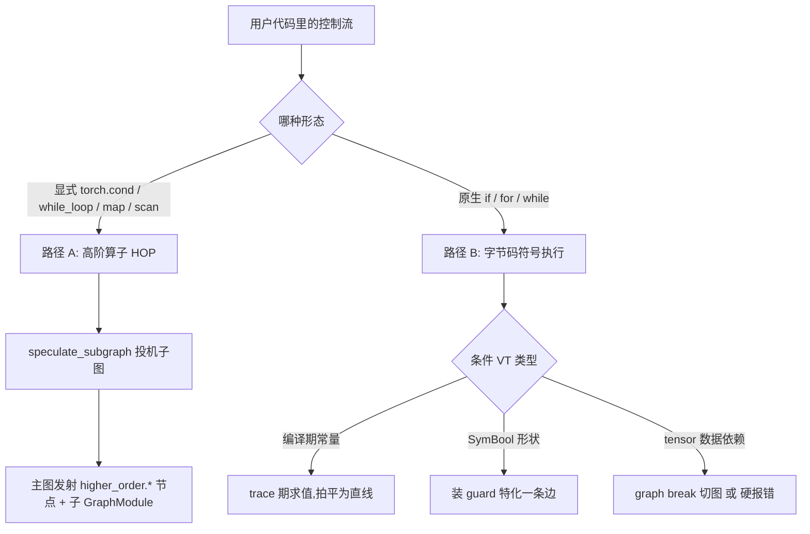
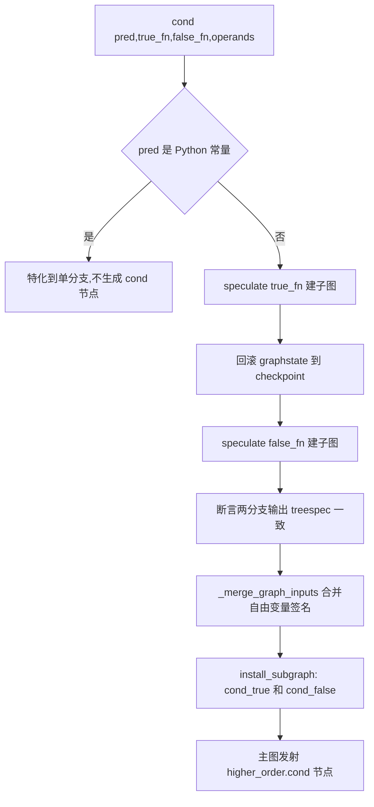
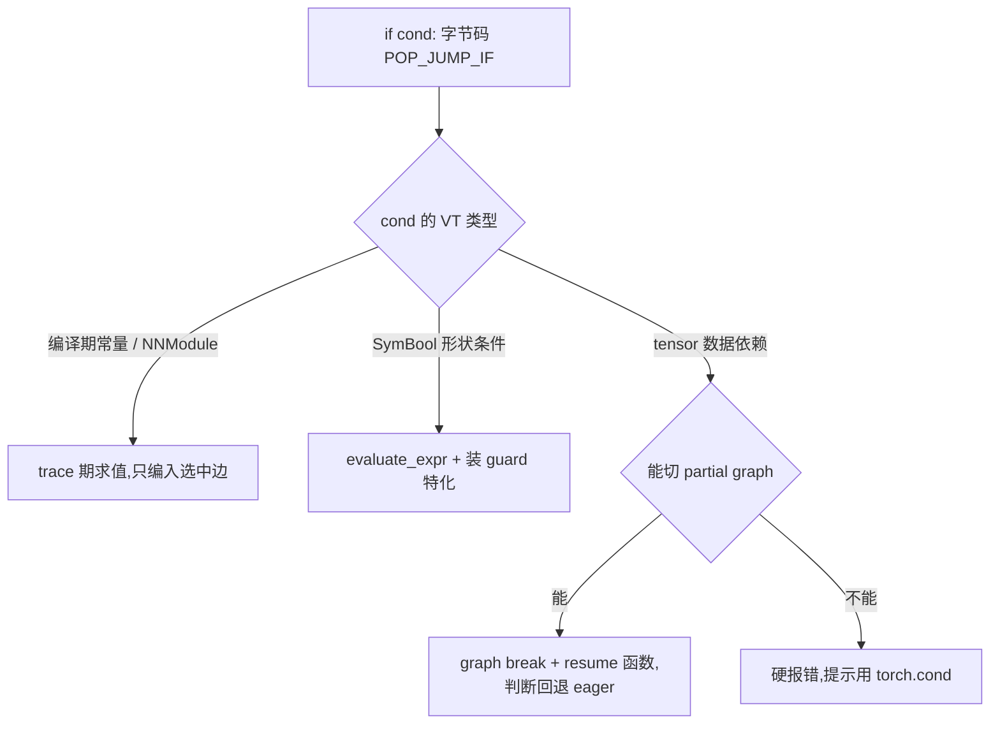

# 控制流捕获 — 两条路径:显式 HOP 投机子图 vs 原生控制流字节码特化

> **Source baseline**: pytorch @ `5f6df46744a`(trunk, 2026-06-29)
> **Dimension**: Deep Dive(mechanism-level)
> 最后更新: 2026-06-30
>
> 本页回答「`torch.compile` 编译流程里控制流是怎么入图的」。结论先行:**控制流不是只有一种处理方式**。Dynamo 走**两条互不相同的路径**——显式高阶算子(`torch.cond` 等)被投机成子图、在主图留一个节点;原生 Python `if/for/while` 则在字节码层被**特化 / 展开 / 切图**,多数情况根本不以控制流形态入图。上游 Dynamo 字节码符号执行见 [[instruction_translator_and_bytecode_state_machine_analysis]],下游分解见 [[02_compile_stack/02_aot_autograd/index]] / [[02_compile_stack/04_inductor/index]]。
>
> **与 [[structured_outputs_higher_order_and_nested_graphs_analysis]] 的划界**（P4 Task 7 组 4
> 判重结论）：本页讲**捕获前端**——Dynamo 如何在字节码符号执行期间决定"这段控制流该不该
> 入图、走哪条路径"（`speculate_subgraph`/`generic_jump`/graph break，均是 `torch/_dynamo/`
> 内部机制）；那一页讲**IR 层结构**——不论控制流是谁捕获的（Dynamo、`make_fx`、
> `torch.export` 均可能触发），outer/child GraphModule 的 ownership、pytree、DCE 递归
> 边界怎样表达（`torch/_higher_order_ops/`、`torch/fx/` 机制）。两页在 `torch.cond` 的
> `FakeTensorMode`/`ProxyTorchDispatchMode` dispatch 细节上有小段重叠，已在 §2.4 收缩为
> 互指，其余内容互不重复。

---

## 1. 概览

**一条主线**:Dynamo 对「控制流」有两套机制,分界线是**条件是否数据依赖、以及用户是否显式调用了控制流算子**:

- **路径 A — 显式高阶算子(HigherOrderOperator, HOP)**:用户写 `torch.cond / torch.while_loop / map / scan / ...`。Dynamo 把每个分支/循环体**投机(speculate)成一张独立 FX 子图**,主图里只留一个 `torch.ops.higher_order.*` 调用节点。控制流**真正编进图**,且**不允许 graph break**。
- **路径 B — 原生 Python `if/for/while`**:在字节码解释器里按**条件的 `VariableTracker` 类型**决定结局——编译期常量→拍平成直线;符号形状(SymBool)→装 guard 特化走一条边;数据依赖(tensor 值)→graph break 切图,或在 `fullgraph` 下硬报错。**控制流多数情况没入图**。

两条路径的交界点很关键:**Dynamo 不会自动把 `if x.sum()>0` 改写成 `torch.cond`**;命中数据依赖分支时它要么切图、要么报错并提示你手写 `torch.cond`(`torch/_dynamo/symbolic_convert.py:769`)。

| 概念 | 路径 | 锚点 | 一句话 |
|------|------|------|--------|
| HOP 投机子图 | A | `torch/_dynamo/variables/higher_order_ops.py:2004` `speculate_subgraph` | 子图捕获的统一引擎 |
| `CondHigherOrderVariable` | A | `higher_order_ops.py:2376` | `torch.cond` 入图 |
| `_merge_graph_inputs` | A | `higher_order_ops.py:1287` | 多分支自由变量签名对齐 |
| `generic_jump` | B | `torch/_dynamo/symbolic_convert.py:714` | 原生 `if` 的字节码处理 |
| `FOR_ITER` | B | `symbolic_convert.py:2485` | 原生 `for` 的循环展开 |
| 下游 dispatch | — | `torch/_higher_order_ops/cond.py:47` / `torch/_inductor/ir.py:10700` | HOP 在 Fake/Proxy/functionalize/Inductor 的处理 |

**Quick start(怎么触发 + 从哪读起)**:
- 想让分支**进图而非切图**,显式用 `torch.cond(pred, true_fn, false_fn, operands)`,且 `pred` 用 bool 张量 / `SymBool`(用 Python 常量会被特化掉,见下)。
- 想看捕获结果:`torch._dynamo.explain(fn)(*args)` 或 `TORCH_LOGS=graph_breaks`(见 [[dynamo_quickstart]])。
- 读源码从 `CondHigherOrderVariable._call_function`(`higher_order_ops.py:2382`)进,核心引擎是 `speculate_subgraph`(`:2004`);原生控制流从 `generic_jump`(`symbolic_convert.py:714`)进。

---

## 2. 路径 A:显式高阶控制流算子(HOP)

### 2.1 统一机制:`speculate_subgraph` 四步

所有控制流 HOP 共用一台引擎 `speculate_subgraph`(`torch/_dynamo/variables/higher_order_ops.py:2004`)。对每个分支/循环体函数 `f`,它做四件事:

1. **开子 tracer 建独立子图**:`tx.output.subtracer(...)`(`:2073`)新开一张 FX subgraph;`get_hop_args`(`:2074`)用 `set_subgraph_inputs="automatic"` 把 `operands` 设成子图 placeholder。
2. **内联函数体**:`trace_hop_function`(`:2078`)把 `f` 的函数体符号执行进这张子图。
3. **闭包自由变量 lifting**:`f` 引用到的外层张量(freevar)被 `maybe_lift_tracked_freevar_to_input`(`:2154`)提升成子图的额外输入,记进 `subtracer.lifted_freevars`,最后 `move_lifted_freevars_phs_to_end`(`:2168`,见注释 `:1387-1399`)把这些 lifted placeholder 重排到参数末尾——保证 placeholder 顺序确定。
4. **收尾**:flatten 输出成 tuple 并记 `treespec`(`:2091-2103`);建 `output` 节点 + `graph.lint()`(`:2157-2164`);`check_aliasing_and_input_mutation`(`:2169`)校验该 HOP 是否允许输入突变/别名。

> **不变量**:子图始终**封闭**——所有外部依赖要么是显式 `operands`,要么被 lift 成显式输入。主图永远只看到「一个 HOP 节点 + 几个 `get_attr` 引用的子 `GraphModule`」,看不到分支体内部。这正是控制流能被下游 AOTAutograd/Inductor 当成一个普通算子处理的前提。

### 2.2 cond 深挖

`CondHigherOrderVariable._call_function`(`higher_order_ops.py:2382`)是 `torch.cond` 的入图逻辑。

**① 常量谓词特化(关键短路)**:若 `pred` 是 Python 常量(`type(args[0]) is ConstantVariable`,`:2419`),Dynamo **直接选定一条分支、根本不生成 `cond` 节点**,并 warn 提示「想保留两条分支请把谓词做成 bool 张量 / `SymBool`」(`:2420-2428`)。否则校验 `pred ∈ {Constant, Tensor, SymNode}`(`:2431`)、`operands` 是只含 tensor/constant/symnode 叶子的 list/tuple(`:2447-2469`)、两分支可调用(`:2472-2473`)。

**② 投机两分支 + checkpoint/rollback**:策略写在源码注释(`:2475-2486`)——*checkpoint 当前 graphstate → 跑 true 分支 → 回滚到 checkpoint → 跑 false 分支 → 合并*(合并其实主要是「断言两个 graphstate 必须一致」)。`speculate_branch`(`:2488`)对 `ix=1/2` 各调一次 `speculate_subgraph`(`:2500`);每跑完一个分支 `tx.fake_mode.epoch += 1`(`:2519`),避免 unbacked symbol 跨子图被错误 memoize。

**③ 合并签名**:两分支 lift 的自由变量集合可能不同,`_merge_graph_inputs`(`:1287`、由 `:2569` 调用)把它们对齐成统一签名 `shared + unique_true + unique_false`——共享 freevar(去重 `get_attr`)放前面,各分支独有的加 `_true_branch`/`_false_branch` 后缀(举例见注释 `:1336-1346`),使两个子图 placeholder 签名完全一致。

**④ 一致性断言**:`true_spec.treespec == false_spec.treespec`,不同直接 `differing branch outputs` 报错(`:2555-2567`);分支返回值只能是张量或 int 常量(`:2521-2541`)。

**⑤ 发射节点**:`install_subgraph` 把两子图注册为 `cond_true`/`cond_false` 的 `GraphModule`(`:2575-2582`),用 `make_attr` 生成 `get_attr` proxy 引用(`:2210`);组装 `p_args = (pred, get_attr(cond_true), get_attr(cond_false), tuple(shared+unique_true+unique_false))`(`:2587-2592`),由 `_call_function_and_unflatten_output`(`:399`、`:2594`)在主图建 `call_function` 节点(target=`torch.ops.higher_order.cond`)并按 treespec unflatten 回去让外层继续 trace。

**关键不变量 / 代价**:
- **禁 side-effect**:分支内不允许副作用,否则路径爆炸(注释 `:2482-2486`)。
- **禁输入突变 / 别名**:`supports_input_mutation/aliasing` 仅在 `not torch.is_grad_enabled()` 时放开(`:2390-2391`),由 `check_aliasing_and_input_mutation`(`:2169`)强制。
- **禁 graph break(硬约束)**:`_ALLOW_FALLBACK_TO_EAGER = False`(`:2378`)。子图里出现 Dynamo 不支持的东西,会被 `wrapped_call_function`(`:2240-2267`)转成 `UncapturedHigherOrderOpError` **硬报错**,而不是切图回退 eager。这是「HOP 要么完整捕获、要么报错」的根因。

### 2.3 控制流 HOP 家族

同一套 `speculate_subgraph` 机制服务于整个控制流算子族(`higher_order_ops.py`):

| 算子 | VariableTracker | 子图结构 | 验证锚点 |
|------|----------------|---------|---------|
| `torch.cond` | `CondHigherOrderVariable`(`:2376`) | `true_fn` / `false_fn` 两张子图 | 投机 `:2500`,install `:2575-2582` |
| `torch.switch` | `SwitchHigherOrderVariable`(`:2605`) | N 个分支子图(按 index 选) | 投机 `:2723`,install `:2803` |
| `torch.while_loop` | `WhileLoopHigherOrderVariable`(`:2900`) | `cond_fn` + `body_fn` 两张子图 | 投机 `:854`/`:929`,merge names `["cond_fn","body_fn"]` `:966`,install `:985-986` |
| `map`(`map_impl`) | `MapHigherOrderVariable`(`:3491`) | `body_fn` 子图,沿首维映射 | 投机 `:3564` |
| `scan` | `ScanHigherOrderVariable`(`:3182`) | `combine_fn` 子图,携带 carry | 投机 `:3333` |
| `associative_scan` | `AssociativeScanHigherOrderVariable`(`:2939`) | `combine_fn` 子图(结合律) | 投机 `:3051` |

> `while_loop` 还有两个小细节:`cond_fn` 必须返回标量 bool(`:902-904`);若 `cond_fn` 返回常量则短路/报无限循环(`:910-916`)。`WhileLoopStackOutputHigherOrderVariable`(`:2920`)是 stack-output 变体,与前者共用 `_call_while_loop`(`:744`)。
>
> 注:`higher_order_ops.py` 里还有一大批 `*HigherOrderVariable`(`wrap` / `checkpoint` / `autocast` / `flex_attention` / `auto_functionalized` …)——那些是**作用域/副作用包装器或融合 kernel**,不属于控制流,别混进来。

### 2.4 下游:HOP 在编译后端的处理

Dynamo 发射的 `torch.ops.higher_order.cond` 是个 `HigherOrderOperator`(`torch/_higher_order_ops/cond.py:47` `class CondOp`),按 dispatch key 注册多份实现,后续编译阶段按需命中:

- **`FakeTensorMode`**（`cond.py:408`，逐分支 fake 执行、`_merge_output` 合并输出、拒绝
  TreeSpec 不一致）与 **`ProxyTorchDispatchMode`**（`cond.py:403` → `trace_cond`，AOTAutograd
  再次 trace 时把子图重新记成 proxy 上的 cond 节点，child 注册为 outer tracer root 的
  `GraphModule` 属性、不产生跨图 Node 边）这两条 dispatch 路径本页不再展开——它们是
  `cond` 算子自身的捕获/推断机制，与本页 §2.1-§2.2 讨论的 **Dynamo 侧** `speculate_subgraph`
  是两层不同的实现，完整源码跟读见
  [[structured_outputs_higher_order_and_nested_graphs_analysis]] §6 与其"源码跟读"§1-§3
  （`trace_cond` 的 `reenter_make_fx`/`register_module`、FakeTensor merge 的 TreeSpec/metadata
  校验，locator 一致）。
- **`py_functionalize_impl`**(`cond.py:710`):对两分支做函数化;cond 默认不允许输入突变(除非走 `auto_functionalize`,`:721`)。
- **Inductor**:`torch/_inductor/ir.py:10700` `class Conditional(ExternKernel)` 是 cond 的 IR 节点,codegen 出 host 端真实 if/else(按 `pred` 选择执行哪张子 kernel),输出用 `MultiOutput`;编译后的 cond 不支持输出别名(`ir.py:10834`)。

一句话:**子图全程保持封闭,控制流被当成一个普通算子在 Fake→Proxy→functionalize→Inductor 链路上逐级 lower。**

### 2.5 关键澄清:trace 两支 / 编译两支 / 运行只跑一支(编译期 vs 运行期)

这一环最容易混——「Dynamo 捕获条件、建两支子图、按需调用」这个直觉**方向对、但把分属三个阶段的事压成了一句**。三个常见误解逐一拆开:

**误解一「Dynamo 在 trace 期判断条件走哪支」——否。** Dynamo 把 `pred` 作为**符号 proxy 接到 cond 节点的第一个参数**(`higher_order_ops.py:2588` `pred.as_proxy()`),pred 的真实值留到**运行时**才知道。这正是 `cond` 与原生 `if` 的本质分野:原生 `if` 碰到 `SymBool` 会 `evaluate_expr` + 装 guard **特化**走一条边、trace 期就定死(见 §3 路径 B 第 2 点);`torch.cond` 故意**不特化、两支都留**。反过来,若 `pred` 是 Python 常量,cond 反而退化成特化、**根本不生成节点**(`:2419-2428`)。所以「捕获条件」= 把 pred 连成 cond 节点的运行时输入,**不是 trace 期选分支**。

**误解二「Dynamo 编译两个子图」——「编译」和「两个独立图」都不准确。**
- **trace ≠ compile**:Dynamo 是图捕获前端,只产 FX IR、不生成 kernel。它确实 **trace 出两张 FX 子图**(`cond_true` / `cond_false` 两个 `GraphModule`),但用 `install_subgraph` 挂成**同一张父图的嵌套子模块**(`:2575-2582`),父图里只有**一个** `higher_order.cond` 节点用 `get_attr` 引用它们。
- **Dynamo 产出是 1 张图,不是 2 张**:整段是**一个可 fullgraph 的编译单元、没有 graph break**。真正把两支编译成 kernel 的是下游 **Inductor**:`Conditional` IR(`ir.py:10700`)在**一次编译**里给两支各 codegen 一段 sub-kernel,外包 host if/else。

**误解三「按 pred 调用子图是 Dynamo 做的」——是 cond 算子的 lowering 在运行期做的。** 编译期两支并存挂在节点上、不做任何选择;运行期由 cond 实现按 pred 二选一——dense 实现 `cond_op_dense`(`cond.py:310-313`)就是字面的 `if pred: return true_fn(*operands) else: return false_fn(*operands)`,Inductor 则是 host 端 if/else 只跳进一支。

**一句话精确版**:**Dynamo「trace」两支并打包进一张父图 → Inductor「编译」两支(一次编译产两段代码)→ 运行期按 pred「只跑」一支。** 三件事分属捕获 / 编译 / 运行三个阶段,别合并成「Dynamo 按执行需要编译/调用子图」。

把 `torch.cond` 和数据依赖 `if` 触发的 graph break 并排看,差异最清楚——两者都「两支都有代码」,但图的数量、编译单元、选择主体完全不同:

| 维度 | `torch.cond`(路径 A) | 数据依赖 `if` → graph break(路径 B) |
|------|---------------------|----------------------------------|
| Dynamo 产出图数 | **1 张父图**(内含 2 个嵌套子图) | **2+ 张独立图**(prefix + 两个 resume) |
| 编译单元 | 一个,两支都在里面 | 多个,运行时走到哪支才懒编译哪支 |
| 两支是否都生成代码 | 是(**一次**编译产两段) | 是(但各自**独立**编译单元) |
| 分支选择主体/时机 | cond 算子 lowering,**运行期** host if/else | Python eager,**运行期**裸 `if` |
| graph break | 无(`_ALLOW_FALLBACK_TO_EAGER=False`,`:2378`) | 有 |
| 谓词在图里的形态 | cond 节点的运行时输入(proxy) | 不入图(切点处回退 eager 判断) |

> 由此也能反推 cond 的**动机**:当分支条件数据依赖、又想要**单图、无 graph break、可 export/AOT** 时,裸 `if` 只会切图或报错(路径 B),只有 `torch.cond` 能把两支都封进一张图、把判断推迟到运行期。代价是两支都得编译、且分支体内禁副作用/输入突变(§2.2 不变量)。

---

## 3. 路径 B:原生 Python `if/for/while`

原生控制流在字节码解释器 `torch/_dynamo/symbolic_convert.py` 里处理:`if` 走 `generic_jump`(`:714`,绑定到 `POP_JUMP_IF_*` 系列指令),`for` 走 `FOR_ITER`(`:2485`)。**关键在于:多数情况控制流被「特化 / 展开 / 切图」掉,不以控制流形态进图。**

`generic_jump.inner`(`:845`)按弹出值 `value` 的类型分流:

1. **编译期可定(常量)**(`value.is_python_constant()`,`:927`):truth 在 trace 期就求出,直接选一条边继续(`:933-936`)→ 图里没有分支,只剩被选中路径的算子。NNModule 判空(`:939`)、常量 source(`:999`)同理。**控制流被拍平成直线。**

2. **符号形状条件(SymBool)**(`SymNodeVariable`,`:966`):`evaluate_expr` / `guard_bool(sym_num != 0)`(`:973-976`)**装一条 guard 再特化**走一条边 → 图里也没有分支,但条件变了会 guard 失败触发重编译。**这是「形状依赖的 `if`」能进单图的原因——本质是特化,不是把两条分支都编进图。**

3. **数据依赖(tensor 值,如 `if x.sum()>0`)**(`:937`):
   - **能切图** → `jump_graph_break`(`:778`):`compile_subgraph` 把当前 partial graph 编译掉(`:810`),再用 `create_call_resume_at`(`:819`、`:827`)给 `if` 的两个目标各生成 resume 函数,在输出字节码里塞回真正的条件跳转(`:836-843`)——**真正的分支判断回退到 Python eager 在运行时做**,两条路径各自是独立编译图。**控制流没入图,而是切图。**
   - **不能切图**(如 `fullgraph=True`)→ `unimplemented` 抛「Data-dependent branching」硬报错,hint 明确写 `Use torch.cond to express dynamic control flow`(`:769-776`)。
   - 用户对象非常量 `__bool__`(`:959`)、循环回边上的 data-dependent 中断(`:799` `raise_loop_graph_break`)也归此类。

4. **循环 `for`/`while`**:`FOR_ITER`(`:2485`)每轮 `it.next_variable(self)` 取一个元素压栈、内联执行循环体(`:2493-2495`)——即**对可静态确定的迭代器做循环展开(unroll)**,展开后的算子直接进主图、没有循环节点;`StopIteration` 时 `self.jump` 结束循环(`:2496-2513`)。data-dependent 的 `while` 条件则落到 `generic_jump` → 切图,或要求改用 `torch.while_loop`。

> **代价**:展开 + 切图意味着**循环体越大、数据依赖分支越多,图越碎 / 字节码越膨胀**,且 data-dependent 分支判断的开销回到 eager。要单图捕获动态控制流,只能改写成路径 A 的 HOP。

---

## 4. 两条路径的交界与选型

| 控制流写法 | 走哪条 | 结果 | 何时用 |
|-----------|--------|------|--------|
| `if <python 常量>:` | B | trace 期拍平成直线 | 配置开关、超参分支 |
| `if <形状表达式>:`(SymBool) | B | 装 guard 特化,失败重编译 | 形状依赖、分桶可接受 |
| `if <tensor 值>:` | B | graph break 切图 / `fullgraph` 报错 | 不得已;尽量避免或改写 |
| `for x in <静态迭代器>:` | B | 循环展开内联 | 固定层数/步数 |
| `torch.cond(pred, ...)` | A | 单图内一个 cond 节点 | 要单图捕获数据依赖分支 |
| `torch.while_loop / map / scan` | A | 单图内一个 HOP 节点 | 要单图捕获数据依赖循环/扫描 |

**最易踩的纠正(源码 > 直觉)**:很多人以为 Dynamo 会把数据依赖的 `if` 自动转成 `cond`——**不会**。源码里数据依赖分支只有「切图」或「报错提示手写 `torch.cond`」两条出路(`symbolic_convert.py:769`、`:937`)。路径 A 和路径 B 之间没有自动桥接,改写是用户的责任。

---

## Related Pages

- [[eval_frame_callback_and_code_cache_analysis]] — 上游:帧评估与 code cache(本页是其后续「控制流」专题展开)
- [[instruction_translator_and_bytecode_state_machine_analysis]] — 上游:字节码符号执行状态机
- [[guards_cache_lookup_and_recompilation_analysis]] — 上游:Guard 与重编译
- [[dynamo_quickstart]] — `explain` / `graph_breaks` 日志 / `fullgraph` 等定位手段
- [[02_compile_stack/01_dynamo/index]] — Dynamo 图捕获域索引
- [[02_compile_stack/02_aot_autograd/index]] — 下游:HOP 子图的前/反向分解
- [[02_compile_stack/04_inductor/index]] — 下游:`Conditional` IR 与控制流 codegen
- [[04_export_and_distributed/01_fx_export_extensibility/index]] — 对比:`torch.export` 如何用控制流算子消除 Python 控制流;`symbolic_trace` 为何不支持数据依赖控制流
- [[structured_outputs_higher_order_and_nested_graphs_analysis]] — IR 层的 HOP/nested graph ownership、pytree 与 DCE 递归边界(与本页的划界见页头)
