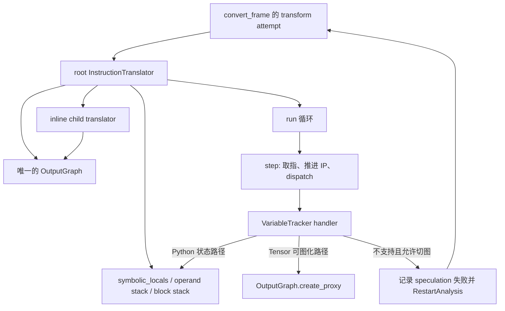

# B04 · InstructionTranslator 与字节码符号执行状态机

> 卷别：B · TorchDynamo 捕获  
> 固定源码：PyTorch `e8f97c1a6ef8cbcdd0a946606bc1e924e4f07e52`  
> 前置：[[eval_frame_callback_and_code_cache_analysis]]  
> 后续：[[variable_tracker_source_and_python_object_model_analysis]]  
> 最后更新：2026-07-30(§14 并入 A03 独有的 bytecode_transformation 重组内容；补 §14.4「不变量与失败边界」7 条,此前漏迁,勿与本页 §11 同名小节混淆——后者讲符号执行状态机的不变量)

## 1. 为什么 Dynamo要解释 Python bytecode

直接运行原 Python函数并记录 Tensor op，只能看见“这一次实际执行了哪些算子”，却很难：

- 在执行前建立 Python变量与输入来源之间的 guards；
- 安全地处理 graph break和恢复栈/locals；
- 改写控制流以调用 compiled subgraph；
- 对 Python对象操作进行特化、内联或回退；
- 在不真实执行 Tensor计算的情况下传播 fake/proxy值。

所以 Dynamo建立了一个抽象解释器：按 CPython bytecode推进，但 operand stack和locals中保存
`VariableTracker`，Tensor计算则写入 FX graph。

**核心结论**：InstructionTranslator不是 FX interpreter；它解释的是 Python bytecode，
FX graph只是符号执行过程中累积的一个输出。

## 2. 状态机保存了什么

`InstructionTranslatorBase`的关键状态包括：

- `symbolic_locals`、`symbolic_globals`；
- `stack: list[VariableTracker]`；
- `instruction_pointer`与当前 instruction；
- `block_stack`；
- exception stack；
- inline parent/child关系；
- speculation checkpoint；
- 唯一共享的 `OutputGraph`。

字段定义见 `torch/_dynamo/symbolic_convert.py:1458-1483`。

构造时还保存输入 instructions、code options、真实 locals/globals/builtins、原 code object和
closure（`torch/_dynamo/symbolic_convert.py:5410-5432`）。

## 3. 根 translator和内联 translator的所有权

一个根 Python frame对应一个 root `InstructionTranslator`和一个 `OutputGraph`。被允许内联的
Python调用可创建 child translator，但继续写入根 OutputGraph。OutputGraph的类注释明确：
它与正在处理的 frame 1:1，内联 translator共享根输出
（`torch/_dynamo/output_graph.py:741-750`）。

这带来三层身份：

| 身份 | 负责 |
|---|---|
| root translator | 最终 transformed bytecode、根 locals/stack |
| inline translator | 被内联 Python调用的字节码状态 |
| OutputGraph/SubgraphTracer | FX nodes、inputs、guards、side effects、backend调用 |

“内联了 Python函数”不等于 FX graph里存在 `call_module`；其 body可能直接展开为算子 nodes。

## 4. 初始化如何连接 OutputGraph

根 `InstructionTranslator.__init__`创建 `OutputGraph`，把 compiler callback、frame state、
scope、原 code和 mode stack传入；然后把 OutputGraph交给基类
（`torch/_dynamo/symbolic_convert.py:5510-5539` 和
`torch/_dynamo/symbolic_convert.py:5540-5567`）。

因此 translator从一开始就同时拥有两套输出通道：

1. graph通道：Tensor/可图化操作写入 FX；
2. bytecode通道：调用 compiled region、恢复 Python状态、继续 eager。

## 5. `run → step → opcode handler`

`run()`压入当前 translator上下文，然后循环 `while self.step(): pass`
（`torch/_dynamo/symbolic_convert.py:2060-2069`）。

每个 `step()`：

1. 读取当前 instruction并推进 IP；
2. 更新源码行和 tracing位置；
3. 必要时检查一个 partial graph的 speculation结果；
4. 记录 bytecode日志；
5. 分派到对应 opcode handler。

前半段见 `torch/_dynamo/symbolic_convert.py:1673-1698`。

BytecodeDispatchTable metaclass让不同 Python版本的 opcodes映射到 handler方法。operand
stack的 push/pop效果必须与 CPython语义一致，否则 graph break后无法正确恢复。

## 6. 一个算子表达式如何经过状态机

以近似的 `y = torch.sin(x)`为例：

```text
LOAD_GLOBAL torch
  → Global/Module VariableTracker
LOAD_ATTR sin
  → callable VariableTracker
LOAD_FAST x
  → TensorVariable(Source=LocalSource("x"))
CALL
  → VariableTracker.call_function
  → OutputGraph.create_proxy("call_function", aten.sin, ...)
  → TensorVariable(proxy=<fx.Proxy>, example_value=<FakeTensor>)
STORE_FAST y
  → symbolic_locals["y"] = result tracker
```

状态机同时维护：

- Python值类别；
- 这个值从哪里来；
- 对应 FX proxy；
- fake example value；
- 为这次特化产生的 guards；
- 若无法图化，怎样还原成 Python bytecode。

## 7. Speculation为什么需要“失败后重启”

遇到可能不支持的 bytecode时，Dynamo不能在已经修改图、stack和side effects之后简单继续。
`break_graph_if_unsupported`先创建 speculation checkpoint，handler失败时：

1. 记录 graph-break reason；
2. 标记 speculation失败；
3. 抛出 restart-analysis；
4. 从 checkpoint按已知 break路径重新跑。

装饰器的 checkpoint/异常处理见 `torch/_dynamo/symbolic_convert.py:1081-1103`；
失败转为 restart见 `torch/_dynamo/symbolic_convert.py:1133-1148`。

外层 `transform_code_object`处于 attempt循环，捕获 `RestartAnalysis`后清理失败 graph并重试
（`torch/_dynamo/convert_frame.py:1592-1612`、
`torch/_dynamo/convert_frame.py:1613-1623`）。

设计原因是正确性：第一次尝试中的局部修改不能泄漏到重新选择的捕获路径。

## 8. Graph break不是“暂停解释器”

允许 partial graph时，translator会：

- 结束当前 FX subgraph；
- 生成调用 compiled subgraph的 bytecode；
- 重建当前 stack、locals、block/context状态；
- 生成/查找 resume code object；
- 让不支持的操作在 Python中执行；
- 在后续 resume frame上再次进入 Dynamo。

所以 graph break是一次程序变换，而不是在原 frame内临时暂停 FX recording。

## 9. Transformed code怎样形成

translator运行结束后，`OutputGraph.output_instructions`替换原 instruction列表，随后：

- 更新 code options；
- 传播 exception-table信息；
- 校验 exception-table；
- 删除死 bytecode和无意义跳转。

见 `torch/_dynamo/convert_frame.py:967-980`。

这一步的“dead code”是字节码控制流层的不可达/无用指令，不是 FX graph DCE，也不是
AOTAutograd保存激活的生命周期。

## 10. 源码跟读：一个 frame 怎样变成图与新字节码

这一节按实际控制流阅读，不按类名罗列。先把对象所有权画清楚：



### 10.1 根对象不是“先建 FX 图、再解释字节码”

`InstructionTranslator.__init__`在调用基类时内联创建 `OutputGraph`，并同时传入原始
instructions、真实 locals/globals、closure、frame state 与 compiler callback
（`torch/_dynamo/symbolic_convert.py:5510-5539`、
`torch/_dynamo/symbolic_convert.py:5540-5567`）。因此真实顺序是：

1. 为当前 frame 建立符号解释状态；
2. 把同一个 `OutputGraph`作为所有可图化操作的汇点；
3. 逐条解释 bytecode，只有走到需要代理 Tensor 计算的 handler 才创建 FX node；
4. 同时生成恢复 Python 状态所需的新 bytecode。

这解释了为什么一个 bytecode 不一定对应一个 FX node：`LOAD_FAST`只从
`symbolic_locals`取出 `VariableTracker`并压栈
（`torch/_dynamo/symbolic_convert.py:2173-2180`），`STORE_FAST`只是弹栈并更新符号
locals（`torch/_dynamo/symbolic_convert.py:2220-2224`）。它们影响后续图节点的参数和
Source，却不是 Tensor 算子。

### 10.2 `run`只负责生命周期，`step`才是状态迁移

`run`进入 translator 上下文、把自己压入 `OutputGraph`的 translator 栈，然后执行
`while self.step()`（`torch/_dynamo/symbolic_convert.py:2060-2068`）。单次 `step`先读取
`instructions[ip]`并立即把 IP 推到下一条；再同步源码位置，并在空 operand stack 的安全点
检查 partial graph speculation（`torch/_dynamo/symbolic_convert.py:1673-1698`）。

随后它更新 block stack，并用 `dispatch_table[inst.opcode]`调用版本对应的 handler；
`ReturnValueOp`/`YieldValueOp`结束循环，观察到的 Python 异常进入符号异常处理
（`torch/_dynamo/symbolic_convert.py:1717-1728`）。所以这里的“状态机”不是比喻：

\[
(\mathrm{IP},\ stack,\ locals,\ blocks,\ exceptions,\ output)
\xrightarrow{\mathrm{opcode}}
(\mathrm{IP}',\ stack',\ locals',\ blocks',\ exceptions',\ output')
\]

### 10.3 以 `CALL`为例看栈协议怎样落到图

`CALL`本身只委托 `_call`。`_call`按照对应 CPython 版本的栈约定弹出 callable、位置参数和
关键字参数（`torch/_dynamo/symbolic_convert.py:4651-4679`），重建
`args/kwargs`后调用 translator 的 `call_function`
（`torch/_dynamo/symbolic_convert.py:4687-4713`）。

`call_function`先断言 callable 和所有实参都已是 `VariableTracker`
（`torch/_dynamo/symbolic_convert.py:1584-1603`）。之后是多态分派：

- Python 常量/容器 tracker可在符号层直接求值；
- 可内联的用户函数创建 child translator，但继续写根 `OutputGraph`；
- Tensor/torch callable tracker才会把代理实参交给当前 tracer；
- 不支持路径抛出 `Unsupported`，由 `CALL`外层的
  `break_graph_if_unsupported`决定 graph break 或硬失败。

真正的 FX 写入边界是 `OutputGraph.create_proxy → current_tracer.create_proxy`
（`torch/_dynamo/output_graph.py:1458-1462`）。因此不能把 `_call`等同于“创建
`call_function` node”：是否建 node由被调 `VariableTracker`的语义决定。

### 10.4 restart为什么必须回到 frame 级 attempt

装饰器先建立 speculation；handler第一次抛出 `Unsupported`时只记录 break reason，最后
调用 `fail_and_restart_analysis`
（`torch/_dynamo/symbolic_convert.py:1089-1103`、
`torch/_dynamo/symbolic_convert.py:1133-1148`）。外层 attempt循环重新执行
`transform_code_object`（`torch/_dynamo/convert_frame.py:1592-1612`），捕获
`RestartAnalysis`后还会清理失败 tracer output以断开图中的引用环
（`torch/_dynamo/convert_frame.py:1613-1628`）。

这个边界很关键：回滚对象不只是一条 FX node，还包括 operand stack、locals、guards、
side effects、resume决策与已生成 bytecode。只在 `Graph`上调用 `erase_node`无法恢复这些
frame级状态。

## 11. 不变量与失败边界

- symbolic operand stack必须模拟 CPython stack effect；
- 每个 VariableTracker必须能参与图化、守卫、重建或明确失败；
- speculation rollback必须覆盖 graph、guards、side effects和translator状态；
- inline translator不能独占根输出；
- 输出 bytecode必须满足新旧 code的参数/cell/freevar布局约束；
- fullgraph模式下不允许通过 partial graph掩盖 unsupported；
- resume prologue tracing中的失败不能再次被普通 graph break吞掉。

## 12. 复杂度

令：

- \(B\)：被处理字节码数，包括内联 body；
- \(R\)：restart次数；
- \(V\)：跟踪值/容器结构规模；
- \(G\)：生成 FX nodes。

理想单次符号执行约为 \(O(B+V+G)\)。有 speculation restart时上界近似：

\[
O\left(\sum_{r=1}^{R+1}(B_r+V_r+G_r)\right)
\text{backend compile}
\text{guard build}
\text{bytecode transform}
\]

若同一长前缀多次重跑，捕获成本会高于线性单遍。VariableTracker缓存、source去重和
speculation log用于降低重复工作与保证决策一致。

## 13. 常见误解

- **“Dynamo逐个遍历 FX node来构图。”** Dynamo先逐个解释 Python bytecode；FX nodes是
  某些 handler的副产物。
- **“InstructionTranslator就是 `torch.fx.Interpreter`。”** 前者解释 CPython bytecode，
  后者解释已有 FX graph。
- **“graph break后原 frame接着跑就行。”** 必须显式保存/恢复 stack、locals和block状态。
- **“restart说明系统失败了。”** restart是 speculative tracing的正常控制机制之一。
- **“输出只有 GraphModule。”** 输出还包含 guards、transformed code和相关元数据。

## 14. 源码补充：`bytecode_transformation` 如何把 Instructions 重新组装成新 code object

> 本节内容原属 P4 知识库整改被删除的 A 卷回顾页(`19_torch_compile_end_to_end/a03_python_frames_code_objects_and_bytecode_analysis.md`),因其"改写后的字节码如何被重新汇编成合法 code object"这一层(`torch/_dynamo/bytecode_transformation.py`)在本页(聚焦符号执行状态机)、[[eval_frame_callback_and_code_cache_analysis]](聚焦 cache)与 [[graph_break_resume_functions_and_partial_graphs_analysis]] 均未覆盖,逐字迁入本页。

### 14.1 Dynamo 的 mutable Instruction

PyTorch 定义的 `Instruction`是 `dis.Instruction`的可变版本，除 opcode/opname/arg/offset
外，还显式保存 jump target 和 exception table entry
（`torch/_dynamo/bytecode_transformation.py:71-95`）。

使用对象 target 而不是只保存原始字节 offset，可以在插入/删除指令后重新计算跳转。
Instruction equality 采用 identity，也符合"这是可重写程序位置，不是按字段合并的值"。

### 14.2 从 code object 到可重写 instructions

`cleaned_instructions()`先从缓存取标准化 instructions，再 clone 一份，因为后续转换会
原地修改 instruction array
（`torch/_dynamo/bytecode_transformation.py:1899-1909`）。

缓存构建路径：

```text
code object
  → dis.get_instructions
  → convert_instruction
  → line number propagation
  → exception table / jump virtualization
  → strip extended args
```

见 `torch/_dynamo/bytecode_transformation.py:1944-1959`。

"virtualize jump"的意义是把原始数字 offset 变成 Instruction target；真正重新组装前再
根据新位置 devirtualize。

### 14.3 代码重写状态机

`transform_code_object()`执行：

1. 从原 code object复制 code options；
2. 生成 cleaned instructions；
3. 运行 transformations；
4. 清理并重新 assemble；
5. 返回新 code object和 tracer output。

对应入口见 `torch/_dynamo/bytecode_transformation.py:1824-1845`。

assemble 前要：

- 检查 exception table；
- 修复 locals；
- 重复更新 offsets、devirtualize jumps、修复 extended args，直到 offset 稳定；
- 重建 bytecode、line table、stack size 和 exception table。

实现见 `torch/_dynamo/bytecode_transformation.py:1848-1875`。

**设计原因**：插入一个 compiled-graph call 可能改变后续 instruction offsets；offset
变化又可能使 jump 参数需要更多字节。一次线性写出不能保证稳定，因此要迭代修复布局。

这一层解释了 §9 "Transformed code怎样形成"中 `OutputGraph.output_instructions`替换原
instruction列表之后，具体是靠这套 clone→transform→fixpoint-reassemble 流程才产出一个
CPython 可以合法执行的新 code object，而不是简单地把字节数组拼接起来。

### 14.4 不变量与失败边界

- transformed code 的 locals 数必须与 `co_varnames`一致；
- jump target 必须引用当前 instruction array；
- exception table entries 必须有效；
- stack-size analysis 必须覆盖重写后控制流；
- generator/coroutine 的 resume 语义有额外限制；
- code object/cache identity 不能用函数名代替；
- Python 版本改变 opcode/exception-table 格式，源码结论必须绑定版本与 commit。

## 配套 Demo

本页对应卷级入口 `tools/labs_torch_compile/demo_b_dynamo_capture.py` 的 `bytecode_state_machine` 用例。默认以 CUDA 为验收设备：

```powershell
python -B tools\labs_torch_compile\demo_b_dynamo_capture.py `
  --case bytecode_state_machine --device cuda `
  --output-dir tools\labs_torch_compile\artifacts\volume_demos\b04
```

先用 `--list --json` 查看用例声明的能力要求。无 CUDA 的机器可把 `--device` 改为 `cpu` 探索设备无关机制；CUDA/Triton/多卡专属用例会返回 `BLOCKED`，且不会执行用例正文。不要把 `BLOCKED` 写成 `PASS`。

重点读取 `summary.json` 与 `bytecode_state_machine/result.json`：`status` 区分 `PASS/BLOCKED/FAIL`，`environment` 固化运行环境，`observations` 保存本页机制的实测字段，`artifacts` 指向图代码、日志、trace 或进程证据。`PASS` 只表示该次运行中的断言通过，不外推到其他 PyTorch 版本、shape、dtype 或硬件。

## Related Pages

- [[00_torch_compile_end_to_end_index]]
- [[eval_frame_callback_and_code_cache_analysis]]
- [[variable_tracker_source_and_python_object_model_analysis]]
- [[output_graph_side_effects_and_graph_emission_analysis]]
- [[graph_break_resume_functions_and_partial_graphs_analysis]]
