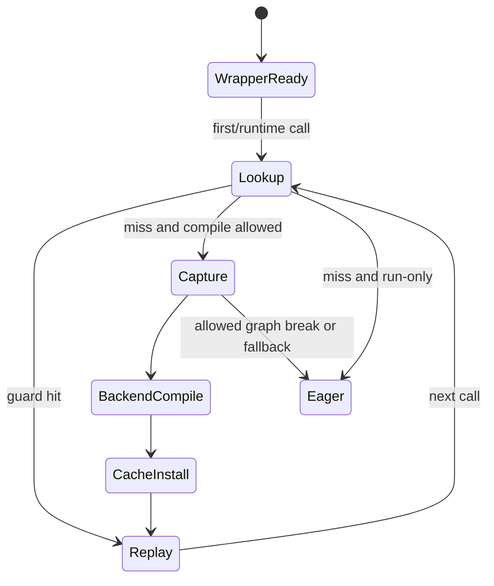

# B01 · `torch.compile` API 与第一次调用生命周期

> 卷别：B · TorchDynamo 捕获  
> 固定源码：PyTorch `e8f97c1a6ef8cbcdd0a946606bc1e924e4f07e52`  
> 后续：[[backend_modes_options_stances_and_fullgraph_analysis]]  
> 最后更新：2026-07-30(§12 并入 A05 独有的七阶段成本模型与缓存分层内容;§13 并入 `torch_compile_source_analysis` 独有的 API 入口版本门禁与 `torch.export` 边界内容)

## 1. 为什么公开入口必须很薄

`torch.compile`面对的是 Python callable，但真正的捕获对象只有调用发生后才存在：

- 当前 `code object`；
- 当前 frame 的 locals/globals/builtins；
- 当前 Tensor 的 shape、stride、dtype、device、alias 和 grad 状态；
- 当前 Python/dispatcher/global state；
- 能否匹配已有 compiled specialization 的 guard 结果。

因此 API 调用阶段只能完成参数归一化和 wrapper 组装，不能提前完成输入相关的捕获。

**核心结论**：`torch.compile(fn)`创建“以后怎样截获 frame”的策略；`compiled_fn(*args)`
第一次执行才让这项策略遇到真实 frame，并在 cache miss 时触发捕获和 backend compile。

## 2. 公开参数落到哪些控制平面

公开签名见 `torch/__init__.py:3134-3151`。参数并不处于同一层：

| 参数 | 主要控制层 | 作用 |
|---|---|---|
| `backend` | Dynamo/backend | FX graph交给谁 |
| `mode`、`options` | backend，默认是 Inductor | 后端策略和配置 patch |
| `fullgraph` | Dynamo | graph break是否变成错误 |
| `dynamic`、`dynamic_shapes` | Dynamo/ShapeEnv/backend | shape如何符号化和特化 |
| `disable` | API/Dynamo | wrapper退化为 no-op |
| `recompile_limit` | Dynamo code cache | specialization增长上限 |
| `isolate_recompiles` | code-object cache bucket | 同一 code object上的重编译计数隔离 |

`mode`和`options`互斥，未指定时 mode归一化为 `default`
（`torch/__init__.py:3323-3329`）。`dynamic`与`dynamic_shapes`也不能同时设置，
这一约束在 Dynamo context初始化时检查（`torch/_dynamo/eval_frame.py:890-902`）。

## 3. 从公开 API 到 Dynamo context

调用链为：

```text
torch.compile(fn, ...)
  → 选择默认 backend
  → 归一化 dynamic_shapes
  → 构造 _TorchCompileInductorWrapper 或 _TorchCompileWrapper
  → torch._dynamo.optimize(...)(fn)
  → 返回 compile_wrapper
```

默认 backend选择和 decorator mode处理见 `torch/__init__.py:3282-3307`；backend wrapper
选择及 `optimize`参数映射见 `torch/__init__.py:3361-3378`。

`torch._dynamo.optimize`再进入 `_optimize`。普通模式会：

1. 将 backend名字解析为 callable；
2. 读取可选 `backend_ctx_ctor`；
3. 用 `convert_frame.convert_frame(...)`创建 frame callback；
4. 用 `_optimize_catch_errors(...)`创建 `OptimizeContext`。

对应源码为 `torch/_dynamo/eval_frame.py:1826-1848` 和
`torch/_dynamo/eval_frame.py:1849-1862`。

## 4. wrapper 创建阶段实际拥有的对象


此时已有：

- 原 callable；
- backend callable和 backend config；
- eval-frame callback；
- dynamic/fullgraph/recompile策略；
- enter/exit hooks。

此时没有：

- 当前 FX graph；
- example inputs；
- 当前 guard manager；
- transformed code；
- Inductor kernel。

## 5. 第一次调用的真实控制流

`OptimizeContext`生成的 wrapper在调用前安装 eval-frame callback，调用原函数，然后恢复
TLS、dynamic-layer和 dispatcher状态。安装 callback、调用函数和 finally恢复逻辑见
`torch/_dynamo/eval_frame.py:1190-1216`、`torch/_dynamo/eval_frame.py:1217-1224` 与
`torch/_dynamo/eval_frame.py:1241-1265`、`torch/_dynamo/eval_frame.py:1266-1275`。

第一次遇到 code object 时：

```text
compile_wrapper(args)
  → 安装 callback
  → CPython准备执行目标 frame
  → Dynamo eval-frame shim截获
  → code-object ExtraState/cache lookup
  → cache miss
  → callback(frame, cache_entry, frame_state)
  → ConvertFrame
  → InstructionTranslator解释字节码并构造 FX + residual bytecode
  → OutputGraph调用 backend(gm, example_inputs)
  → 构造 guards + GuardedCode
  → 写入 code-object cache
  → 立即执行 transformed code
```

C++边界在 cache miss 后才调用 Python callback，并从返回值读取 execution strategy和
`guarded_code`（`torch/csrc/dynamo/eval_frame_cpp.cpp:614-638`）。非空
`guarded_code`被写入 cache后立即执行（`torch/csrc/dynamo/eval_frame_cpp.cpp:672-691`）。

## 6. 命中路径不是重新 capture

后续相同 code object调用先做 cache lookup。若某个 entry的 backend和 guards均匹配，
直接取出 transformed code并执行；不会再次调用 frame conversion callback。命中与 miss
分支见 `torch/csrc/dynamo/eval_frame_cpp.cpp:589-611`。

所以必须区分：

- wrapper复用：仍可能 cache miss；
- code cache hit：跳过 Dynamo capture和 backend callback；
- backend artifact cache hit：即便 Dynamo miss，后端也可能复用更深层产物；
- steady-state kernel replay：仍包含 guard与 wrapper成本。

## 7. `GraphModule`和 transformed bytecode为什么同时存在

Dynamo不是简单把整个 Python函数替换成一个 FX graph。一次捕获的结果通常包含：

1. 可张量化区域的 `fx.GraphModule`；
2. 调用 compiled callable的改写字节码；
3. 图外 Python语义、局部变量恢复和副作用回放；
4. graph break后的 resume函数；
5. 保护这一版本的 guards。

这就是“编译 Python frame”而不是“只追踪 Tensor算子列表”。详情见
[[output_graph_side_effects_and_graph_emission_analysis]]。

### 7.1 backend 收到 capture 结果后交给谁

> 本节内容原属 P4 知识库整改被删除的 A 卷回顾页(`19_torch_compile_end_to_end/a05_eager_capture_compile_and_replay_cost_model_analysis.md`)。该页对 `OutputGraph` 调用 backend、校验返回值、失败分类的这段控制流已在 §12.3 用更精确的源码定位（`call_user_compiler`/`BackendCompilerFailed`）覆盖；此处只保留 §12.3 未涉及的一步——backend 是 Inductor 时，capture 结果具体交给了谁。

若 backend 是 Inductor，`compile_fx` 接收 §12.3 中 `call_user_compiler` 传出的 FX
GraphModule 与 example inputs，并负责继续编排 AOTAutograd/Inductor 路径
（`torch/_inductor/compile_fx.py:2889-2907`）。这说明 backend handoff 是一个明确接口：
Dynamo 提交一段图和样例输入，backend 可以再有自己的 graph cache、code cache、native
compiler 与 lazy backward compile；code-object entry hit 只保证不再次走这次
Dynamo/backend handoff，不代表那些下层 cache 与 runtime 都不存在。

## 8. 生命周期状态机



`fullgraph=True`改变“捕获失败能否切图/回退”，不改变“先 lookup、miss才捕获”的基本结构。

## 9. 复杂度

令：

- \(B\)：原函数字节码指令数；
- \(G\)：捕获出的 FX node数；
- \(C\)：该 cache bucket中的 entries数；
- \(Q_i\)：第 \(i\) 个 entry guard树的检查成本；
- \(K(G)\)：backend编译成本。

则：

- wrapper creation通常为 \(O(1)\)，不计配置字典复制；
- lookup worst case为 \(O(\sum_{i=1}^{C} Q_i)\)；
- Dynamo符号执行约为 \(O(B)\)，但 restart、内联和数据结构操作会放大常数；
- FX/bytecode emission约为 \(O(G+B_{\text{emitted}})\)；
- 首次 miss总成本由 \(K(G)\)主导时远大于 lookup；
- hit路径不再支付 \(O(B)+K(G)\)，但仍支付 guard与 runtime wrapper成本。

## 10. 常见误解

- **“调用 `torch.compile`就已经编译。”** 实际上通常只是创建 wrapper。
- **“第一次调用只跑编译，不执行模型。”** 编译成功后仍会执行生成代码并返回本次结果。
- **“命中 cache就是直接调用一个 kernel。”** transformed code可能调用多个 compiled
  regions、Python residual和runtime wrapper。
- **“同一个函数只有一个 compiled graph。”** cache按 guards保存多个 specialization。
- **“backend接收原 Python函数。”** Dynamo backend契约的核心输入是
  `GraphModule + example_inputs`。

## 11. 源码阅读顺序

1. `torch/__init__.py:3282-3307`：参数和 decorator形态；
2. `torch/__init__.py:3361-3378`：backend wrapper到 Dynamo；
3. `torch/_dynamo/eval_frame.py:1742-1765`、`torch/_dynamo/eval_frame.py:1766-1773`：
   Dynamo主入口契约；
4. `torch/_dynamo/eval_frame.py:1826-1848`：callback组装；
5. `torch/csrc/dynamo/eval_frame_cpp.cpp:536-562`：lookup/run-only；
6. `torch/csrc/dynamo/eval_frame_cpp.cpp:589-612`、
   `torch/csrc/dynamo/eval_frame_cpp.cpp:614-625`：hit/miss/callback；
7. `torch/csrc/dynamo/eval_frame_cpp.cpp:672-691`：cache安装和执行。

## 12. 编译器视角补充：七阶段成本模型与缓存分层

> 本节内容原属 P4 知识库整改被删除的 A 卷回顾页(`19_torch_compile_end_to_end/a05_eager_capture_compile_and_replay_cost_model_analysis.md`)。该页的参数化成本模型、四层 cache 对照表与阶段主导参数已迁入 [[compile_latency_cache_and_steady_state_performance_analysis]] §12-§16(与该页既有的 break-even 模型合并,不在本页重复);这里只保留与本页 §1-§11"wrapper creation 与 first call 是两个事件"直接互补、e07 未覆盖的两块:七阶段词汇表,以及 cache 命中之后仍要做的具体工作清单。

### 12.1 七个时间阶段

| 阶段 | 输入 | 主要产物 | 是否每次调用 |
|---|---|---|---|
| wrapper creation | Python callable + options | Dynamo context/backend wrapper | 否 |
| cache lookup | code object + frame state | 命中 entry 或 compile decision | 是 |
| capture | Python frame + inputs | FX region、guards、residual code | 每个新 specialization |
| graph compile | FX + fake inputs | AOT/Inductor transformed artifacts | 每个新 specialization/cache miss |
| native compile/load | generated source/binary | callable module/kernel | 取决于 artifact cache |
| warmup/record | callable + runtime state | runtime/cache/CUDAGraph 状态 | backend/模式相关 |
| replay | guards + callable + inputs | 用户结果 | 每次命中调用 |

"一次 compile"常同时包含 capture、AOT、Inductor 和 native compile,但这些阶段的 cache 边界不同,所以不能用一个总开关推断全部是否执行。

### 12.2 cache 命中之后仍要做的 8 件事

命中 specialization 的调用仍可能执行:

1. eval-frame/run-only wrapper 逻辑;
2. cache entry guards;
3. transformed Python code;
4. compiled callable wrapper;
5. input unpack/layout/alias checks;
6. allocation/reuse;
7. kernel/extern calls;
8. output assembly。

因此 steady-state overhead 不为零。小模型/小 batch 中,guards、Python wrapper、launch 和同步可能比 kernel 本身更显著。跨调用的参数化成本模型、break-even 分析与四层 cache 对照表见 [[compile_latency_cache_and_steady_state_performance_analysis]] §12-§16。

### 12.3 源码补充:cache entry 查找与 backend handoff 的两处细节

§6 已说明命中路径不再触发 frame conversion callback,以下补两处更底层的边界:

`ExtraState::lookup_in_list` 会先核对 backend,再运行 entry 的 guard manager(`torch/csrc/dynamo/extra_state.cpp:201-225`)。更外层 lookup 依次查询相应 backend 的 bucket 与 default bucket(`torch/csrc/dynamo/extra_state.cpp:292-316`);命中后还会把 entry 移到链表前端并返回 cached code(`torch/csrc/dynamo/extra_state.cpp:319-323`)。因此"同一 code object"只是 cache 搜索范围,不是充分命中条件。

miss 后,Dynamo 完成 capture 交给 backend 的边界是显式的:`call_user_compiler` 在 `dynamo_timed` 计时区域内调用 `_call_user_compiler`(`torch/_dynamo/output_graph.py:3217-3228`),后者调用 compiler function 并检查返回值必须可调用(`torch/_dynamo/output_graph.py:3286-3293`);除少数允许 fallback 的例外,其余异常在这里统一被归类为 `BackendCompilerFailed`(`torch/_dynamo/output_graph.py:3317-3320`)。code-object entry hit 只保证不再次走这次 Dynamo/backend handoff,不代表 backend 自己的 graph cache、code cache、native compiler 与 lazy backward compile 都不存在。backend handoff 之后各阶段成本的主导参数(codegen/native compile/autotune)见 [[compile_latency_cache_and_steady_state_performance_analysis]] §16。

## 13. 源码补充:API 入口的版本门禁与 `torch.export` 边界

> 本节内容原属 P4 知识库整改被删除的旧大文(`04_inductor/torch_compile_source_analysis.md`)。§1-§12 从"wrapper 是什么"讲起,未覆盖公开函数体最前面的环境门禁,以及被 `torch.export` 包住时的短路行为,逐字迁入本页。

### 13.1 环境门禁先于任何 wrapper 构造

`compile()` 函数体的第一步不是参数归一化,而是两条 `RuntimeError` 门禁和一次遥测调用(`torch/__init__.py:3267-3280`):

```python
import sysconfig

_C._log_api_usage_once("torch.compile")
if sys.version_info >= (3, 15):
    raise RuntimeError("torch.compile is not supported on Python 3.15+")
elif sysconfig.get_config_var("Py_GIL_DISABLED") == 1 and sys.version_info < (
    3, 13, 3,
):
    raise RuntimeError(
        "torch.compile is not supported on Python < 3.13.3 built with GIL disabled. "
        "Please use Python 3.13.3+."
    )
```

- `_C._log_api_usage_once("torch.compile")`:C++ 扩展遥测,同一进程只记录一次,不影响控制流;
- Python 3.15+ 直接拒绝:TorchDynamo 深度依赖 CPython 帧求值机制,新版本需要先适配才能放开;
- Free-threaded(无 GIL)构建额外要求 3.13.3+:更早的无 GIL 构建与 Dynamo 的 eval-frame 钩子不兼容。

两条门禁都在任何 wrapper 或 backend 对象创建之前执行,失败时函数体尚未触碰 `model`。

### 13.2 `torch.export` 区域内 `torch.compile` 退化为 no-op

`compile()` 从 `options` 中提取 `guard_filter_fn`/`use_aoti`(见 [[backend_modes_options_stances_and_fullgraph_analysis]] §14)之后、实例化 backend wrapper 之前,还有一段边界检查(`torch/__init__.py:3350-3359`):

```python
if torch.compiler.is_exporting():
    from torch._higher_order_ops.utils import _in_hop_compile

    if not _in_hop_compile():
        warnings.warn(
            "torch.compile is ignored when called inside torch.export region",
            stacklevel=2,
        )
        # torch.compile is a no-op when inside torch.export region
        return model
```

`torch.export` 把模型追踪为可序列化 `ExportedProgram`,这个过程里再调用 `torch.compile`本身没有意义——所以默认警告并原样返回 `model`,不组装 wrapper、不安装 eval-frame callback。**例外**:若当前正处于高阶算子(如 `torch.cond`)的子图编译上下文(`_in_hop_compile()` 为真),则放行继续编译,因为 HOP 分支子图仍然需要走正常编译路径。这个短路发生在 backend wrapper 实例化(§7)之前,是"wrapper 未必总会被构造"的另一个具体反例,与 §10"常见误解"中"调用就已经编译"互补。

## 配套 Demo

本页对应卷级入口 `tools/labs_torch_compile/demo_b_dynamo_capture.py` 的 `compile_lifecycle` 用例。默认以 CUDA 为验收设备：

```powershell
python -B tools\labs_torch_compile\demo_b_dynamo_capture.py `
  --case compile_lifecycle --device cuda `
  --output-dir tools\labs_torch_compile\artifacts\volume_demos\b01
```

先用 `--list --json` 查看用例声明的能力要求。无 CUDA 的机器可把 `--device` 改为 `cpu` 探索设备无关机制；CUDA/Triton/多卡专属用例会返回 `BLOCKED`，且不会执行用例正文。不要把 `BLOCKED` 写成 `PASS`。

重点读取 `summary.json` 与 `compile_lifecycle/result.json`：`status` 区分 `PASS/BLOCKED/FAIL`，`environment` 固化运行环境，`observations` 保存本页机制的实测字段，`artifacts` 指向图代码、日志、trace 或进程证据。`PASS` 只表示该次运行中的断言通过，不外推到其他 PyTorch 版本、shape、dtype 或硬件。

## Related Pages

- [[backend_modes_options_stances_and_fullgraph_analysis]]
- [[eval_frame_callback_and_code_cache_analysis]]
- [[output_graph_side_effects_and_graph_emission_analysis]]
- [[compile_latency_cache_and_steady_state_performance_analysis]] — 测量场景与统计设计
- [[d04_compile_cache_hierarchy_keys_and_invalidation_analysis]] — 多层缓存 key/失效边界
- [[00_torch_compile_end_to_end_index]]
